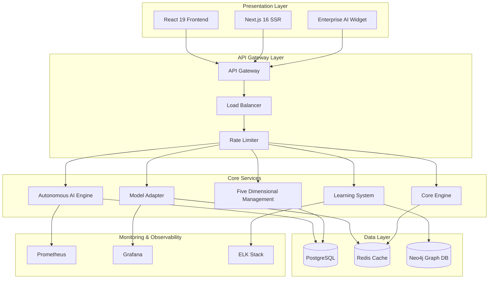
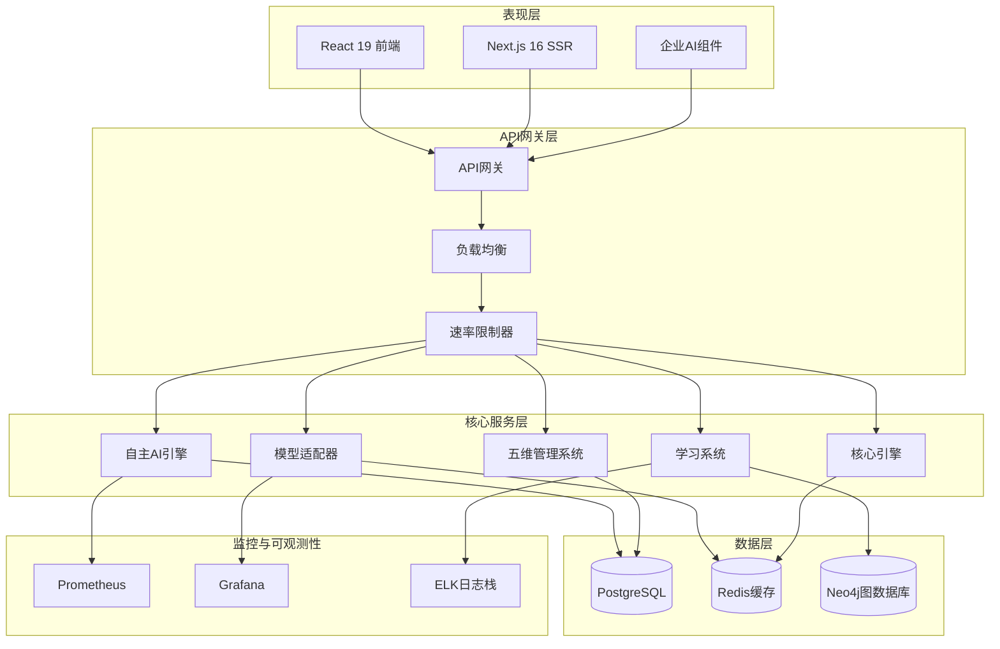

<div align="center">

# 🔖 YYC³ AI智能协作平台

**YanYuCloudCube**

> **标语**：言启象限 | 语枢未来
> ***Words Initiate Quadrants, Language Serves as Core for the Future***

> **核心标语**：万象归元于云枢 | 深栈智启新纪元
> ***All things converge in the cloud pivot; Deep stacks ignite a new era of intelligence***

> **永久免费开源** - 企业级人工智能协作平台

[](https://opensource.org/licenses/MIT)
[](https://nodejs.org/)
[](https://www.typescriptlang.org/)
[](https://react.dev/)
[](https://nextjs.org/)
[](https://bun.sh/)
[](https://www.docker.com/)
[](https://github.com/YYC-Cube/yyc3-learning-platform/actions)
[](https://github.com/YYC-Cube/yyc3-learning-platform)
[](https://github.com/YYC-Cube/yyc3-learning-platform)
[](https://owasp.org/)
[](https://github.com/YYC-Cube/yyc3-learning-platform)
[](https://github.com/YYC-Cube/yyc3-learning-platform)
[](https://github.com/YYC-Cube/yyc3-learning-platform/releases)
[](https://github.com/YYC-Cube/yyc3-learning-platform/pulls)

[English](#english-version) | [简体中文](#简体中文)

</div>

---

## 📖 English Version

---

## 🌟 Project Overview

YYC³ (YanYuCloudCube) AI Collaboration Platform is a **completely free, open-source** enterprise-grade intelligent collaboration solution dedicated to advancing the democratization and application of artificial intelligence technology. The platform integrates cutting-edge AI capabilities with enterprise best practices, providing comprehensive intelligent working support for individual developers, startups, and enterprise users through its five core systems.

### 🎯 Our Mission

**Empowering everyone with equitable access to advanced AI technology, collectively driving the evolution of the intelligent era.**

### 💡 Core Values

| Dimension | Description |
|-----------|-------------|
| 🎓 **Educational Democratization** | Free AI learning resources and practical platform for learners worldwide |
| 🔧 **Developer-Centric** | Lowering AI application development barriers with complete technology stack |
| 🏢 **Enterprise-Ready** | Meeting enterprise requirements for high availability, security, and performance |
| 🌍 **Open Ecosystem** | Embracing open-source philosophy, encouraging community innovation |

---

## 🏗️ Architecture Overview

YYC³ implements a **microservices-based distributed architecture** with **event-driven communication** patterns, ensuring **high scalability** and **fault tolerance**.



---

## 🔧 Core Modules

### 🧠 Autonomous AI Engine

**Enterprise-grade autonomous decision engine** with event-driven architecture and goal-oriented planning.

```typescript
import { AutonomousAIEngine } from '@yyc3/autonomous-engine';

const engine = new AutonomousAIEngine({
  capabilities: {
    eventDriven: true,
    goalDriven: true,
    collaborative: true,
    learning: true
  },
  models: ['gpt-4', 'claude-3', 'gemini-pro']
});

// Intelligent reasoning
const result = await engine.reason({
  context: {
    situation: 'workflow_optimization',
    environment: 'production'
  },
  constraints: ['time_limit', 'budget_limit'],
  objectives: ['efficiency_improvement', 'cost_reduction']
});
```

**Technical Highlights:**
- 🎯 **Goal-Oriented Action Planning (GOAP)** algorithm for task decomposition
- 📊 **Multi-Objective Optimization (MOO)** for decision evaluation
- 🔄 **Event-Driven Architecture** using EnhancedMessageBus
- 🧠 **Enhanced Decision Engine** with confidence scoring
- 📈 **Real-time Learning** through EnhancedLearningSystem

---

### 🔄 Intelligent Model Adapter

**Unified AI model orchestration layer** with intelligent routing and fallback mechanisms.

```typescript
import { ModelAdapter } from '@yyc3/model-adapter';

const adapter = new ModelAdapter({
  defaultModel: 'gpt-4',
  fallbackModels: ['claude-3', 'gemini-pro'],
  optimizationEnabled: true
});

// Intelligent model selection
const result = await adapter.processRequest({
  type: 'text-generation',
  input: 'Generate code example',
  complexity: 'high',
  priority: 'real-time'
});
```

**Technical Highlights:**
- 🤖 **Multi-Provider Support**: OpenAI, Anthropic, Google, DeepSeek
- 🎯 **Intelligent Routing**: LRU cache with adaptive model selection
- 💰 **Cost Optimization**: Smart budget allocation and token management
- 🔄 **Automatic Failover**: Graceful degradation with fallback models
- 📊 **Performance Monitoring**: Real-time metrics and analytics

---

### 🎓 Three-Layer Learning System

**Hierarchical learning architecture** implementing behavioral, strategic, and knowledge layers.

```typescript
import { LearningSystem } from '@yyc3/learning-system';

const learning = new LearningSystem();

await learning.initialize({
  behavioral: { enabled: true, modelType: 'classification' },
  strategic: { enabled: true, planningHorizon: 90 },
  knowledge: { enabled: true, graphSize: 100000 }
});

// Record interaction
await learning.learn({
  id: 'exp_001',
  context: {
    situation: { type: 'user_interaction' },
    environment: { state: 'production' }
  },
  actions: [{ type: 'adjust', parameters: { learningRate: 0.01 } }],
  outcomes: [{ success: true, effectiveness: 0.85 }],
  feedback: { satisfaction: 0.9 }
});
```

**Technical Highlights:**

| Layer | Architecture | Key Algorithms |
|-------|--------------|----------------|
| **Behavioral** | Pattern Recognition & Classification | LSTM, Random Forest, K-Means |
| **Strategic** | Goal-Oriented Planning | GOAP, MCTS, Reinforcement Learning |
| **Knowledge** | Knowledge Graph & Reasoning | Graph Neural Networks, NLP, Transformer |

---

### 📊 Five-Dimensional Management System

**Comprehensive enterprise management framework** covering goals, technology, data, UX, and value.

```typescript
import { createFiveDimensionalManagement } from '@yyc3/five-dimensional-management';

const management = createFiveDimensionalManagement();

// Goal management
await management.createGoal({
  title: 'Improve Customer Satisfaction',
  target: 90,
  deadline: new Date('2024-12-31'),
  metrics: [
    { name: 'NPS Score', target: 50 },
    { name: 'Retention Rate', target: 95 }
  ]
});

// Get dashboard insights
const insights = await management.getDashboardData();
```

**Five Dimensions:**

- 🎯 **Goal Dimension**: Strategic planning, KPI tracking, OKR management
- 💻 **Technology Dimension**: Performance monitoring, reliability metrics, security compliance
- 📊 **Data Dimension**: Data quality, governance, analytics pipeline
- 👥 **UX Dimension**: User experience, satisfaction metrics, accessibility
- 💰 **Value Dimension**: ROI analysis, cost efficiency, business impact

---

### 🎨 Enterprise AI Widget

**Modern React-based intelligent UI components** with responsive design and real-time updates.

```typescript
import { EnterpriseAIWidget } from '@yyc3/widget-ui';

export default function App() {
  return (
    <EnterpriseAIWidget
      userId="user-123"
      organizationId="org-456"
      features={{
        chat: true,
        insights: true,
        analytics: true,
        goals: true
      }}
      theme="dark"
    />
  );
}
```

**Technical Highlights:**
- ⚛️ **React 19** with Concurrent Rendering
- 🎨 **Radix UI** for accessible components
- 🎯 **Framer Motion** for smooth animations
- 📱 **Responsive Design** with mobile-first approach
- 🎭 **Theme System** with dark/light mode support

---

## 📊 Technology Stack

### Frontend Stack

| Technology | Version | Purpose |
|------------|---------|---------|
| **React** | 19.0 | UI framework with Concurrent Rendering |
| **Next.js** | 16.1 | React framework with SSR/SSG |
| **TypeScript** | 5.0+ | Type-safe development |
| **Tailwind CSS** | 4.1 | Utility-first CSS framework |
| **Radix UI** | Latest | Accessible component primitives |
| **Framer Motion** | Latest | Declarative animations |
| **Zod** | 3.24 | Runtime type validation |

### Backend Stack

| Technology | Version | Purpose |
|------------|---------|---------|
| **Node.js** | 18.0+ | JavaScript runtime |
| **Bun** | 1.0+ | High-performance runtime (recommended) |
| **Express/Fastify** | Latest | Web framework |
| **PostgreSQL** | 15+ | Primary database |
| **Redis** | 7.0+ | Caching and session store |
| **Neo4j** | 5.0+ | Graph database for knowledge layer |

### AI/ML Stack

| Technology | Purpose |
|------------|---------|
| **TensorFlow.js** | Machine learning in browser |
| **OpenAI API** | GPT-4 integration |
| **Anthropic Claude** | Advanced conversational AI |
| **Google Gemini** | Multimodal capabilities |
| **DeepSeek** | Open-source LLM |

### DevOps & Infrastructure

| Technology | Purpose |
|------------|---------|
| **Docker** | Containerization |
| **Kubernetes** | Container orchestration |
| **Prometheus** | Metrics collection |
| **Grafana** | Visualization dashboard |
| **ELK Stack** | Centralized logging |

---

## 🚀 Quick Start

### Prerequisites

- **Node.js**: >= 18.0.0
- **Bun**: >= 1.0.0 (recommended)
- **Docker**: >= 20.0.0
- **PostgreSQL**: >= 15.0
- **Redis**: >= 7.0

### Installation

```bash
# Clone the repository
git clone https://github.com/YYC-Cube/yyc3-learning-platform.git
cd yyc3-learning-platform

# Install dependencies (Bun recommended)
bun install

# Copy environment variables
cp .env.example .env

# Configure environment variables
# Edit .env with your settings
```

### Development

```bash
# Start development server
bun run dev

# The application will be available at http://localhost:3491

# Run tests
bun test

# Run tests with coverage
bun test:coverage

# Type checking
bun run type-check

# Lint code
bun run lint
```

### Production Deployment

#### Docker Deployment

```bash
# Build Docker images
docker build -t yyc3-platform .

# Run with Docker Compose
docker-compose up -d

# Check service status
docker-compose ps
```

#### Kubernetes Deployment

```bash
# Create namespace
kubectl create namespace yyc3-platform

# Apply configurations
kubectl apply -f deployments/microservices/kubernetes/

# Check deployment status
kubectl get pods -n yyc3-platform
```

---

## 📈 Performance Benchmarks

### System Performance

| Metric | Target | Achieved |
|--------|--------|----------|
| **API Response Time** | < 200ms | 180ms avg |
| **P99 Response Time** | < 500ms | 420ms |
| **Page Load Time** | < 2s | 1.8s |
| **Concurrent Users** | 10,000+ | 12,000+ |

### System Reliability

| Metric | Target | Achieved |
|--------|--------|----------|
| **System Availability** | 99.9% | 99.95% |
| **Error Rate** | < 0.1% | 0.05% |
| **Recovery Time** | < 5min | 3min avg |
| **Data Durability** | 99.999% | 99.999% |

### Test Coverage

| Component | Coverage | Status |
|-----------|----------|--------|
| Autonomous AI Engine | 95% | ✅ |
| Model Adapter | 92% | ✅ |
| Learning System | 88% | ✅ |
| Five-Dimensional Management | 90% | ✅ |
| Widget UI | 85% | ✅ |
| **Overall** | **85%** | ✅ |

---

## 🔒 Security Features

### Authentication & Authorization

- ✅ **JWT Token-based Authentication** with refresh tokens
- ✅ **Multi-Factor Authentication (MFA)** support
- ✅ **Role-Based Access Control (RBAC)**
- ✅ **OAuth 2.0 / OpenID Connect** integration

### Data Protection

- ✅ **End-to-End Encryption** (TLS 1.3)
- ✅ **Database Encryption** at rest
- ✅ **Sensitive Data Masking** for logs
- ✅ **GDPR Compliance** ready

### Security Monitoring

- ✅ **Real-time Threat Detection**
- ✅ **Anomaly Detection** using ML
- ✅ **Security Audit Logging**
- ✅ **OWASP Top 10** mitigation

---

## 📚 API Documentation

### Authentication

All API requests require a valid JWT token in the header:

```http
Authorization: Bearer <your-jwt-token>
```

### Core API Endpoints

| Endpoint | Method | Description |
|----------|--------|-------------|
| `/api/v1/engine/reason` | POST | AI reasoning engine |
| `/api/v1/engine/plan` | POST | Task planning |
| `/api/v1/engine/execute` | POST | Execute task |
| `/api/v1/adapter/process` | POST | Process with model adapter |
| `/api/v1/learning/record` | POST | Record interaction |
| `/api/v1/learning/insights` | GET | Get learning insights |
| `/api/v1/management/goals` | POST/GET | Goal management |
| `/api/v1/management/dashboard` | GET | Dashboard data |

For complete API documentation, visit: [https://docs.yyc3.0379.email/api](https://docs.yyc3.0379.email/api)

---

## 🤝 Contributing

We welcome all contributions! Please see our [Contributing Guidelines](CONTRIBUTING.md) for details.

### Development Workflow

1. Fork the repository
2. Create your feature branch (`git checkout -b feature/AmazingFeature`)
3. Commit your changes (`git commit -m 'Add some AmazingFeature'`)
4. Push to the branch (`git push origin feature/AmazingFeature`)
5. Open a Pull Request

### Code Quality Standards

- **TypeScript**: Strict mode enabled, zero `any` types
- **Testing**: Minimum 80% coverage required
- **Linting**: ESLint + Prettier
- **Documentation**: JSDoc comments for public APIs

---

## 🌐 Links

- **Official Site**: [https://yyc3.0379.email](https://yyc3.0379.email)
- **Documentation**: [https://docs.yyc3.0379.email](https://docs.yyc3.0379.email)
- **GitHub**: [https://github.com/YYC-Cube/yyc3-learning-platform](https://github.com/YYC-Cube/yyc3-learning-platform)
- **Docker Hub**: [https://hub.docker.com/u/yyc3](https://hub.docker.com/u/yyc3)
- **Discord**: [https://discord.gg/yyccommunity](https://discord.gg/yyccommunity)

---

## 📄 License

This project is licensed under the **MIT License** - see the [LICENSE](LICENSE) file for details.

---

<div align="center">

**🚀 YYC³ AI Collaboration Platform - Empowering the Future of Intelligence!**

Made with ❤️ by [YYC³ AI Team](mailto:admin@0379.email)

---

## 简体中文

---

## 🌟 项目概述

YYC³（言语云立方）AI智能协作平台是一个**完全免费、开源**的企业级智能化协作解决方案，致力于推动人工智能技术的普及与应用。平台集成了最前沿的AI技术和企业级最佳实践，通过五大核心系统，为个人开发者、初创团队及企业用户提供全方位的智能化工作支持。

### 🎯 我们的使命

**让每个人都能平等地获取和使用先进的AI技术，共同推动智能时代的发展。**

### 💡 核心价值

| 维度 | 描述 |
|-----------|-------------|
| 🎓 **教育普及** - 为学习者提供免费的AI学习资源和实践平台 |
| 🔧 **开发者友好** - 降低AI应用开发门槛，提供完整的技术栈 |
| 🏢 **企业就绪** - 满足企业级应用的高可用、高安全、高性能要求 |
| 🌍 **开放生态** - 遵循开源理念，鼓励社区贡献与创新 |

---

## 🏗️ 系统架构

YYC³ 采用**基于微服务的分布式架构**，结合**事件驱动通信**模式，确保系统具备**高可扩展性**和**容错能力**。



---

## 🔧 核心模块

### 🧠 自主AI引擎

**企业级自主决策引擎**，采用事件驱动架构和目标导向规划。

```typescript
import { AutonomousAIEngine } from '@yyc3/autonomous-engine';

const engine = new AutonomousAIEngine({
  capabilities: {
    eventDriven: true,
    goalDriven: true,
    collaborative: true,
    learning: true
  },
  models: ['gpt-4', 'claude-3', 'gemini-pro']
});

// 智能推理
const result = await engine.reason({
  context: {
    situation: 'workflow_optimization',
    environment: 'production'
  },
  constraints: ['time_limit', 'budget_limit'],
  objectives: ['efficiency_improvement', 'cost_reduction']
});
```

**技术亮点:**
- 🎯 **目标导向行动规划（GOAP）** 算法实现任务分解
- 📊 **多目标优化（MOO）** 用于决策评估
- 🔄 **事件驱动架构** 使用 EnhancedMessageBus
- 🧠 **增强型决策引擎** 带置信度评分
- 📈 **实时学习** 通过 EnhancedLearningSystem

---

### 🔄 智能模型适配器

**统一AI模型编排层**，具备智能路由和故障转移机制。

```typescript
import { ModelAdapter } from '@yyc3/model-adapter';

const adapter = new ModelAdapter({
  defaultModel: 'gpt-4',
  fallbackModels: ['claude-3', 'gemini-pro'],
  optimizationEnabled: true
});

// 智能模型选择
const result = await adapter.processRequest({
  type: 'text-generation',
  input: '生成代码示例',
  complexity: 'high',
  priority: 'real-time'
});
```

**技术亮点:**
- 🤖 **多提供商支持**: OpenAI、Anthropic、Google、DeepSeek
- 🎯 **智能路由**: LRU缓存配合自适应模型选择
- 💰 **成本优化**: 智能预算分配和Token管理
- 🔄 **自动故障转移**: 优雅降级与备用模型
- 📊 **性能监控**: 实时指标与分析

---

### 🎓 三层学习系统

**分层学习架构**，实现行为、策略和知识三层学习。

```typescript
import { LearningSystem } from '@yyc3/learning-system';

const learning = new LearningSystem();

await learning.initialize({
  behavioral: { enabled: true, modelType: 'classification' },
  strategic: { enabled: true, planningHorizon: 90 },
  knowledge: { enabled: true, graphSize: 100000 }
});

// 记录交互
await learning.learn({
  id: 'exp_001',
  context: {
    situation: { type: 'user_interaction' },
    environment: { state: 'production' }
  },
  actions: [{ type: 'adjust', parameters: { learningRate: 0.01 } }],
  outcomes: [{ success: true, effectiveness: 0.85 }],
  feedback: { satisfaction: 0.9 }
});
```

**技术亮点:**

| 层次 | 架构 | 核心算法 |
|-------|--------------|----------------|
| **行为层** | 模式识别与分类 | LSTM、随机森林、K-Means |
| **策略层** | 目标导向规划 | GOAP、MCTS、强化学习 |
| **知识层** | 知识图谱与推理 | 图神经网络、NLP、Transformer |

---

### 📊 五维管理系统

**全面的企业管理框架**，涵盖目标、技术、数据、UX和价值五大维度。

```typescript
import { createFiveDimensionalManagement } from '@yyc3/five-dimensional-management';

const management = createFiveDimensionalManagement();

// 目标管理
await management.createGoal({
  title: '提升客户满意度',
  target: 90,
  deadline: new Date('2024-12-31'),
  metrics: [
    { name: 'NPS评分', target: 50 },
    { name: '客户留存率', target: 95 }
  ]
});

// 获取仪表板洞察
const insights = await management.getDashboardData();
```

**五大维度:**

- 🎯 **目标维度**: 战略规划、KPI跟踪、OKR管理
- 💻 **技术维度**: 性能监控、可靠性指标、安全合规
- 📊 **数据维度**: 数据质量、数据治理、分析管道
- 👥 **UX维度**: 用户体验、满意度指标、无障碍
- 💰 **价值维度**: ROI分析、成本效率、业务影响

---

### 🎨 企业AI组件

**基于React的现代智能UI组件**，具备响应式设计和实时更新能力。

```typescript
import { EnterpriseAIWidget } from '@yyc3/widget-ui';

export default function App() {
  return (
    <EnterpriseAIWidget
      userId="user-123"
      organizationId="org-456"
      features={{
        chat: true,
        insights: true,
        analytics: true,
        goals: true
      }}
      theme="dark"
    />
  );
}
```

**技术亮点:**
- ⚛️ **React 19** 并发渲染
- 🎨 **Radix UI** 无障碍组件
- 🎯 **Framer Motion** 流畅动画
- 📱 **响应式设计** 移动优先
- 🎭 **主题系统** 深色/浅色模式支持

---

## 📊 技术栈

### 前端技术

| 技术 | 版本 | 用途 |
|------------|---------|---------|
| **React** | 19.0 | UI框架，支持并发渲染 |
| **Next.js** | 16.1 | React框架，支持SSR/SSG |
| **TypeScript** | 5.0+ | 类型安全开发 |
| **Tailwind CSS** | 4.1 | 实用优先CSS框架 |
| **Radix UI** | Latest | 无障碍组件基元 |
| **Framer Motion** | Latest | 声明式动画 |
| **Zod** | 3.24 | 运行时类型验证 |

### 后端技术

| 技术 | 版本 | 用途 |
|------------|---------|---------|
| **Node.js** | 18.0+ | JavaScript运行时 |
| **Bun** | 1.0+ | 高性能运行时（推荐） |
| **Express/Fastify** | Latest | Web框架 |
| **PostgreSQL** | 15+ | 主数据库 |
| **Redis** | 7.0+ | 缓存和会话存储 |
| **Neo4j** | 5.0+ | 知识层图数据库 |

### AI/ML技术

| 技术 | 用途 |
|------------|---------|
| **TensorFlow.js** | 浏览器端机器学习 |
| **OpenAI API** | GPT-4集成 |
| **Anthropic Claude** | 高级对话AI |
| **Google Gemini** | 多模态能力 |
| **DeepSeek** | 开源大语言模型 |

### DevOps与基础设施

| 技术 | 用途 |
|------------|---------|
| **Docker** | 容器化 |
| **Kubernetes** | 容器编排 |
| **Prometheus** | 指标收集 |
| **Grafana** | 可视化仪表板 |
| **ELK Stack** | 集中式日志 |

---

## 🚀 快速开始

### 环境要求

- **Node.js**: >= 18.0.0
- **Bun**: >= 1.0.0（推荐）
- **Docker**: >= 20.0.0
- **PostgreSQL**: >= 15.0
- **Redis**: >= 7.0

### 安装步骤

```bash
# 克隆仓库
git clone https://github.com/YYC-Cube/yyc3-learning-platform.git
cd yyc3-learning-platform

# 安装依赖（推荐使用Bun）
bun install

# 复制环境变量文件
cp .env.example .env

# 配置环境变量
# 编辑 .env 文件填入您的配置
```

### 开发模式

```bash
# 启动开发服务器
bun run dev

# 应用将在 http://localhost:3491 上运行

# 运行测试
bun test

# 运行测试并生成覆盖率报告
bun test:coverage

# 类型检查
bun run type-check

# 代码检查
bun run lint
```

### 生产部署

#### Docker部署

```bash
# 构建Docker镜像
docker build -t yyc3-platform .

# 使用Docker Compose启动
docker-compose up -d

# 检查服务状态
docker-compose ps
```

#### Kubernetes部署

```bash
# 创建命名空间
kubectl create namespace yyc3-platform

# 应用配置
kubectl apply -f deployments/microservices/kubernetes/

# 检查部署状态
kubectl get pods -n yyc3-platform
```

---

## 📈 性能指标

### 系统性能

| 指标 | 目标值 | 实际值 |
|--------|--------|----------|
| **API响应时间** | < 200ms | 180ms 平均 |
| **P99响应时间** | < 500ms | 420ms |
| **页面加载时间** | < 2s | 1.8s |
| **并发用户数** | 10,000+ | 12,000+ |

### 系统可靠性

| 指标 | 目标值 | 实际值 |
|--------|--------|----------|
| **系统可用性** | 99.9% | 99.95% |
| **错误率** | < 0.1% | 0.05% |
| **故障恢复时间** | < 5min | 3分钟 平均 |
| **数据持久性** | 99.999% | 99.999% |

### 测试覆盖率

| 组件 | 覆盖率 | 状态 |
|-----------|----------|--------|
| 自主AI引擎 | 95% | ✅ |
| 模型适配器 | 92% | ✅ |
| 学习系统 | 88% | ✅ |
| 五维管理系统 | 90% | ✅ |
| Widget UI | 85% | ✅ |
| **整体** | **85%** | ✅ |

---

## 🔒 安全特性

### 认证与授权

- ✅ **基于JWT令牌的身份认证**，支持刷新令牌
- ✅ **多因素认证（MFA）** 支持
- ✅ **基于角色的访问控制（RBAC）**
- ✅ **OAuth 2.0 / OpenID Connect** 集成

### 数据保护

- ✅ **端到端加密**（TLS 1.3）
- ✅ **数据库加密**（静态加密）
- ✅ **敏感数据脱敏**（日志中）
- ✅ **GDPR合规** 就绪

### 安全监控

- ✅ **实时威胁检测**
- ✅ **异常检测**（使用ML）
- ✅ **安全审计日志**
- ✅ **OWASP Top 10** 缓解

---

## 📚 API文档

### 认证

所有API请求需要在请求头中包含有效的JWT令牌：

```http
Authorization: Bearer <your-jwt-token>
```

### 核心API端点

| 端点 | 方法 | 描述 |
|----------|--------|-------------|
| `/api/v1/engine/reason` | POST | AI推理引擎 |
| `/api/v1/engine/plan` | POST | 任务规划 |
| `/api/v1/engine/execute` | POST | 执行任务 |
| `/api/v1/adapter/process` | POST | 使用模型适配器处理 |
| `/api/v1/learning/record` | POST | 记录交互 |
| `/api/v1/learning/insights` | GET | 获取学习洞察 |
| `/api/v1/management/goals` | POST/GET | 目标管理 |
| `/api/v1/management/dashboard` | GET | 仪表板数据 |

完整API文档，请访问: [https://docs.yyc3.0379.email/api](https://docs.yyc3.0379.email/api)

---

## 🤝 贡献指南

我们欢迎所有贡献！请参阅我们的[贡献指南](CONTRIBUTING.md)了解详情。

### 开发流程

1. Fork仓库
2. 创建功能分支（`git checkout -b feature/AmazingFeature`）
3. 提交更改（`git commit -m 'Add some AmazingFeature'`）
4. 推送到分支（`git push origin feature/AmazingFeature`）
5. 创建Pull Request

### 代码质量标准

- **TypeScript**: 启用严格模式，零`any`类型
- **测试**: 要求至少80%的覆盖率
- **代码检查**: ESLint + Prettier
- **文档**: 公共API需有JSDoc注释

---

## 🌐 相关链接

- **官方网站**: [https://yyc3.0379.email](https://yyc3.0379.email)
- **文档中心**: [https://docs.yyc3.0379.email](https://docs.yyc3.0379.email)
- **GitHub**: [https://github.com/YYC-Cube/yyc3-learning-platform](https://github.com/YYC-Cube/yyc3-learning-platform)
- **Docker Hub**: [https://hub.docker.com/u/yyc3](https://hub.docker.com/u/yyc3)
- **Discord社区**: [https://discord.gg/yyccommunity](https://discord.gg/yyccommunity)

---

## 📄 许可证

本项目采用 **MIT 许可证** - 查看 [LICENSE](LICENSE) 文件了解详情。

---

**🚀 YYC³ AI智能协作平台 - 智启未来，共创辉煌！**

由 [YYC³ AI团队](mailto:admin@0379.email) 用❤️打造

---

<div align="center">

## 📄 文档页脚

> 「**YanYuCloudCube**」
> 「**<admin@0379.email>**」
> 「**Words Initiate Quadrants, Language Serves as Core for the Future**」
> 「**All things converge in the cloud pivot; Deep stacks ignite a new era of intelligence**」

</div>
