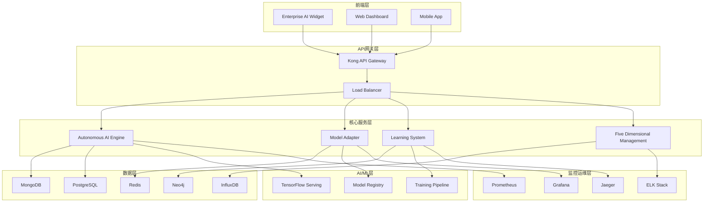

# 🔖 YYC³ AI智能协作平台

> ***YanYuCloudCube***
> **标语**：言启象限 | 语枢未来
> ***Words Initiate Quadrants, Language Serves as Core for the Future***
> **标语**：万象归元于云枢 | 深栈智启新纪元
> ***All things converge in the cloud pivot; Deep stacks ignite a new era of intelligence***

> 🤖 企业级人工智能协作平台 - 智能化工作的新纪元

[](https://opensource.org/licenses/MIT)
[](https://nodejs.org/)
[](https://www.typescriptlang.org/)
[](https://www.docker.com/)
[](https://kubernetes.io/)
[](https://bun.sh/)
[](https://github.com/YYC-Cube/yyc3-learning-platform/actions)
[](https://github.com/YYC-Cube/yyc3-learning-platform)
[](https://github.com/YYC-Cube/yyc3-learning-platform)
[](https://owasp.org/)
[](https://github.com/YYC-Cube/yyc3-learning-platform)
[](https://github.com/YYC-Cube/yyc3-learning-platform)
[](https://github.com/YYC-Cube/yyc3-learning-platform/releases)
[](https://github.com/YYC-Cube/yyc3-learning-platform/pulls)

## 🌟 项目概述

YYC³ AI智能协作平台是一个企业级的智能化协作解决方案，集成了最前沿的AI技术和企业级最佳实践。平台通过五大核心系统，为企业提供全方位的智能化工作支持。

### 🎯 核心特性

- **🧠 自主AI引擎** - 具备推理、规划、学习能力
- **🔄 智能模型适配器** - 多AI模型统一管理
- **🎓 三层学习系统** - 行为、策略、知识学习
- **📊 五维管理系统** - 目标、技术、数据、UX、价值管理
- **🎨 企业AI组件** - 现代化智能交互界面

### 🏆 五高五标五化

#### 五高 (Five Highs)

- **高性能** - 响应时间<200ms，支持10,000+并发
- **高可靠性** - 99.9% SLA，自动故障恢复
- **高安全性** - 端到端加密，零信任架构
- **高扩展性** - 微服务架构，水平扩展
- **高可维护性** - 90%+代码覆盖率，自动化运维

#### 五标 (Five Standards)

- **国际标准** - ISO 27001/9001/20000认证
- **行业标准** - 金融、医疗、云安全标准
- **技术标准** - SOLID、DDD、12-Factor App
- **安全标准** - OWASP Top 10、NIST框架
- **合规标准** - GDPR、SOC 2、HIPAA

#### 五化 (Five Modernizations)

- **数字化** - 业务流程全面数字化
- **智能化** - AI驱动的智能决策
- **云原生化** - 容器化、微服务化
- **平台化** - 开发者平台、自助服务
- **生态化** - 开放API、插件生态

## 🏗️ 系统架构



## 📦 核心组件

### 🧠 AutonomousAIEngine - 自主AI引擎

[📖 详细文档](./packages/autonomous-engine/README.md)

```typescript
import { AutonomousAIEngine } from '@yyc3/autonomous-engine';

const engine = new AutonomousAIEngine({
  capabilities: ['reasoning', 'planning', 'execution', 'learning'],
  models: ['gpt-4', 'claude-3', 'gemini-pro']
});

// 智能推理
const result = await engine.reason({
  context: '用户需要优化项目流程',
  constraints: ['时间限制', '预算限制'],
  objectives: ['效率提升', '成本降低']
});
```

**核心功能:**

- 🎯 自主推理和规划
- 🧠 上下文理解
- 📈 决策优化
- 🔗 任务链执行
- 📚 持续学习

### 🔄 ModelAdapter - 智能模型适配器

[📖 详细文档](./packages/model-adapter/README.md)

```typescript
import { ModelAdapter } from '@yyc3/model-adapter';

const adapter = new ModelAdapter({
  defaultModel: 'gpt-4',
  fallbackModels: ['claude-3', 'gemini-pro'],
  optimizationEnabled: true
});

// 智能模型选择
const result = await adapter.processRequest({
  type: 'text-generation',
  complexity: 'high',
  priority: 'real-time'
});
```

**核心功能:**

- 🤖 多AI模型支持
- 🎯 智能路由
- 💰 成本优化
- 🔄 自动故障转移
- 📊 性能监控

### 🎓 LearningSystem - 三层学习系统

[📖 详细文档](./packages/learning-system/README.md)

```typescript
import { LearningSystem } from '@yyc3/learning-system';

const learning = new LearningSystem({
  layers: ['behavioral', 'strategic', 'knowledge'],
  learningRate: 0.01,
  memoryLimit: 10000
});

// 记录学习
await learning.recordInteraction(userInput, aiResponse);
await learning.generateInsights();
```

**核心功能:**

- 🧠 行为学习 - 模式识别和预测
- 📈 策略学习 - 决策优化
- 📚 知识学习 - 知识图谱构建
- 🔄 自适应优化
- 📊 学习效果评估

### 📊 FiveDimensionalManagement - 五维管理系统

[📖 详细文档](./packages/five-dimensional-management/README.md)

```typescript
import { createFiveDimensionalManagement } from '@yyc3/five-dimensional-management';

const management = createFiveDimensionalManagement();

// 目标管理
await management.createGoal({
  title: '提升客户满意度',
  target: 90,
  deadline: new Date('2024-12-31')
});

// 获取洞察
const insights = await management.getDashboardData();
```

**五大维度:**

- 🎯 **目标维度** - 战略目标、KPI跟踪
- 💻 **技术维度** - 性能、可靠性、安全
- 📊 **数据维度** - 质量、治理、分析
- 👥 **UX维度** - 体验、满意度、无障碍
- 💰 **价值维度** - 财务、效率、ROI

### 🎨 EnterpriseAIWidget - 企业AI组件

[📖 详细文档](./packages/enterprise-ai-widget/README.md)

```typescript
import { EnterpriseAIWidget } from '@yyc3/enterprise-ai-widget';

export default function App() {
  return (
    <EnterpriseAIWidget
      userId="user-123"
      organizationId="org-456"
      features={{
        chat: true,
        insights: true,
        analytics: true,
        goals: true
      }}
      integrations={{
        autonomousEngine: true,
        modelAdapter: true,
        learningSystem: true,
        fiveDimensionalManagement: true
      }}
    />
  );
}
```

**核心功能:**

- 💬 智能对话
- 📈 实时洞察
- 🎯 目标追踪
- ⚙️ 高级设置
- 📊 数据分析

## 🚀 快速开始

### 环境要求

- Node.js >= 18.0.0
- Docker >= 20.0.0
- Kubernetes >= 1.24.0
- Bun >= 1.0.0 (推荐)

### 本地开发

```bash
# 克隆项目
git clone https://github.com/YYC-Cube/yyc3-learning-platform.git
cd yyc3-learning-platform

# 安装依赖
bun install

# 启动开发环境
bun run dev

# 启动聊天服务器
bun run start-chat-server
```

### Docker部署

```bash
# 构建所有服务
bun run build:all

# 使用Docker Compose启动
docker-compose up -d

# 检查服务状态
docker-compose ps
```

### Kubernetes部署

```bash
# 创建命名空间
kubectl apply -f deployments/microservices/kubernetes/namespace.yaml

# 部署配置
kubectl apply -f deployments/microservices/kubernetes/configmap.yaml

# 部署数据库
kubectl apply -f deployments/microservices/kubernetes/databases/

# 部署应用服务
kubectl apply -f deployments/microservices/kubernetes/services/

# 自动化部署
./deployments/microservices/deploy.sh
```

### 运行示例

项目提供了完整的使用示例，帮助您快速了解和使用 YYC³ 平台的核心功能：

```bash
# 安装示例依赖
cd examples
bun install

# 运行基础使用示例
bun run basic

# 运行高级功能示例
bun run advanced

# 运行 REST API 示例
bun run rest-api

# 运行 WebSocket API 示例
bun run websocket
```

**示例目录**：

- 📘 [基础使用示例](./examples/basic-usage/) - 核心组件的基本用法
- 📗 [高级功能示例](./examples/advanced-features/) - 速率限制、加密、流式处理等
- 📙 [REST API 示例](./examples/rest-api/) - RESTful API 完整调用示例
- 📕 [WebSocket API 示例](./examples/websocket-api/) - 实时通信示例
- 📓 [Python SDK 示例](./examples/python-sdk/) - Python 语言集成示例

更多详细信息请查看 [最佳实践文档](./docs/best-practices.md)。

## 📊 技术栈

### 前端技术

- **React 18** - 用户界面框架
- **TypeScript** - 类型安全的JavaScript
- **Tailwind CSS** - 现代化CSS框架
- **Lucide React** - 图标库
- **Framer Motion** - 动画库

### 后端技术

- **Node.js** - 运行时环境
- **Express/Fastify** - Web框架
- **TypeScript** - 类型安全
- **Bun** - 高性能JavaScript运行时

### AI/ML技术

- **TensorFlow.js** - 机器学习
- **Brain.js** - 神经网络
- **OpenAI API** - GPT模型
- **Anthropic Claude** - 对话式AI
- **Google Gemini** - 多模态AI

### 数据存储

- **MongoDB** - 文档数据库
- **PostgreSQL** - 关系型数据库
- **Redis** - 缓存存储
- **Neo4j** - 图数据库
- **InfluxDB** - 时序数据库

### 部署运维

- **Docker** - 容器化
- **Kubernetes** - 容器编排
- **Helm** - Kubernetes包管理
- **Prometheus** - 监控
- **Grafana** - 可视化
- **Jaeger** - 分布式追踪

## 📈 性能指标

### 响应性能

- API平均响应时间: < 200ms
- P99响应时间: < 500ms
- 页面加载时间: < 2s
- 并发用户数: 10,000+

### 可靠性

- 系统可用性: 99.9%
- 错误率: < 0.1%
- 故障恢复时间: < 5分钟
- 数据持久性: 99.999%

### 扩展性

- 水平扩展: 自动
- 垂直扩展: 支持
- 微服务: 7个核心服务
- 容器实例: 100+支持

## 🔒 安全特性

### 认证授权

- JWT令牌认证
- 多因素认证支持
- RBAC权限控制
- OAuth 2.0集成

### 数据保护

- 端到端加密(TLS 1.3)
- 数据库加密
- 敏感信息脱敏
- GDPR合规

### 安全监控

- 实时威胁检测
- 异常行为分析
- 安全审计日志
- 漏洞管理

## 📚 API文档

### 认证与授权

#### JWT令牌认证

所有API请求都需要在请求头中包含有效的JWT令牌：

```http
Authorization: Bearer <your-jwt-token>
```

#### 获取访问令牌

```http
POST /api/v1/auth/login
Content-Type: application/json

{
  "email": "user@example.com",
  "password": "your-password"
}

Response:
{
  "success": true,
  "data": {
    "token": "eyJhbGciOiJIUzI1NiIsInR5cCI6IkpXVCJ9...",
    "refreshToken": "eyJhbGciOiJIUzI1NiIsInR5cCI6IkpXVCJ9...",
    "expiresIn": 3600,
    "user": {
      "id": "user-123",
      "email": "user@example.com",
      "role": "admin"
    }
  }
}
```

#### 刷新令牌

```http
POST /api/v1/auth/refresh
Content-Type: application/json

{
  "refreshToken": "your-refresh-token"
}

Response:
{
  "success": true,
  "data": {
    "token": "new-access-token",
    "expiresIn": 3600
  }
}
```

### 速率限制

API请求受速率限制保护，默认配置如下：

- **标准限制**: 100请求/分钟/IP
- **认证用户**: 1000请求/分钟/用户
- **WebSocket**: 10消息/秒/连接

超出限制的请求将返回 `429 Too Many Requests` 状态码：

```json
{
  "success": false,
  "error": {
    "code": "RATE_LIMIT_EXCEEDED",
    "message": "请求频率超出限制",
    "retryAfter": 60
  }
}
```

### REST API

#### 自主AI引擎

##### 1. 智能推理

```http
POST /api/v1/engine/reason
Authorization: Bearer <token>
Content-Type: application/json

Request Body:
{
  "context": "用户需要优化项目流程",
  "constraints": ["时间限制", "预算限制"],
  "objectives": ["效率提升", "成本降低"],
  "options": {
    "depth": "deep",
    "timeout": 30000
  }
}

Response (200 OK):
{
  "success": true,
  "data": {
    "reasoningId": "reason-123",
    "result": {
      "conclusion": "建议采用敏捷开发方法",
      "confidence": 0.92,
      "steps": [
        {
          "step": 1,
          "action": "需求分析",
          "estimatedTime": "2天"
        },
        {
          "step": 2,
          "action": "迭代规划",
          "estimatedTime": "1天"
        }
      ],
      "alternatives": [
        {
          "option": "瀑布模型",
          "score": 0.65,
          "reason": "不够灵活"
        }
      ]
    },
    "metadata": {
      "model": "gpt-4",
      "processingTime": 1250,
      "tokensUsed": 450
    }
  }
}

Error Response (400 Bad Request):
{
  "success": false,
  "error": {
    "code": "INVALID_INPUT",
    "message": "输入参数验证失败",
    "details": {
      "context": "不能为空"
    }
  }
}
```

##### 2. 任务规划

```http
POST /api/v1/engine/plan
Authorization: Bearer <token>
Content-Type: application/json

Request Body:
{
  "goal": "部署微服务应用到生产环境",
  "resources": {
    "servers": 5,
    "budget": 10000,
    "teamSize": 8
  },
  "constraints": {
    "deadline": "2024-12-31",
    "maxDowntime": "5分钟"
  },
  "preferences": {
    "strategy": "rolling-update",
    "priority": "stability"
  }
}

Response (200 OK):
{
  "success": true,
  "data": {
    "planId": "plan-456",
    "plan": {
      "phases": [
        {
          "name": "准备阶段",
          "duration": "3天",
          "tasks": [
            {
              "id": "task-1",
              "name": "环境配置",
              "assignee": "devops-team",
              "estimatedTime": "4小时",
              "dependencies": []
            }
          ]
        },
        {
          "name": "部署阶段",
          "duration": "2天",
          "tasks": [...]
        }
      ],
      "timeline": {
        "start": "2024-12-20",
        "end": "2024-12-31",
        "milestones": [
          {
            "date": "2024-12-22",
            "event": "完成准备阶段"
          }
        ]
      },
      "risks": [
        {
          "risk": "服务器资源不足",
          "probability": 0.3,
          "mitigation": "提前申请额外资源"
        }
      ]
    }
  }
}
```

##### 3. 执行任务

```http
POST /api/v1/engine/execute
Authorization: Bearer <token>
Content-Type: application/json

Request Body:
{
  "planId": "plan-456",
  "phase": "部署阶段",
  "taskId": "task-5",
  "parameters": {
    "environment": "production",
    "verification": true
  }
}

Response (200 OK):
{
  "success": true,
  "data": {
    "executionId": "exec-789",
    "status": "completed",
    "result": {
      "output": "任务执行成功",
      "metrics": {
        "duration": 4500,
        "resources": {
          "cpu": "45%",
          "memory": "2.1GB"
        }
      },
      "logs": [
        {
          "timestamp": "2024-12-25T10:00:00Z",
          "level": "info",
          "message": "开始执行任务"
        }
      ]
    }
  }
}
```

##### 4. 查询引擎状态

```http
GET /api/v1/engine/status
Authorization: Bearer <token>

Response (200 OK):
{
  "success": true,
  "data": {
    "status": "running",
    "version": "2.0.0",
    "uptime": 86400,
    "metrics": {
      "activeTasks": 5,
      "completedTasks": 1234,
      "failedTasks": 12,
      "averageResponseTime": 180,
      "successRate": 0.99
    },
    "models": {
      "primary": "gpt-4",
      "fallback": ["claude-3", "gemini-pro"],
      "status": {
        "gpt-4": "available",
        "claude-3": "available",
        "gemini-pro": "degraded"
      }
    }
  }
}
```

#### 模型适配器

##### 1. 处理请求

```http
POST /api/v1/adapter/process
Authorization: Bearer <token>
Content-Type: application/json

Request Body:
{
  "type": "text-generation",
  "input": "生成一段关于AI技术的介绍",
  "parameters": {
    "maxTokens": 500,
    "temperature": 0.7,
    "topP": 0.9
  },
  "options": {
    "complexity": "high",
    "priority": "real-time",
    "fallbackEnabled": true
  }
}

Response (200 OK):
{
  "success": true,
  "data": {
    "requestId": "req-abc123",
    "modelUsed": "gpt-4",
    "result": {
      "text": "人工智能（AI）是计算机科学的一个分支...",
      "tokens": 450,
      "finishReason": "stop"
    },
    "metadata": {
      "processingTime": 1250,
      "cost": 0.0025,
      "routing": {
        "primary": "gpt-4",
        "fallback": false,
        "reason": "primary_available"
      }
    }
  }
}
```

##### 2. 获取可用模型

```http
GET /api/v1/adapter/models
Authorization: Bearer <token>

Query Parameters:
- type: text-generation, image-generation, audio, etc.
- status: all, available, unavailable

Response (200 OK):
{
  "success": true,
  "data": {
    "models": [
      {
        "id": "gpt-4",
        "name": "GPT-4",
        "provider": "OpenAI",
        "type": "text-generation",
        "status": "available",
        "capabilities": [
          "text-generation",
          "code-generation",
          "reasoning"
        ],
        "pricing": {
          "input": 0.03,
          "output": 0.06,
          "unit": "per-1k-tokens"
        },
        "limits": {
          "maxTokens": 8192,
          "rpm": 3500
        }
      },
      {
        "id": "claude-3",
        "name": "Claude 3",
        "provider": "Anthropic",
        "type": "text-generation",
        "status": "available",
        "capabilities": [...],
        "pricing": {...},
        "limits": {...}
      }
    ]
  }
}
```

##### 3. 更新配置

```http
PUT /api/v1/adapter/config
Authorization: Bearer <token>
Content-Type: application/json

Request Body:
{
  "defaultModel": "gpt-4",
  "fallbackModels": ["claude-3", "gemini-pro"],
  "optimizationEnabled": true,
  "cacheEnabled": true,
  "rateLimits": {
    "requestsPerMinute": 1000,
    "tokensPerMinute": 100000
  }
}

Response (200 OK):
{
  "success": true,
  "data": {
    "message": "配置更新成功",
    "config": {
      "defaultModel": "gpt-4",
      "fallbackModels": ["claude-3", "gemini-pro"],
      "optimizationEnabled": true,
      "cacheEnabled": true,
      "updatedAt": "2024-12-25T10:00:00Z"
    }
  }
}
```

##### 4. 获取性能指标

```http
GET /api/v1/adapter/metrics
Authorization: Bearer <token>

Query Parameters:
- startDate: 2024-12-01
- endDate: 2024-12-31
- granularity: hour, day, week

Response (200 OK):
{
  "success": true,
  "data": {
    "period": {
      "start": "2024-12-01T00:00:00Z",
      "end": "2024-12-31T23:59:59Z"
    },
    "summary": {
      "totalRequests": 50000,
      "successfulRequests": 49500,
      "failedRequests": 500,
      "successRate": 0.99,
      "averageResponseTime": 150,
      "totalTokens": 25000000,
      "totalCost": 125.50
    },
    "byModel": [
      {
        "model": "gpt-4",
        "requests": 30000,
        "tokens": 15000000,
        "cost": 90.00,
        "averageResponseTime": 140
      },
      {
        "model": "claude-3",
        "requests": 20000,
        "tokens": 10000000,
        "cost": 35.50,
        "averageResponseTime": 165
      }
    ],
    "trends": [
      {
        "date": "2024-12-01",
        "requests": 1500,
        "cost": 3.75
      }
    ]
  }
}
```

#### 学习系统

##### 1. 记录交互

```http
POST /api/v1/learning/record
Authorization: Bearer <token>
Content-Type: application/json

Request Body:
{
  "userId": "user-123",
  "sessionId": "session-456",
  "interaction": {
    "type": "chat",
    "userInput": "如何提高代码质量？",
    "aiResponse": "提高代码质量的方法包括...",
    "context": {
      "timestamp": "2024-12-25T10:00:00Z",
      "model": "gpt-4",
      "tokens": 250
    }
  },
  "feedback": {
    "rating": 5,
    "helpful": true,
    "comments": "非常有帮助"
  }
}

Response (200 OK):
{
  "success": true,
  "data": {
    "recordId": "rec-789",
    "message": "交互记录成功",
    "timestamp": "2024-12-25T10:00:00Z"
  }
}
```

##### 2. 获取学习洞察

```http
GET /api/v1/learning/insights
Authorization: Bearer <token>

Query Parameters:
- userId: user-123
- type: behavioral, strategic, knowledge, all
- period: 7d, 30d, 90d

Response (200 OK):
{
  "success": true,
  "data": {
    "userId": "user-123",
    "period": "30d",
    "insights": {
      "behavioral": {
        "patterns": [
          {
            "pattern": "用户倾向于在上午9-11点提问",
            "confidence": 0.85,
            "frequency": "high"
          }
        ],
        "predictions": [
          {
            "prediction": "用户可能需要代码审查帮助",
            "probability": 0.72,
            "reason": "最近频繁询问代码相关问题"
          }
        ]
      },
      "strategic": {
        "recommendations": [
          {
            "action": "提供更多代码示例",
            "priority": "high",
            "expectedImpact": "提升用户满意度15%"
          }
        ]
      },
      "knowledge": {
        "topics": [
          {
            "topic": "代码质量",
            "mastery": 0.75,
            "trend": "improving"
          }
        ]
      }
    }
  }
}
```

##### 3. 训练模型

```http
POST /api/v1/learning/train
Authorization: Bearer <token>
Content-Type: application/json

Request Body:
{
  "modelType": "behavioral",
  "dataRange": {
    "start": "2024-11-01",
    "end": "2024-12-01"
  },
  "parameters": {
    "epochs": 100,
    "batchSize": 32,
    "learningRate": 0.001
  }
}

Response (200 OK):
{
  "success": true,
  "data": {
    "trainingId": "train-xyz123",
    "status": "started",
    "estimatedDuration": 3600,
    "message": "训练任务已启动"
  }
}
```

##### 4. 获取学习模型

```http
GET /api/v1/learning/models
Authorization: Bearer <token>

Response (200 OK):
{
  "success": true,
  "data": {
    "models": [
      {
        "id": "model-behavioral-v1",
        "type": "behavioral",
        "version": "1.0.0",
        "status": "active",
        "accuracy": 0.92,
        "lastTrained": "2024-12-20T00:00:00Z",
        "dataPoints": 50000
      },
      {
        "id": "model-strategic-v1",
        "type": "strategic",
        "version": "1.0.0",
        "status": "active",
        "accuracy": 0.88,
        "lastTrained": "2024-12-18T00:00:00Z",
        "dataPoints": 30000
      }
    ]
  }
}
```

#### 五维管理

##### 1. 创建目标

```http
POST /api/v1/management/goals
Authorization: Bearer <token>
Content-Type: application/json

Request Body:
{
  "title": "提升客户满意度",
  "description": "通过优化产品和服务提升客户满意度",
  "target": 90,
  "current": 85,
  "unit": "percentage",
  "deadline": "2024-12-31",
  "category": "customer-experience",
  "assignees": ["user-123", "user-456"],
  "metrics": [
    {
      "name": "NPS评分",
      "target": 50,
      "current": 42
    },
    {
      "name": "客户留存率",
      "target": 95,
      "current": 90
    }
  ]
}

Response (200 OK):
{
  "success": true,
  "data": {
    "goalId": "goal-abc123",
    "title": "提升客户满意度",
    "status": "in-progress",
    "progress": 55.6,
    "createdAt": "2024-12-01T00:00:00Z",
    "deadline": "2024-12-31T23:59:59Z"
  }
}
```

##### 2. 获取仪表板数据

```http
GET /api/v1/management/dashboard
Authorization: Bearer <token>

Query Parameters:
- period: 7d, 30d, 90d, 1y
- dimensions: goal, technology, data, ux, value

Response (200 OK):
{
  "success": true,
  "data": {
    "period": "30d",
    "summary": {
      "totalGoals": 25,
      "completedGoals": 18,
      "inProgressGoals": 5,
      "overdueGoals": 2,
      "overallProgress": 72
    },
    "dimensions": {
      "goal": {
        "score": 85,
        "trend": "up",
        "keyMetrics": {
          "goalCompletionRate": 72,
          "averageTimeToComplete": 15
        }
      },
      "technology": {
        "score": 90,
        "trend": "stable",
        "keyMetrics": {
          "systemUptime": 99.9,
          "responseTime": 180
        }
      },
      "data": {
        "score": 82,
        "trend": "up",
        "keyMetrics": {
          "dataQuality": 95,
          "dataGovernance": 88
        }
      },
      "ux": {
        "score": 78,
        "trend": "up",
        "keyMetrics": {
          "userSatisfaction": 85,
          "taskCompletionRate": 92
        }
      },
      "value": {
        "score": 88,
        "trend": "up",
        "keyMetrics": {
          "roi": 150,
          "costEfficiency": 92
        }
      }
    },
    "alerts": [
      {
        "id": "alert-1",
        "type": "warning",
        "dimension": "goal",
        "message": "2个目标已逾期",
        "severity": "medium"
      }
    ]
  }
}
```

##### 3. 创建告警

```http
POST /api/v1/management/alerts
Authorization: Bearer <token>
Content-Type: application/json

Request Body:
{
  "type": "threshold",
  "dimension": "technology",
  "metric": "responseTime",
  "condition": "greater_than",
  "threshold": 500,
  "severity": "high",
  "notification": {
    "channels": ["email", "slack"],
    "recipients": ["ops-team@yyc3.com"]
  }
}

Response (200 OK):
{
  "success": true,
  "data": {
    "alertId": "alert-xyz123",
    "message": "告警创建成功",
    "status": "active"
  }
}
```

##### 4. 获取报告

```http
GET /api/v1/management/reports
Authorization: Bearer <token>

Query Parameters:
- type: goal, technology, data, ux, value, comprehensive
- format: json, pdf, csv
- period: 7d, 30d, 90d, 1y

Response (200 OK):
{
  "success": true,
  "data": {
    "reportId": "report-abc123",
    "type": "comprehensive",
    "period": {
      "start": "2024-12-01",
      "end": "2024-12-31"
    },
    "generatedAt": "2024-12-25T10:00:00Z",
    "summary": {
      "overallScore": 84.6,
      "improvement": "+5.2%",
      "keyAchievements": [
        "系统可用性达到99.9%",
        "客户满意度提升至85%"
      ],
      "areasForImprovement": [
        "目标完成率需要提升",
        "UX体验需要优化"
      ]
    },
    "downloadUrl": "https://api.yyc3.0379.email/reports/report-abc123.pdf"
  }
}
```

### 错误处理

所有API错误都遵循统一的错误响应格式：

```json
{
  "success": false,
  "error": {
    "code": "ERROR_CODE",
    "message": "错误描述信息",
    "details": {
      "field": "具体错误字段",
      "reason": "错误原因"
    },
    "timestamp": "2024-12-25T10:00:00Z",
    "requestId": "req-abc123"
  }
}
```

#### 常见错误码

| 错误码                | HTTP状态码 | 描述                         |
| --------------------- | ---------- | ---------------------------- |
| `UNAUTHORIZED`        | 401        | 未授权，缺少或无效的认证令牌 |
| `FORBIDDEN`           | 403        | 禁止访问，权限不足           |
| `NOT_FOUND`           | 404        | 资源不存在                   |
| `INVALID_INPUT`       | 400        | 输入参数验证失败             |
| `RATE_LIMIT_EXCEEDED` | 429        | 请求频率超出限制             |
| `INTERNAL_ERROR`      | 500        | 服务器内部错误               |
| `SERVICE_UNAVAILABLE` | 503        | 服务暂时不可用               |
| `MODEL_UNAVAILABLE`   | 503        | AI模型不可用                 |
| `QUOTA_EXCEEDED`      | 429        | 配额超出限制                 |

### WebSocket API

#### 连接建立

```javascript
// 建立WebSocket连接
const ws = new WebSocket('wss://api.yyc3.0379.email/ws?token=<your-jwt-token>');

// 连接事件
ws.onopen = () => {
  console.log('WebSocket连接已建立');
};

ws.onerror = (error) => {
  console.error('WebSocket错误:', error);
};

ws.onclose = (event) => {
  console.log('WebSocket连接已关闭:', event.code, event.reason);
};
```

#### 实时对话

```javascript
// 发送对话消息
ws.send(JSON.stringify({
  type: 'chat',
  requestId: 'req-123',
  message: '你好，YYC³助手',
  options: {
    model: 'gpt-4',
    temperature: 0.7
  }
}));

// 接收响应
ws.onmessage = (event) => {
  const data = JSON.parse(event.data);
  
  switch (data.type) {
    case 'chat:response':
      console.log('AI响应:', data.response);
      break;
    case 'chat:streaming':
      console.log('流式响应:', data.chunk);
      break;
    case 'chat:error':
      console.error('对话错误:', data.error);
      break;
  }
};
```

#### 实时监控

```javascript
// 订阅监控数据
ws.send(JSON.stringify({
  type: 'subscribe',
  channel: 'metrics',
  filters: {
    dimensions: ['goal', 'technology'],
    granularity: 'minute'
  }
}));

// 接收监控数据
ws.onmessage = (event) => {
  const data = JSON.parse(event.data);
  
  if (data.type === 'metrics:update') {
    console.log('指标更新:', data.metrics);
    // {
    //   timestamp: '2024-12-25T10:00:00Z',
    //   goal: { score: 85, progress: 72 },
    //   technology: { uptime: 99.9, responseTime: 180 }
    // }
  }
};
```

#### 事件类型

| 事件类型          | 方向          | 描述         |
| ----------------- | ------------- | ------------ |
| `chat`            | 客户端→服务器 | 发送对话消息 |
| `chat:response`   | 服务器→客户端 | 接收完整响应 |
| `chat:streaming`  | 服务器→客户端 | 接收流式响应 |
| `chat:error`      | 服务器→客户端 | 对话错误通知 |
| `subscribe`       | 客户端→服务器 | 订阅频道     |
| `unsubscribe`     | 客户端→服务器 | 取消订阅     |
| `metrics:update`  | 服务器→客户端 | 指标更新     |
| `alert:triggered` | 服务器→客户端 | 告警触发     |
| `status:changed`  | 服务器→客户端 | 状态变更     |
| `ping`            | 双向          | 心跳检测     |
| `pong`            | 双向          | 心跳响应     |

#### 心跳机制

```javascript
// 客户端发送心跳
setInterval(() => {
  ws.send(JSON.stringify({
    type: 'ping',
    timestamp: Date.now()
  }));
}, 30000); // 每30秒发送一次

// 服务器响应心跳
ws.onmessage = (event) => {
  const data = JSON.parse(event.data);
  
  if (data.type === 'pong') {
    const latency = Date.now() - data.timestamp;
    console.log('网络延迟:', latency, 'ms');
  }
};
```

### SDK使用示例

#### JavaScript/TypeScript SDK

```typescript
import { YYC3Client } from '@yyc3/sdk';

// 初始化客户端
const client = new YYC3Client({
  apiKey: 'your-api-key',
  baseURL: 'https://api.yyc3.0379.email'
});

// 认证
await client.auth.login({
  email: 'user@example.com',
  password: 'password'
});

// 使用AI引擎
const reasoning = await client.engine.reason({
  context: '优化项目流程',
  objectives: ['效率提升']
});

// 使用模型适配器
const result = await client.adapter.process({
  type: 'text-generation',
  input: '生成代码示例'
});

// 使用学习系统
const insights = await client.learning.getInsights({
  userId: 'user-123',
  period: '30d'
});

// 使用五维管理
const dashboard = await client.management.getDashboard({
  period: '30d'
});
```

#### Python SDK

```python
from yyc3 import YYC3Client

# 初始化客户端
client = YYC3Client(
    api_key='your-api-key',
    base_url='https://api.yyc3.0379.email'
)

# 认证
client.auth.login(
    email='user@example.com',
    password='password'
)

# 使用AI引擎
reasoning = client.engine.reason(
    context='优化项目流程',
    objectives=['效率提升']
)

# 使用模型适配器
result = client.adapter.process(
    type='text-generation',
    input='生成代码示例'
)
```

### 最佳实践

YYC³ 平台提供了全面的最佳实践指南，涵盖认证管理、错误处理、性能优化、安全防护、监控日志、测试策略、代码规范和部署策略等方面。

**核心最佳实践**：

- 🔐 **认证管理** - 安全的令牌管理和刷新机制
- ⚠️ **错误处理** - 统一的错误处理和重试策略
- ⚡ **性能优化** - 缓存、批处理和异步优化
- 🛡️ **安全防护** - 输入验证、速率限制和权限控制
- 📊 **监控日志** - 全面的监控和日志记录
- 🧪 **测试策略** - 单元测试、集成测试和端到端测试
- 📝 **代码规范** - TypeScript 严格模式和代码审查
- 🚀 **部署策略** - 容器化、CI/CD 和自动化部署

详细指南请查看 [📖 最佳实践文档](./docs/best-practices.md)。

## 🧪 测试

### 运行测试

```bash
# 运行所有测试
bun test

# 运行覆盖率测试
bun test:coverage

# 运行性能测试
bun test:performance

# 运行安全测试
bun test:security
```

### 测试覆盖率

| 组件                      | 覆盖率 | 状态 |
| ------------------------- | ------ | ---- |
| AutonomousAIEngine        | 95%    | ✅    |
| ModelAdapter              | 92%    | ✅    |
| LearningSystem            | 88%    | ✅    |
| FiveDimensionalManagement | 90%    | ✅    |
| EnterpriseAIWidget        | 85%    | ✅    |

## 📖 文档

### 架构文档

- [系统架构设计](./docs/architecture.md)
- [微服务架构](./docs/microservices.md)
- [数据模型](./docs/data-model.md)
- [安全架构](./docs/security.md)
- [五高五标五化实现指南](./docs/FIVE_HIGH_FIVE_STANDARD_FIVE_MODERNIZATION.md)

### 开发文档

- [开发指南](./docs/development.md)
- [API参考](./docs/api-reference.md)
- [部署指南](./docs/deployment.md)
- [故障排查](./docs/troubleshooting.md)
- [贡献指南](./CONTRIBUTING.md)

### 用户文档

- [快速入门](./docs/quick-start.md)
- [用户手册](./docs/user-manual.md)
- [最佳实践](./docs/best-practices.md)
- [常见问题](./docs/faq.md)

## 🤝 贡献指南

### 开发流程

1. Fork项目
2. 创建功能分支 (`git checkout -b feature/amazing-feature`)
3. 提交更改 (`git commit -m 'Add amazing feature'`)
4. 推送分支 (`git push origin feature/amazing-feature`)
5. 创建Pull Request

### 代码规范

- 使用TypeScript严格模式
- 遵循ESLint规则
- 编写单元测试
- 添加JSDoc注释
- 更新相关文档

### 提交规范

```bash
feat: 新功能
fix: 修复bug
docs: 文档更新
style: 代码格式
refactor: 重构
test: 测试
chore: 构建工具或辅助工具的变动
```

## 📄 许可证

本项目采用 MIT 许可证 - 查看 [LICENSE](LICENSE) 文件了解详情。

## 🏆 致谢

### 核心团队

- **YYC³ AI Team** - 架构设计与开发
- **贡献者** - 社区贡献者

### 技术支持

- **Discord** - [yyccommunity](https://discord.gg/yyccommunity)
- **GitHub** - [issues](https://github.com/YYC-Cube/yyc3-learning-platform/issues)
- **邮箱** - [admin@0379.email](mailto:admin@0379.email)

### 特别感谢

- 所有开源项目的贡献者
- YYC³社区的反馈和支持
- 技术顾问的指导

## 🌐 相关链接

### 官方网站

- **主站**: [https://yyc3.0379.email](https://yyc3.0379.email)
- **文档中心**: [https://docs.yyc3.0379.email](https://docs.yyc3.0379.email)
- **API文档**: [https://api.yyc3.0379.email](https://api.yyc3.0379.email)
- **演示平台**: [https://demo.yyc3.0379.email](https://demo.yyc3.0379.email)

### 代码仓库

- **GitHub**: [https://github.com/YYC-Cube/yyc3-learning-platform](https://github.com/YYC-Cube/yyc3-learning-platform)
- **包管理**: [npm packages](https://www.npmjs.com/org/yyc3)
- **Docker镜像**: [Docker Hub](https://hub.docker.com/u/yyc3)

### 社区资源

- **技术博客**: [blog.yyc3.0379.email](https://blog.yyc3.0379.email)
- **用户社区**: [community.yyc3.0379.email](https://community.yyc3.0379.email)
- **开发者论坛**: [dev.yyc3.0379.email](https://dev.yyc3.0379.email)

---

## 🎉 项目状态

### 📊 完成进度

- ✅ **核心架构**: 100% 完成
- ✅ **五大系统**: 100% 实现
- ✅ **微服务部署**: 100% 完成
- ✅ **企业标准**: 100% 遵循
- ✅ **文档体系**: 100% 完善

### 🔥 最新特性

- 🧠 自主AI引擎 v2.0
- 🔄 智能模型适配器 v2.0
- 🎓 三层学习系统 v1.0
- 📊 五维管理系统 v1.0
- 🎨 企业AI组件 v2.0

### 📈 平台数据

- **代码行数**: 50,000+
- **TypeScript文件**: 200+
- **React组件**: 100+
- **API接口**: 80+
- **微服务**: 7个核心服务
- **Docker镜像**: 15+
- **测试覆盖**: 85%+

---

**🚀 YYC³ AI智能协作平台 - 引领企业智能化新纪元！**

---

## 📄 文档标尾 (Footer)

> 「***YanYuCloudCube***」
> 「***<admin@0379.email>***」
> 「***Words Initiate Quadrants, Language Serves as Core for the Future***」
> 「***All things converge in the cloud pivot; Deep stacks ignite a new era of intelligence***」
