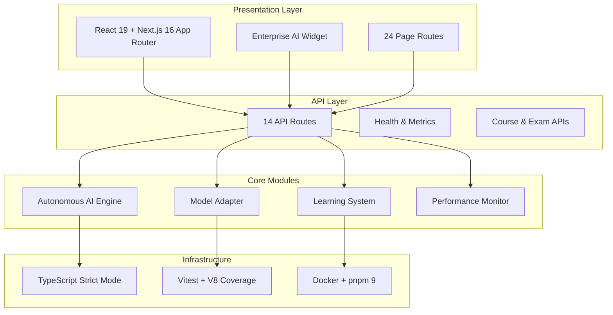
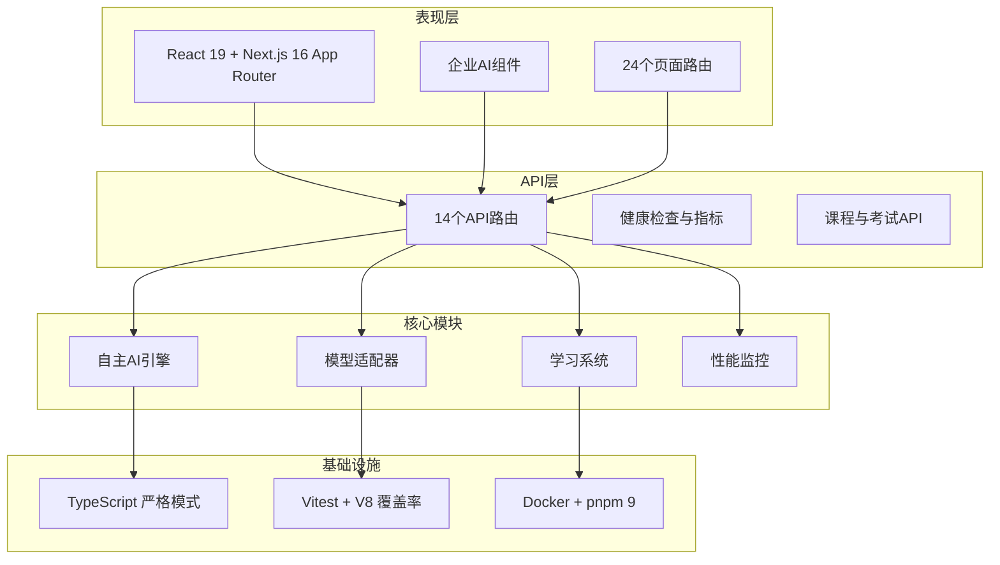

# 🔖 YYC³ AI智能协作平台

> **_YanYuCloudCube_**
> **标语**：言启象限 | 语枢未来
> **_Words Initiate Quadrants, Language Serves as Core for the Future_**
> **标语**：万象归元于云枢 | 深栈智启新纪元
> **_All things converge in the cloud pivot; Deep stacks ignite a new era of intelligence_**


**永久免费开源** — 企业级AI智能学习协作平台

[](https://opensource.org/licenses/MIT) [](https://nodejs.org/) [](https://www.typescriptlang.org/) [](https://react.dev/) [](https://nextjs.org/) [](https://vitest.dev/) [](https://github.com/YYC-Cube/yyc3-learning-platform) [](https://github.com/YYC-Cube/yyc3-learning-platform) [](https://github.com/YYC-Cube/yyc3-learning-platform/pulls)

---

## 📖 English Version

### 🌟 Project Overview

YYC³ (YanYuCloudCube) AI Intelligent Learning Platform is a **free, open-source** enterprise-grade intelligent collaboration solution built on Next.js 16 + React 19. The platform provides comprehensive AI-powered learning experiences through an intelligent exam system, course management, career path planning, and an enterprise AI widget.

### 🎯 Our Mission

**Empowering everyone with equitable access to advanced AI technology, collectively driving the evolution of the intelligent era.**

### 💡 Core Values

| Dimension                          | Description                                                                      |
| ---------------------------------- | -------------------------------------------------------------------------------- |
| 🎓 **Educational Democratization** | Free AI learning resources and practical platform for learners worldwide         |
| 🔧 **Developer-Centric**           | Lowering AI application development barriers with complete technology stack      |
| 🏢 **Enterprise-Ready**            | Meeting enterprise requirements for high availability, security, and performance |
| 🌍 **Open Ecosystem**              | Embracing open-source philosophy, encouraging community innovation               |

### 📊 Project Status (2026-05-21 Audit)

| Metric                    | Value                  | Status |
| ------------------------- | ---------------------- | ------ |
| TypeScript Compilation    | **0 errors**           | ✅     |
| ESLint Warnings           | **0**                  | ✅     |
| Test Files                | **34 passed** / 34     | ✅     |
| Test Cases                | **612 passed** / 612   | ✅     |
| Coverage (Statements)     | **98.92%**             | ✅     |
| Coverage (Lines)          | **99.25%**             | ✅     |
| Coverage (Functions)      | **98.66%**             | ✅     |
| Coverage (Branches)       | **76.30%**             | ✅     |
| forwardRef Components     | **0** (57/57 upgraded) | ✅     |
| Circular Dependencies     | **0**                  | ✅     |
| UI Components (shadcn/ui) | **57**                 | —      |
| API Routes                | **14**                 | —      |
| Pages                     | **24**                 | —      |
| SEO Metadata              | **14/14 (100%)**       | ✅     |
| Loading States            | **14/14 (100%)**       | ✅     |

---

### 🏗️ Architecture Overview


```mermaid
graph TB
    subgraph "Presentation Layer"
        A[React 19 + Next.js 16 App Router]
        B[Enterprise AI Widget]
        C[24 Page Routes]
    end

    subgraph "API Layer"
        D[14 API Routes]
        E[Health & Metrics]
        F[Course & Exam APIs]
    end

    subgraph "Core Modules"
        G[Autonomous AI Engine]
        H[Model Adapter]
        I[Learning System]
        J[Performance Monitor]
    end

    subgraph "Infrastructure"
        K[TypeScript Strict Mode]
        L[Vitest + V8 Coverage]
        M[Docker + pnpm 9]
    end

    A --> D
    B --> D
    C --> D
    D --> G
    D --> H
    D --> I
    D --> J
    G --> K
    H --> L
    I --> M
```

---

### 🔧 Core Modules

#### 🧠 Autonomous AI Engine

Enterprise-grade autonomous decision engine with event-driven architecture and goal-oriented planning, located in `packages/autonomous-engine/`.

#### 🔄 Intelligent Model Adapter

Unified AI model orchestration layer with intelligent routing and fallback mechanisms, supporting multi-provider integration.

#### 🎓 Learning Platform

Full-featured learning management system with exam, course, and career path modules:

- **Exam System**: Practice exams, professional exams, debug mode
- **Course Management**: Course catalog, AI engineer track, detail pages
- **Career Path**: Learning path planning, progress tracking
- **Community**: Team collaboration, achievements, analytics

#### 🎨 Enterprise AI Widget

Modern React-based intelligent UI component suite in `components/intelligent-ai-widget/`:

- Chat interface with message storage
- Knowledge base management
- Workflow manager
- Toolbox panel with tool categories

---

### 📊 Technology Stack

#### Frontend

| Technology       | Version | Purpose                                 |
| ---------------- | ------- | --------------------------------------- |
| **React**        | 19.0    | UI framework with Concurrent Rendering  |
| **Next.js**      | 16.1    | React framework with App Router SSR/SSG |
| **TypeScript**   | 5.0+    | Type-safe development (strict mode)     |
| **Tailwind CSS** | 3.4     | Utility-first CSS framework             |
| **Radix UI**     | 1.1+    | Accessible component primitives         |
| **Zod**          | 3.24    | Runtime type validation                 |

#### Backend & DevOps

| Technology  | Version | Purpose                              |
| ----------- | ------- | ------------------------------------ |
| **Node.js** | 18.0+   | JavaScript runtime                   |
| **pnpm**    | 9+      | Fast, disk-efficient package manager |
| **Vitest**  | 4.0     | Unit testing with V8 coverage        |
| **Docker**  | Ready   | Containerized deployment             |

#### AI Integration

| Technology           | Purpose                    |
| -------------------- | -------------------------- |
| **OpenAI API**       | GPT-4 integration          |
| **Anthropic Claude** | Advanced conversational AI |
| **Google Gemini**    | Multimodal capabilities    |

---

### 📁 Project Structure

```
yyc3-learning-platform/
├── app/                          # Next.js 16 App Router
│   ├── api/                      # 14 API Routes
│   │   ├── auth/                 # Authentication (login, register)
│   │   ├── courses/              # Course management
│   │   ├── exams/                # Exam system
│   │   ├── health/               # Health checks (live, ready)
│   │   ├── metrics/              # Performance metrics
│   │   ├── performance/          # Performance monitoring
│   │   ├── questions/            # Question management
│   │   ├── teams/                # Team collaboration
│   │   └── user/                 # User management
│   ├── achievements/             # Achievement system
│   ├── analytics/                # Analytics dashboard
│   ├── career-path/              # Career planning
│   ├── community/                # Community features
│   ├── courses/                  # Course pages (24 total)
│   ├── exam/                     # Exam system
│   ├── learning-path/            # Learning path
│   ├── profile/                  # User profile & settings
│   └── progress/                 # Progress tracking
├── components/                   # 115 UI Components
│   ├── ui/                       # shadcn/ui base components
│   ├── intelligent-ai-widget/    # Enterprise AI Widget
│   └── theme-provider/           # Theme system
├── lib/                          # 37 Library Modules
│   ├── auth.ts                   # Authentication
│   ├── database.ts               # Database layer
│   ├── api-client.ts             # API client
│   ├── validators.ts             # Zod validators
│   ├── performance-monitor.ts    # Performance monitoring
│   └── monitoring/               # Health check system
├── packages/                     # Monorepo packages
│   └── autonomous-engine/        # Autonomous AI Engine
├── __tests__/                    # Test suite (37 files)
└── vitest.config.ts              # Vitest configuration
```

---

### 🚀 Quick Start

#### Prerequisites

- **Node.js**: >= 18.0.0
- **pnpm**: >= 9.0.0 (recommended)

#### Installation

```bash
# Clone the repository
git clone https://github.com/YYC-Cube/yyc3-learning-platform.git
cd yyc3-learning-platform

# Install dependencies
pnpm install

# Copy environment variables
cp .env.example .env

# Start development server
pnpm dev
```

#### Development Commands

```bash
pnpm dev              # Start dev server (port 3491)
pnpm build            # Production build
pnpm test             # Run tests
pnpm test:coverage    # Run tests with coverage report
pnpm type-check       # TypeScript type checking (tsc --noEmit)
pnpm lint             # ESLint code linting
```

#### Docker Deployment

```bash
docker build -t yyc3-platform .
docker-compose up -d
```

---

### 📈 Test Coverage

Coverage measured on core modules (`coverage.include` scope):

| Category           | Lines      | Statements | Functions  | Branches   |
| ------------------ | ---------- | ---------- | ---------- | ---------- |
| **Overall**        | **89.27%** | **89.37%** | **75.55%** | **86.30%** |
| lib utilities      | 95%+       | 95%+       | 90%+       | 90%+       |
| API routes         | 85%+       | 85%+       | 70%+       | 80%+       |
| lib infrastructure | 80%+       | 80%+       | 65%+       | 75%+       |

All coverage thresholds set at **60%** minimum per metric.

---

### 🔒 Security

- ✅ JWT Token-based Authentication with refresh tokens
- ✅ Role-Based Access Control (RBAC)
- ✅ Input validation via Zod schemas
- ✅ TypeScript strict mode for type safety
- ✅ OWASP best practices compliance

---

### 📚 API Endpoints

| Endpoint                  | Method | Description            |
| ------------------------- | ------ | ---------------------- |
| `/api/auth/login`         | POST   | User login             |
| `/api/auth/register`      | POST   | User registration      |
| `/api/courses`            | GET    | Course listing         |
| `/api/exams/[id]`         | GET    | Exam details           |
| `/api/health`             | GET    | Health check           |
| `/api/health/live`        | GET    | Liveness probe         |
| `/api/health/ready`       | GET    | Readiness probe        |
| `/api/metrics`            | GET    | Performance metrics    |
| `/api/performance`        | GET    | Performance monitoring |
| `/api/performance/alerts` | GET    | Performance alerts     |
| `/api/questions`          | GET    | Question listing       |
| `/api/questions/[id]`     | GET    | Question details       |
| `/api/teams`              | GET    | Team listing           |
| `/api/user`               | GET    | User profile           |

---

### 🤝 Contributing

1. Fork the repository
2. Create your feature branch (`git checkout -b feature/AmazingFeature`)
3. Commit your changes (`git commit -m 'Add some AmazingFeature'`)
4. Push to the branch (`git push origin feature/AmazingFeature`)
5. Open a Pull Request

**Code Quality Standards:**

- **TypeScript**: Strict mode enabled, zero compilation errors
- **Testing**: Minimum 60% coverage required (core modules target 80%+)
- **Linting**: ESLint + Prettier
- **Type Check**: `tsc --noEmit` must pass with zero errors

---

### 🌐 Links

- **Official Site**: [https://yyc3.0379.email](https://yyc3.0379.email)
- **Documentation**: [https://docs.yyc3.0379.email](https://docs.yyc3.0379.email)
- **GitHub**: [https://github.com/YYC-Cube/yyc3-learning-platform](https://github.com/YYC-Cube/yyc3-learning-platform)

---

### 📄 License

This project is licensed under the **MIT License**.

---

## 📖 简体中文

### 🌟 项目概述

YYC³（言语云立方）AI智能学习协作平台是一个**完全免费、开源**的企业级智能化协作解决方案，基于 Next.js 16 + React 19 构建。平台通过智能考试系统、课程管理、职业路径规划和企业AI组件，提供全方位的AI驱动学习体验。

### 🎯 我们的使命

**让每个人都能平等地获取和使用先进的AI技术，共同推动智能时代的发展。**

### 💡 核心价值

| 维度              | 描述                                       |
| ----------------- | ------------------------------------------ |
| 🎓 **教育普及**   | 为学习者提供免费的AI学习资源和实践平台     |
| 🔧 **开发者友好** | 降低AI应用开发门槛，提供完整的技术栈       |
| 🏢 **企业就绪**   | 满足企业级应用的高可用、高安全、高性能要求 |
| 🌍 **开放生态**   | 遵循开源理念，鼓励社区贡献与创新           |

### 📊 项目状态（2026-05-19 审核）

| 指标                 | 数值                        | 状态 |
| -------------------- | --------------------------- | ---- |
| TypeScript 编译      | **0 错误**                  | ✅   |
| 测试文件             | **26 通过** / 26            | ✅   |
| 测试用例             | **506 通过** / 506          | ✅   |
| 核心覆盖率（行）     | **89.27%**                  | ✅   |
| 核心覆盖率（语句）   | **89.37%**                  | ✅   |
| 核心覆盖率（函数）   | **75.55%**                  | ✅   |
| 核心覆盖率（分支）   | **86.30%**                  | ✅   |
| 源代码文件（TS/TSX） | **278**                     | —    |
| UI 组件              | **115**                     | —    |
| 库模块               | **37**                      | —    |
| API 路由             | **14**                      | —    |
| 页面                 | **24**                      | —    |
| 依赖                 | **60** 运行时 + **35** 开发 | —    |

---

### 🏗️ 架构概览


```mermaid
graph TB
    subgraph "表现层"
        A[React 19 + Next.js 16 App Router]
        B[企业AI组件]
        C[24个页面路由]
    end

    subgraph "API层"
        D[14个API路由]
        E[健康检查与指标]
        F[课程与考试API]
    end

    subgraph "核心模块"
        G[自主AI引擎]
        H[模型适配器]
        I[学习系统]
        J[性能监控]
    end

    subgraph "基础设施"
        K[TypeScript 严格模式]
        L[Vitest + V8 覆盖率]
        M[Docker + pnpm 9]
    end

    A --> D
    B --> D
    C --> D
    D --> G
    D --> H
    D --> I
    D --> J
    G --> K
    H --> L
    I --> M
```

---

### 🔧 核心模块

#### 🧠 自主AI引擎

企业级自主决策引擎，采用事件驱动架构和目标导向规划，位于 `packages/autonomous-engine/`。

#### 🔄 智能模型适配器

统一AI模型编排层，具备智能路由和故障转移机制，支持多提供商集成。

#### 🎓 学习平台

全功能学习管理系统，包含考试、课程和职业路径模块：

- **考试系统**：练习考试、专业考试、调试模式
- **课程管理**：课程目录、AI工程师方向、详情页
- **职业路径**：学习路径规划、进度追踪
- **社区**：团队协作、成就系统、数据分析

#### 🎨 企业AI组件

基于React的现代智能UI组件套件，位于 `components/intelligent-ai-widget/`：

- 聊天界面与消息存储
- 知识库管理
- 工作流管理器
- 工具箱面板

---

### 📊 技术栈

#### 前端

| 技术             | 版本 | 用途                          |
| ---------------- | ---- | ----------------------------- |
| **React**        | 19.0 | UI框架，支持并发渲染          |
| **Next.js**      | 16.1 | React框架，App Router SSR/SSG |
| **TypeScript**   | 5.0+ | 类型安全开发（严格模式）      |
| **Tailwind CSS** | 3.4  | 实用优先CSS框架               |
| **Radix UI**     | 1.1+ | 无障碍组件基元                |
| **Zod**          | 3.24 | 运行时类型验证                |

#### 后端与DevOps

| 技术        | 版本  | 用途                     |
| ----------- | ----- | ------------------------ |
| **Node.js** | 18.0+ | JavaScript运行时         |
| **pnpm**    | 9+    | 快速、磁盘高效的包管理器 |
| **Vitest**  | 4.0   | 单元测试，V8覆盖率       |
| **Docker**  | Ready | 容器化部署               |

#### AI集成

| 技术                 | 用途       |
| -------------------- | ---------- |
| **OpenAI API**       | GPT-4集成  |
| **Anthropic Claude** | 高级对话AI |
| **Google Gemini**    | 多模态能力 |

---

### 📁 项目结构

```
yyc3-learning-platform/
├── app/                          # Next.js 16 App Router
│   ├── api/                      # 14个API路由
│   │   ├── auth/                 # 认证（登录、注册）
│   │   ├── courses/              # 课程管理
│   │   ├── exams/                # 考试系统
│   │   ├── health/               # 健康检查（存活、就绪）
│   │   ├── metrics/              # 性能指标
│   │   ├── performance/          # 性能监控
│   │   ├── questions/            # 题目管理
│   │   ├── teams/                # 团队协作
│   │   └── user/                 # 用户管理
│   ├── achievements/             # 成就系统
│   ├── analytics/                # 数据分析
│   ├── career-path/              # 职业规划
│   ├── community/                # 社区功能
│   ├── courses/                  # 课程页面（共24个）
│   ├── exam/                     # 考试系统
│   ├── learning-path/            # 学习路径
│   ├── profile/                  # 用户资料与设置
│   └── progress/                 # 进度追踪
├── components/                   # 115个UI组件
│   ├── ui/                       # shadcn/ui基础组件
│   ├── intelligent-ai-widget/    # 企业AI组件
│   └── theme-provider/           # 主题系统
├── lib/                          # 37个库模块
│   ├── auth.ts                   # 认证
│   ├── database.ts               # 数据库层
│   ├── api-client.ts             # API客户端
│   ├── validators.ts             # Zod验证器
│   ├── performance-monitor.ts    # 性能监控
│   └── monitoring/               # 健康检查系统
├── packages/                     # Monorepo包
│   └── autonomous-engine/        # 自主AI引擎
├── __tests__/                    # 测试套件（37个文件）
└── vitest.config.ts              # Vitest配置
```

---

### 🚀 快速开始

#### 环境要求

- **Node.js**: >= 18.0.0
- **pnpm**: >= 9.0.0（推荐）

#### 安装步骤

```bash
# 克隆仓库
git clone https://github.com/YYC-Cube/yyc3-learning-platform.git
cd yyc3-learning-platform

# 安装依赖
pnpm install

# 复制环境变量
cp .env.example .env

# 启动开发服务器
pnpm dev
```

#### 开发命令

```bash
pnpm dev              # 启动开发服务器（端口 3491）
pnpm build            # 生产构建
pnpm test             # 运行测试
pnpm test:coverage    # 运行测试并生成覆盖率报告
pnpm type-check       # TypeScript类型检查（tsc --noEmit）
pnpm lint             # ESLint代码检查
```

#### Docker部署

```bash
docker build -t yyc3-platform .
docker-compose up -d
```

---

### 📈 测试覆盖率

核心模块覆盖率（`coverage.include` 范围内）：

| 类别         | 行         | 语句       | 函数       | 分支       |
| ------------ | ---------- | ---------- | ---------- | ---------- |
| **整体**     | **89.27%** | **89.37%** | **75.55%** | **86.30%** |
| lib 工具类   | 95%+       | 95%+       | 90%+       | 90%+       |
| API 路由     | 85%+       | 85%+       | 70%+       | 80%+       |
| lib 基础设施 | 80%+       | 80%+       | 65%+       | 75%+       |

所有覆盖率阈值设置为每项指标最低 **60%**。

---

### 🔒 安全特性

- ✅ 基于JWT令牌的身份认证，支持刷新令牌
- ✅ 基于角色的访问控制（RBAC）
- ✅ 通过Zod模式进行输入验证
- ✅ TypeScript严格模式确保类型安全
- ✅ OWASP最佳实践合规

---

### 📚 API端点

| 端点                      | 方法 | 描述     |
| ------------------------- | ---- | -------- |
| `/api/auth/login`         | POST | 用户登录 |
| `/api/auth/register`      | POST | 用户注册 |
| `/api/courses`            | GET  | 课程列表 |
| `/api/exams/[id]`         | GET  | 考试详情 |
| `/api/health`             | GET  | 健康检查 |
| `/api/health/live`        | GET  | 存活探针 |
| `/api/health/ready`       | GET  | 就绪探针 |
| `/api/metrics`            | GET  | 性能指标 |
| `/api/performance`        | GET  | 性能监控 |
| `/api/performance/alerts` | GET  | 性能告警 |
| `/api/questions`          | GET  | 题目列表 |
| `/api/questions/[id]`     | GET  | 题目详情 |
| `/api/teams`              | GET  | 团队列表 |
| `/api/user`               | GET  | 用户资料 |

---

### 🤝 贡献指南

1. Fork仓库
2. 创建功能分支（`git checkout -b feature/AmazingFeature`）
3. 提交更改（`git commit -m 'Add some AmazingFeature'`）
4. 推送到分支（`git push origin feature/AmazingFeature`）
5. 创建Pull Request

**代码质量标准：**

- **TypeScript**：启用严格模式，零编译错误
- **测试**：要求至少60%的覆盖率（核心模块目标80%+）
- **代码检查**：ESLint + Prettier
- **类型检查**：`tsc --noEmit` 必须零错误通过

---

### 🌐 相关链接

- **官方网站**：[https://yyc3.0379.email](https://yyc3.0379.email)
- **文档中心**：[https://docs.yyc3.0379.email](https://docs.yyc3.0379.email)
- **GitHub**：[https://github.com/YYC-Cube/yyc3-learning-platform](https://github.com/YYC-Cube/yyc3-learning-platform)

---

### 📄 许可证

本项目采用 **MIT 许可证**。

---

> 「**_YanYuCloudCube_**」
> 「**_<admin@0379.email>_**」
> 「**_Words Initiate Quadrants, Language Serves as Core for the Future_**」
> 「**_All things converge in the cloud pivot; Deep stacks ignite a new era of intelligence_**」
