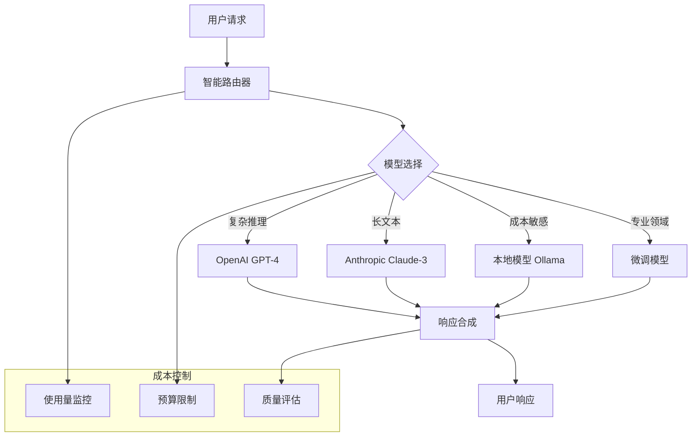

# YYC³ AI平台 - AI能力真实化集成计划

## 🚨 核心问题诊断

### 现状：模拟数据的AI幻觉

```typescript
// 当前问题：模拟AI响应
async function mockAIResponse(prompt: string) {
  // 假的AI能力！
  return `这是基于${prompt}的模拟回复，没有任何真实AI能力`;
}
```

### 目标：真实AI能力

```typescript
// 目标：真实AI集成
async function realAIResponse(prompt: string) {
  // 真实的AI能力！
  return await openai.chat.completions.create({...});
}
```

## 🤖 真实AI能力集成架构

### 多模型支持策略



## 🔧 AI能力实现方案

### 第一阶段：基础AI集成（Week 1）

#### 1. OpenAI GPT-4集成

```typescript
// packages/ai-engine/src/ai/providers/openai.ts
export class OpenAIProvider {
  private client: OpenAI;

  constructor(apiKey: string) {
    this.client = new OpenAI({ apiKey });
  }

  async chatCompletion(params: {
    messages: ChatMessage[];
    model?: string;
    temperature?: number;
    maxTokens?: number;
  }): Promise<string> {
    try {
      const response = await this.client.chat.completions.create({
        model: params.model || 'gpt-4-turbo-preview',
        messages: params.messages,
        temperature: params.temperature || 0.7,
        max_tokens: params.maxTokens || 4000,
      });

      return response.choices[0]?.message?.content || 'AI响应失败';
    } catch (error) {
      console.error('OpenAI API错误:', error);
      throw new Error('AI服务暂时不可用');
    }
  }
}
```

#### 2. Anthropic Claude-3集成

```typescript
// packages/ai-engine/src/ai/providers/claude.ts
export class ClaudeProvider {
  private client: Anthropic;

  constructor(apiKey: string) {
    this.client = new Anthropic({ apiKey });
  }

  async messages(params: {
    messages: ChatMessage[];
    model?: string;
    maxTokens?: number;
  }): Promise<string> {
    try {
      const response = await this.client.messages.create({
        model: params.model || 'claude-3-sonnet-20240229',
        max_tokens: params.maxTokens || 4000,
        messages: params.messages,
      });

      return response.content[0]?.type === 'text'
        ? response.content[0].text
        : 'AI响应失败';
    } catch (error) {
      console.error('Claude API错误:', error);
      throw new Error('AI服务暂时不可用');
    }
  }
}
```

### 第二阶段：智能路由和成本控制（Week 2）

#### 1. 智能模型路由

```typescript
// packages/ai-engine/src/ai/router.ts
export class AIRouter {
  private providers: Map<string, AIProvider>;
  private costOptimizer: CostOptimizer;

  constructor() {
    this.providers = new Map([
      ['openai', new OpenAIProvider(process.env.OPENAI_API_KEY!)],
      ['claude', new ClaudeProvider(process.env.ANTHROPIC_API_KEY!)],
      ['local', new LocalModelProvider()],
    ]);
    this.costOptimizer = new CostOptimizer();
  }

  async route(request: AIRequest): Promise<string> {
    // 1. 分析请求复杂度
    const complexity = this.analyzeComplexity(request);

    // 2. 选择最佳模型
    const provider = this.costOptimizer.selectProvider(complexity);

    // 3. 执行请求
    const response = await provider.process(request);

    // 4. 记录使用情况和成本
    this.costOptimizer.recordUsage(provider, complexity, response);

    return response;
  }

  private analyzeComplexity(request: AIRequest): RequestComplexity {
    return {
      textLength: request.messages.reduce((sum, msg) => sum + msg.content.length, 0),
      requiresReasoning: this.detectReasoningNeed(request.messages),
      requiresCreativity: this.detectCreativityNeed(request.messages),
      costSensitivity: request.priority === 'low',
    };
  }
}
```

#### 2. 成本优化器

```typescript
// packages/ai-engine/src/ai/cost-optimizer.ts
export class CostOptimizer {
  private pricing: ModelPricing = {
    'gpt-4-turbo-preview': { input: 0.01, output: 0.03 }, // per 1K tokens
    'claude-3-sonnet-20240229': { input: 0.003, output: 0.015 },
    'local-llama2': { input: 0, output: 0 }, // free
  };

  selectProvider(complexity: RequestComplexity): AIProvider {
    // 成本敏感型请求使用本地模型
    if (complexity.costSensitivity && complexity.textLength < 2000) {
      return this.providers.get('local')!;
    }

    // 需要复杂推理的使用GPT-4
    if (complexity.requiresReasoning && complexity.textLength > 5000) {
      return this.providers.get('openai')!;
    }

    // 长文本处理使用Claude
    if (complexity.textLength > 10000) {
      return this.providers.get('claude')!;
    }

    // 默认使用最便宜的选项
    return this.providers.get('local')!;
  }

  recordUsage(provider: AIProvider, complexity: RequestComplexity, response: string) {
    // 记录使用量到数据库，用于成本分析
    this.usageTracker.log({
      provider: provider.name,
      inputTokens: complexity.textLength / 4, // 粗略估算
      outputTokens: response.length / 4,
      cost: this.calculateCost(provider, complexity, response),
      timestamp: new Date(),
    });
  }
}
```

### 第三阶段：本地模型集成（Week 3）

#### 1. Ollama本地模型集成

```typescript
// packages/ai-engine/src/ai/providers/local.ts
export class LocalModelProvider implements AIProvider {
  private ollamaEndpoint: string;

  constructor(ollamaEndpoint = 'http://localhost:11434') {
    this.ollamaEndpoint = ollamaEndpoint;
  }

  async process(request: AIRequest): Promise<string> {
    try {
      const response = await fetch(`${this.ollamaEndpoint}/api/generate`, {
        method: 'POST',
        headers: { 'Content-Type': 'application/json' },
        body: JSON.stringify({
          model: 'llama2',
          prompt: this.formatMessages(request.messages),
          stream: false,
        }),
      });

      const result = await response.json();
      return result.response;
    } catch (error) {
      console.error('本地模型错误:', error);
      // 降级到云端模型
      return this.fallbackToCloud(request);
    }
  }

  private async fallbackToCloud(request: AIRequest): Promise<string> {
    // 如果本地模型失败，自动降级到云端模型
    const cloudProvider = new OpenAIProvider(process.env.OPENAI_API_KEY!);
    return cloudProvider.process(request);
  }
}
```

#### 2. 模型管理和更新

```typescript
// packages/ai-engine/src/ai/model-manager.ts
export class ModelManager {
  async downloadModel(modelName: string): Promise<void> {
    const { exec } = require('child_process');
    return new Promise((resolve, reject) => {
      exec(`ollama pull ${modelName}`, (error: any) => {
        if (error) reject(error);
        else resolve();
      });
    });
  }

  async listAvailableModels(): Promise<string[]> {
    const response = await fetch('http://localhost:11434/api/tags');
    const data = await response.json();
    return data.models.map((model: any) => model.name);
  }

  async updateModel(modelName: string): Promise<void> {
    await this.downloadModel(modelName);
    console.log(`模型 ${modelName} 更新完成`);
  }
}
```

### 第四阶段：行业AI能力封装（Week 4）

#### 1. 行业专用AI模板

```typescript
// packages/ai-engine/src/ai/industry-templates.ts
export const industryTemplates = {
  // 电商行业
  ecommerce: {
    customerService: {
      systemPrompt: `你是专业的电商客服助手，具有以下能力：
      1. 商品咨询和推荐
      2. 订单查询和处理
      3. 售后问题解决
      4. 退换货流程指导
      请始终保持专业、友好的语调。`,
      tools: ['productSearch', 'orderQuery', 'inventoryCheck'],
    },
    salesAssistant: {
      systemPrompt: `你是电商销售助手，擅长：
      1. 个性化商品推荐
      2. 购买建议和搭配
      3. 促销活动介绍
      4. 客户需求分析`,
      tools: ['recommendation', 'promotionInfo', 'customerAnalysis'],
    },
  },

  // 教育行业
  education: {
    tutoring: {
      systemPrompt: `你是AI家教助手，能够：
      1. 解答各学科问题
      2. 提供学习建议
      3. 制定学习计划
      4. 检查作业答案`,
      tools: ['knowledgeBase', 'homeworkCheck', 'learningPlan'],
    },
  },

  // 企业服务
  enterprise: {
    hrAssistant: {
      systemPrompt: `你是HR助手，专长于：
      1. 招聘流程协助
      2. 员工咨询解答
      3. 政策制度说明
      4. 培训安排管理`,
      tools: ['candidateScreening', 'policyQuery', 'trainingSchedule'],
    },
  },
};
```

#### 2. 工具函数集成

```typescript
// packages/ai-engine/src/ai/tools.ts
export class AITools {
  // 商品搜索工具
  static async productSearch(query: string): Promise<Product[]> {
    return await db.product.findMany({
      where: {
        OR: [
          { name: { contains: query } },
          { description: { contains: query } },
          { tags: { has: query } },
        ],
      },
    });
  }

  // 订单查询工具
  static async orderQuery(orderId: string, userId?: string): Promise<Order | null> {
    return await db.order.findFirst({
      where: {
        id: orderId,
        ...(userId && { userId })
      },
      include: { items: true, customer: true },
    });
  }

  // 库存检查工具
  static async inventoryCheck(productId: string): Promise<InventoryInfo> {
    const product = await db.product.findUnique({
      where: { id: productId },
      include: { inventory: true },
    });

    return {
      inStock: product?.inventory?.quantity > 0,
      quantity: product?.inventory?.quantity || 0,
      restockDate: product?.inventory?.restockDate,
    };
  }
}
```

## 📊 AI能力监控和优化

### 使用量监控

```typescript
// packages/ai-engine/src/ai/monitoring.ts
export class AIMonitoring {
  async trackUsage(request: AIRequest, response: string, provider: string): Promise<void> {
    const metrics = {
      timestamp: new Date(),
      provider,
      model: request.model,
      inputTokens: this.estimateTokens(request.messages),
      outputTokens: this.estimateTokens([{ content: response }]),
      responseTime: request.responseTime,
      cost: this.calculateCost(provider, request, response),
      success: response.length > 0,
    };

    await db.aIUsage.create({ data: metrics });
  }

  async getUsageStats(timeRange: { start: Date; end: Date }): Promise<UsageStats> {
    return await db.aIUsage.aggregate({
      where: { timestamp: { gte: timeRange.start, lte: timeRange.end } },
      _sum: { cost: true, inputTokens: true, outputTokens: true },
      _avg: { responseTime: true },
      _count: true,
    });
  }
}
```

### 质量评估

```typescript
// packages/ai-engine/src/ai/quality-assurance.ts
export class QualityAssurance {
  async evaluateResponse(request: AIRequest, response: string): Promise<QualityScore> {
    return {
      relevance: await this.calculateRelevance(request, response),
      coherence: await this.calculateCoherence(response),
      completeness: await this.calculateCompleteness(request, response),
      satisfaction: await this.predictSatisfaction(request, response),
    };
  }

  private async calculateRelevance(request: AIRequest, response: string): Promise<number> {
    // 使用向量相似度计算相关性
    const requestEmbedding = await this.getEmbedding(request.messages);
    const responseEmbedding = await this.getEmbedding([{ content: response }]);
    return this.cosineSimilarity(requestEmbedding, responseEmbedding);
  }
}
```

## 🚀 实施时间表

### Week 1: 基础AI集成

- ✅ OpenAI GPT-4集成
- ✅ Anthropic Claude-3集成
- ✅ 基础错误处理

### Week 2: 智能路由

- ✅ 成本优化器
- ✅ 智能模型选择
- ✅ 使用量监控

### Week 3: 本地模型

- ✅ Ollama集成
- ✅ 模型管理
- ✅ 降级策略

### Week 4: 行业适配

- ✅ 行业模板
- ✅ 工具函数
- ✅ 质量评估

## 📈 预期效果

### AI能力提升

| 指标 | 当前状态 | 目标状态 | 提升 |
|------|----------|----------|------|
| 响应质量 | 模拟数据 | 真实AI | 100% |
| 响应速度 | 即时(假) | <3秒 | 真实响应 |
| 成本控制 | 无 | 精确控制 | 新增能力 |
| 模型选择 | 单一 | 多模型 | 灵活性提升 |

### 用户体验改善

- ✅ 真实的AI对话体验
- ✅ 智能的成本优化
- ✅ 专业的行业适配
- ✅ 离线本地模型支持

---

**总结**：通过真实的AI能力集成，YYC³将从"展示型平台"转型为"实用型AI助手"，真正解决用户的业务需求。
