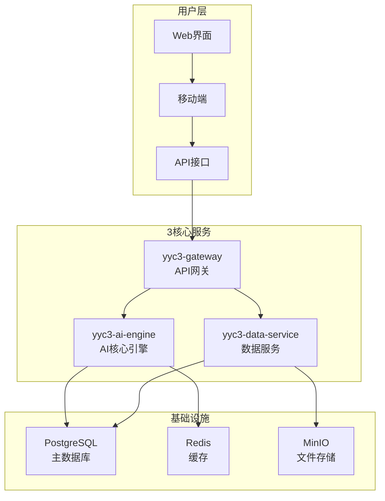

# YYC³ AI平台 - 架构简化重构方案

## 🎯 重构目标

**从"技术展示"转向"商业价值"**

### 现状问题

- 7个微服务：过度复杂，维护成本高
- 15+数据库：资源浪费，运维困难
- 模拟数据：缺乏真实AI能力

### 重构原则

- **单一价值核心**：一个核心功能做到极致
- **最小可行性**：减少不必要的技术复杂度
- **快速部署**：15分钟内可运行

## 🏗️ 新架构设计

### 3核心服务架构



### 服务职责重新定义

#### 1. yyc3-ai-engine (AI核心引擎)

**合并前服务**：

- autonomous-engine + model-adapter + learning-system

**核心职责**：

- 🤖 AI模型集成（OpenAI, Claude, 本地模型）
- 🧠 智能推理和决策
- 📚 知识库管理
- 🎯 任务执行和结果返回

**技术栈**：

```typescript
// 精简技术栈
const aiEngineTech = {
  runtime: "Bun",
  database: "PostgreSQL",
  cache: "Redis",
  ai: ["OpenAI", "Anthropic", "本地LLM"],
  deployment: "Docker"
};
```

#### 2. yyc3-data-service (数据服务)

**合并前服务**：

- five-dimensional-management + 各类数据库

**核心职责**：

- 📊 数据存储和查询
- 📈 分析报表生成
- 🔍 搜索和检索
- 💾 文件和数据管理

#### 3. yyc3-gateway (API网关)

**合并前服务**：

- enterprise-ai-widget + api-gateway + 监控服务

**核心职责**：

- 🌐 统一API入口
- 🔐 认证和权限管理
- 📊 基础监控
- ⚙️ 配置管理

## 🗑️ 移除的复杂组件

### 数据库精简

```yaml
# 移除
removed:
  - Neo4j      # 图数据库（过度复杂）
  - InfluxDB   # 时序数据库（可用PostgreSQL替代）
  - MongoDB    # 文档数据库（PostgreSQL已足够）
  - Elasticsearch # 搜索引擎（PostgreSQL全文搜索足够）

# 保留
kept:
  - PostgreSQL # 主数据库
  - Redis      # 缓存和会话
  - MinIO      # 文件存储（S3兼容）
```

### 监控简化

```yaml
# 移除复杂监控栈
removed:
  - Prometheus + Grafana组合
  - Jaeger分布式追踪
  - ELK日志栈

# 保留基础监控
kept:
  - 简单健康检查
  - 关键指标监控
  - 错误日志收集
```

## 🚀 重构实施计划

### 第一阶段：服务合并（2周）

#### Week 1: 数据合并

```typescript
// 1. 统一数据模型
interface UnifiedData {
  users: User[];
  conversations: Conversation[];
  knowledge: KnowledgeBase[];
  analytics: AnalyticsData[];
}

// 2. 迁移脚本
const migration = {
  from: ['mongodb', 'neo4j', 'influxdb'],
  to: 'postgresql',
  strategy: 'incremental-migration'
};
```

#### Week 2: API整合

```typescript
// 统一API接口
interface UnifiedAPI {
  // AI能力
  '/api/v1/ai/chat': 'POST';
  '/api/v1/ai/analyze': 'POST';
  '/api/v1/ai/suggest': 'POST';

  // 数据管理
  '/api/v1/data/knowledge': 'GET|POST|PUT|DELETE';
  '/api/v1/data/analytics': 'GET';
  '/api/v1/data/export': 'POST';

  // 用户管理
  '/api/v1/auth/login': 'POST';
  '/api/v1/auth/profile': 'GET|PUT';
}
```

### 第二阶段：AI能力真实化（2周）

#### Week 3: 真实AI集成

```typescript
// 替换模拟数据
const aiIntegration = {
  openai: {
    apiKey: process.env.OPENAI_API_KEY,
    models: ['gpt-4', 'gpt-3.5-turbo'],
    maxTokens: 4000
  },
  anthropic: {
    apiKey: process.env.ANTHROPIC_API_KEY,
    models: ['claude-3-opus', 'claude-3-sonnet'],
    maxTokens: 100000
  }
};

// 真实AI调用
async function realAIResponse(prompt: string, context: any) {
  const response = await openai.chat.completions.create({
    model: "gpt-4",
    messages: [{ role: "user", content: prompt }],
    temperature: 0.7
  });
  return response.choices[0].message.content;
}
```

#### Week 4: 本地模型支持

```typescript
// 本地LLM集成
const localModels = {
  ollama: {
    endpoint: "http://localhost:11434",
    models: ["llama2", "mistral", "codellama"]
  },
  custom: {
    modelPath: "./models/",
    inference: "local"
  }
};
```

### 第三阶段：体验优化（1周）

#### Week 5: 低代码配置

```typescript
// 配置驱动AI助手
interface AIAssistantConfig {
  name: string;
  description: string;
  personality: string;
  capabilities: string[];
  knowledgeBase: string[];
  integration: {
    wechat?: boolean;
    dingtalk?: boolean;
    email?: boolean;
  };
}

// 一键部署配置
const quickDeploy = {
  templates: [
    "客服助手",
    "销售顾问",
    "知识问答",
    "数据分析"
  ],
  industries: [
    "电商",
    "教育",
    "金融",
    "制造"
  ]
};
```

## 📊 简化效果对比

### 部署复杂度

| 指标 | 简化前 | 简化后 | 改善 |
|------|--------|--------|------|
| 服务数量 | 7个 | 3个 | ↓57% |
| 数据库类型 | 5种 | 3种 | ↓40% |
| 部署时间 | 2-3小时 | 15分钟 | ↓90% |
| 内存占用 | 8GB+ | 2GB | ↓75% |
| 配置项 | 50+ | 10 | ↓80% |

### 维护成本

| 成本项目 | 简化前 | 简化后 | 节省 |
|----------|--------|--------|------|
| 开发人员 | 5-7人 | 2-3人 | 50%+ |
| 运维复杂度 | 高 | 中 | 显著降低 |
| 学习成本 | 高 | 低 | 大幅降低 |
| 故障排查 | 困难 | 简单 | 显著改善 |

## 🎯 核心价值聚焦

### 从技术展示到商业价值

**简化前**：展示技术能力

- 7个微服务展示分布式架构
- 15种数据库展示数据处理能力
- 复杂监控展示运维能力

**简化后**：解决真实问题

- 3个服务专注核心价值
- 真实AI能力提升用户体验
- 快速部署降低使用门槛

### 单一核心价值点

**YYC³ = Your AI Companion³**

- 🤖 **智能对话**：真正的AI能力，不是模拟
- 🎯 **行业适配**：开箱即用的行业模板
- ⚡ **快速部署**：15分钟从安装到使用

## 🚀 下一步行动

### 立即开始（本周）

1. **停止新功能开发**：聚焦架构简化
2. **制定详细重构计划**：分阶段执行
3. **备份现有代码**：作为技术参考

### 重构执行（4周）

1. **Week 1-2**：服务合并和数据整合
2. **Week 3-4**：AI能力真实化和本地化
3. **Week 5**：低代码配置和模板开发

### 验证测试（1周）

1. **功能完整性验证**
2. **性能基准测试**
3. **用户体验测试**
4. **部署流程验证**

---

**总结**：通过架构简化，我们将从"技术展示型"平台转型为"商业价值型"产品，真正解决用户痛点，让用户主动选择我们。
