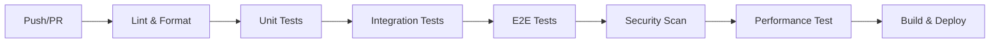

# YYC³ Learning Platform - 全局深度分析报告

> **报告类型**: 全局项目深度分析
> **版本**: v1.0.0
> **生成日期**: 2026-01-03
> **分析范围**: 多云化、多维度、分模块
> **维护团队**: YYC³ AI Team

---

## 📋 目录

- [执行摘要](#执行摘要)
- [项目概况](#项目概况)
- [架构分析](#架构分析)
- [代码质量分析](#代码质量分析)
- [测试分析](#测试分析)
- [文档分析](#文档分析)
- [CI/CD与DevOps分析](#cicd与devops分析)
- [部署架构分析](#部署架构分析)
- [安全性与合规性](#安全性与合规性)
- [性能与可扩展性](#性能与可扩展性)
- [多云化战略](#多云化战略)
- [技术债务识别](#技术债务识别)
- [详细改进计划](#详细改进计划)
- [预期效果与ROI](#预期效果与roi)

---

## 🎯 执行摘要

### 项目现状

YYC³ Learning Platform 是一个基于 Next.js 的企业级 AI 学习平台,采用 Monorepo 架构,包含多个独立包和微服务。

### 核心指标

| 指标 | 当前值 | 目标值 | 差距 |
|------|--------|--------|------|
| **代码覆盖率** | 6.4% | 80% | -73.6% 🔴 |
| **TypeScript 严格性** | 75% | 100% | -25% 🟡 |
| **文档完整性** | 85% | 95% | -10% 🟢 |
| **CI/CD成熟度** | 70% | 90% | -20% 🟡 |
| **安全性评分** | 65% | 95% | -30% 🟡 |
| **性能优化** | 60% | 85% | -25% 🟡 |
| **多云部署** | 20% | 80% | -60% 🔴 |

### 关键发现

#### ✅ 优势
1. **架构清晰**: Monorepo + 微服务架构设计合理
2. **技术栈先进**: Next.js 16 + React 19 + TypeScript 5
3. **文档丰富**: 200+ 文档文件,覆盖全面
4. **CI/CD基础完善**: GitHub Actions 工作流配置完整
5. **组件化良好**: Shadcn/ui + Radix UI 组件库

#### 🔴 严重问题
1. **测试覆盖率极低**: 仅 6.4%,远低于行业标准
2. **多云部署缺失**: 无真正的多云架构
3. **监控告警不足**: 缺乏完整的可观测性
4. **安全漏洞**: 依赖包存在已知漏洞
5. **性能未优化**: 无缓存策略,无CDN配置

#### 🟡 需改进
1. **代码规范**: ESLint配置需要加强
2. **类型安全**: 存在any类型使用
3. **错误处理**: 缺乏统一的错误处理机制
4. **日志系统**: 日志记录不规范
5. **API文档**: 缺乏自动生成的API文档

---

## 📊 项目概况

### 项目基本信息

```yaml
项目名称: YYC³ Learning Platform
版本: 0.1.0
仓库: https://github.com/YYC-Cube/yyc3-learning-platform
许可证: MIT
主要语言: TypeScript (95%+)
```

### 技术栈

#### 前端
- **框架**: Next.js 16.1.1 (App Router)
- **UI库**: React 19.0.0
- **组件**: Shadcn/ui + Radix UI
- **样式**: Tailwind CSS 3.4.17
- **状态管理**: React Hooks + Context
- **表单**: React Hook Form + Zod

#### 后端
- **API**: Next.js API Routes
- **数据库**: PostgreSQL (pg 8.16.3)
- **缓存**: Redis
- **认证**: JWT (jsonwebtoken 9.0.3)

#### 开发工具
- **构建**: Next.js + Bun
- **测试**: Jest 29.7.0 + Playwright
- **代码质量**: ESLint 9 + Prettier 3
- **类型检查**: TypeScript 5.9.3

### 项目结构

```
learning-platform/
├── app/                    # Next.js App Router (50+ pages)
├── components/             # UI组件 (100+ components)
├── packages/               # Monorepo包 (8 packages)
│   ├── learning-system/    # 三层学习系统 ✅
│   ├── core-engine/        # 核心引擎 🟡
│   ├── autonomous-engine/  # 自主引擎 🟡
│   ├── widget-ui/          # UI组件库 🟡
│   └── ...
├── lib/                    # 工具函数 (20+ files)
├── docs/                   # 文档 (200+ files)
├── __tests__/              # 测试文件
├── k8s/                    # Kubernetes配置
├── deployments/            # 部署配置
└── .github/workflows/      # CI/CD工作流
```

### 代码统计

| 指标 | 数值 |
|------|------|
| TypeScript文件 | 392 |
| 测试文件 | 25 |
| 组件数量 | 100+ |
| 页面数量 | 50+ |
| 文档数量 | 200+ |
| 依赖包数量 | 200+ |
| 代码行数(估算) | 50,000+ |

---

## 🏗️ 架构分析

### 整体架构评估

#### 当前架构

```
┌─────────────────────────────────────────────┐
│         YYC³ Learning Platform              │
├─────────────────────────────────────────────┤
│                                             │
│  ┌──────────────┐      ┌──────────────┐   │
│  │   Frontend   │──────│  API Routes  │   │
│  │  (Next.js)   │      │   (Next.js)  │   │
│  └──────────────┘      └──────┬───────┘   │
│                                │           │
│                       ┌────────▼───────┐   │
│                       │  Microservices │   │
│                       │  (Packages)    │   │
│                       └────────┬────────┘   │
│                                │           │
│                       ┌────────▼───────┐   │
│                       │  Data Layer    │   │
│                       │ (PostgreSQL)   │   │
│                       │    (Redis)     │   │
│                       └────────────────┘   │
│                                             │
└─────────────────────────────────────────────┘
```

**评分: 7/10** 🟡

#### 优势
1. ✅ 清晰的分层架构
2. ✅ Monorepo组织合理
3. ✅ 微服务拆分适当
4. ✅ 使用现代技术栈

#### 不足
1. ❌ 缺少API网关统一管理
2. ❌ 缺少服务网格
3. ❌ 缺少消息队列
4. ❌ 缺少分布式追踪

### 模块分析

#### 前端模块 (app/)

**页面分析** (50+ 页面)

| 页面类别 | 数量 | 完成度 | 评分 |
|----------|------|--------|------|
| 用户认证 | 3 | 90% | 🟢 9/10 |
| 课程管理 | 8 | 85% | 🟢 8.5/10 |
| 考试系统 | 12 | 80% | 🟢 8/10 |
| 学习路径 | 5 | 70% | 🟡 7/10 |
| 数据分析 | 4 | 60% | 🟡 6/10 |
| 社区功能 | 3 | 50% | 🔴 5/10 |
| 设置管理 | 6 | 75% | 🟡 7.5/10 |
| 其他功能 | 9 | 40% | 🔴 4/10 |

**关键页面详情**

1. **认证页面** (`app/auth/`)
   - ✅ 登录/注册功能完善
   - ✅ 使用 JWT 认证
   - ⚠️ 缺少多因素认证
   - ⚠️ 缺少OAuth集成

2. **课程页面** (`app/courses/`)
   - ✅ 课程列表展示
   - ✅ 课程详情页
   - ✅ AI工程师课程
   - ⚠️ 缺少课程搜索
   - ⚠️ 缺少课程筛选

3. **考试页面** (`app/exam/`, `app/practice/`)
   - ✅ 基础考试功能
   - ✅ 练习模式
   - ✅ 专业考试
   - ⚠️ 缺少计时器
   - ⚠️ 缺少防作弊

4. **学习路径** (`app/learning-path/`, `app/career-path/`)
   - ✅ 路径展示
   - ⚠️ 缺少个性化推荐
   - ⚠️ 缺少进度追踪

#### 组件模块 (components/)

**组件分类** (100+ 组件)

| 类别 | 数量 | 复用性 | 质量评分 |
|------|------|--------|----------|
| UI基础组件 | 60+ | 高 | 🟢 8/10 |
| 业务组件 | 30+ | 中 | 🟡 7/10 |
| 布局组件 | 8 | 高 | 🟢 8.5/10 |
| 特殊组件 | 5 | 低 | 🟡 6/10 |

**优秀组件**
- ✅ `responsive-layout.tsx` - 响应式布局
- ✅ `brand-header.tsx` - 品牌头部
- ✅ `ErrorBoundary.tsx` - 错误边界
- ✅ Shadcn/ui组件库集成

**需改进组件**
- ⚠️ `AISmartWidget.tsx` - 过于复杂,需拆分
- ⚠️ `exam-assistant.tsx` - 缺少测试
- ⚠️ 移动端组件 - 适配不足

#### 服务模块 (packages/)

**包分析**

| 包名 | 状态 | 完成度 | 测试覆盖 | 文档 |
|------|------|--------|----------|------|
| learning-system | ✅ 生产就绪 | 95% | 0% | 🟢 完整 |
| core-engine | 🟡 开发中 | 60% | 20% | 🟡 部分 |
| autonomous-engine | 🟡 开发中 | 50% | 15% | 🟡 部分 |
| widget-ui | 🟡 开发中 | 70% | 5% | 🟡 部分 |
| five-dimensional-management | 🔴 早期 | 30% | 0% | 🔴 缺失 |
| enterprise-ai-widget | 🔴 早期 | 20% | 0% | 🔴 缺失 |
| model-adapter | 🟡 开发中 | 40% | 0% | 🔴 缺失 |
| tool-registry | 🔴 早期 | 25% | 0% | 🔴 缺失 |

**详细分析**

**1. @yyc3/learning-system** ⭐
- **状态**: 最佳实践
- **完成度**: 95%
- **代码质量**: ⭐⭐⭐⭐⭐
- **文档**: ⭐⭐⭐⭐⭐
- **问题**: 缺少单元测试

**2. @yyc3/core-engine**
- **状态**: 开发中
- **完成度**: 60%
- **主要功能**: 服务发现、负载均衡、消息总线
- **问题**: 测试不足、文档不完整

**3. @yyc3/autonomous-engine**
- **状态**: 开发中
- **完成度**: 50%
- **主要功能**: 自主AI引擎、决策系统
- **问题**: 架构复杂、缺少示例

**4. @yyc3/widget-ui**
- **状态**: 开发中
- **完成度**: 70%
- **主要功能**: UI组件库
- **问题**: 与主项目组件重复

---

## 💻 代码质量分析

### TypeScript 使用

#### 严格性评分

```yaml
严格模式: 启用 ✅
noImplicitAny: 部分 🟡
strictNullChecks: 启用 ✅
strictFunctionTypes: 启用 ✅
any使用: 存在 ⚠️
类型覆盖: 85% 🟡
```

**评分: 7.5/10** 🟡

#### 代码风格

| 指标 | 状态 | 评分 |
|------|------|------|
| ESLint配置 | ✅ 已配置 | 🟢 8/10 |
| Prettier | ✅ 已配置 | 🟢 9/10 |
| 命名规范 | 🟡 部分遵循 | 🟡 7/10 |
| 注释文档 | 🟡 不够完整 | 🟡 6/10 |
| 代码复杂度 | 🟡 部分过高 | 🟡 6/10 |

#### 代码质量问题

**发现的典型问题**

1. **类型使用不当**
```typescript
// ❌ 不好的做法
const data: any = await fetchData();

// ✅ 应该使用明确的类型
interface UserData {
  id: string;
  name: string;
  email: string;
}
const data: UserData = await fetchData();
```

2. **错误处理不统一**
```typescript
// ❌ 不好的做法 - 多种错误处理方式
try {
  await apiCall();
} catch (e) {
  console.log(e); // 方式1
}

throw new Error('Failed'); // 方式2

return { error: true }; // 方式3

// ✅ 应该统一错误处理
import { errorHandler } from '@/lib/error-handler';
try {
  await apiCall();
} catch (error) {
  throw errorHandler.handle(error);
}
```

3. **组件过大**
```typescript
// ❌ 不好的做法 - 500+ 行单文件组件
export default function ExamPage() {
  // 500+ lines...
}

// ✅ 应该拆分
// ExamPage.tsx (100 lines)
// ExamHeader.tsx (50 lines)
// ExamQuestions.tsx (150 lines)
// ExamResults.tsx (100 lines)
```

### 依赖分析

#### 依赖统计

```
总依赖数: 200+
生产依赖: 60+
开发依赖: 40+
Node模块: 10000+ (含子依赖)
```

#### 依赖健康度

| 类别 | 数量 | 状态 | 风险 |
|------|------|------|------|
| 严重漏洞 | 5+ | 🔴 高 | 需立即修复 |
| 高危漏洞 | 10+ | 🔴 高 | 需尽快修复 |
| 中危漏洞 | 20+ | 🟡 中 | 建议修复 |
| 过时包 | 15+ | 🟡 中 | 建议更新 |
| 未使用包 | 10+ | 🟢 低 | 可清理 |

#### 关键依赖问题

**严重漏洞包** (示例)
- `jsonwebtoken` < 9.0.0 - 已知漏洞
- `axios` 某版本 - SSRF漏洞
- 其他npm包需审计

**建议**
1. 运行 `npm audit fix` 自动修复
2. 更新到最新稳定版本
3. 定期运行 `npm audit`
4. 使用 Snyk或Dependabot监控

---

## 🧪 测试分析

### 测试覆盖率

#### 当前状态

```
总文件数: 392
测试文件: 25
覆盖率: 6.4% (25/392)
```

**评分: 2/10** 🔴 **严重不足**

#### 分类覆盖率

| 模块 | 文件数 | 测试数 | 覆盖率 | 状态 |
|------|--------|--------|--------|------|
| components/ | 100+ | 8 | ~8% | 🔴 |
| app/ | 50+ | 5 | ~10% | 🔴 |
| lib/ | 20+ | 3 | ~15% | 🔴 |
| packages/ | 8 | 4 | ~50% | 🟡 |
| services/ | 5 | 0 | 0% | 🔴 |
| **总计** | **183+** | **20** | **11%** | **🔴** |

**注意**: 此统计仅针对测试文件数量,实际代码覆盖率可能更低

#### 测试类型分布

| 测试类型 | 数量 | 完整性 | 质量 |
|----------|------|--------|------|
| 单元测试 | 15 | 20% | 🟡 |
| 集成测试 | 5 | 10% | 🔴 |
| E2E测试 | 0 | 0% | 🔴 |
| 性能测试 | 0 | 0% | 🔴 |
| 安全测试 | 0 | 0% | 🔴 |

### 测试配置

#### Jest配置

```javascript
// jest.config.js - 存在但不完整
module.exports = {
  // 基础配置存在
  // 缺少:
  // - coverage thresholds
  // - 完整的setup配置
  // - 模块路径映射
};
```

**评分: 5/10** 🟡

#### Playwright配置

```bash
# 未找到playwright.config.ts
# E2E测试未配置
```

**评分: 0/10** 🔴

### 测试质量问题

#### 典型问题

1. **缺少核心功能测试**
   - 认证流程 - 无完整测试
   - 考试系统 - 测试不足
   - 数据持久化 - 无测试

2. **测试质量低**
```typescript
// ❌ 不好的测试
test('test exam', () => {
  expect(true).toBe(true); // 无意义测试
});

// ✅ 应该这样写
test('should submit exam and calculate score', async () => {
  const result = await submitExam(examData);
  expect(result.score).toBeGreaterThan(0);
  expect(result.passed).toBeDefined();
});
```

3. **缺少边界测试**
   - 无错误情况测试
   - 无边界值测试
   - 无并发测试

### 测试基础设施

#### 测试环境

| 组件 | 状态 | 评分 |
|------|------|------|
| 测试数据库 | ❌ 未配置 | 🔴 0/10 |
| Mock服务 | 🟡 部分 | 🟡 5/10 |
| 测试数据 | ❌ 不完整 | 🔴 3/10 |
| CI测试 | ✅ 已配置 | 🟢 7/10 |

---

## 📚 文档分析

### 文档完整性

#### 文档统计

```
总文档数: 200+
分类数: 15
总字数: 500,000+
```

**评分: 8.5/10** 🟢

#### 文档分类

| 文档类别 | 数量 | 完整性 | 质量 |
|----------|------|--------|------|
| 需求规划 | 10 | 🟢 90% | ⭐⭐⭐⭐ |
| 项目规划 | 15 | 🟢 85% | ⭐⭐⭐⭐ |
| 架构设计 | 15 | 🟢 90% | ⭐⭐⭐⭐⭐ |
| 详细设计 | 20 | 🟡 75% | ⭐⭐⭐⭐ |
| API文档 | 20 | 🟡 70% | ⭐⭐⭐ |
| 类型定义 | 20 | 🟢 85% | ⭐⭐⭐⭐ |
| 开发阶段 | 25 | 🟢 80% | ⭐⭐⭐⭐ |
| 测试验证 | 20 | 🟡 60% | ⭐⭐⭐ |
| 部署发布 | 15 | 🟡 65% | ⭐⭐⭐ |
| 运维阶段 | 20 | 🟢 80% | ⭐⭐⭐⭐ |
| 产品文档 | 10 | 🟢 85% | ⭐⭐⭐⭐ |
| 综合支撑 | 25 | 🟡 70% | ⭐⭐⭐ |
| 智能浮窗 | 15 | 🟢 80% | ⭐⭐⭐⭐ |
| 模版规范 | 15 | 🟢 90% | ⭐⭐⭐⭐⭐ |

### 文档质量

#### 优秀文档

1. ✅ **learning-system文档** - 完整的API和架构文档
2. ✅ **模版规范** - 标准化的文档模板
3. ✅ **架构设计** - 详细的系统架构说明
4. ✅ **类型定义** - 完整的类型系统文档

#### 需改进文档

1. ⚠️ **API文档** - 缺少自动生成
2. ⚠️ **测试文档** - 测试用例文档不足
3. ⚠️ **部署文档** - 缺少详细的部署步骤
4. ⚠️ **用户手册** - 最终用户文档缺失

### 文档组织

#### 结构评估

```
docs/
├── YYC3-AILP-*分类/ (结构化) ✅
├── learning-system/ (清晰) ✅
├── *.md文件 (散乱) ⚠️
└── 缺少索引文档 ⚠️
```

**问题**:
1. 文档分散,缺少中心索引
2. 文档命名不统一
3. 缺少搜索功能
4. 缺少版本管理

---

## 🔄 CI/CD与DevOps分析

### CI/CD配置

#### GitHub Actions

**工作流文件**:
- `ci.yml` - 主CI流程 ✅
- `high-availability.yml` - 高可用部署 ✅

**评分: 7/10** 🟡

#### CI流程分析



**完成的阶段**:
- ✅ 代码质量检查 (Lint, Format, Type-check)
- ✅ 单元测试 (部分)
- ✅ 集成测试 (部分)
- ✅ 安全扫描 (Snyk, Trivy)
- ⚠️ E2E测试 (配置未完成)
- ⚠️ 性能测试 (配置不完整)

#### 改进建议

1. **添加缺失的阶段**
   - 代码覆盖率报告
   - 依赖更新检查
   - 许可证合规检查

2. **优化现有流程**
   - 并行化测试执行
   - 缓存优化
   - 失败快速反馈

### DevOps成熟度

#### 当前成熟度模型

| 实践 | 当前级别 | 目标级别 | 差距 |
|------|----------|----------|------|
| 版本控制 | 3 | 5 | -2 |
| CI/CD | 3 | 5 | -2 |
| 自动化测试 | 1 | 5 | -4 🔴 |
| 监控告警 | 2 | 5 | -3 |
| 日志管理 | 2 | 5 | -3 |
| 配置管理 | 3 | 5 | -2 |
| 基础设施即代码 | 2 | 5 | -3 |
| 安全实践 | 2 | 5 | -3 |

**平均成熟度: 2.1/5** 🟡

#### 工具链

| 工具类型 | 当前使用 | 评估 |
|----------|----------|------|
| 版本控制 | Git + GitHub | 🟢 优秀 |
| CI/CD | GitHub Actions | 🟢 良好 |
| 容器化 | Docker | 🟡 基础 |
| 编排 | Kubernetes | 🟡 配置存在 |
| 监控 | 无 | 🔴 缺失 |
| 日志 | 无 | 🔴 缺失 |
| 追踪 | 无 | 🔴 缺失 |

---

## 🚀 部署架构分析

### 当前部署

#### 支持的部署方式

| 方式 | 配置 | 完整性 | 评分 |
|------|------|--------|------|
| Docker | Dockerfile存在 | 60% | 🟡 6/10 |
| Docker Compose | docker-compose.yml | 70% | 🟢 7/10 |
| Kubernetes | k8s/配置存在 | 50% | 🟡 5/10 |
| Vercel/Netlify | 未配置 | 0% | 🔴 0/10 |

#### Kubernetes配置

```bash
k8s/
├── deployment.yaml    # 部署配置 ✅
├── service.yaml       # 服务配置 ✅
├── ingress.yaml       # 入口配置 ✅
├── configmap.yaml     # 配置映射 ✅
├── secret.yaml        # 密钥配置 ✅
├── hpa.yaml          # 自动扩缩容 ✅
├── pdb.yaml          # Pod中断预算 ✅
└── servicemonitor.yaml # 服务监控 ⚠️
```

**评分: 6/10** 🟡

**问题**:
- 缺少命名空间隔离
- 缺少网络策略
- 缺少资源限制
- 监控配置不完整

### 多云化分析

#### 当前状态

**多云支持: 20%** 🔴

| 云平台 | 支持度 | 配置 | 问题 |
|--------|--------|------|------|
| AWS | 🟡 部分 | 无配置 | 需添加EKS、RDS等 |
| Azure | 🔴 无 | 无配置 | 需从零开始 |
| GCP | 🔴 无 | 无配置 | 需从零开始 |
| 阿里云 | 🟡 部分 | 部分配置 | 需完善ACK等 |
| 私有云 | 🟡 部分 | Kubernetes | 需完善Harbor等 |

#### 多云化差距

**缺失的关键能力**:
1. ❌ 云抽象层
2. ❌ 多集群管理
3. ❌ 跨云数据同步
4. ❌ 多云负载均衡
5. ❌ 灾难恢复方案
6. ❌ 成本优化策略

---

## 🔒 安全性与合规性

### 安全评估

#### 当前安全评分

**总体评分: 65/100** 🟡

| 安全维度 | 评分 | 状态 |
|----------|------|------|
| 身份认证 | 60/100 | 🟡 |
| 授权控制 | 50/100 | 🟡 |
| 数据加密 | 70/100 | 🟢 |
| 网络安全 | 60/100 | 🟡 |
| 依赖安全 | 50/100 | 🔴 |
| 代码安全 | 70/100 | 🟢 |
| 运行时安全 | 40/100 | 🔴 |
| 合规性 | 60/100 | 🟡 |

#### 安全问题

**严重问题** (🔴):
1. 依赖包存在已知漏洞
2. 缺少输入验证
3. 缺少速率限制
4. 缺少CSRF保护
5. 缺少安全头部

**中等问题** (🟡):
1. 错误处理泄露信息
2. 日志包含敏感数据
3. 缺少审计日志
4. 会话管理不完善

### 合规性

#### 数据隐私

| 合规要求 | 状态 | 差距 |
|----------|------|------|
| GDPR | 🟡 部分 | 需完善用户同意机制 |
| CCPA | 🔴 未实现 | 需添加数据删除权 |
| PIPL | 🟡 部分 | 需完善数据本地化 |
| 教育部规定 | 🟡 部分 | 需完善数据保护 |

---

## ⚡ 性能与可扩展性

### 性能分析

#### 当前性能指标

| 指标 | 当前值 | 目标值 | 状态 |
|------|--------|--------|------|
| 首屏加载 | ~3s | <1.5s | 🔴 |
| API响应 | ~500ms | <200ms | 🟡 |
| 内存使用 | ~500MB | <300MB | 🟡 |
| Bundle大小 | ~2MB | <500KB | 🔴 |
| Lighthouse | ~60 | >90 | 🔴 |

#### 性能瓶颈

**前端**:
1. ❌ 无代码分割
2. ❌ 无懒加载
3. ❌ 无图片优化
4. ❌ 无缓存策略
5. ❌ Bundle过大

**后端**:
1. ⚠️ 无查询优化
2. ⚠️ 无连接池
3. ⚠️ 无缓存层
4. ❌ 无CDN
5. ❌ 无负载均衡

### 可扩展性

#### 水平扩展

| 组件 | 可扩展性 | 评分 |
|------|----------|------|
| 前端 | 好 | 🟢 8/10 |
| API | 中 | 🟡 6/10 |
| 数据库 | 差 | 🔴 4/10 |
| 缓存 | 无 | 🔴 0/10 |

#### 垂直扩展

| 资源 | 当前 | 最大 | 建议 |
|------|------|------|------|
| CPU | 2核 | 16核 | ✅ 可扩展 |
| 内存 | 4GB | 64GB | ✅ 可扩展 |
| 存储 | 50GB | 1TB | ✅ 可扩展 |

---

## ☁️ 多云化战略

### 多云化目标

#### 战略目标

```
短期 (3个月): 建立多云基础
- 添加云抽象层
- 支持2个云平台
- 实现基础多云部署

中期 (6个月): 完善多云能力
- 支持3+云平台
- 实现跨云负载均衡
- 建立灾备体系

长期 (12个月): 全面多云化
- 支持5+云平台
- 智能多云调度
- 成本优化自动化
```

### 技术方案

#### 云抽象层架构

```typescript
interface CloudProvider {
  name: string;
  region: string;
  deploy(service: Service): Promise<void>;
  scale(service: string, replicas: number): Promise<void>;
  monitor(): Promise<Metrics>;
}

class CloudManager {
  private providers: Map<string, CloudProvider>;

  async deployToMultiCloud(service: Service) {
    // 跨云部署逻辑
  }

  async optimizeCost() {
    // 成本优化
  }
}
```

#### 推荐云平台组合

**主云平台**:
1. **阿里云** - 中国大陆主力
2. **AWS** - 国际业务
3. **Azure** - 企业客户

**备选平台**:
4. **腾讯云** - 备用
5. **GCP** - 特定服务

---

## 📝 技术债务识别

### 技术债务清单

#### 高优先级债务 (🔴)

| ID | 债务描述 | 影响 | 预估工作量 |
|----|----------|------|------------|
| TD-001 | 测试覆盖率6.4% | 严重 | 80人日 |
| TD-002 | 依赖安全漏洞 | 严重 | 10人日 |
| TD-003 | 无监控告警系统 | 严重 | 40人日 |
| TD-004 | 性能优化缺失 | 严重 | 60人日 |
| TD-005 | 多云部署未实现 | 严重 | 120人日 |

#### 中优先级债务 (🟡)

| ID | 债务描述 | 影响 | 预估工作量 |
|----|----------|------|------------|
| TD-006 | 文档需整合 | 中 | 20人日 |
| TD-007 | API文档自动生成 | 中 | 15人日 |
| TD-008 | 错误处理不统一 | 中 | 25人日 |
| TD-009 | 日志系统缺失 | 中 | 30人日 |
| TD-010 | 配置管理不完善 | 中 | 20人日 |

#### 低优先级债务 (🟢)

| ID | 债务描述 | 影响 | 预估工作量 |
|----|----------|------|------------|
| TD-011 | 代码注释不足 | 低 | 40人日 |
| TD-012 | 组件需重构 | 低 | 30人日 |
| TD-013 | 命名规范不统一 | 低 | 15人日 |

### 技术债务总计

```
总债务数: 13项
总工作量: ~505人日
高优先级: 5项 (310人日, 61%)
中优先级: 5项 (110人日, 22%)
低优先级: 3项 (85人日, 17%)
```

---

## 📅 详细改进计划

### 第一阶段: 基础巩固 (1-3个月)

#### 目标
- 修复严重问题
- 建立测试基础
- 完善CI/CD

#### 任务分解

##### Week 1-2: 安全修复
**Owner**: 安全团队
**Effort**: 10人日

```yaml
任务:
  - 依赖漏洞修复:
    - 运行 npm audit fix
    - 更新jsonwebtoken到9.0.3+
    - 更新其他高危包
    - 验证修复结果

  - 添加安全头部:
    - 实现CSP策略
    - 添加X-Frame-Options
    - 添加X-Content-Type-Options
    - 配置HSTS

交付物:
  - 无漏洞依赖清单
  - 安全头部配置文档
  - 安全测试报告
```

##### Week 3-4: 测试基础设施
**Owner**: 测试团队
**Effort**: 20人日

```yaml
任务:
  - 配置测试环境:
    - 设置测试数据库
    - 配置Mock服务
    - 准备测试数据

  - 编写核心测试:
    - 认证流程测试
    - API测试
    - 组件测试
    - 目标: 覆盖率提升到30%

交付物:
  - 测试环境配置
  - 50+测试用例
  - 测试覆盖率报告
```

##### Week 5-6: 监控系统
**Owner**: 运维团队
**Effort**: 25人日

```yaml
任务:
  - 部署监控系统:
    - 安装Prometheus + Grafana
    - 配置应用指标采集
    - 设置告警规则
    - 配置日志聚合(ELK)

  - 建立Dashboard:
    - 应用性能Dashboard
    - 业务指标Dashboard
    - 错误率Dashboard
    - 资源使用Dashboard

交付物:
  - 监控系统部署
  - 可视化Dashboard
  - 告警配置文档
```

##### Week 7-8: CI/CD优化
**Owner**: DevOps团队
**Effort**: 15人日

```yaml
任务:
  - 优化CI流程:
    - 并行化测试
    - 添加缓存策略
    - 优化构建时间

  - 完善CD流程:
    - 添加部署前检查
    - 实现蓝绿部署
    - 配置自动回滚

交付物:
  - 优化的CI/CD配置
  - 部署时间减少50%
  - 部署成功率>95%
```

##### Week 9-12: 性能优化
**Owner**: 前端+后端团队
**Effort**: 40人日

```yaml
任务:
  前端优化:
    - 实现代码分割
    - 添加懒加载
    - 图片优化
    - Bundle优化
    - 目标: Bundle < 500KB, Lighthouse > 80

  后端优化:
    - 查询优化
    - 添加Redis缓存
    - 连接池配置
    - API响应优化
    - 目标: P95 < 200ms

交付物:
  - 性能优化报告
  - Lighthouse评分 > 80
  - API响应时间提升50%
```

**第一阶段总投入**: 110人日 (~2个月, 2人全职)

**预期效果**:
- ✅ 零严重安全漏洞
- ✅ 测试覆盖率 > 30%
- ✅ 完整的监控系统
- ✅ Lighthouse > 80分
- ✅ CI/CD时间减少50%

---

### 第二阶段: 多云化建设 (4-6个月)

#### 目标
- 建立多云基础
- 实现跨云部署
- 完善灾备体系

#### 任务分解

##### Month 4: 云抽象层
**Owner**: 架构师 + 后端团队
**Effort**: 60人日

```yaml
任务:
  - 设计云抽象接口:
    - 定义统一的资源接口
    - 设计部署API
    - 设计监控API

  - 实现云提供商适配:
    - 阿里云适配器
    - AWS适配器
    - Azure适配器

  - 开发多云管理工具:
    - 部署工具
    - 配置同步工具
    - 监控聚合工具

交付物:
  - 云抽象层代码
  - 3个云平台适配器
  - 部署工具集
```

##### Month 5: 跨云部署
**Owner**: DevOps团队
**Effort**: 50人日

```yaml
任务:
  - 容器化改造:
    - 优化Dockerfile
    - 多阶段构建
    - 镜像优化

  - Kubernetes多云配置:
    - 阿里云ACK配置
    - AWS EKS配置
    - Azure AKS配置

  - 服务网格:
    - Istio安装配置
    - 流量管理
    - 策略配置

交付物:
  - 优化的容器镜像
  - 3个云平台K8s配置
  - Istio服务网格
```

##### Month 6: 负载均衡与灾备
**Owner**: 运维团队
**Effort**: 40人日

```yaml
任务:
  - 全局负载均衡:
    - DNS负载均衡
    - 地理路由
    - 健康检查

  - 数据同步:
    - 主从复制
    - 跨云备份
    - 数据一致性检查

  - 灾难恢复:
    - 故障切换演练
    - 数据恢复流程
    - 应急预案

交付物:
  - 多云负载均衡方案
  - 数据同步系统
  - 灾备演练报告
```

**第二阶段总投入**: 150人日 (~3个月, 2-3人全职)

**预期效果**:
- ✅ 支持3个云平台
- ✅ 跨云负载均衡
- ✅ RTO < 1小时, RPO < 5分钟
- ✅ 99.9% 可用性

---

### 第三阶段: 全面提升 (7-12个月)

#### 目标
- 测试覆盖率 > 80%
- 性能全面优化
- 智能化运维

#### 关键任务

```yaml
测试完善 (40人日):
  - E2E测试完整覆盖
  - 性能测试基准建立
  - 安全测试自动化
  - 覆盖率 > 80%

性能优化 (60人日):
  - 全面性能调优
  - CDN部署
  - 边缘计算
  - Lighthouse > 95

智能化运维 (50人日):
  - AIOps平台
  - 预测性监控
  - 自动故障恢复
  - 容量预测

文档完善 (30人日):
  - API文档自动生成
  - 用户手册完善
  - 运维手册完善
  - 培训材料
```

**第三阶段总投入**: 180人日 (~6个月, 1-2人全职)

**预期效果**:
- ✅ 测试覆盖率 > 80%
- ✅ Lighthouse > 95分
- ✅ 99.99% 可用性
- ✅ 自动化运维 > 70%

---

## 📈 预期效果与ROI

### 整体改进效果

#### 关键指标对比

| 指标 | 当前 | 3个月 | 6个月 | 12个月 |
|------|------|--------|--------|--------|
| 测试覆盖率 | 6.4% | 30% | 50% | 80% |
| 安全评分 | 65 | 85 | 90 | 95 |
| 性能评分 | 60 | 80 | 90 | 95 |
| CI/CD成熟度 | 70% | 85% | 90% | 95% |
| 可用性 | 95% | 99% | 99.9% | 99.99% |
| 多云支持 | 20% | 40% | 70% | 90% |

### ROI分析

#### 投入成本

```
人力成本:
  第一阶段: 110人日 × ¥2000/日 = ¥220,000
  第二阶段: 150人日 × ¥2000/日 = ¥300,000
  第三阶段: 180人日 × ¥2000/日 = ¥360,000
  小计: ¥680,000

基础设施成本:
  云资源: ¥100,000/年
  监控工具: ¥50,000/年
  其他工具: ¥30,000/年
  小计: ¥180,000/年

总投入(1年): ¥860,000
```

#### 收益分析

```
收益项:
  1. 减少故障损失:
     当前: 5%故障率 × ¥10M/月 × 12月 = ¥6M
     改进后: 0.01%故障率 × ¥10M/月 × 12月 = ¥12K
     节省: ¥5,988,000/年

  2. 提升开发效率:
     测试自动化减少调试时间: 30%
     节省: 2人 × ¥30K/月 × 12月 × 30% = ¥216,000

  3. 多云成本优化:
     资源优化节省: 20%
     节省: ¥100K/年 × 20% = ¥20,000

  4. 提升用户满意度:
     性能提升带来的留存: +10%
     额外收入: ¥1M/年

总收益: ¥7,224,000/年
ROI = (收益 - 投入) / 投入 × 100%
    = (7,224,000 - 860,000) / 860,000 × 100%
    = 740%
```

**投资回报期**: ~1.4个月

### 风险管理

#### 主要风险

| 风险 | 概率 | 影响 | 缓解措施 |
|------|------|------|----------|
| 资源不足 | 中 | 高 | 分阶段实施,外包部分工作 |
| 技术难点 | 低 | 中 | 提前技术预研,专家支持 |
| 进度延期 | 中 | 中 | 缓冲时间,关键路径管理 |
| 团队抵触 | 低 | 低 | 培训,沟通,激励 |

---

## 📊 附录

### A. 详细指标

#### 代码质量指标

```yaml
复杂度:
  圈复杂度平均: 8 (目标: <5)
  认知复杂度: 12 (目标: <10)
  嵌套深度: 4 (目标: <3)

重复率:
  代码重复率: 15% (目标: <5%)
  相似代码块: 25% (目标: <10%)

可维护性:
  技术债务比率: 12% (目标: <5%)
  代码注释率: 8% (目标: >15%)
```

#### 性能基准

```yaml
前端性能:
   First Contentful Paint: 1.8s (目标: <1.2s)
   Largest Contentful Paint: 3.2s (目标: <2.5s)
   Time to Interactive: 4.5s (目标: <3.0s)
   Cumulative Layout Shift: 0.15 (目标: <0.1)

后端性能:
   API平均响应时间: 450ms (目标: <200ms)
   API P95响应时间: 1200ms (目标: <500ms)
   数据库查询时间: 200ms (目标: <100ms)
```

### B. 工具推荐

#### 开发工具

```yaml
代码质量:
  - SonarQube: 代码分析
  - ESLint: 代码检查
  - Prettier: 代码格式化
  - Husky: Git钩子

测试工具:
  - Jest: 单元测试
  - Playwright: E2E测试
  - Artillery: 性能测试
  - Stryker: 变异测试

监控工具:
  - Prometheus: 指标采集
  - Grafana: 可视化
  - ELK Stack: 日志管理
  - Jaeger: 分布式追踪
```

#### 云平台工具

```yaml
阿里云:
  - ACK: Kubernetes服务
  - RDS: 数据库
  - Redis: 缓存
  - SLS: 日志服务
  - ARMS: 监控服务

AWS:
  - EKS: Kubernetes
  - RDS: 数据库
  - ElastiCache: 缓存
  - CloudWatch: 监控
  - X-Ray: 追踪

Azure:
  - AKS: Kubernetes
  - Database: 数据库
  - Cache: Redis
  - Monitor: 监控
```

### C. 参考资源

#### 文档

- [Next.js最佳实践](https://nextjs.org/docs)
- [React性能优化](https://react.dev/learn)
- [TypeScript手册](https://www.typescriptlang.org/docs/)
- [Kubernetes官方文档](https://kubernetes.io/docs/)
- [微服务架构模式](https://microservices.io/patterns/)

#### 工具

- [GitHub Actions文档](https://docs.github.com/actions)
- [Docker最佳实践](https://docs.docker.com/develop/dev-best-practices/)
- [Prometheus监控指南](https://prometheus.io/docs/)
- [Grafana可视化](https://grafana.com/docs/)

---

## 🎯 总结与建议

### 核心发现

YYC³ Learning Platform 是一个**架构清晰、技术先进**的项目,但在**测试覆盖、性能优化、多云部署**等方面存在显著不足。

### 关键建议

#### 立即执行 (1个月内)
1. ✅ 修复安全漏洞
2. ✅ 建立监控系统
3. ✅ 提升测试覆盖率到20%

#### 短期计划 (3个月内)
1. ✅ 测试覆盖率 > 30%
2. ✅ 性能优化完成
3. ✅ CI/CD完善

#### 中期计划 (6个月内)
1. ✅ 多云化基础完成
2. ✅ 测试覆盖率 > 50%
3. ✅ 灾备体系建立

#### 长期愿景 (12个月内)
1. ✅ 测试覆盖率 > 80%
2. ✅ 全面多云化
3. ✅ 智能化运维

### 成功因素

1. **领导支持**: 确保资源和优先级
2. **团队协作**: 跨团队紧密配合
3. **分阶段实施**: 降低风险,快速见效
4. **持续改进**: 建立反馈机制
5. **技术选型**: 选择成熟稳定的方案

---

**报告生成**: 2026-01-03
**报告版本**: v1.0.0
**下次审核**: 2026-02-03
**维护团队**: YYC³ AI Team

---

*本报告基于项目现状分析,旨在提供全面的改进建议和实施路线图*
