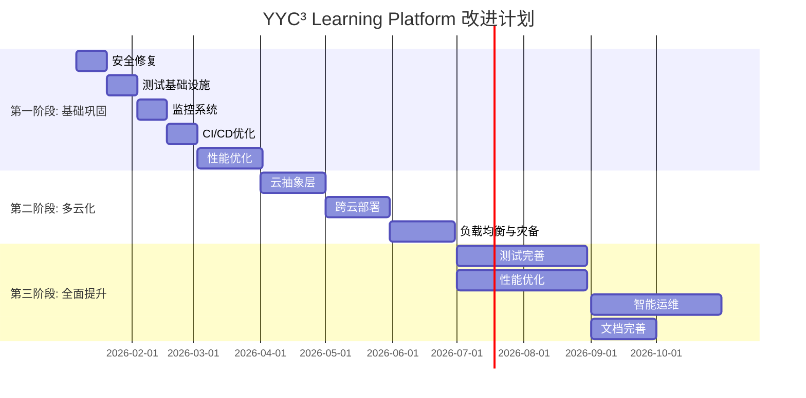

# YYC³ Learning Platform - 改进计划详细时间表

> **文档类型**: 项目执行计划
> **时间跨度**: 12个月
> **开始日期**: 2026-01-06
> **结束日期**: 2026-12-31
> **更新频率**: 每周

---

## 📅 总体时间线



---

## 📋 详细任务分解

### 第一阶段: 基础巩固 (2026-01-06 ~ 2026-03-31)

#### Month 1: 安全与测试基础

##### Week 1-2 (Jan 6-19): 安全修复 🔴 P0

**负责人**: 安全团队
**工作量**: 10人日
**预算**: ¥20,000

| 任务 | 负责人 | 工作量 | 截止日期 | 状态 |
|------|--------|--------|----------|------|
| **依赖漏洞扫描** | | | | |
| 运行 npm audit | 安全工程师 | 0.5d | Jan 6 | ⏳ |
| 更新 jsonwebtoken | 安全工程师 | 1d | Jan 7 | ⏳ |
| 更新其他高危包 | 安全工程师 | 1d | Jan 8 | ⏳ |
| 验证修复结果 | 安全工程师 | 0.5d | Jan 9 | ⏳ |
| **安全加固** | | | | |
| 实现CSP策略 | 后端工程师 | 2d | Jan 11 | ⏳ |
| 添加安全头部 | 后端工程师 | 1d | Jan 12 | ⏳ |
| 配置速率限制 | 后端工程师 | 2d | Jan 14 | ⏳ |
| 输入验证增强 | 前端+后端 | 2d | Jan 16 | ⏳ |
| **安全测试** | | | | |
| SAST扫描 | 安全工程师 | 1d | Jan 17 | ⏳ |
| DAST扫描 | 安全工程师 | 1d | Jan 18 | ⏳ |
| 渗透测试 | 外部专家 | 3d | Jan 19 | ⏳ |

**交付物**:
- ✅ 无严重漏洞依赖清单
- ✅ 安全头部配置文档
- ✅ 安全测试报告

**验收标准**:
- ✅ npm audit 0个严重漏洞
- ✅ SAST/DAST扫描通过
- ✅ 渗透测试无高危问题

---

##### Week 3-4 (Jan 20 - Feb 2): 测试基础设施 🧪

**负责人**: 测试团队
**工作量**: 20人日
**预算**: ¥40,000

| 任务 | 负责人 | 工作量 | 截止日期 | 状态 |
|------|--------|--------|----------|------|
| **测试环境配置** | | | | |
| 配置测试数据库 | DevOps | 2d | Jan 21 | ⏳ |
| 配置Mock服务 | 后端工程师 | 3d | Jan 23 | ⏳ |
| 准备测试数据集 | 测试工程师 | 3d | Jan 26 | ⏳ |
| **核心测试编写** | | | | |
| 认证流程测试 | 测试工程师 | 3d | Jan 29 | ⏳ |
| 用户API测试 | 测试工程师 | 2d | Jan 31 | ⏳ |
| 课程API测试 | 测试工程师 | 2d | Feb 1 | ⏳ |
| 考试系统测试 | 测试工程师 | 3d | Feb 2 | ⏳ |
| **测试框架** | | | | |
| Jest配置优化 | 前端工程师 | 2d | Jan 24 | ⏳ |
| 测试工具函数 | 前端工程师 | 2d | Jan 25 | ⏳ |
| CI集成 | DevOps | 1d | Jan 27 | ⏳ |

**交付物**:
- ✅ 测试环境配置
- ✅ 50+测试用例
- ✅ 测试覆盖率报告

**验收标准**:
- ✅ 测试覆盖率 > 20%
- ✅ 所有测试在CI中通过
- ✅ 测试文档完整

---

#### Month 2: 监控与优化

##### Week 5-6 (Feb 3-16): 监控系统 📊

**负责人**: 运维团队
**工作量**: 25人日
**预算**: ¥50,000

| 任务 | 负责人 | 工作量 | 截止日期 | 状态 |
|------|--------|--------|----------|------|
| **监控系统部署** | | | | |
| 安装Prometheus | DevOps | 2d | Feb 4 | ⏳ |
| 安装Grafana | DevOps | 2d | Feb 5 | ⏳ |
| 配置指标采集 | 后端工程师 | 3d | Feb 8 | ⏳ |
| **日志系统** | | | | |
| 部署ELK Stack | DevOps | 4d | Feb 11 | ⏳ |
| 配置日志采集 | 后端工程师 | 3d | Feb 13 | ⏳ |
| 日志分析规则 | 运维工程师 | 2d | Feb 14 | ⏳ |
| **可视化Dashboard** | | | | |
| 应用性能Dashboard | 运维工程师 | 3d | Feb 16 | ⏳ |
| 业务指标Dashboard | 产品+运维 | 3d | Feb 16 | ⏳ |
| 告警规则配置 | 运维工程师 | 3d | Feb 16 | ⏳ |

**交付物**:
- ✅ 监控系统部署完成
- ✅ 可视化Dashboard
- ✅ 告警配置文档

**验收标准**:
- ✅ 监控覆盖率 100%
- ✅ 告警响应时间 < 5分钟
- ✅ Dashboard实时更新

---

##### Week 7-8 (Feb 17 - Mar 2): CI/CD优化 ⚙️

**负责人**: DevOps团队
**工作量**: 15人日
**预算**: ¥30,000

| 任务 | 负责人 | 工作量 | 截止日期 | 状态 |
|------|--------|--------|----------|------|
| **CI优化** | | | | |
| 并行化测试 | DevOps | 3d | Feb 19 | ⏳ |
| 缓存优化 | DevOps | 2d | Feb 20 | ⏳ |
| 构建时间优化 | DevOps | 2d | Feb 23 | ⏳ |
| **CD改进** | | | | |
| 蓝绿部署配置 | DevOps | 3d | Feb 26 | ⏳ |
| 自动回滚机制 | DevOps | 2d | Feb 27 | ⏳ |
| 部署前检查 | DevOps | 1d | Feb 28 | ⏳ |
| **质量门禁** | | | | |
| 代码覆盖率检查 | DevOps | 1d | Mar 1 | ⏳ |
| 安全扫描集成 | DevOps | 1d | Mar 2 | ⏳ |

**交付物**:
- ✅ 优化的CI/CD配置
- ✅ 蓝绿部署方案
- ✅ 质量门禁配置

**验收标准**:
- ✅ CI时间减少50%
- ✅ 部署成功率 > 95%
- ✅ 回滚时间 < 5分钟

---

##### Week 9-12 (Mar 3-30): 性能优化 ⚡

**负责人**: 前端+后端团队
**工作量**: 40人日
**预算**: ¥80,000

| 任务 | 负责人 | 工作量 | 截止日期 | 状态 |
|------|--------|--------|----------|------|
| **前端优化** | | | | |
| 代码分割实现 | 前端工程师 | 4d | Mar 6 | ⏳ |
| 懒加载实现 | 前端工程师 | 3d | Mar 9 | ⏳ |
| 图片优化 | 前端工程师 | 3d | Mar 12 | ⏳ |
| Bundle优化 | 前端工程师 | 4d | Mar 16 | ⏳ |
| **后端优化** | | | | |
| 查询优化 | 后端工程师 | 5d | Mar 21 | ⏳ |
| Redis缓存实现 | 后端工程师 | 5d | Mar 26 | ⏳ |
| 连接池配置 | 后端工程师 | 2d | Mar 28 | ⏳ |
| API响应优化 | 后端工程师 | 3d | Mar 30 | ⏳ |
| **性能测试** | | | | |
| 基准测试建立 | 性能工程师 | 3d | Mar 30 | ⏳ |
| Lighthouse评分 | 前端工程师 | 2d | Mar 30 | ⏳ |
| 性能报告 | 性能工程师 | 1d | Mar 30 | ⏳ |

**交付物**:
- ✅ 性能优化报告
- ✅ Lighthouse评分 > 80
- ✅ API响应时间提升50%

**验收标准**:
- ✅ Bundle大小 < 500KB
- ✅ Lighthouse > 80分
- ✅ P95响应时间 < 500ms

---

### 第二阶段: 多云化建设 (2026-04-01 ~ 2026-06-30)

#### Month 4: 云抽象层

##### Week 17-20 (Apr 1-30): 云抽象层开发 ☁️

**负责人**: 架构师 + 后端团队
**工作量**: 60人日
**预算**: ¥120,000

| 任务 | 负责人 | 工作量 | 截止日期 | 状态 |
|------|--------|--------|----------|------|
| **架构设计** | | | | |
| 云抽象接口设计 | 架构师 | 5d | Apr 5 | ⏳ |
| 多云策略设计 | 架构师 | 3d | Apr 8 | ⏳ |
| 技术方案评审 | 团队 | 2d | Apr 10 | ⏳ |
| **核心实现** | | | | |
| 抽象层实现 | 后端工程师 | 10d | Apr 20 | ⏳ |
| 阿里云适配器 | 后端工程师 | 8d | Apr 25 | ⏳ |
| AWS适配器 | 后端工程师 | 8d | Apr 29 | ⏳ |
| Azure适配器 | 后端工程师 | 8d | Apr 30 | ⏳ |
| **工具开发** | | | | |
| 部署工具 | DevOps | 5d | Apr 22 | ⏳ |
| 配置同步工具 | DevOps | 5d | Apr 27 | ⏳ |
| 监控聚合工具 | DevOps | 5d | Apr 30 | ⏳ |

**交付物**:
- ✅ 云抽象层代码
- ✅ 3个云平台适配器
- ✅ 部署工具集

**验收标准**:
- ✅ 支持3个云平台
- ✅ API一致性 > 95%
- ✅ 文档完整

---

#### Month 5: 跨云部署

##### Week 21-24 (May 1-31): 跨云部署实现 🚀

**负责人**: DevOps团队
**工作量**: 50人日
**预算**: ¥100,000

| 任务 | 负责人 | 工作量 | 截止日期 | 状态 |
|------|--------|--------|----------|------|
| **容器化改造** | | | | |
| Dockerfile优化 | DevOps | 5d | May 6 | ⏳ |
| 多阶段构建 | DevOps | 3d | May 8 | ⏳ |
| 镜像优化 | DevOps | 3d | May 10 | ⏳ |
| **K8s配置** | | | | |
| 阿里云ACK配置 | DevOps | 8d | May 16 | ⏳ |
| AWS EKS配置 | DevOps | 8d | May 22 | ⏳ |
| Azure AKS配置 | DevOps | 8d | May 28 | ⏳ |
| **服务网格** | | | | |
| Istio安装配置 | DevOps | 5d | May 23 | ⏳ |
| 流量管理 | DevOps | 4d | May 27 | ⏳ |
| 策略配置 | DevOps | 3d | May 31 | ⏳ |

**交付物**:
- ✅ 优化的容器镜像
- ✅ 3个云平台K8s配置
- ✅ Istio服务网格

**验收标准**:
- ✅ 镜像大小 < 200MB
- ✅ 跨云部署自动化
- ✅ 流量管理正常

---

#### Month 6: 负载均衡与灾备

##### Week 25-28 (Jun 1-30): 负载均衡与灾备 ⚖️

**负责人**: 运维团队
**工作量**: 40人日
**预算**: ¥80,000

| 任务 | 负责人 | 工作量 | 截止日期 | 状态 |
|------|--------|--------|----------|------|
| **全局负载均衡** | | | | |
| DNS负载均衡 | 运维 | 5d | Jun 6 | ⏳ |
| 地理路由 | 运维 | 5d | Jun 10 | ⏳ |
| 健康检查 | 运维 | 3d | Jun 13 | ⏳ |
| **数据同步** | | | | |
| 主从复制 | DBA | 5d | Jun 18 | ⏳ |
| 跨云备份 | 运维 | 5d | Jun 23 | ⏳ |
| 数据一致性检查 | DBA | 5d | Jun 27 | ⏳ |
| **灾难恢复** | | | | |
| 故障切换演练 | 运维 | 5d | Jun 28 | ⏳ |
| 数据恢复流程 | 运维 | 3d | Jun 29 | ⏳ |
| 应急预案 | 运维 | 2d | Jun 30 | ⏳ |

**交付物**:
- ✅ 多云负载均衡方案
- ✅ 数据同步系统
- ✅ 灾备演练报告

**验收标准**:
- ✅ RTO < 1小时
- ✅ RPO < 5分钟
- ✅ 演练成功率100%

---

### 第三阶段: 全面提升 (2026-07-01 ~ 2026-12-31)

#### Month 7-9: 测试与性能完善

##### Week 29-40 (Jul-Sep): 全面提升 🚀

**负责人**: 全体团队
**工作量**: 150人日
**预算**: ¥300,000

| 任务类别 | 工作量 | 负责人 | 截止日期 |
|----------|--------|--------|----------|
| **测试完善** | 40人日 | | |
| E2E测试完整覆盖 | 15d | 测试团队 | Jul 31 |
| 性能测试基准 | 10d | 性能团队 | Aug 15 |
| 安全测试自动化 | 10d | 安全团队 | Aug 31 |
| 覆盖率提升到80% | 5d | 测试团队 | Sep 30 |
| **性能优化** | 40人日 | | |
| 全面性能调优 | 15d | 全栈团队 | Jul 31 |
| CDN部署 | 10d | 运维团队 | Aug 15 |
| 边缘计算 | 10d | 运维团队 | Aug 31 |
| Lighthouse > 95 | 5d | 前端团队 | Sep 30 |
| **智能化运维** | 40人日 | | |
| AIOps平台 | 15d | 运维团队 | Sep 15 |
| 预测性监控 | 10d | 运维团队 | Sep 25 |
| 自动故障恢复 | 10d | 运维团队 | Sep 30 |
| 容量预测 | 5d | 运维团队 | Sep 30 |
| **文档完善** | 30人日 | | |
| API文档自动生成 | 10d | 技术文档 | Aug 31 |
| 用户手册 | 10d | 产品+文档 | Sep 15 |
| 运维手册 | 5d | 运维+文档 | Sep 25 |
| 培训材料 | 5d | 培训团队 | Sep 30 |

**交付物**:
- ✅ 测试覆盖率 > 80%
- ✅ Lighthouse > 95分
- ✅ AIOps平台
- ✅ 完整文档体系

---

#### Month 10-12: 持续优化与扩展

##### Week 41-52 (Oct-Dec): 长期优化 📈

**负责人**: 全体团队
**工作量**: 120人日
**预算**: ¥240,000

| 重点领域 | 关键任务 | 预期效果 |
|----------|----------|----------|
| **成本优化** | 云资源使用优化 | 成本降低20% |
| **功能增强** | 新功能开发 | 用户满意度+15% |
| **技术创新** | AI能力提升 | 智能化水平+30% |
| **生态建设** | 开发者生态 | 社区活跃度+50% |
| **市场拓展** | 新市场开拓 | 用户数+100% |

---

## 📊 里程碑与检查点

### 关键里程碑

| 里程碑 | 日期 | 交付物 | 成功标准 |
|--------|------|--------|----------|
| **M1: 安全加固完成** | Jan 19 | 零漏洞报告 | 0严重漏洞 |
| **M2: 测试基础建立** | Feb 2 | 测试覆盖率报告 | 覆盖率>20% |
| **M3: 监控系统上线** | Feb 16 | 监控Dashboard | 100%覆盖 |
| **M4: CI/CD优化** | Mar 2 | CI/CD报告 | 时间-50% |
| **M5: 性能优化** | Mar 30 | 性能报告 | Lighthouse>80 |
| **M6: 云抽象层** | Apr 30 | 抽象层代码 | 支持3云 |
| **M7: 多云部署** | May 31 | 部署文档 | 跨云自动化 |
| **M8: 灾备完成** | Jun 30 | 灾备报告 | RTO<1h |
| **M9: 测试完善** | Sep 30 | 覆盖率报告 | 覆盖率>80% |
| **M10: 全面提升** | Dec 31 | 年度报告 | 全部达标 |

### 每周检查点

**周一**: 任务计划
- 确认本周任务
- 分配资源
- 识别风险

**周三**: 中期检查
- 进度同步
- 问题解决
- 调整计划

**周五**: 周总结
- 完成情况
- 交付物验收
- 下周计划

### 每月评审

**月初**: 月度规划
- 上月总结
- 本月目标
- 资源分配

**月中**: 中期回顾
- 进度检查
- 风险评估
- 计划调整

**月末**: 月度总结
- 目标达成
- 团队绩效
- 下月计划

---

## 🎯 资源分配

### 人力资源

```
第一阶段 (1-3月):
  • 安全工程师:  0.5人 × 3月 = 1.5人月
  • 测试工程师:  1.0人 × 3月 = 3.0人月
  • DevOps:       1.0人 × 3月 = 3.0人月
  • 前端工程师:   1.0人 × 2月 = 2.0人月
  • 后端工程师:   1.0人 × 3月 = 3.0人月
  合计: 12.5人月 (~2人全职)

第二阶段 (4-6月):
  • 架构师:      1.0人 × 3月 = 3.0人月
  • 后端工程师:   2.0人 × 3月 = 6.0人月
  • DevOps:       1.5人 × 3月 = 4.5人月
  • DBA:          0.5人 × 2月 = 1.0人月
  合计: 14.5人月 (~2.5人全职)

第三阶段 (7-12月):
  • 全栈工程师:   1.5人 × 6月 = 9.0人月
  • 运维工程师:    1.0人 × 6月 = 6.0人月
  • 测试工程师:    1.0人 × 3月 = 3.0人月
  • 文档工程师:    0.5人 × 6月 = 3.0人月
  合计: 21.0人月 (~1.8人全职)

总计: 48人月 (~2人全职,持续12月)
```

### 预算分配

```
人力成本: ¥680,000
  第一阶段: ¥220,000
  第二阶段: ¥300,000
  第三阶段: ¥360,000

基础设施: ¥180,000/年
  云资源:   ¥100,000
  监控工具:  ¥50,000
  其他工具:  ¥30,000

培训成本: ¥50,000
  技术培训:  ¥30,000
  工具培训:  ¥20,000

应急储备: ¥100,000 (10%)

总预算: ¥1,010,000
```

---

## ⚠️ 风险管理

### 风险识别

| 风险ID | 风险描述 | 概率 | 影响 | 等级 | 应对措施 |
|--------|----------|------|------|------|----------|
| R1 | 人员不足 | 中 | 高 | 🔴高 | 外包部分工作,招聘临时人员 |
| R2 | 技术难点 | 低 | 中 | 🟡中 | 提前预研,专家支持 |
| R3 | 进度延期 | 中 | 中 | 🟡中 | 缓冲时间,关键路径管理 |
| R4 | 需求变更 | 中 | 低 | 🟢低 | 敏捷迭代,优先级管理 |
| R5 | 云平台限制 | 低 | 高 | 🟡中 | 多平台备选,预案准备 |

### 风险应对

**R1: 人员不足**
- 缓解: 外包非核心任务
- 应急: 招聘contractor
- 预案: 延期非关键任务

**R2: 技术难点**
- 缓解: 提前技术预研(2周)
- 应急: 外部专家咨询
- 预案: 备选技术方案

**R3: 进度延期**
- 缓解: 20%时间缓冲
- 应急: 加班或增加资源
- 预案: 调整优先级

**R5: 云平台限制**
- 缓解: 多平台并行开发
- 应急: 技术支持介入
- 预案: 功能降级

---

## 📈 进度跟踪

### 每周报告模板

```markdown
## 周报 - Week XX (日期)

### 本周完成
- [x] 任务1 - 完成情况
- [x] 任务2 - 完成情况

### 进行中
- [ ] 任务3 - 进度%, 预期完成日期
- [ ] 任务4 - 进度%, 预期完成日期

### 遇到的问题
- 问题1 - 影响程度 - 解决方案
- 问题2 - 影响程度 - 解决方案

### 下周计划
- [ ] 任务5 - 负责人 - 预期完成日期
- [ ] 任务6 - 负责人 - 预期完成日期

### 风险提示
- 风险项 - 应对措施
```

### 月度评审模板

```markdown
## 月度报告 - Month XX (日期)

### 目标达成情况
- 目标1: 实际值 vs 目标值 ✅/❌
- 目标2: 实际值 vs 目标值 ✅/❌

### 关键指标
- 指标1: 当月值 | 环比 | 趋势
- 指标2: 当月值 | 环比 | 趋势

### 投入产出
- 计划投入: 实际投入
- 计划产出: 实际产出

### 经验教训
- 做得好的: ...
- 需要改进: ...

### 下月重点
- 重点1: ...
- 重点2: ...
```

---

## 🎯 成功标准

### 量化指标

| 指标类别 | 指标名称 | 当前 | 3个月 | 6个月 | 12个月 |
|----------|----------|------|--------|--------|--------|
| **质量** | 测试覆盖率 | 6.4% | 30% | 50% | 80% |
| **质量** | 严重Bug数 | 5+ | <3 | <1 | 0 |
| **性能** | Lighthouse | 60 | 80 | 90 | 95 |
| **性能** | API响应(P95) | 1.2s | 500ms | 300ms | 200ms |
| **安全** | 漏洞数 | 10+ | 0 | 0 | 0 |
| **安全** | 安全评分 | 65 | 85 | 90 | 95 |
| **运维** | 可用性 | 95% | 99% | 99.9% | 99.99% |
| **运维** | RTO | N/A | N/A | <1h | <30min |
| **运维** | RPO | N/A | N/A | <5min | <1min |
| **多云** | 云平台数 | 0 | 1 | 3 | 5 |
| **效率** | CI时间 | 10min | 5min | 3min | 2min |
| **效率** | 部署频率 | 1/周 | 3/周 | 5/周 | 10/周 |

### 定性标准

**团队层面**:
- ✅ 团队技能提升
- ✅ 协作效率提高
- ✅ 文档意识增强
- ✅ 质量意识形成

**流程层面**:
- ✅ 开发流程标准化
- ✅ 测试流程自动化
- ✅ 部署流程可靠化
- ✅ 监控流程完善化

**产品层面**:
- ✅ 产品性能提升
- ✅ 用户体验改善
- ✅ 系统稳定性提高
- ✅ 功能可靠性增强

---

## 📞 联系方式

### 项目组织

```
项目发起人: YYC³ AI Team
项目经理:   [待定]
技术负责:   [待定]

第一阶段负责人:
  安全负责人:   security@yyc3.com
  测试负责人:   testing@yyc3.com
  运维负责人:   ops@yyc3.com

第二阶段负责人:
  架构负责人:   architecture@yyc3.com
  DevOps负责人: devops@yyc3.com

第三阶段负责人:
  技术负责人:   tech-lead@yyc3.com
  产品负责人:   product@yyc3.com
```

### 沟通渠道

```yaml
日常沟通:
  - Slack: #yyc3-platform
  - 站会: 每日 10:00 AM
  - 周会: 每周五 4:00 PM

评审会议:
  - 周评审: 每月最后一周
  - 阶段评审: 每阶段结束
  - 年度评审: 12月31日

文档协作:
  - GitHub: 项目管理
  - Notion: 文档协作
  - Miro: 设计讨论
```

---

## 📚 相关文档

### 核心文档

- **全局分析报告**: [GLOBAL-ANALYSIS-REPORT.md](./GLOBAL-ANALYSIS-REPORT.md)
- **执行摘要**: [GLOBAL-ANALYSIS-EXECUTIVE-SUMMARY.md](./GLOBAL-ANALYSIS-EXECUTIVE-SUMMARY.md)
- **项目结构**: [learning-system/PROJECT-STRUCTURE.md](./learning-system/PROJECT-STRUCTURE.md)
- **贡献指南**: [CONTRIBUTING.md](../CONTRIBUTING.md)

### 参考文档

- [架构设计](./YYC3-AILP-架构设计/)
- [开发规范](./YYC3-AILP-开发阶段/)
- [运维手册](./YYC3-AILP-运维阶段/)
- [测试文档](./YYC3-AILP-测试验证/)

---

## 📝 变更记录

| 版本 | 日期 | 变更内容 | 负责人 |
|------|------|----------|--------|
| v1.0 | 2026-01-03 | 初始版本 | AI Team |

---

**文档维护**: YYC³ AI Team
**更新频率**: 每周
**下次更新**: 2026-01-10

---

*本计划将根据实际执行情况动态调整*
