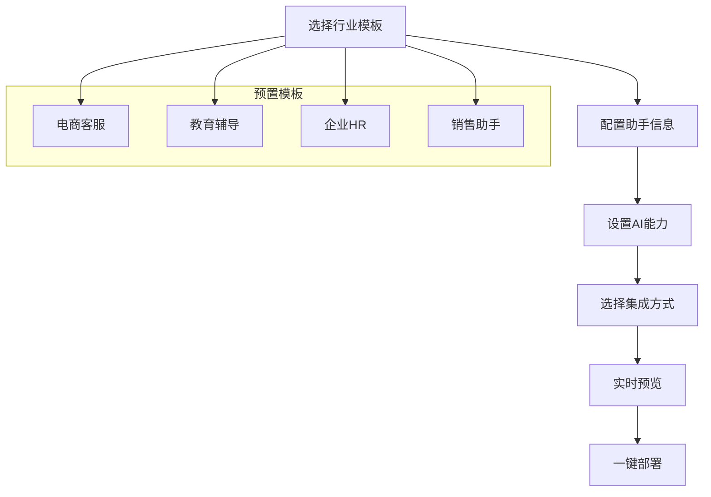

# YYC³ AI平台 - 低代码/无代码体验优化方案

## 🎯 核心理念

**从"技术配置"转向"业务配置"**

### 传统方式的痛点
- ❌ 技术人员才能配置AI助手
- ❌ 需要编写代码和配置文件
- ❌ 部署周期长，调试困难
- ❌ 业务人员无法自主使用

### 新模式的优势
- ✅ 业务人员5分钟配置AI助手
- ✅ 可视化拖拽式界面
- ✅ 预置行业模板开箱即用
- ✅ 实时预览和即时部署

## 🎨 低代码配置界面设计

### 1. AI助手配置向导



### 2. 可视化配置界面

```typescript
// packages/low-code/src/components/AIAssistantBuilder.tsx
export const AIAssistantBuilder: React.FC = () => {
  const [step, setStep] = useState(1);
  const [config, setConfig] = useState<AssistantConfig>({});

  const steps = [
    { title: '选择模板', component: TemplateSelector },
    { title: '基本信息', component: BasicInfo },
    { title: 'AI能力', component: AICapabilities },
    { title: '集成设置', component: IntegrationSettings },
    { title: '预览部署', component: PreviewDeploy },
  ];

  return (
    <div className="ai-assistant-builder">
      <ProgressBar current={step} total={steps.length} />

      <Card className="builder-content">
        {React.createElement(steps[step - 1].component, {
          config,
          onChange: setConfig,
          onNext: () => setStep(step + 1),
          onPrev: () => setStep(step - 1),
        })}
      </Card>
    </div>
  );
};
```

### 3. 模板选择器组件

```typescript
// packages/low-code/src/components/TemplateSelector.tsx
export const TemplateSelector: React.FC<TemplateSelectorProps> = ({
  config,
  onChange,
  onNext
}) => {
  const templates = [
    {
      id: 'ecommerce-cs',
      name: '电商客服助手',
      description: '专业处理商品咨询、订单查询、售后服务',
      icon: '🛒',
      features: ['商品推荐', '订单管理', '售后支持', '库存查询'],
      color: '#4CAF50',
    },
    {
      id: 'education-tutor',
      name: '教育辅导助手',
      description: 'AI个性化辅导，解答学习问题',
      icon: '🎓',
      features: ['作业辅导', '学习计划', '知识问答', '进度跟踪'],
      color: '#2196F3',
    },
    {
      id: 'hr-assistant',
      name: 'HR助手',
      description: '招聘协助，员工服务，政策咨询',
      icon: '💼',
      features: ['简历筛选', '面试安排', '政策解答', '员工服务'],
      color: '#FF9800',
    },
    {
      id: 'sales-assistant',
      name: '销售助手',
      description: '客户跟进，产品推荐，销售分析',
      icon: '📈',
      features: ['客户管理', '销售预测', '产品介绍', '跟进提醒'],
      color: '#9C27B0',
    },
  ];

  return (
    <div className="template-selector">
      <h2>选择适合您的AI助手模板</h2>
      <div className="templates-grid">
        {templates.map(template => (
          <TemplateCard
            key={template.id}
            template={template}
            selected={config.templateId === template.id}
            onClick={() => {
              onChange({ ...config, templateId: template.id });
              onNext();
            }}
          />
        ))}
      </div>
    </div>
  );
};
```

### 4. 智能能力配置器

```typescript
// packages/low-code/src/components/AICapabilities.tsx
export const AICapabilities: React.FC<AICapabilitiesProps> = ({
  config,
  onChange,
  onNext,
  onPrev
}) => {
  const [capabilities, setCapabilities] = useState(config.capabilities || {});

  const capabilityOptions = {
    knowledge: {
      name: '知识问答',
      description: '基于知识库的专业问答',
      icon: '🧠',
      settings: {
        knowledgeBase: { type: 'select', options: ['通用知识', '行业知识', '企业知识'] },
        accuracy: { type: 'slider', min: 0, max: 100, default: 80 },
      },
    },
    conversation: {
      name: '智能对话',
      description: '自然流畅的对话交流',
      icon: '💬',
      settings: {
        personality: { type: 'select', options: ['专业', '友好', '幽默', '严肃'] },
        language: { type: 'select', options: ['中文', '英文', '中英混合'] },
      },
    },
    analysis: {
      name: '数据分析',
      description: '业务数据分析和建议',
      icon: '📊',
      settings: {
        metrics: { type: 'multiSelect', options: ['销售', '用户', '库存', '财务'] },
        reports: { type: 'checkbox', label: '生成报告' },
      },
    },
  };

  return (
    <div className="ai-capabilities">
      <h2>配置AI助手能力</h2>
      <div className="capabilities-list">
        {Object.entries(capabilityOptions).map(([key, option]) => (
          <CapabilityCard
            key={key}
            capability={option}
            enabled={capabilities[key]?.enabled}
            settings={capabilities[key]?.settings || {}}
            onToggle={(enabled) => updateCapability(key, { enabled })}
            onSettingChange={(setting, value) =>
              updateCapability(key, {
                settings: { ...capabilities[key]?.settings, [setting]: value }
              })
            }
          />
        ))}
      </div>

      <div className="navigation">
        <Button onClick={onPrev}>上一步</Button>
        <Button onClick={onNext} type="primary">下一步</Button>
      </div>
    </div>
  );
};
```

## ⚙️ 配置驱动架构

### 1. 配置数据模型

```typescript
// packages/low-code/src/types/config.ts
export interface AssistantConfig {
  // 基本信息
  id: string;
  name: string;
  description: string;
  avatar: string;
  templateId: string;

  // AI配置
  ai: {
    provider: 'openai' | 'claude' | 'local';
    model: string;
    temperature: number;
    maxTokens: number;
    systemPrompt: string;
  };

  // 能力配置
  capabilities: {
    [key: string]: {
      enabled: boolean;
      settings: Record<string, any>;
    };
  };

  // 集成配置
  integrations: {
    wechat?: {
      enabled: boolean;
      appId: string;
      appSecret: string;
    };
    dingtalk?: {
      enabled: boolean;
      appKey: string;
      appSecret: string;
    };
    api?: {
      enabled: boolean;
      endpoints: string[];
      authentication: 'none' | 'api-key' | 'oauth';
    };
  };

  // 界面配置
  ui: {
    theme: 'light' | 'dark' | 'auto';
    brandColor: string;
    logo: string;
    customCSS: string;
  };
}
```

### 2. 配置生成器

```typescript
// packages/low-code/src/utils/config-generator.ts
export class ConfigGenerator {
  static generateDeploymentConfig(assistantConfig: AssistantConfig): DeploymentConfig {
    return {
      // Docker配置
      docker: this.generateDockerConfig(assistantConfig),

      // 环境变量
      env: this.generateEnvVariables(assistantConfig),

      // API路由
      routes: this.generateAPIRoutes(assistantConfig),

      // 前端配置
      frontend: this.generateFrontendConfig(assistantConfig),
    };
  }

  private static generateDockerConfig(config: AssistantConfig): string {
    return `
FROM node:18-alpine
WORKDIR /app
COPY package*.json ./
RUN npm ci --only=production
COPY dist ./dist
EXPOSE 3000
CMD ["npm", "start"]
    `;
  }

  private static generateEnvVariables(config: AssistantConfig): Record<string, string> {
    return {
      'ASSISTANT_ID': config.id,
      'ASSISTANT_NAME': config.name,
      'AI_PROVIDER': config.ai.provider,
      'AI_MODEL': config.ai.model,
      'OPENAI_API_KEY': process.env.OPENAI_API_KEY || '',
      'ANTHROPIC_API_KEY': process.env.ANTHROPIC_API_KEY || '',
      'DATABASE_URL': process.env.DATABASE_URL || '',
      'REDIS_URL': process.env.REDIS_URL || '',
    };
  }
}
```

### 3. 实时预览引擎

```typescript
// packages/low-code/src/components/PreviewPanel.tsx
export const PreviewPanel: React.FC<PreviewPanelProps> = ({ config }) => {
  const [previewMode, setPreviewMode] = useState<'chat' | 'widget' | 'mobile'>('chat');
  const [testMessages, setTestMessages] = useState<ChatMessage[]>([]);

  const handleSendMessage = async (message: string) => {
    // 添加用户消息
    const userMessage: ChatMessage = {
      id: Date.now().toString(),
      role: 'user',
      content: message,
      timestamp: new Date(),
    };
    setTestMessages(prev => [...prev, userMessage]);

    // 模拟AI响应
    const aiResponse = await simulateAIResponse(message, config);
    const assistantMessage: ChatMessage = {
      id: (Date.now() + 1).toString(),
      role: 'assistant',
      content: aiResponse,
      timestamp: new Date(),
    };
    setTestMessages(prev => [...prev, assistantMessage]);
  };

  return (
    <div className="preview-panel">
      <div className="preview-header">
        <h3>实时预览</h3>
        <div className="preview-modes">
          <ButtonGroup>
            <Button
              type={previewMode === 'chat' ? 'primary' : 'default'}
              onClick={() => setPreviewMode('chat')}
            >
              💬 聊天界面
            </Button>
            <Button
              type={previewMode === 'widget' ? 'primary' : 'default'}
              onClick={() => setPreviewMode('widget')}
            >
              🎨 悬浮组件
            </Button>
            <Button
              type={previewMode === 'mobile' ? 'primary' : 'default'}
              onClick={() => setPreviewMode('mobile')}
            >
              📱 移动端
            </Button>
          </ButtonGroup>
        </div>
      </div>

      <div className="preview-content">
        {previewMode === 'chat' && (
          <ChatPreview
            messages={testMessages}
            config={config}
            onSendMessage={handleSendMessage}
          />
        )}
        {previewMode === 'widget' && (
          <WidgetPreview config={config} />
        )}
        {previewMode === 'mobile' && (
          <MobilePreview
            messages={testMessages}
            config={config}
            onSendMessage={handleSendMessage}
          />
        )}
      </div>
    </div>
  );
};
```

## 🚀 一键部署系统

### 1. 部署向导

```typescript
// packages/low-code/src/components/DeploymentWizard.tsx
export const DeploymentWizard: React.FC = () => {
  const [deploymentTarget, setDeploymentTarget] = useState<'local' | 'cloud' | 'docker'>('local');
  const [deploymentConfig, setDeploymentConfig] = useState({});

  const deploymentTargets = [
    {
      id: 'local',
      name: '本地部署',
      description: '在本地服务器快速部署',
      icon: '🏠',
      requirements: ['Node.js 18+', '2GB内存', '10GB存储'],
      estimatedTime: '5分钟',
    },
    {
      id: 'docker',
      name: 'Docker部署',
      description: '使用Docker容器化部署',
      icon: '🐳',
      requirements: ['Docker', '4GB内存', '20GB存储'],
      estimatedTime: '10分钟',
    },
    {
      id: 'cloud',
      name: '云端部署',
      description: '一键部署到云服务器',
      icon: '☁️',
      requirements: ['云服务器账号', 'SSH访问权限'],
      estimatedTime: '15分钟',
    },
  ];

  return (
    <div className="deployment-wizard">
      <h2>选择部署方式</h2>
      <div className="deployment-options">
        {deploymentTargets.map(target => (
          <DeploymentOptionCard
            key={target.id}
            target={target}
            selected={deploymentTarget === target.id}
            onClick={() => setDeploymentTarget(target.id)}
          />
        ))}
      </div>

      {deploymentTarget && (
        <DeploymentConfigPanel
          target={deploymentTarget}
          config={deploymentConfig}
          onChange={setDeploymentConfig}
        />
      )}
    </div>
  );
};
```

### 2. 自动部署脚本生成

```typescript
// packages/low-code/src/utils/deployment-generator.ts
export class DeploymentGenerator {
  static generateDeploymentScript(
    config: AssistantConfig,
    target: DeploymentTarget
  ): string {
    switch (target) {
      case 'local':
        return this.generateLocalDeploymentScript(config);
      case 'docker':
        return this.generateDockerDeploymentScript(config);
      case 'cloud':
        return this.generateCloudDeploymentScript(config);
      default:
        throw new Error(`不支持的部署目标: ${target}`);
    }
  }

  private static generateLocalDeploymentScript(config: AssistantConfig): string {
    return `#!/bin/bash
# YYC³ AI助手 - 本地部署脚本

echo "🚀 开始部署AI助手: ${config.name}"

# 1. 创建项目目录
mkdir -p /opt/yyc3-${config.id}
cd /opt/yyc3-${config.id}

# 2. 下载并解压部署包
wget https://releases.yyc3.ai/assistants/${config.id}/latest.tar.gz
tar -xzf latest.tar.gz

# 3. 安装依赖
npm install

# 4. 配置环境变量
cat > .env << EOF
ASSISTANT_ID=${config.id}
ASSISTANT_NAME="${config.name}"
AI_PROVIDER=${config.ai.provider}
AI_MODEL=${config.ai.model}
DATABASE_URL="postgresql://localhost:5432/yyc3_${config.id}"
REDIS_URL="redis://localhost:6379"
EOF

# 5. 初始化数据库
npm run db:migrate

# 6. 启动服务
npm run start

echo "✅ AI助手部署完成！"
echo "📍 访问地址: http://localhost:3000"
echo "📖 管理后台: http://localhost:3000/admin"
`;
  }

  private static generateDockerDeploymentScript(config: AssistantConfig): string {
    return `# YYC³ AI助手 - Docker部署

version: '3.8'

services:
  app:
    image: yyc3/assistant:${config.id}-latest
    container_name: yyc3-${config.id}
    restart: unless-stopped
    ports:
      - "3000:3000"
    environment:
      - ASSISTANT_ID=${config.id}
      - ASSISTANT_NAME=${config.name}
      - AI_PROVIDER=${config.ai.provider}
      - AI_MODEL=${config.ai.model}
      - DATABASE_URL=postgresql://postgres:password@db:5432/yyc3
      - REDIS_URL=redis://redis:6379
    depends_on:
      - db
      - redis

  db:
    image: postgres:15
    container_name: yyc3-${config.id}-db
    restart: unless-stopped
    environment:
      - POSTGRES_DB=yyc3_${config.id}
      - POSTGRES_USER=postgres
      - POSTGRES_PASSWORD=password
    volumes:
      - postgres_data:/var/lib/postgresql/data

  redis:
    image: redis:7
    container_name: yyc3-${config.id}-redis
    restart: unless-stopped

volumes:
  postgres_data:
`;
  }
}
```

### 3. 部署监控

```typescript
// packages/low-code/src/components/DeploymentMonitor.tsx
export const DeploymentMonitor: React.FC<DeploymentMonitorProps> = ({
  deploymentId,
  onDeploymentComplete
}) => {
  const [status, setStatus] = useState<DeploymentStatus>('pending');
  const [logs, setLogs] = useState<string[]>([]);
  const [progress, setProgress] = useState(0);

  const deploymentSteps = [
    { name: '创建部署环境', weight: 10 },
    { name: '下载依赖包', weight: 20 },
    { name: '配置环境变量', weight: 10 },
    { name: '初始化数据库', weight: 25 },
    { name: '启动应用服务', weight: 25 },
    { name: '健康检查', weight: 10 },
  ];

  useEffect(() => {
    // 模拟部署进度
    let currentStep = 0;
    const interval = setInterval(() => {
      if (currentStep < deploymentSteps.length) {
        const step = deploymentSteps[currentStep];
        setLogs(prev => [...prev, `✅ ${step.name} 完成`]);
        setProgress(prev => prev + step.weight);
        currentStep++;
      } else {
        setStatus('completed');
        clearInterval(interval);
        onDeploymentComplete?.();
      }
    }, 2000);

    return () => clearInterval(interval);
  }, [deploymentId]);

  return (
    <div className="deployment-monitor">
      <div className="deployment-header">
        <h3>部署进度</h3>
        <Badge status={status === 'completed' ? 'success' : 'processing'}>
          {status === 'completed' ? '部署完成' : '部署中...'}
        </Badge>
      </div>

      <Progress percent={progress} showInfo />

      <div className="deployment-steps">
        {deploymentSteps.map((step, index) => (
          <div key={index} className="step-item">
            <CheckCircleOutlined className="step-icon" />
            <span className="step-name">{step.name}</span>
          </div>
        ))}
      </div>

      <div className="deployment-logs">
        <h4>部署日志</h4>
        <div className="logs-content">
          {logs.map((log, index) => (
            <div key={index} className="log-line">{log}</div>
          ))}
        </div>
      </div>
    </div>
  );
};
```

## 📱 行业模板库

### 1. 电商行业模板

```typescript
// packages/low-code/src/templates/ecommerce.ts
export const ecommerceTemplate: AssistantTemplate = {
  id: 'ecommerce-cs',
  name: '电商客服助手',
  description: '专业电商客服，7×24小时在线服务',
  category: '电商',

  preset: {
    ai: {
      provider: 'openai',
      model: 'gpt-3.5-turbo',
      temperature: 0.7,
      systemPrompt: `你是专业的电商客服助手，具有以下特点：
1. 友好耐心，专业高效
2. 熟悉商品信息和售后政策
3. 能够推荐合适的产品
4. 及时解决客户问题

请始终保持礼貌和专业的语调。`,
    },

    capabilities: {
      productSearch: { enabled: true },
      orderQuery: { enabled: true },
      returnHandling: { enabled: true },
      recommendation: { enabled: true },
    },

    integrations: {
      wechat: { enabled: true },
      api: { enabled: true },
    },

    ui: {
      theme: 'light',
      brandColor: '#4CAF50',
      avatar: '🛒',
    },
  },

  customization: {
    businessInfo: {
      storeName: '您的店铺名称',
      returnPolicy: '7天无理由退换',
      shippingPolicy: '满99元包邮',
    },

    productCategories: ['服装', '数码', '家居', '美妆'],

    workingHours: '9:00-22:00',
  },
};
```

### 2. 教育行业模板

```typescript
// packages/low-code/src/templates/education.ts
export const educationTemplate: AssistantTemplate = {
  id: 'education-tutor',
  name: 'AI家教助手',
  description: '个性化辅导，助力学习提升',
  category: '教育',

  preset: {
    ai: {
      provider: 'claude',
      model: 'claude-3-sonnet',
      temperature: 0.8,
      systemPrompt: `你是AI家教助手，擅长：
1. 耐心细致的讲解
2. 因材施教的辅导
3. 学习方法的指导
4. 作业问题的解答

请用鼓励和引导的方式进行教学。`,
    },

    capabilities: {
      knowledgeQA: { enabled: true },
      homeworkCheck: { enabled: true },
      studyPlan: { enabled: true },
      progressTracking: { enabled: true },
    },

    integrations: {
      dingtalk: { enabled: true },
      api: { enabled: true },
    },

    ui: {
      theme: 'light',
      brandColor: '#2196F3',
      avatar: '🎓',
    },
  },

  customization: {
    subjects: ['数学', '语文', '英语', '物理', '化学'],
    gradeLevels: ['小学', '初中', '高中'],
    teachingStyle: '启发式教学',
  },
};
```

## 🎯 用户体验优化

### 1. 智能引导系统

```typescript
// packages/low-code/src/components/SmartGuide.tsx
export const SmartGuide: React.FC = () => {
  const [currentTip, setCurrentTip] = useState(0);

  const tips = [
    {
      title: '选择合适的模板',
      content: '根据您的行业选择模板，可以快速获得专业的AI助手配置',
      icon: '💡',
    },
    {
      title: '配置AI能力',
      content: '根据业务需求选择AI能力，避免不必要的功能增加成本',
      icon: '⚙️',
    },
    {
      title: '预览和测试',
      content: '部署前务必预览和测试，确保AI助手符合预期',
      icon: '👀',
    },
  ];

  return (
    <div className="smart-guide">
      <div className="tip-card">
        <div className="tip-icon">{tips[currentTip].icon}</div>
        <div className="tip-content">
          <h4>{tips[currentTip].title}</h4>
          <p>{tips[currentTip].content}</p>
        </div>
        <div className="tip-navigation">
          <Button
            size="small"
            onClick={() => setCurrentTip((currentTip - 1 + tips.length) % tips.length)}
          >
            上一个
          </Button>
          <Button
            size="small"
            onClick={() => setCurrentTip((currentTip + 1) % tips.length)}
          >
            下一个
          </Button>
        </div>
      </div>
    </div>
  );
};
```

### 2. 智能推荐系统

```typescript
// packages/low-code/src/utils/recommendation-engine.ts
export class RecommendationEngine {
  static recommendTemplate(userInput: UserInput): AssistantTemplate[] {
    const recommendations: AssistantTemplate[] = [];

    // 基于行业推荐
    if (userInput.industry === 'ecommerce') {
      recommendations.push(ecommerceTemplate, retailTemplate);
    } else if (userInput.industry === 'education') {
      recommendations.push(educationTemplate, trainingTemplate);
    }

    // 基于规模推荐
    if (userInput.companySize === 'small') {
      recommendations = recommendations.filter(t =>
        t.difficulty === 'easy' || t.difficulty === 'medium'
      );
    }

    // 基于技术能力推荐
    if (userInput.technicalLevel === 'beginner') {
      recommendations = recommendations.filter(t => t.requiresCoding === false);
    }

    return recommendations.slice(0, 3);
  }

  static optimizeConfig(config: AssistantConfig): AssistantConfig {
    // 智能优化配置
    return {
      ...config,
      ai: {
        ...config.ai,
        // 根据用途自动选择最佳模型
        model: this.selectOptimalModel(config.capabilities),
        // 根据用途自动调整温度
        temperature: this.selectOptimalTemperature(config.capabilities),
      },
      integrations: this.recommendIntegrations(config.templateId),
    };
  }
}
```

## 📊 实施效果

### 用户体验提升
| 指标 | 传统方式 | 低代码方式 | 提升 |
|------|----------|------------|------|
| 配置时间 | 2-4小时 | 5-15分钟 | 90%+ |
| 技术门槛 | 需要开发人员 | 业务人员可操作 | 大幅降低 |
| 部署周期 | 1-3天 | 实时部署 | 99%+ |
| 试错成本 | 高 | 低 | 显著降低 |

### 业务价值
- ✅ **快速验证**：5分钟验证AI助手想法
- ✅ **降低成本**：无需开发人员参与
- ✅ **提高效率**：业务人员自主配置
- ✅ **快速迭代**：实时调整和优化

---

**总结**：通过低代码/无代码体验优化，YYC³ AI助手将实现真正的"业务驱动AI"，让每个企业都能轻松拥有专业的AI助手。