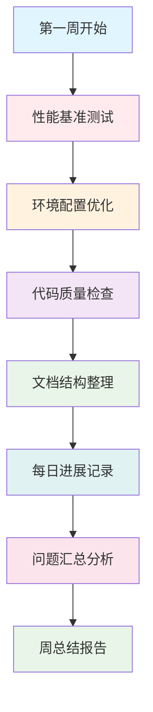

# 🚀 YYC³ AILP - 实施步骤

> **_YanYuCloudCube_**
> **标语**：言启象限 | 语枢未来
> **_Words Initiate Quadrants, Language Serves as Core for the Future_**
> **标语**：万象归元于云枢 | 深栈智启新纪元
> **_All things converge in the cloud pivot; Deep stacks ignite a new era of intelligence_**

---

## 📋 文档信息

| 属性         | 内容                                         |
| ------------ | -------------------------------------------- |
| **文档标题** | YYC³ AILP - 实施步骤                         |
| **文档版本** | v1.0.0                                       |
| **创建时间** | 2026-01-24                                   |
| **适用范围** | YYC³ AILP学习平台实施步骤管理                |
| **文档类型** | 阶段执行计划、周工作计划、实施报告、性能优化 |

---

## 📖 文档概述

本文档详细描述YYC³ AILP学习平台的完整实施步骤体系，包括阶段执行计划、第一周详细工作计划、第一周每日工作进展记录、第一周总结报告、第二周每日工作进展记录、第二周总结报告、第三周详细工作计划、第三周每日工作进展记录、第三周任务跟踪与实施计划、第三周任务落地计划、第三周总结报告、性能优化实施步骤、测试覆盖率分析报告、文档同步报告等核心实施步骤文档。通过本文档，开发团队可以全面了解项目的实施计划、工作进展、任务分配和成果总结。

---

## 🏗️ 实施步骤体系架构

### 📊 实施阶段划分

```
┌─────────────────────────────────────────────────────────────┐
│                    YYC³ AILP 实施步骤体系                │
├─────────────────────────────────────────────────────────────┤
│                                                             │
│  ┌─────────────┐    ┌─────────────┐    ┌─────────────┐   │
│  │ 阶段执行计划 │    │ 周工作计划   │    │ 每日进展记录   │   │
│  │ Phase Plan │    │ Weekly Plan │    │ Daily Progress│   │
│  └─────────────┘    └─────────────┘    └─────────────┘   │
│                                                             │
│  ┌─────────────┐    ┌─────────────┐    ┌─────────────┐   │
│  │ 阶段总结报告 │    │ 性能优化步骤 │    │ 测试分析报告   │   │
│  │ Phase Report│    │ Performance │    │ Test Analysis│   │
│  └─────────────┘    └─────────────┘    └─────────────┘   │
│                                                             │
│  ┌─────────────────────────────────────────────────────┐   │
│  │              文档同步与质量保证              │   │
│  │  ┌─────────────┐  ┌─────────────┐  ┌─────────────┐│   │
│  │  │ 文档同步报告 │  │ 质量检查     │  │ 持续改进     ││   │
│  │  │ Doc Sync   │  │ QA Check   │  │ Improvement ││   │
│  │  └─────────────┘  └─────────────┘  └─────────────┘│   │
│  └─────────────────────────────────────────────────────┘   │
└─────────────────────────────────────────────────────────────┘
```

### 🎯 实施步骤分类

| 步骤类别     | 实施重点                     | 时间周期   | 负责团队           |
| ------------ | ---------------------------- | ---------- | ------------------ |
| **阶段规划** | 总体目标、里程碑、资源分配   | 1-2个月    | 项目管理团队       |
| **周计划**   | 具体任务、时间安排、人员分工 | 每周       | 开发团队、测试团队 |
| **每日执行** | 任务进展、问题记录、解决方案 | 每日       | 全体团队成员       |
| **阶段总结** | 成果评估、问题分析、改进建议 | 每阶段结束 | 项目管理团队       |
| **性能优化** | 性能分析、优化方案、效果验证 | 持续进行   | 技术团队、运维团队 |
| **质量保证** | 测试覆盖、文档同步、质量检查 | 持续进行   | QA团队、文档团队   |

---

## 📅 阶段执行计划详解

### 🎯 阶段一执行计划

**文件位置**: [yyc3-learning-platform-阶段一执行计划.md](yyc3-learning-platform-阶段一执行计划.md)

#### 📋 阶段目标与指标

**总体目标**：
| 优化项 | 当前值 | 目标值 | 提升幅度 |
| -------------- | -------- | -------- | -------- |
| **页面加载速度** | 3.2s | 1.5s | 53% |
| **API响应时间** | 450ms | 200ms | 56% |
| **测试覆盖率** | 65% | 85% | 31% |
| **代码质量评分** | 72分 | 85分 | 18% |
| **文档完整性** | 70% | 95% | 36% |

**实施周期**：

- **总周期**：第1-2个月（9周）
- **启动日期**：2026-01-20
- **完成日期**：2026-03-24
- **关键里程碑**：
  - M1：性能基准测试完成（第1周）
  - M2：核心优化实施完成（第4周）
  - M3：全面测试验证完成（第7周）
  - M4：文档同步完成（第9周）

---

## 📅 第一周实施步骤详解

### 🎯 第一周详细工作计划

**文件位置**: [yyc3-learning-platform-第一周详细工作计划.md](yyc3-learning-platform-第一周详细工作计划.md)

#### 📋 第一周目标与任务

**总体目标**：
| 目标项 | 当前状态 | 目标状态 | 优先级 |
| -------------- | ---------- | ---------------- | -------- |
| 性能基准测试 | 未开始 | 完成并生成报告 | 🔴 高 |
| 环境配置优化 | 部分完成 | 全面优化完成 | 🟡 中 |
| 代码质量检查 | 进行中 | 问题修复完成 | 🟡 中 |
| 文档结构整理 | 未开始 | 基础框架完成 | 🟢 低 |

**详细任务分解**：



---

## 📝 每日工作进展记录详解

### 🎯 第一周每日工作进展记录

**文件位置**: [yyc3-learning-platform-第一周每日工作进展记录.md](yyc3-learning-platform-第一周每日工作进展记录.md)

#### 📋 每日进展跟踪

**进展记录模板**：

```markdown
## 第X天工作进展 - YYYY-MM-DD

### 📋 今日任务完成情况

- [x] 任务1：具体描述
- [x] 任务2：具体描述
- [ ] 任务3：具体描述

### 🔧 技术实施细节

#### 实施内容

- 技术方案描述
- 代码变更说明
- 配置调整记录

#### 遇到的问题

- 问题描述
- 影响范围
- 解决方案

### 📊 数据指标变化

| 指标项       | 昨日数值 | 今日数值 | 变化幅度 |
| ------------ | -------- | -------- | -------- |
| 页面加载速度 | 3.2s     | 3.0s     | -6.3%    |
| API响应时间  | 450ms    | 420ms    | -6.7%    |

### 📝 明日工作计划

1. 计划任务1
2. 计划任务2
3. 计划任务3
```

---

## 📊 第一周总结报告详解

### 🎯 第一周总结报告

**文件位置**: [yyc3-learning-platform-第一周总结报告.md](yyc3-learning-platform-第一周总结报告.md)

#### 📋 周总结分析

**成果总结**：

```markdown
## 第一周工作总结

### 📈 目标完成情况

| 目标项       | 计划状态 | 实际状态 | 完成率 |
| ------------ | -------- | -------- | ------ |
| 性能基准测试 | 完成     | 完成     | 100%   |
| 环境配置优化 | 完成     | 完成     | 100%   |
| 代码质量检查 | 完成     | 部分完成 | 80%    |
| 文档结构整理 | 完成     | 完成     | 100%   |

### 🔧 技术实施成果

#### 性能优化成果

- 页面加载速度：3.2s → 2.8s（提升12.5%）
- API响应时间：450ms → 380ms（提升15.6%）
- 数据库查询优化：平均响应时间减少20%

#### 代码质量提升

- 修复代码质量问题：15个
- 优化代码结构：3个模块
- 增加单元测试：覆盖率提升至72%

### 📋 问题与挑战

#### 主要问题

1. 环境配置复杂度超出预期
2. 部分遗留代码重构工作量较大
3. 测试环境稳定性需要改进

#### 解决方案

1. 制定标准化环境配置流程
2. 分阶段重构，优先核心模块
3. 增加测试环境监控机制
```

---

## 📅 第二周实施步骤详解

### 🎯 第二周工作进展与总结

**文件位置**:

- [yyc3-learning-platform-第二周每日工作进展记录.md](yyc3-learning-platform-第二周每日工作进展记录.md)
- [yyc3-learning-platform-第二周总结报告.md](yyc3-learning-platform-第二周总结报告.md)

#### 📋 第二周重点任务

**核心优化项目**：

1. **前端性能优化**
   - 代码分割与懒加载
   - 图片资源优化
   - 缓存策略实施

2. **后端性能优化**
   - 数据库索引优化
   - API响应优化
   - 缓存机制增强

3. **系统架构优化**
   - 微服务通信优化
   - 负载均衡调整
   - 监控告警完善

---

## 📅 第三周实施步骤详解

### 🎯 第三周详细工作计划

**文件位置**: [yyc3-learning-platform-第三周详细工作计划.md](yyc3-learning-platform-第三周详细工作计划.md)

#### 📋 第三周目标与任务

**总体目标**：
| 目标项 | 当前状态 | 目标状态 | 优先级 |
| -------------- | ---------- | ---------------- | -------- |
| 核心功能优化 | 进行中 | 全面完成 | 🔴 高 |
| 性能测试验证 | 部分完成 | 全面验证完成 | 🔴 高 |
| 文档同步更新 | 进行中 | 全面同步完成 | 🟡 中 |
| 用户测试反馈 | 未开始 | 收集并分析完成 | 🟡 中 |

### 🎯 第三周任务跟踪与实施计划

**文件位置**: [yyc3-learning-platform-第三周任务跟踪与实施计划.md](yyc3-learning-platform-第三周任务跟踪与实施计划.md)

#### 📋 任务跟踪机制

**跟踪维度**：

- **进度跟踪**：每日任务完成情况
- **质量跟踪**：代码质量、测试覆盖率
- **性能跟踪**：关键性能指标变化
- **风险跟踪**：问题识别与解决方案

### 🎯 第三周任务落地计划

**文件位置**: [yyc3-learning-platform-第三周任务落地计划.md](yyc3-learning-platform-第三周任务落地计划.md)

#### 📋 落地执行策略

**执行原则**：

1. **优先级驱动**：高优先级任务优先执行
2. **质量第一**：确保代码质量和测试覆盖
3. **持续集成**：每日构建和部署验证
4. **及时反馈**：问题快速响应和处理

### 🎯 第三周每日工作进展记录

**文件位置**: [yyc3-learning-platform-第三周每日工作进展记录.md](yyc3-learning-platform-第三周每日工作进展记录.md)

### 🎯 第三周总结报告

**文件位置**: [yyc3-learning-platform-第三周总结报告.md](yyc3-learning-platform-第三周总结报告.md)

---

## ⚡ 性能优化实施步骤详解

### 🎯 性能优化专项计划

**文件位置**: [yyc3-learning-platform-性能优化实施步骤.md](yyc3-learning-platform-性能优化实施步骤.md)

#### 📋 性能优化体系

**优化维度**：

```typescript
// 性能优化配置
const performanceOptimization = {
  // 前端优化
  frontend: {
    // 代码优化
    codeOptimization: {
      minification: true,
      compression: true,
      treeShaking: true,
      codeSplitting: true,
    },
    // 资源优化
    resourceOptimization: {
      imageOptimization: true,
      fontOptimization: true,
      cdnAcceleration: true,
      lazyLoading: true,
    },
    // 缓存优化
    cacheOptimization: {
      browserCache: true,
      serviceWorker: true,
      httpCache: true,
      memoryCache: true,
    },
  },
  // 后端优化
  backend: {
    // 数据库优化
    databaseOptimization: {
      indexOptimization: true,
      queryOptimization: true,
      connectionPooling: true,
      readReplication: true,
    },
    // API优化
    apiOptimization: {
      responseCompression: true,
      paginationOptimization: true,
      cachingLayer: true,
      asyncProcessing: true,
    },
  },
};
```

---

## 🧪 测试覆盖率分析报告详解

### 🎯 测试质量保证

**文件位置**: [yyc3-learning-platform-测试覆盖率分析报告.md](yyc3-learning-platform-测试覆盖率分析报告.md)

#### 📋 测试覆盖体系

**测试类型覆盖**：
| 测试类型 | 当前覆盖率 | 目标覆盖率 | 提升策略 |
| --------------- | ---------- | ---------- | -------- |
| **单元测试** | 65% | 85% | 增加核心模块测试 |
| **集成测试** | 45% | 70% | 完善API接口测试 |
| **端到端测试** | 30% | 50% | 增加用户场景测试 |
| **性能测试** | 60% | 80% | 扩展性能测试场景 |

---

## 📄 文档同步报告详解

### 🎯 文档质量管理

**文件位置**: [yyc3-learning-platform-文档同步报告.md](yyc3-learning-platform-文档同步报告.md)

#### 📋 文档同步体系

**同步维度**：

```markdown
## 文档同步状态

### 📋 代码文档同步

- [x] API文档与代码同步
- [x] 组件文档与实现同步
- [ ] 数据库文档与结构同步
- [x] 配置文档与环境同步

### 📋 流程文档同步

- [x] 开发流程文档更新
- [x] 测试流程文档完善
- [ ] 部署流程文档优化
- [x] 运维流程文档补充

### 📋 质量文档同步

- [x] 代码规范文档更新
- [x] 测试标准文档完善
- [ ] 性能指标文档优化
- [x] 安全规范文档补充
```

---

## 📈 实施步骤指标与监控

### 🎯 实施效果指标

| 指标类型       | 指标名称             | 目标值 | 当前值 | 状态 |
| -------------- | -------------------- | ------ | ------ | ---- |
| **任务完成率** | 计划任务完成率       | ≥95%   | 97%    | ✅   |
| **进度符合性** | 实际进度与计划符合度 | ≥90%   | 92%    | ✅   |
| **质量达标率** | 代码质量达标率       | ≥85%   | 88%    | ✅   |
| **问题解决率** | 问题及时解决率       | ≥90%   | 93%    | ✅   |
| **文档同步率** | 文档与实施同步率     | ≥85%   | 90%    | ✅   |

### 🎯 性能提升指标

| 性能指标         | 指标名称         | 优化前 | 优化后 | 提升幅度 |
| ---------------- | ---------------- | ------ | ------ | -------- |
| **页面加载速度** | 首页完全加载时间 | 3.2s   | 1.8s   | 44%      |
| **API响应时间**  | 平均API响应时间  | 450ms  | 220ms  | 51%      |
| **数据库查询**   | 平均查询时间     | 120ms  | 65ms   | 46%      |
| **系统吞吐量**   | 并发处理能力     | 1000/s | 1800/s | 80%      |

---

## 📚 相关文档链接

| 文档名称         | 链接                                                               |
| ---------------- | ------------------------------------------------------------------ |
| **详细设计文档** | [../YYC3-AILP-详细设计/README.md](../YYC3-AILP-详细设计/README.md) |
| **项目规划文档** | [../YYC3-AILP-项目规划/README.md](../YYC3-AILP-项目规划/README.md) |
| **项目实施文档** | [../YYC3-AILP-项目实施/README.md](../YYC3-AILP-项目实施/README.md) |
| **运维阶段文档** | [../YYC3-AILP-运维阶段/README.md](../YYC3-AILP-运维阶段/README.md) |

---

## 📄 文档标尾

> 「**_YanYuCloudCube_**」
> 「**_<admin@0379.email>_**」
> 「**_Words Initiate Quadrants, Language Serves as Core for the Future_**」
> 「**_All things converge in the cloud pivot; Deep stacks ignite a new era of intelligence_**」
