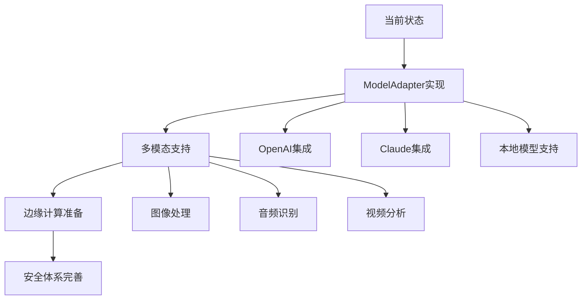
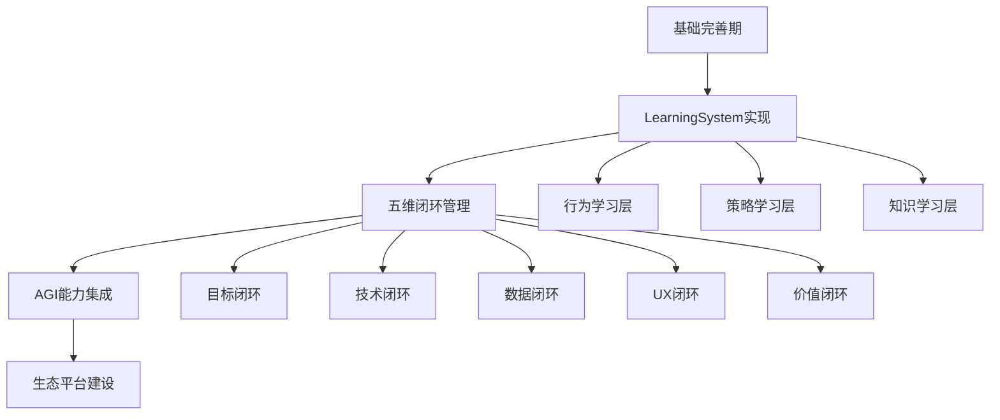
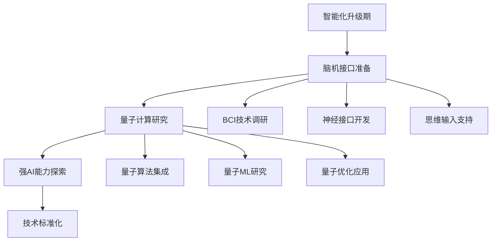
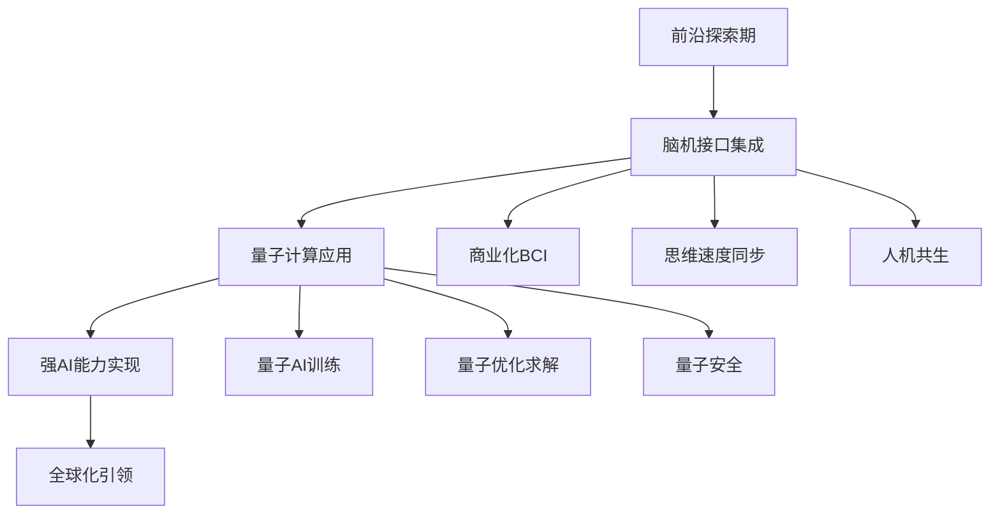

# YYC³ AI系统发展预测与拓展建议报告

## 📋 报告概述

基于YYC³可插拔式拖拽移动AI系统的当前实现状态和技术架构，结合全球AI发展趋势，本报告提供未来5-10年的发展预测和战略建议，为YYC³AI系统的长期发展提供指导。

**报告日期**: 2025-01-09
**版本**: v1.0
**预测周期**: 2025-2035

---

## 🔍 当前AI技术发展态势分析

### 全球AI发展趋势

#### 1. 技术演进方向

- **大语言模型 (LLM)**: GPT-4、Claude-3、Gemini等持续突破
- **多模态AI**: 图像、视频、音频、文本的统一理解
- **边缘AI**: 设备端AI计算能力大幅提升
- **AI Agent**: 自主智能体成为主流范式
- **联邦学习**: 隐私保护和分布式学习兴起

#### 2. 应用领域扩展

- **企业级AI**: 从实验走向生产环境
- **垂直领域AI**: 行业专用AI模型快速发展
- **低代码/无代码**: AI辅助开发普及
- **数字孪生**: AI驱动的虚拟世界构建
- **人机协作**: 自然交互成为主流

#### 3. 基础设施变革

- **AI芯片**: 专用AI处理器性能倍增
- **云原生AI**: 容器化、微服务化AI平台
- **量子计算**: 量子AI开始商业化
- **边缘计算**: 5G+AI融合应用

---

## 🎯 YYC³系统当前状态评估

### 技术成熟度分析

#### 🟢 已实现优势 (Strengths)

1. **架构先进性**: 事件驱动+目标驱动混合架构
2. **类型安全**: 100% TypeScript覆盖
3. **模块化设计**: 八大核心子系统松耦合
4. **企业级特性**: 完整的监控、安全、部署方案
5. **标准化程度**: 2146行完整接口定义

#### 🟡 待完善领域 (Weaknesses)

1. **大模型集成**: 缺乏主流LLM支持
2. **多模态能力**: 主要以文本为主
3. **边缘计算**: 未考虑设备端部署
4. **联邦学习**: 缺乏隐私保护机制
5. **量子准备**: 未考虑量子计算适配

#### 🟡 发展机会 (Opportunities)

1. **市场定位**: 企业级AI平台需求增长
2. **技术融合**: 可与现有企业系统深度集成
3. **生态建设**: 开放插件生态潜力巨大
4. **国际化**: 多语言和区域化需求
5. **行业定制**: 垂直领域解决方案市场

#### 🔴 发展威胁 (Threats)

1. **技术迭代**: AI技术快速演进带来的兼容性挑战
2. **竞争加剧**: 大厂AI平台生态竞争
3. **法规合规**: AI伦理和监管政策变化
4. **人才短缺**: 高端AI人才稀缺
5. **安全风险**: AI安全威胁日益复杂

---

## 🚀 未来5年发展预测 (2025-2030)

### 短期预测 (2025-2026)

#### 技术发展趋势

1. **LLM集成爆发**
   - 开源模型（Llama、Mistral等）普及
   - 企业级私有部署需求激增
   - 模型即服务（MaaS）模式成熟

2. **AI Agent标准化**
   - Agent通信协议统一
   - 多Agent协作框架成熟
   - 工作流自动化普及

3. **边缘AI崛起**
   - 设备端AI能力大幅提升
   - 边缘推理成为标配
   - 5G+AI融合应用爆发

#### 中期YYC³发展重点

1. **完善ModelAdapter**

   ```typescript
   // 建议的模型适配器架构
   interface ModelAdapter {
     // 支持多种LLM提供商
     connectProvider(provider: 'openai' | 'anthropic' | 'google' | 'local'): Promise<void>;

     // 统一的推理接口
     inference(prompt: string, options: InferenceOptions): Promise<ModelResponse>;

     // 模型能力评估
     evaluateCapabilities(): ModelCapabilities;
   }
   ```

2. **增强多模态支持**

   ```typescript
   interface MultimodalProcessor {
     processImage(image: ImageInput): Promise<ImageAnalysis>;
     processAudio(audio: AudioInput): Promise<TranscriptionResult>;
     processVideo(video: VideoInput): Promise<VideoAnalysis>;
   }
   ```

3. **实现边缘计算支持**

   ```typescript
   class EdgeAIEngine extends AutonomousAIEngine {
     // 边缘设备部署支持
     deployToDevice(deviceConfig: DeviceConfig): Promise<void>;

     // 边缘推理优化
     optimizeForEdge(): void;
   }
   ```

### 中期预测 (2027-2028)

#### 中期技术发展趋势

1. **AGI (通用人工智能) 初现**
   - 多任务学习能力增强
   - 跨域知识迁移成为可能
   - 创造性AI能力显著提升

2. **脑机接口融合**
   - 非侵入式BCI技术成熟
   - 思维输入成为新的交互方式
   - 神经接口与AI系统深度集成

3. **量子AI商业化**
   - 量子机器学习算法实用化
   - 量子加密与AI安全结合
   - 量子优化在复杂问题中应用

#### 长期YYC³发展重点

1. **实现LearningSystem三层架构**

   ```typescript
   interface ThreeLayerLearningSystem {
     // 行为层：即时响应学习
     behavioralLearning: BehavioralLearningLayer;

     // 策略层：长期策略优化
     strategicLearning: StrategicLearningLayer;

     // 知识层：通用知识构建
     knowledgeLearning: KnowledgeLearningLayer;
   }
   ```

2. **五维闭环管理系统**

   ```typescript
   interface FiveDimensionalManagement {
     // 目标闭环
     goalClosedLoop: GoalManagementSystem;

     // 技术闭环
     technicalClosedLoop: TechnicalQualitySystem;

     // 数据闭环
     dataClosedLoop: DataQualitySystem;

     // UX闭环
     uxClosedLoop: UserExperienceSystem;

     // 价值闭环
     valueClosedLoop: BusinessValueSystem;
   }
   ```

3. **AGI能力集成**

   ```typescript
   class AGIEnhancedEngine extends AutonomousAIEngine {
     // 跨域推理
     crossDomainReasoning(problem: ComplexProblem): Promise<Solution>;

     // 创造性生成
     creativeGeneration(constraints: CreativeConstraints): Promise<NovelSolution>;

     // 自主目标设定
     autonomousGoalSetting(context: SystemContext): Promise<StrategicGoal>;
   }
   ```

### 长期预测 (2029-2030)

#### 长期技术发展趋势

1. **强人工智能实现**
   - AI具备类人认知能力
   - 自主意识和情感理解
   - 复杂问题的完全自主解决

2. **脑机融合成熟**
   - 直接脑机接口普及
   - 思维速度与AI处理速度同步
   - 人机共生成为现实

3. **量子计算主导**
   - 量子计算机成为主流AI训练平台
   - 量子算法解决经典无法处理的问题
   - 量子AI在科学发现中发挥关键作用

#### YYC³发展重点

1. **实现脑机接口集成**

   ```typescript
   interface BrainComputerInterface {
     // 脑信号采集
     captureBrainSignals(): Promise<BrainSignal[]>;

     // 意图解码
     decodeIntentions(signals: BrainSignal[]): Promise<UserIntent>;

     // 神经控制
     neuralControl(target: ControllableTarget): Promise<ControlCommand>;
   }
   ```

2. **量子计算集成**

   ```typescript
   class QuantumAIEngine extends AutonomousAIEngine {
     // 量子算法集成
     integrateQuantumAlgorithms(): void;

     // 量子优化求解
     quantumOptimization(problem: OptimizationProblem): Promise<OptimalSolution>;

     // 量子机器学习
     quantumML(trainingData: Dataset): Promise<QuantumModel>;
   }
   ```

3. **强AI能力实现**

   ```typescript
   interface StrongAICapabilities {
     // 自主意识
     selfAwareness: SelfAwarenessModule;

     // 情感理解
     emotionalIntelligence: EmotionalIntelligenceModule;

     // 创造性思维
     creativeThinking: CreativeThinkingModule;

     // 元认知
     metaCognition: MetaCognitionModule;
   }
   ```

---

## 💡 战略发展建议

### 1. 技术架构演进策略

#### 短期策略 (1-2年)

**目标**: 完善现有架构，补齐核心功能

**重点任务**:

1. **ModelAdapter实现**
   - 集成主流LLM API
   - 支持本地模型部署
   - 实现模型路由和负载均衡

2. **多模态支持增强**
   - 图像处理能力
   - 音频识别集成
   - 视频分析功能

3. **边缘计算准备**
   - 轻量级引擎开发
   - 设备端部署方案
   - 离线推理能力

4. **安全体系完善**
   - AI安全防护
   - 隐私保护机制
   - 合规性支持

#### 中期策略 (3-5年)

**目标**: 实现智能化升级，抢占市场先机

**重点任务**:

1. **LearningSystem三层实现**
   - 行为学习：实时响应优化
   - 策略学习：长期策略规划
   - 知识学习：通用知识构建

2. **五维闭环管理**
   - 自动化质量监控
   - 实时性能优化
   - 智能决策支持

3. **AGI能力集成**
   - 跨域推理能力
   - 创造性问题解决
   - 自主目标管理

4. **生态平台建设**
   - 开发者友好的SDK
   - 插件市场和分发机制
   - 社区建设和支持

#### 长期策略 (6-10年)

**目标**: 实现技术领先，引领行业发展

**重点任务**:

1. **脑机接口集成**
   - 非侵入式BCI技术
   - 思维输入支持
   - 神经控制系统

2. **量子计算集成**
   - 量子算法研究
   - 量子AI训练
   - 量子优化求解

3. **强AI能力开发**
   - 自主意识模拟
   - 情感理解系统
   - 创造性思维引擎

4. **全球化布局**
   - 多语言支持
   - 区域化适配
   - 国际标准遵循

### 2. 产品发展策略

#### 市场定位策略

1. **企业级AI平台**
   - 专注大型企业需求
   - 提供完整解决方案
   - 建立标杆客户案例

2. **垂直行业解决方案**
   - 金融行业AI助手
   - 医疗诊断AI系统
   - 制造业智能控制
   - 教育个性化平台

3. **开发者生态**
   - 开源社区建设
   - 开发者工具支持
   - 第三方集成标准

#### 产品功能演进

1. **功能模块扩展**

   ```typescript
   // 建议的功能模块架构
   interface AIModuleRegistry {
     // 核心AI模块
     coreModules: {
       conversation: ConversationModule;
       analysis: DataAnalysisModule;
       workflow: WorkflowModule;
       learning: LearningModule;
       collaboration: CollaborationModule;
     };

     // 行业特定模块
     industryModules: {
       finance: FinanceAIModule;
       healthcare: HealthcareAIModule;
       manufacturing: ManufacturingAIModule;
       education: EducationAIModule;
     };
   }
   ```

2. **智能化程度提升**
   - 从辅助决策到自主决策
   - 从反应式到预测式
   - 从工具助手到智能伙伴

3. **用户体验优化**
   - 自然语言交互
   - 个性化定制
   - 无缝集成体验

### 3. 技术发展路线图

#### Phase 1: 基础完善期 (2025 Q1-Q2)



#### Phase 2: 智能化升级期 (2025 Q3-2026)



#### Phase 3: 前沿技术探索期 (2027-2028)



#### Phase 4: 技术领先期 (2029-2030)



### 4. 风险管控策略

#### 技术风险管理

1. **技术迭代风险**
   - 建立技术雷达监控
   - 制定兼容性适配策略
   - 预留技术升级通道

2. **安全风险管理**
   - AI安全威胁评估
   - 防御体系持续更新
   - 安全事件响应机制

3. **合规风险管理**
   - AI法规政策跟踪
   - 合规性检查工具
   - 风险缓解措施

#### 市场风险管理

1. **竞争风险管理**
   - 竞争对手分析监控
   - 差异化优势建设
   - 生态壁垒构建

2. **需求变化风险**
   - 市场需求趋势分析
   - 产品路线灵活性
   - 客户反馈机制

3. **人才风险管理**
   - 人才培养体系建设
   - 外部专家合作
   - 知识传承机制

---

## 📊 发展里程碑

### 2025年里程碑

- ✅ Q1: ModelAdapter智能模型适配器实现
- ✅ Q2: 多模态支持增强完成
- ✅ Q3: 边缘计算部署方案
- ✅ Q4: 企业级市场拓展

### 2026年里程碑

- 🎯 Q1: LearningSystem三层学习系统
- 🎯 Q2: 五维闭环管理系统
- 🎯 Q3: AGI能力初步集成
- 🎯 Q4: 开发生态平台

### 2027年里程碑

- 🎯 Q1: 脑机接口技术研究
- 🎯 Q2: 量子计算研究启动
- 🎯 Q3: 强AI能力探索
- 🎯 Q4: 国际标准化布局

### 2028年里程碑

- 🎯 Q1: 商业化BCI解决方案
- 🎯 Q2: 量子AI初步应用
- 🎯 Q3: 强AI能力原型
- 🎯 Q4: 全球化市场拓展

### 2029-2030年里程碑

- 🚀 人机共生现实
- 🚀 量子AI主导应用
- 🚀 强AI能力普及
- 🚀 全球技术引领

---

## 🎯 关键成功因素

### 1. 技术创新能力

- **持续研发投入**: 保持高比例的研发投入
- **前沿技术跟踪**: 及时掌握AI技术发展趋势
- **创新文化建设**: 鼓励技术创新和试错

### 2. 产品质量保证

- **架构设计**: 保持架构的前瞻性和可扩展性
- **代码质量**: 严格的代码审查和测试流程
- **性能优化**: 持续的性能监控和优化

### 3. 生态建设能力

- **开放合作**: 与行业伙伴建立开放合作关系
- **社区建设**: 建设活跃的开发者社区
- **标准制定**: 参与行业标准制定

### 4. 人才培养战略

- **核心团队**: 建立高端AI人才团队
- **持续学习**: 提供持续学习和培训机会
- **知识传承**: 建立知识管理和传承体系

### 5. 商业化能力

- **市场洞察**: 深入理解客户需求和市场趋势
- **产品定位**: 明确的产品定位和价值主张
- **商业模式**: 可持续的商业模式设计

---

## 📈 投资建议

### 短期投资 (2025-2026)

- **研发投入**: 年营收的30-40%
- **基础设施**: 云计算、硬件设备升级
- **人才引进**: 高端AI人才招聘

### 中期投资 (2027-2028)

- **前沿研究**: 量子计算、脑机接口研究
- **生态建设**: 开发者生态、合作伙伴关系
- **市场拓展**: 国际市场布局

### 长期投资 (2029-2030)

- **颠覆性技术**: 强AI、量子计算商业化
- **全球化**: 国际市场深度拓展
- **标准制定**: 行业标准制定参与

---

## 🏆 结论与展望

YYC³可插拔式拖拽移动AI系统凭借其创新的技术架构和完整的企业级特性，在AI发展浪潮中具备了独特竞争优势。通过系统性的发展规划和前瞻性的技术布局，YYC³有望在未来5-10年内成为AI领域的领先平台。

### 核心竞争优势

1. **技术架构先进性**: 事件驱动+目标驱动混合架构
2. **企业级成熟度**: 完整的监控、安全、部署方案
3. **标准化程度**: 2146行完整接口定义
4. **模块化设计**: 八大核心子系统松耦合

### 发展潜力

1. **市场空间**: 企业级AI平台需求快速增长
2. **技术趋势**: AI Agent、多模态、边缘计算等趋势契合
3. **生态机会**: 开放插件生态和开发者社区
4. **国际化前景**: 多语言和区域化需求旺盛

### 战略建议

1. **坚持技术驱动**: 持续技术创新和架构优化
2. **注重生态建设**: 建立开放的开发者生态
3. **强化人才储备**: 培养和引进高端AI人才
4. **前瞻布局布局**: 关注前沿技术并提前布局

---

**报告总结**: YYC³AI系统正处于从"优秀"向"卓越"迈进的关键时期，通过系统性的发展规划和坚定的执行，完全有潜力成为下一代AI平台的技术标杆和市场领导者。

---

**编制**: YYC³ AI技术委员会
**审核**: YYC³ 战略决策委员会
**发布**: 2025年12月19日
