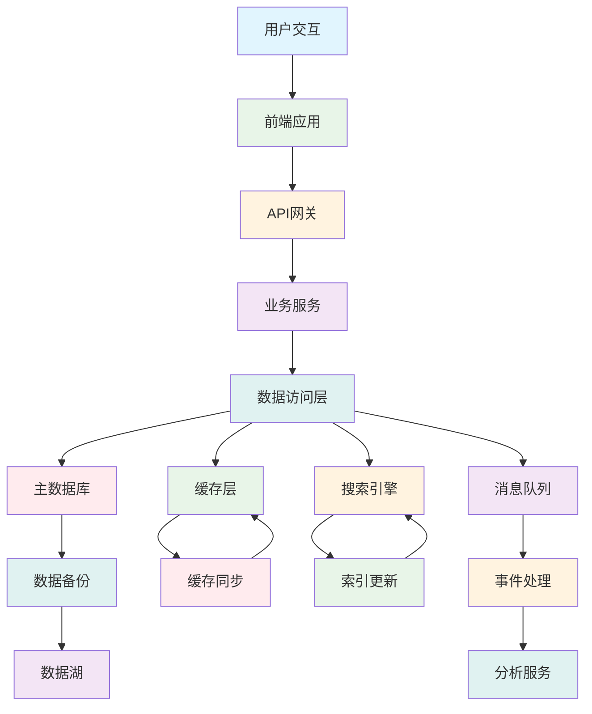
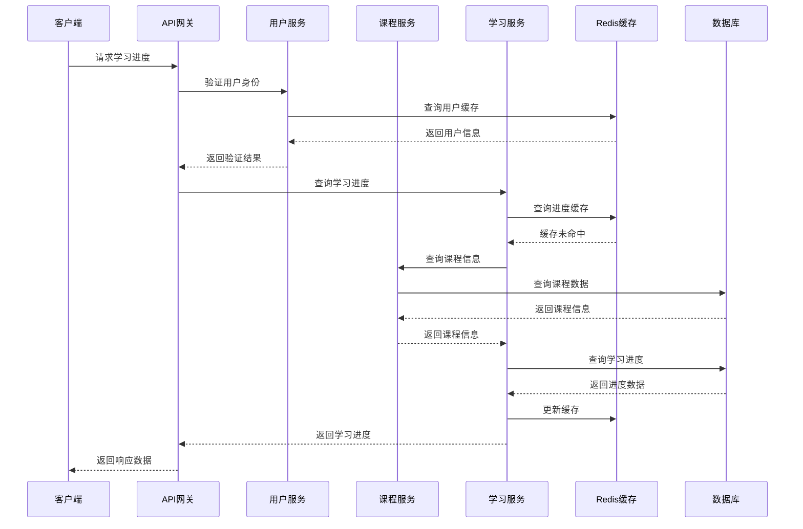

# 🏗️ YYC³ AILP - 架构设计

> **_YanYuCloudCube_**
> **标语**：言启象限 | 语枢未来
> **_Words Initiate Quadrants, Language Serves as Core for the Future_**
> **标语**：万象归元于云枢 | 深栈智启新纪元
> **_All things converge in the cloud pivot; Deep stacks ignite a new era of intelligence_**

---

## 📋 文档信息

| 属性         | 内容                                   |
| ------------ | -------------------------------------- |
| **文档标题** | YYC³ AILP - 架构设计                   |
| **文档版本** | v1.0.0                                 |
| **创建时间** | 2026-01-24                             |
| **适用范围** | YYC³ AILP学习平台系统架构设计          |
| **文档类型** | 系统架构、数据架构、技术选型、安全架构 |

---

## 📖 文档概述

本文档详细描述YYC³ AILP学习平台的完整架构设计，包括系统架构、数据架构、技术选型、数据库设计、安全架构、微服务拆分、缓存架构、分布式链路、高并发限流、多环境架构适配等核心设计文档。通过本文档，开发团队可以全面了解系统的技术架构、设计原则和实现方案。

---

## 🏗️ 架构设计体系

### 📊 架构设计架构

```
┌─────────────────────────────────────────────────────────────┐
│                    YYC³ AILP 架构设计体系                │
├─────────────────────────────────────────────────────────────┤
│                                                             │
│  ┌─────────────┐    ┌─────────────┐    ┌─────────────┐   │
│  │ 系统架构设计  │    │ 数据架构设计  │    │ 技术选型报告  │   │
│  │ System Arch │    │ Data Arch   │    │ Tech Stack  │   │
│  └─────────────┘    └─────────────┘    └─────────────┘   │
│                                                             │
│  ┌─────────────┐    ┌─────────────┐    ┌─────────────┐   │
│  │ 数据库设计    │    │ 安全架构设计  │    │ 微服务拆分设计  │   │
│  │ Database    │    │ Security    │    │ Microservice │   │
│  └─────────────┘    └─────────────┘    └─────────────┘   │
│                                                             │
│  ┌─────────────┐    ┌─────────────┐    ┌─────────────┐   │
│  │ 缓存架构设计  │    │ 分布式链路设计  │    │ 高并发限流设计  │   │
│  │ Cache Arch  │    │ Distributed │    │ Rate Limit  │   │
│  └─────────────┘    └─────────────┘    └─────────────┘   │
│                                                             │
│  ┌─────────────────────────────────────────────────────┐   │
│  │              核心引擎架构与前端架构              │   │
│  │  ┌─────────────┐  ┌─────────────┐  ┌─────────────┐│   │
│  │  │ 核心引擎架构  │  │ 前端架构     │  │ 智能协同架构  ││   │
│  │  │ Core Engine │  │ Frontend    │  │ AI Collab  ││   │
│  │  └─────────────┘  └─────────────┘  └─────────────┘│   │
│  └─────────────────────────────────────────────────────┘   │
│                                                             │
│  ┌─────────────────────────────────────────────────────┐   │
│  │              架构演进与运维生态                  │   │
│  │  ┌─────────────┐  ┌─────────────┐  ┌─────────────┐│   │
│  │  │ 多环境架构适配  │  │ 架构简化计划  │  │ AI运维生态   ││   │
│  │  │ Multi Env   │  │ Simplify    │  │ AI Ops     ││   │
│  │  └─────────────┘  └─────────────┘  └─────────────┘│   │
│  └─────────────────────────────────────────────────────┘   │
└─────────────────────────────────────────────────────────────┘
```

### 🎯 架构设计分类

| 架构类型       | 设计重点                       | 技术栈                     | 负责团队           |
| -------------- | ------------------------------ | -------------------------- | ------------------ |
| **系统架构**   | 整体架构、分层设计、模块划分   | Next.js、React、Node.js    | 架构团队、前端团队 |
| **数据架构**   | 数据流、数据模型、数据处理     | PostgreSQL、Redis、GraphQL | 数据团队、后端团队 |
| **安全架构**   | 身份认证、数据加密、安全防护   | JWT、OAuth、SSL/TLS        | 安全团队、运维团队 |
| **微服务架构** | 服务拆分、服务治理、API网关    | Docker、K8s、gRPC          | 架构团队、后端团队 |
| **缓存架构**   | 缓存策略、数据一致性、性能优化 | Redis、Memcached           | 后端团队、运维团队 |
| **前端架构**   | 组件化、状态管理、路由设计     | Next.js、React、Tailwind   | 前端团队、UI团队   |

---

## 🏛️ 系统架构设计详解

### 🎯 整体架构设计

**文件位置**: [021-YYC3-AILP-架构设计-系统架构设计文档.md](021-YYC3-AILP-架构设计-系统架构设计文档.md)

#### 📋 系统架构分层

```
┌─────────────────────────────────────────────────────────────┐
│                    YYC³ AILP 系统架构                    │
├─────────────────────────────────────────────────────────────┤
│                                                             │
│  ┌─────────────────────────────────────────────────────┐   │
│  │                前端展示层 (Frontend)               │   │
│  │  ┌─────────────┐  ┌─────────────┐  ┌─────────────┐│   │
│  │  │ Web应用     │  │ 移动应用     │  │ 桌面应用     ││   │
│  │  │ Next.js    │  │ React Native│  │ Electron    ││   │
│  │  └─────────────┘  └─────────────┘  └─────────────┘│   │
│  └─────────────────────────────────────────────────────┘   │
│                                                             │
│  ┌─────────────────────────────────────────────────────┐   │
│  │                API网关层 (API Gateway)             │   │
│  │  ┌─────────────┐  ┌─────────────┐  ┌─────────────┐│   │
│  │  │ 路由管理     │  │ 认证授权     │  │ 限流控制     ││   │
│  │  │ Routing    │  │ AuthN/AuthZ │  │ Rate Limit  ││   │
│  │  └─────────────┘  └─────────────┘  └─────────────┘│   │
│  └─────────────────────────────────────────────────────┘   │
│                                                             │
│  ┌─────────────────────────────────────────────────────┐   │
│  │                业务服务层 (Business Services)        │   │
│  │  ┌─────────────┐  ┌─────────────┐  ┌─────────────┐│   │
│  │  │ 用户服务     │  │ 学习服务     │  │ AI服务       ││   │
│  │  │ User Svc   │  │ Learning Svc│  │ AI Svc      ││   │
│  │  └─────────────┘  └─────────────┘  └─────────────┘│   │
│  └─────────────────────────────────────────────────────┘   │
│                                                             │
│  ┌─────────────────────────────────────────────────────┐   │
│  │                数据存储层 (Data Storage)            │   │
│  │  ┌─────────────┐  ┌─────────────┐  ┌─────────────┐│   │
│  │  │ 关系数据库   │  │ 缓存数据库   │  │ 文件存储     ││   │
│  │  │ PostgreSQL │  │ Redis      │  │ S3/OSS     ││   │
│  │  └─────────────┘  └─────────────┘  └─────────────┘│   │
│  └─────────────────────────────────────────────────────┘   │
└─────────────────────────────────────────────────────────────┘
```

#### 🏗️ 架构设计原则

**五高原则**：

- **高可用性**：多活部署、故障自动转移、数据备份恢复
- **高性能**：缓存优化、数据库优化、CDN加速、异步处理
- **高安全性**：身份认证、数据加密、安全审计、漏洞防护
- **高扩展性**：微服务架构、水平扩展、弹性伸缩
- **高可维护性**：模块化设计、标准化接口、自动化运维

**五标体系**：

- **标准化**：统一的技术标准、接口规范、文档标准
- **规范化**：代码规范、流程规范、安全规范
- **自动化**：自动化测试、自动化部署、自动化监控
- **智能化**：AI辅助开发、智能运维、智能推荐
- **可视化**：架构可视化、监控可视化、数据可视化

---

## 🗄️ 数据架构设计详解

### 🎯 数据架构设计

**文件位置**: [022-YYC3-AILP-架构设计-数据架构设计文档.md](022-YYC3-AILP-架构设计-数据架构设计文档.md)

#### 📋 数据流架构



#### 🏗️ 数据模型设计

**核心数据实体**：

- **用户模型**：用户基本信息、认证信息、权限信息
- **课程模型**：课程内容、章节结构、学习资源
- **学习模型**：学习进度、成绩记录、学习行为
- **AI模型**：推荐算法、内容生成、智能分析

**数据关系设计**：

- **一对多关系**：用户-课程、课程-章节、用户-学习记录
- **多对多关系**：用户-角色、课程-标签、用户-社区
- **层次关系**：课程-章节-知识点、组织架构-部门-用户

---

## 🛠️ 技术选型报告详解

### 🎯 技术栈选择

**文件位置**: [023-YYC3-AILP-架构设计-技术选型报告.md](023-YYC3-AILP-架构设计-技术选型报告.md)

#### 📋 前端技术栈

| 技术类别     | 技术选择              | 选择原因                          |
| ------------ | --------------------- | --------------------------------- |
| **框架**     | Next.js 14            | 全栈框架、SEO友好、性能优异       |
| **UI库**     | React 19              | 最新版本、并发特性、生态丰富      |
| **语言**     | TypeScript            | 类型安全、开发效率、维护性好      |
| **样式**     | Tailwind CSS          | 原子化CSS、响应式设计、开发效率高 |
| **组件库**   | shadcn/ui             | 现代化、可定制、TypeScript友好    |
| **状态管理** | Zustand               | 轻量级、TypeScript友好、API简洁   |
| **表单处理** | React Hook Form + Zod | 性能优异、类型安全、验证简单      |

#### 📋 后端技术栈

| 技术类别   | 技术选择           | 选择原因                           |
| ---------- | ------------------ | ---------------------------------- |
| **运行时** | Node.js 18         | 性能优异、生态丰富、TypeScript支持 |
| **框架**   | Next.js API Routes | 全栈一致性、类型安全、开发效率高   |
| **数据库** | PostgreSQL 15      | 功能强大、ACID特性、JSON支持       |
| **缓存**   | Redis 7            | 性能优异、数据结构丰富、持久化     |
| **认证**   | NextAuth.js        | 功能完整、安全性高、易集成         |
| **ORM**    | Prisma             | 类型安全、迁移管理、查询优化       |

---

## 🗃️ 数据库设计文档详解

### 🎯 数据库架构设计

**文件位置**: [024-YYC3-AILP-架构设计-数据库设计文档.md](024-YYC3-AILP-架构设计-数据库设计文档.md)

#### 📋 数据库表结构

**核心业务表**：

```sql
-- 用户表
CREATE TABLE users (
    id UUID PRIMARY KEY DEFAULT gen_random_uuid(),
    email VARCHAR(255) UNIQUE NOT NULL,
    username VARCHAR(100) UNIQUE NOT NULL,
    password_hash VARCHAR(255) NOT NULL,
    first_name VARCHAR(100),
    last_name VARCHAR(100),
    avatar_url TEXT,
    role user_role DEFAULT 'student',
    created_at TIMESTAMP DEFAULT CURRENT_TIMESTAMP,
    updated_at TIMESTAMP DEFAULT CURRENT_TIMESTAMP
);

-- 课程表
CREATE TABLE courses (
    id UUID PRIMARY KEY DEFAULT gen_random_uuid(),
    title VARCHAR(255) NOT NULL,
    description TEXT,
    instructor_id UUID REFERENCES users(id),
    category_id UUID REFERENCES categories(id),
    difficulty_level course_difficulty DEFAULT 'beginner',
    estimated_hours INTEGER,
    price DECIMAL(10,2) DEFAULT 0.00,
    thumbnail_url TEXT,
    status course_status DEFAULT 'draft',
    created_at TIMESTAMP DEFAULT CURRENT_TIMESTAMP,
    updated_at TIMESTAMP DEFAULT CURRENT_TIMESTAMP
);

-- 学习进度表
CREATE TABLE learning_progress (
    id UUID PRIMARY KEY DEFAULT gen_random_uuid(),
    user_id UUID REFERENCES users(id),
    course_id UUID REFERENCES courses(id),
    lesson_id UUID REFERENCES lessons(id),
    completion_percentage INTEGER DEFAULT 0,
    time_spent_minutes INTEGER DEFAULT 0,
    last_accessed_at TIMESTAMP,
    completed_at TIMESTAMP,
    created_at TIMESTAMP DEFAULT CURRENT_TIMESTAMP,
    updated_at TIMESTAMP DEFAULT CURRENT_TIMESTAMP,
    UNIQUE(user_id, course_id, lesson_id)
);
```

#### 🏗️ 数据库优化策略

**索引优化**：

- **主键索引**：所有表的主键自动创建唯一索引
- **外键索引**：外键字段创建索引提高关联查询性能
- **复合索引**：常用查询组合创建复合索引
- **全文索引**：课程标题、描述创建全文索引支持搜索

**查询优化**：

- **分页查询**：使用LIMIT和OFFSET优化大数据集分页
- **预加载**：使用JOIN或预加载减少N+1查询问题
- **缓存策略**：热点数据缓存减少数据库压力
- **读写分离**：主从复制分离读写操作

---

## 🔒 安全架构设计文档详解

### 🎯 安全架构设计

**文件位置**: [025-YYC3-AILP-架构设计-安全架构设计文档.md](025-YYC3-AILP-架构设计-安全架构设计文档.md)

#### 📋 安全防护体系

```
┌─────────────────────────────────────────────────────────────┐
│                    YYC³ AILP 安全架构                    │
├─────────────────────────────────────────────────────────────┤
│                                                             │
│  ┌─────────────────────────────────────────────────────┐   │
│  │                网络安全层 (Network Security)       │   │
│  │  ┌─────────────┐  ┌─────────────┐  ┌─────────────┐│   │
│  │  │ WAF防火墙   │  │ DDoS防护    │  │ SSL/TLS加密  ││   │
│  │  │ Web App FW │  │ DDoS Protect│  │ Encryption  ││   │
│  │  └─────────────┘  └─────────────┘  └─────────────┘│   │
│  └─────────────────────────────────────────────────────┘   │
│                                                             │
│  ┌─────────────────────────────────────────────────────┐   │
│  │                应用安全层 (Application Security)   │   │
│  │  ┌─────────────┐  ┌─────────────┐  ┌─────────────┐│   │
│  │  │ 身份认证     │  │ 权限控制     │  │ 数据验证     ││   │
│  │  │ AuthN       │  │ AuthZ       │  │ Validation  ││   │
│  │  └─────────────┘  └─────────────┘  └─────────────┘│   │
│  └─────────────────────────────────────────────────────┘   │
│                                                             │
│  ┌─────────────────────────────────────────────────────┐   │
│  │                数据安全层 (Data Security)           │   │
│  │  ┌─────────────┐  ┌─────────────┐  ┌─────────────┐│   │
│  │  │ 数据加密     │  │ 访问控制     │  │ 审计日志     ││   │
│  │  │ Encryption  │  │ Access Ctrl │  │ Audit Log  ││   │
│  │  └─────────────┘  └─────────────┘  └─────────────┘│   │
│  └─────────────────────────────────────────────────────┘   │
└─────────────────────────────────────────────────────────────┘
```

#### 🔐 安全技术实现

**身份认证**：

- **JWT令牌**：无状态认证，支持分布式部署
- **OAuth 2.0**：第三方登录集成，提升用户体验
- **多因素认证**：短信、邮箱、TOTP多种认证方式
- **单点登录**：企业级SSO集成，统一身份管理

**权限控制**：

- **RBAC模型**：基于角色的访问控制，灵活权限分配
- **细粒度权限**：资源级权限控制，精确到操作级别
- **动态权限**：基于业务规则的动态权限验证
- **权限继承**：组织架构权限继承，简化管理

---

## ⚡ 微服务拆分设计文档详解

### 🎯 微服务架构设计

**文件位置**: [026-YYC3-AILP-架构设计-微服务拆分设计文档.md](026-YYC3-AILP-架构设计-微服务拆分设计文档.md)

#### 📋 服务拆分策略

```
┌─────────────────────────────────────────────────────────────┐
│                    YYC³ AILP 微服务架构                │
├─────────────────────────────────────────────────────────────┤
│                                                             │
│  ┌─────────────────────────────────────────────────────┐   │
│  │                API网关层 (API Gateway)             │   │
│  │  ┌─────────────┐  ┌─────────────┐  ┌─────────────┐│   │
│  │  │ 路由转发     │  │ 负载均衡     │  │ 限流熔断     ││   │
│  │  │ Routing    │  │ Load Balanc │  │ Circuit Brk ││   │
│  │  └─────────────┘  └─────────────┘  └─────────────┘│   │
│  └─────────────────────────────────────────────────────┘   │
│                                                             │
│  ┌─────────────────────────────────────────────────────┐   │
│  │                核心业务服务 (Core Services)          │   │
│  │  ┌─────────────┐  ┌─────────────┐  ┌─────────────┐│   │
│  │  │ 用户服务     │  │ 课程服务     │  │ 学习服务     ││   │
│  │  │ User Svc   │  │ Course Svc  │  │ Learn Svc   ││   │
│  │  └─────────────┘  └─────────────┘  └─────────────┘│   │
│  └─────────────────────────────────────────────────────┘   │
│                                                             │
│  ┌─────────────────────────────────────────────────────┐   │
│  │                支撑服务 (Support Services)           │   │
│  │  ┌─────────────┐  ┌─────────────┐  ┌─────────────┐│   │
│  │  │ 通知服务     │  │ 支付服务     │  │ 文件服务     ││   │
│  │  │ Notify Svc  │  │ Payment Svc │  │ File Svc    ││   │
│  │  └─────────────┘  └─────────────┘  └─────────────┘│   │
│  └─────────────────────────────────────────────────────┘   │
│                                                             │
│  ┌─────────────────────────────────────────────────────┐   │
│  │                基础设施服务 (Infrastructure)         │   │
│  │  ┌─────────────┐  ┌─────────────┐  ┌─────────────┐│   │
│  │  │ 配置中心     │  │ 服务发现     │  │ 监控告警     ││   │
│  │  │ Config Ctr │  │ Service Dsc │  │ Monitor     ││   │
│  │  └─────────────┘  └─────────────┘  └─────────────┘│   │
│  └─────────────────────────────────────────────────────┘   │
└─────────────────────────────────────────────────────────────┘
```

#### 🏗️ 服务治理策略

**服务通信**：

- **同步通信**：RESTful API、gRPC高性能通信
- **异步通信**：消息队列、事件驱动架构
- **服务网格**：Istio服务间通信管理
- **API网关**：统一入口、路由转发、协议转换

**服务治理**：

- **服务发现**：Consul、Eureka动态服务注册发现
- **配置管理**：Apollo、Nacos集中配置管理
- **负载均衡**：Ribbon、Nginx多种负载均衡策略
- **熔断降级**：Hystrix、Sentinel服务保护机制

---

## 🚀 缓存架构设计文档详解

### 🎯 缓存架构设计

**文件位置**: [027-YYC3-AILP-架构设计-缓存架构设计文档.md](027-YYC3-AILP-架构设计-缓存架构设计文档.md)

#### 📋 缓存层次架构

```
┌─────────────────────────────────────────────────────────────┐
│                    YYC³ AILP 缓存架构                    │
├─────────────────────────────────────────────────────────────┤
│                                                             │
│  ┌─────────────────────────────────────────────────────┐   │
│  │                浏览器缓存 (Browser Cache)           │   │
│  │  ┌─────────────┐  ┌─────────────┐  ┌─────────────┐│   │
│  │  │ 静态资源     │  │ API响应     │  │ 本地存储     ││   │
│  │  │ Static Res  │  │ API Res    │  │ Local Stg  ││   │
│  │  └─────────────┘  └─────────────┘  └─────────────┘│   │
│  └─────────────────────────────────────────────────────┘   │
│                                                             │
│  ┌─────────────────────────────────────────────────────┐   │
│  │                CDN缓存 (CDN Cache)                 │   │
│  │  ┌─────────────┐  ┌─────────────┐  ┌─────────────┐│   │
│  │  │ 静态文件     │  │ 图片资源     │  │ 视频资源     ││   │
│  │  │ Static Files│  │ Images     │  │ Videos     ││   │
│  │  └─────────────┘  └─────────────┘  └─────────────┘│   │
│  └─────────────────────────────────────────────────────┘   │
│                                                             │
│  ┌─────────────────────────────────────────────────────┐   │
│  │                应用缓存 (Application Cache)          │   │
│  │  ┌─────────────┐  ┌─────────────┐  ┌─────────────┐│   │
│  │  │ Redis缓存   │  │ 内存缓存     │  │ 分布式缓存   ││   │
│  │  │ Redis Cache│  │ Memory Cache│  │ Dist Cache  ││   │
│  │  └─────────────┘  └─────────────┘  └─────────────┘│   │
│  └─────────────────────────────────────────────────────┘   │
│                                                             │
│  ┌─────────────────────────────────────────────────────┐   │
│  │                数据库缓存 (Database Cache)          │   │
│  │  ┌─────────────┐  ┌─────────────┐  ┌─────────────┐│   │
│  │  │ 查询缓存     │  │ 连接池       │  │ 结果缓存     ││   │
│  │  │ Query Cache│  │ Conn Pool   │  │ Result Cache││   │
│  │  └─────────────┘  └─────────────┘  └─────────────┘│   │
│  └─────────────────────────────────────────────────────┘   │
└─────────────────────────────────────────────────────────────┘
```

#### 🏗️ 缓存策略设计

**缓存模式**：

- **Cache-Aside**：应用程序管理缓存，数据一致性可控
- **Read-Through**：缓存层管理数据读取，简化应用逻辑
- **Write-Through**：写入时同步更新缓存，保证数据一致性
- **Write-Behind**：异步写入数据库，提升写入性能

**缓存策略**：

- **LRU淘汰**：最近最少使用算法，内存管理高效
- **TTL过期**：设置过期时间，防止数据过期
- **缓存预热**：系统启动时预加载热点数据
- **缓存击穿防护**：互斥锁、热点数据永不过期

---

## 🌐 分布式链路设计文档详解

### 🎯 分布式链路设计

**文件位置**: [028-YYC3-AILP-架构设计-分布式链路设计文档.md](028-YYC3-AILP-架构设计-分布式链路设计文档.md)

#### 📋 分布式链路追踪



#### 🏗️ 分布式事务处理

**事务模式**：

- **Saga模式**：长事务拆分为多个本地事务，补偿机制保证一致性
- **TCC模式**：Try-Confirm-Cancel三阶段提交，资源预留机制
- **本地消息表**：可靠消息最终一致性，消息重试机制
- **事件溯源**：事件驱动架构，状态变更记录

**一致性保证**：

- **强一致性**：关键业务数据使用分布式事务
- **最终一致性**：非关键业务使用最终一致性
- **幂等性设计**：重复操作结果一致，防止重复处理
- **补偿机制**：失败时自动回滚或人工干预

---

## 🚦 高并发限流设计文档详解

### 🎯 高并发限流设计

**文件位置**: [029-YYC3-AILP-架构设计-高并发限流设计文档.md](029-YYC3-AILP-架构设计-高并发限流设计文档.md)

#### 📋 限流策略架构

```
┌─────────────────────────────────────────────────────────────┐
│                    YYC³ AILP 限流架构                    │
├─────────────────────────────────────────────────────────────┤
│                                                             │
│  ┌─────────────────────────────────────────────────────┐   │
│  │                接入层限流 (Edge Limiting)           │   │
│  │  ┌─────────────┐  ┌─────────────┐  ┌─────────────┐│   │
│  │  │ CDN限流     │  │ WAF限流     │  │ DNS限流     ││   │
│  │  │ CDN Limit  │  │ WAF Limit  │  │ DNS Limit  ││   │
│  │  └─────────────┘  └─────────────┘  └─────────────┘│   │
│  └─────────────────────────────────────────────────────┘   │
│                                                             │
│  ┌─────────────────────────────────────────────────────┐   │
│  │                网关层限流 (Gateway Limiting)          │   │
│  │  ┌─────────────┐  ┌─────────────┐  ┌─────────────┐│   │
│  │  │ 全局限流     │  │ 用户限流     │  │ IP限流      ││   │
│  │  │ Global Lim  │  │ User Limit  │  │ IP Limit   ││   │
│  │  └─────────────┘  └─────────────┘  └─────────────┘│   │
│  └─────────────────────────────────────────────────────┘   │
│                                                             │
│  ┌─────────────────────────────────────────────────────┐   │
│  │                应用层限流 (Application Limiting)      │   │
│  │  ┌─────────────┐  ┌─────────────┐  ┌─────────────┐│   │
│  │  │ 接口限流     │  │ 方法限流     │  │ 资源限流     ││   │
│  │  │ API Limit  │  │ Method Lim  │  │ Resource   ││   │
│  │  └─────────────┘  └─────────────┘  └─────────────┘│   │
│  └─────────────────────────────────────────────────────┘   │
│                                                             │
│  ┌─────────────────────────────────────────────────────┐   │
│  │                资源层限流 (Resource Limiting)         │   │
│  │  ┌─────────────┐  ┌─────────────┐  ┌─────────────┐│   │
│  │  │ 数据库连接池  │  │ 缓存连接池   │  │ 线程池      ││   │
│  │  │ DB Pool    │  │ Cache Pool  │  │ Thread Pool ││   │
│  │  └─────────────┘  └─────────────┘  └─────────────┘│   │
│  └─────────────────────────────────────────────────────┘   │
└─────────────────────────────────────────────────────────────┘
```

#### 🏗️ 限流算法实现

**限流算法**：

- **令牌桶算法**：平滑限流，允许突发流量
- **漏桶算法**：恒定速率输出，平滑流量整形
- **滑动窗口**：精确控制时间窗口内请求量
- **固定窗口**：简单实现，时间窗口固定

**降级策略**：

- **功能降级**：关闭非核心功能，保证核心服务
- **数据降级**：返回缓存数据或默认值
- **服务降级**：返回友好错误提示
- **熔断机制**：快速失败，防止雪崩效应

---

## 🌍 多环境架构适配文档详解

### 🎯 多环境架构设计

**文件位置**: [030-YYC3-AILP-架构设计-多环境架构适配文档.md](030-YYC3-AILP-架构设计-多环境架构适配文档.md)

#### 📋 环境架构规划

| 环境类型     | 用途                 | 配置特点                       | 部署规模     |
| ------------ | -------------------- | ------------------------------ | ------------ |
| **开发环境** | 本地开发、功能测试   | 调试模式、模拟数据、热重载     | 单机部署     |
| **测试环境** | 集成测试、QA验证     | 完整功能、测试数据、自动化测试 | 小规模集群   |
| **预发环境** | 生产前验证、性能测试 | 生产配置、真实数据、性能监控   | 中等规模集群 |
| **生产环境** | 正式服务、用户访问   | 高可用、高性能、安全加固       | 大规模集群   |

#### 🏗️ 环境隔离策略

**网络隔离**：

- **VPC隔离**：不同环境使用独立VPC网络
- **安全组**：精细化网络访问控制
- **子网划分**：应用、数据库、缓存分离部署
- **防火墙**：网络层安全防护

**数据隔离**：

- **独立数据库**：不同环境使用独立数据库实例
- **数据脱敏**：生产数据脱敏后用于测试
- **数据同步**：生产数据定期同步到测试环境
- **备份恢复**：环境间数据备份恢复机制

---

## 🧠 核心引擎架构详解

### 🎯 AI核心引擎设计

**文件位置**: [155-YYC3-AILP-架构设计-核心引擎架构.md](155-YYC3-AILP-架构设计-核心引擎架构.md)

#### 📋 AI引擎架构

```
┌─────────────────────────────────────────────────────────────┐
│                    YYC³ AILP AI引擎架构                  │
├─────────────────────────────────────────────────────────────┤
│                                                             │
│  ┌─────────────────────────────────────────────────────┐   │
│  │                AI服务层 (AI Services)              │   │
│  │  ┌─────────────┐  ┌─────────────┐  ┌─────────────┐│   │
│  │  │ 智能推荐     │  │ 内容生成     │  │ 智能问答     ││   │
│  │  │ Recommend   │  │ Content Gen │  │ Q&A        ││   │
│  │  └─────────────┘  └─────────────┘  └─────────────┘│   │
│  └─────────────────────────────────────────────────────┘   │
│                                                             │
│  ┌─────────────────────────────────────────────────────┐   │
│  │                模型管理层 (Model Management)        │   │
│  │  ┌─────────────┐  ┌─────────────┐  ┌─────────────┐│   │
│  │  │ 模型训练     │  │ 模型部署     │  │ 模型监控     ││   │
│  │  │ Training   │  │ Deployment  │  │ Monitoring  ││   │
│  │  └─────────────┘  └─────────────┘  └─────────────┘│   │
│  └─────────────────────────────────────────────────────┘   │
│                                                             │
│  ┌─────────────────────────────────────────────────────┐   │
│  │                数据处理层 (Data Processing)          │   │
│  │  ┌─────────────┐  ┌─────────────┐  ┌─────────────┐│   │
│  │  │ 数据预处理   │  │ 特征工程     │  │ 数据标注     ││   │
│  │  │ Preprocess │  │ Feature Eng │  │ Annotation ││   │
│  │  └─────────────┘  └─────────────┘  └─────────────┘│   │
│  └─────────────────────────────────────────────────────┘   │
│                                                             │
│  ┌─────────────────────────────────────────────────────┐   │
│  │                基础设施层 (Infrastructure)           │   │
│  │  ┌─────────────┐  ┌─────────────┐  ┌─────────────┐│   │
│  │  │ GPU集群     │  │ 模型仓库     │  │ 计算资源     ││   │
│  │  │ GPU Cluster│  │ Model Repo  │  │ Compute    ││   │
│  │  └─────────────┘  └─────────────┘  └─────────────┘│   │
│  └─────────────────────────────────────────────────────┘   │
└─────────────────────────────────────────────────────────────┘
```

#### 🏗️ AI技术实现

**推荐算法**：

- **协同过滤**：基于用户行为相似度推荐
- **内容推荐**：基于内容特征匹配推荐
- **深度学习**：神经网络模型学习用户偏好
- **混合推荐**：多算法融合提升推荐效果

**自然语言处理**：

- **文本理解**：语义分析、意图识别
- **内容生成**：自动生成学习内容、答案
- **智能问答**：基于知识库的问答系统
- **情感分析**：用户反馈情感倾向分析

---

## 🎨 前端架构详解

### 🎯 前端架构设计

**文件位置**: [156-YYC3-AILP-架构设计-前端架构.md](156-YYC3-AILP-架构设计-前端架构.md)

#### 📋 前端技术架构

```
┌─────────────────────────────────────────────────────────────┐
│                    YYC³ AILP 前端架构                    │
├─────────────────────────────────────────────────────────────┤
│                                                             │
│  ┌─────────────────────────────────────────────────────┐   │
│  │                展示层 (Presentation Layer)          │   │
│  │  ┌─────────────┐  ┌─────────────┐  ┌─────────────┐│   │
│  │  │ 页面组件     │  │ 布局组件     │  │ 业务组件     ││   │
│  │  │ Pages      │  │ Layouts    │  │ Components ││   │
│  │  └─────────────┘  └─────────────┘  └─────────────┘│   │
│  └─────────────────────────────────────────────────────┘   │
│                                                             │
│  ┌─────────────────────────────────────────────────────┐   │
│  │                状态管理层 (State Management)          │   │
│  │  ┌─────────────┐  ┌─────────────┐  ┌─────────────┐│   │
│  │  │ 全局状态     │  │ 页面状态     │  │ 组件状态     ││   │
│  │  │ Global     │  │ Page State │  │ Local State││   │
│  │  └─────────────┘  └─────────────┘  └─────────────┘│   │
│  └─────────────────────────────────────────────────────┘   │
│                                                             │
│  ┌─────────────────────────────────────────────────────┐   │
│  │                路由层 (Routing Layer)               │   │
│  │  ┌─────────────┐  ┌─────────────┐  ┌─────────────┐│   │
│  │  │ 页面路由     │  │ 权限路由     │  │ 懒加载      ││   │
│  │  │ Page Route │  │ Auth Route  │  │ Lazy Load  ││   │
│  │  └─────────────┘  └─────────────┘  └─────────────┘│   │
│  └─────────────────────────────────────────────────────┘   │
│                                                             │
│  ┌─────────────────────────────────────────────────────┐   │
│  │                数据层 (Data Layer)                  │   │
│  │  ┌─────────────┐  ┌─────────────┐  ┌─────────────┐│   │
│  │  │ API客户端    │  │ 数据缓存     │  │ 状态同步     ││   │
│  │  │ API Client │  │ Data Cache  │  │ State Sync ││   │
│  │  └─────────────┘  └─────────────┘  └─────────────┘│   │
│  └─────────────────────────────────────────────────────┘   │
└─────────────────────────────────────────────────────────────┘
```

#### 🏗️ 前端架构特点

**组件化设计**：

- **原子组件**：基础UI组件，按钮、输入框等
- **分子组件**：组合原子组件，搜索框、卡片等
- **有机体组件**：复杂业务组件，表单、列表等
- **模板组件**：页面布局模板，页面级组件

**状态管理**：

- **全局状态**：用户信息、主题设置等全局数据
- **页面状态**：页面级别的数据状态管理
- **组件状态**：组件内部状态，不跨组件共享
- **服务端状态**：服务器数据状态，与API同步

---

## 🤖 智能协同架构规划详解

### 🎯 智能协同架构设计

**文件位置**: [157-YYC3-AILP-架构设计-智能协同架构规划.md](157-YYC3-AILP-架构设计-智能协同架构规划.md)

#### 📋 智能协同架构

```
┌─────────────────────────────────────────────────────────────┐
│                  YYC³ AILP 智能协同架构                  │
├─────────────────────────────────────────────────────────────┤
│                                                             │
│  ┌─────────────────────────────────────────────────────┐   │
│  │                协同感知层 (Perception Layer)       │   │
│  │  ┌─────────────┐  ┌─────────────┐  ┌─────────────┐│   │
│  │  │ 用户行为感知  │  │ 学习状态感知  │  │ 环境感知     ││   │
│  │  │ User Behav │  │ Learn State │  │ Environment ││   │
│  │  └─────────────┘  └─────────────┘  └─────────────┘│   │
│  └─────────────────────────────────────────────────────┘   │
│                                                             │
│  ┌─────────────────────────────────────────────────────┐   │
│  │                智能决策层 (Decision Layer)          │   │
│  │  ┌─────────────┐  ┌─────────────┐  ┌─────────────┐│   │
│  │  │ 推荐决策     │  │ 适配决策     │  │ 干预决策     ││   │
│  │  │ Recommend  │  │ Adaptation  │  │ Intervention││   │
│  │  └─────────────┘  └─────────────┘  └─────────────┘│   │
│  └─────────────────────────────────────────────────────┘   │
│                                                             │
│  ┌─────────────────────────────────────────────────────┐   │
│  │                协同执行层 (Execution Layer)          │   │
│  │  ┌─────────────┐  ┌─────────────┐  ┌─────────────┐│   │
│  │  │ 内容推荐     │  │ 路径调整     │  │ 智能提醒     ││   │
│  │  │ Content Rec│  │ Path Adjust │  │ Smart Notify││   │
│  │  └─────────────┘  └─────────────┘  └─────────────┘│   │
│  └─────────────────────────────────────────────────────┘   │
│                                                             │
│  ┌─────────────────────────────────────────────────────┐   │
│  │                反馈优化层 (Feedback Layer)           │   │
│  │  ┌─────────────┐  ┌─────────────┐  ┌─────────────┐│   │
│  │  │ 效果评估     │  │ 模型优化     │  │ 策略调整     ││   │
│  │  │ Effect Eval│  │ Model Opt   │  │ Strategy Adj││   │
│  │  └─────────────┘  └─────────────┘  └─────────────┘│   │
│  └─────────────────────────────────────────────────────┘   │
└─────────────────────────────────────────────────────────────┘
```

#### 🏗️ 智能协同机制

**协同感知**：

- **学习行为分析**：学习时长、进度、互动行为分析
- **认知状态评估**：知识掌握度、学习困难点识别
- **环境因素感知**：学习环境、设备状态、网络状况

**智能决策**：

- **个性化推荐**：基于学习行为的内容推荐
- **自适应路径**：根据学习效果动态调整学习路径
- **智能干预**：学习困难时的及时帮助和提醒

---

## 📈 架构演进与运维生态

### 🎯 架构演进规划

**文件位置**: [154-YYC3-AILP-架构设计-架构简化计划.md](154-YYC3-AILP-架构设计-架构简化计划.md)
**文件位置**: [153-YYC3-AILP-架构设计-AI运维生态.md](153-YYC3-AILP-架构设计-AI运维生态.md)

#### 📋 架构演进路径

**第一阶段：基础架构**（v1.0-v1.2）

- 单体应用架构，快速验证业务需求
- 基础微服务拆分，核心服务独立部署
- 基础缓存和数据库优化

**第二阶段：架构优化**（v2.0-v2.5）

- 完整微服务架构，服务治理完善
- 容器化部署，自动化运维
- AI功能集成，智能化升级

**第三阶段：架构演进**（v3.0+）

- 云原生架构，弹性伸缩
- 智能运维，自愈能力
- 生态开放，第三方集成

#### 🏗️ AI运维生态

**智能监控**：

- **异常检测**：基于机器学习的异常行为检测
- **性能预测**：资源使用预测，提前扩容
- **故障定位**：智能根因分析，快速定位问题

**自动化运维**：

- **自动扩缩容**：基于负载自动调整资源
- **自愈能力**：故障自动恢复，减少人工干预
- **智能调度**：资源优化调度，提升利用率

---

## 📚 相关文档链接

| 文档名称         | 链接                                                               |
| ---------------- | ------------------------------------------------------------------ |
| **开发阶段文档** | [../YYC3-AILP-开发阶段/README.md](../YYC3-AILP-开发阶段/README.md) |
| **详细设计文档** | [../YYC3-AILP-详细设计/README.md](../YYC3-AILP-详细设计/README.md) |
| **API文档**      | [../YYC3-AILP-API文档/README.md](../YYC3-AILP-API文档/README.md)   |
| **运维阶段文档** | [../YYC3-AILP-运维阶段/README.md](../YYC3-AILP-运维阶段/README.md) |

---

## 📄 文档标尾

> 「**_YanYuCloudCube_**」
> 「**_<admin@0379.email>_**」
> 「**_Words Initiate Quadrants, Language Serves as Core for the Future_**」
> 「**_All things converge in the cloud pivot; Deep stacks ignite a new era of intelligence_**」
