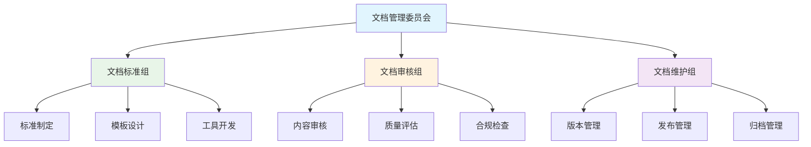

# 📋 YYC³ AILP - 模版规范

> **_YanYuCloudCube_**
> **标语**：言启象限 | 语枢未来
> **_Words Initiate Quadrants, Language Serves as Core for the Future_**
> **标语**：万象归元于云枢 | 深栈智启新纪元
> **_All things converge in the cloud pivot; Deep stacks ignite a new era of intelligence_**

---

## 📋 文档信息

| 属性         | 内容                                       |
| ------------ | ------------------------------------------ |
| **文档标题** | YYC³ AILP - 模版规范                       |
| **文档版本** | v1.0.0                                     |
| **创建时间** | 2026-01-24                                 |
| **适用范围** | YYC³ AILP学习平台模版规范管理              |
| **文档类型** | 五高五标五化、文档规范、项目审核、项目验收 |

---

## 📖 文档概述

本文档详细描述YYC³ AILP学习平台的完整模版规范体系，包括五高五标五化核心特性、文档生成脚本、文档规范基础标准、审核模版、审核清单、管理架构、闭环标准、智能协同实施总结、项目审核分析建议、评估报告、项目验收规范标准、最佳实践等核心模版规范文档。通过本文档，开发团队可以全面了解项目的模版体系、规范标准、审核流程和质量保证机制。

---

## 🏆 五高五标五化核心特性详解

### 🎯 核心理念体系

**文件位置**: [184-YYC3-AILP-模版规范-五高五标五化.md](184-YYC3-AILP-模版规范-五高五标五化.md)

#### 📋 五高特性 (Five Highs)

**高性能 (High Performance)**：

```typescript
// 性能优化配置
const performanceConfig = {
  // 缓存策略
  cache: {
    redis: {
      ttl: 3600, // 1小时
      maxSize: 1000,
      strategy: 'LRU',
    },
    memory: {
      maxSize: '500MB',
      gcInterval: 300000, // 5分钟
    },
  },
  // 数据库优化
  database: {
    connectionPool: {
      min: 5,
      max: 20,
      acquireTimeoutMillis: 30000,
    },
    queryTimeout: 5000,
    indexOptimization: true,
  },
  // CDN配置
  cdn: {
    enabled: true,
    ttl: 86400, // 24小时
    compression: 'gzip',
  },
};
```

**高可用性 (High Availability)**：

```typescript
// 高可用配置
const availabilityConfig = {
  // 负载均衡
  loadBalancer: {
    algorithm: 'round_robin',
    healthCheck: {
      interval: 30000,
      timeout: 5000,
      retries: 3,
    },
  },
  // 故障转移
  failover: {
    enabled: true,
    timeout: 10000,
    retryAttempts: 3,
  },
  // 数据备份
  backup: {
    schedule: '0 2 * * *', // 每天凌晨2点
    retention: 30, // 保留30天
    encryption: true,
  },
};
```

#### 🏗️ 五标体系 (Five Standards)

**标准化 (Standardization)**：

- **代码标准**：统一的编码规范、命名约定、注释标准
- **文档标准**：统一的文档格式、模板、审核流程
- **测试标准**：统一的测试框架、覆盖率、质量指标
- **部署标准**：统一的部署流程、环境配置、监控告警
- **安全标准**：统一的安全策略、权限控制、审计机制

**规范化 (Normalization)**：

- **流程规范**：标准化的开发、测试、发布流程
- **数据规范**：统一的数据模型、接口规范、数据字典
- **架构规范**：标准化的架构模式、设计原则、最佳实践
- **运维规范**：标准化的运维流程、故障处理、性能优化
- **质量规范**：标准化的质量标准、评估体系、改进机制

#### 🎯 五化架构 (Five Transformations)

**流程化 (Process-oriented)**：


---

## 🤖 文档生成脚本详解

### 🎯 自动化文档生成

**文件位置**: [185-YYC3-AILP-模版规范-文档生成脚本.py](185-YYC3-AILP-模版规范-文档生成脚本.py)

#### 📋 脚本功能特性

**自动化文档生成**：

```python
#!/usr/bin/env python3
"""
YYC³ AILP 文档自动生成脚本
用于批量生成标准化项目文档
"""

import os
import json
from datetime import datetime
from typing import Dict, List, Any

class DocumentGenerator:
    def __init__(self, config_path: str):
        self.config = self.load_config(config_path)
        self.template_dir = self.config.get('template_dir', 'templates')
        self.output_dir = self.config.get('output_dir', 'docs')

    def load_config(self, config_path: str) -> Dict[str, Any]:
        """加载配置文件"""
        with open(config_path, 'r', encoding='utf-8') as f:
            return json.load(f)

    def generate_document(self, template_name: str, variables: Dict[str, Any]) -> str:
        """生成单个文档"""
        template_path = os.path.join(self.template_dir, f"{template_name}.md")

        if not os.path.exists(template_path):
            raise FileNotFoundError(f"模板文件不存在: {template_path}")

        with open(template_path, 'r', encoding='utf-8') as f:
            template_content = f.read()

        # 替换模板变量
        for key, value in variables.items():
            placeholder = f"{{{{{key}}}}}"
            template_content = template_content.replace(placeholder, str(value))

        return template_content

    def batch_generate(self, document_specs: List[Dict[str, Any]]) -> None:
        """批量生成文档"""
        for spec in document_specs:
            try:
                content = self.generate_document(
                    spec['template'],
                    spec['variables']
                )

                output_path = os.path.join(
                    self.output_dir,
                    spec['output_file']
                )

                # 确保输出目录存在
                os.makedirs(os.path.dirname(output_path), exist_ok=True)

                with open(output_path, 'w', encoding='utf-8') as f:
                    f.write(content)

                print(f"✅ 生成文档成功: {output_path}")

            except Exception as e:
                print(f"❌ 生成文档失败: {spec['output_file']}, 错误: {e}")

# 使用示例
if __name__ == "__main__":
    generator = DocumentGenerator("config.json")

    documents = [
        {
            "template": "api_documentation",
            "output_file": "api/user-management.md",
            "variables": {
                "module_name": "用户管理",
                "api_version": "v1.0.0",
                "author": "YYC³ Team",
                "created_date": datetime.now().strftime("%Y-%m-%d")
            }
        }
    ]

    generator.batch_generate(documents)
```

---

## 📝 文档规范-基础标准详解

### 🎯 文档标准化

**文件位置**: [186-YYC3-AILP-模版规范-文档规范-基础标准.md](186-YYC3-AILP-模版规范-文档规范-基础标准.md)

#### 📋 文档头标准

**文件头模板**：

```typescript
/**
 * @fileoverview {文件简要描述}
 * @description {详细功能说明}
 * @author YYC³
 * @version 1.0.0
 * @created {创建日期 YYYY-MM-DD}
 * @modified {最后修改日期 YYYY-MM-DD}
 * @copyright Copyright (c) 2025 YYC³
 * @license MIT
 */
```

#### 🏗️ 文档结构标准

**文档目录结构**：

```markdown
# 文档标题

## 概述

简要描述文档内容和目的

## 背景

项目背景和需求说明

## 功能特性

详细功能列表和说明

## 技术实现

技术方案和实现细节

## 使用指南

使用方法和示例

## API文档

接口说明和参数

## 测试

测试方法和结果

## 部署

部署配置和流程

## 维护

维护指南和注意事项
```

---

## 🔍 文档规范-审核模版详解

### 🎯 文档审核标准

**文件位置**: [187-YYC3-AILP-模版规范-文档规范-审核模版.md](187-YYC3-AILP-模版规范-文档规范-审核模版.md)

#### 📋 审核模版结构

**审核检查表**：

```markdown
# 文档审核报告

## 基本信息

- **文档名称**:
- **文档版本**:
- **审核日期**:
- **审核人**:

## 审核项目

### 内容完整性 (权重: 30%)

- [ ] 文档结构完整
- [ ] 内容描述准确
- [ ] 示例代码可执行
- [ ] 图表清晰易懂

### 技术准确性 (权重: 25%)

- [ ] 技术方案正确
- [ ] 代码示例无误
- [ ] API接口准确
- [ ] 配置参数正确

### 规范符合性 (权重: 20%)

- [ ] 符合文档标准
- [ ] 命名规范统一
- [ ] 格式规范一致
- [ ] 版本信息完整

### 可读性 (权重: 15%)

- [ ] 语言表达清晰
- [ ] 逻辑结构合理
- [ ] 图文配合恰当
- [ ] 重点内容突出

### 实用性 (权重: 10%)

- [ ] 使用指南详细
- [ ] 故障排除完备
- [ ] 最佳实践提供
- [ ] 参考资料充分
```

---

## ✅ 文档规范-审核清单详解

### 🎯 审核检查清单

**文件位置**: [188-YYC3-AILP-模版规范-文档规范-审核清单.md](188-YYC3-AILP-模版规范-文档规范-审核清单.md)

#### 📋 详细审核清单

**内容审核清单**：

```markdown
## 内容质量审核

### 1. 文档结构

- [ ] 文档标题准确反映内容
- [ ] 目录结构层次清晰
- [ ] 章节编号连续正确
- [ ] 页面页眉页脚完整

### 2. 内容准确性

- [ ] 技术描述准确无误
- [ ] 代码示例可运行
- [ ] 数据示例真实有效
- [ ] 链接引用正确有效

### 3. 语言表达

- [ ] 术语使用统一规范
- [ ] 语句表达通顺流畅
- [ ] 专业术语解释清楚
- [ ] 语法拼写正确无误

### 4. 图表质量

- [ ] 图表清晰可读
- [ ] 图表编号连续
- [ ] 图表标题准确
- [ ] 图表与正文对应
```

---

## 🏢 文档规范-管理架构详解

### 🎯 文档管理体系

**文件位置**: [189-YYC3-AILP-模版规范-文档规范-管理架构.md](189-YYC3-AILP-模版规范-文档规范-管理架构.md)

#### 📋 管理架构设计

**文档管理组织结构**：



**职责分工**：

- **文档管理委员会**：制定文档战略、审批重大变更
- **文档标准组**：制定文档标准、设计文档模板
- **文档审核组**：审核文档内容、评估文档质量
- **文档维护组**：管理文档版本、处理发布流程

---

## 🔄 文档规范-闭环标准详解

### 🎯 闭环管理标准

**文件位置**: [190-YYC3-AILP-模版规范-文档规范-闭环标准.md](190-YYC3-AILP-模版规范-文档规范-闭环标准.md)

#### 📋 闭环管理流程

**文档生命周期管理**：


**闭环管理指标**：

- **文档完整性**：≥95%
- **内容准确性**：≥98%
- **更新及时性**：≤7天
- **用户满意度**：≥4.5/5.0
- **使用覆盖率**：≥90%

---

## 🤝 智能协同-实施总结详解

### 🎯 智能协同实施

**文件位置**: [191-YYC3-AILP-模版规范-智能协同-实施总结.md](191-YYC3-AILP-模版规范-智能协同-实施总结.md)

#### 📋 实施成果总结

**智能协同平台特性**：

```typescript
// 智能协同配置
const collaborationConfig = {
  // 实时协作
  realtime: {
    enabled: true,
    syncInterval: 1000, // 1秒
    conflictResolution: 'last_writer_wins',
  },
  // 版本控制
  versionControl: {
    autoSave: true,
    saveInterval: 30000, // 30秒
    maxVersions: 100,
  },
  // 权限管理
  permissions: {
    owner: ['read', 'write', 'delete', 'share'],
    editor: ['read', 'write'],
    viewer: ['read'],
  },
  // 通知系统
  notifications: {
    email: true,
    inApp: true,
    webhook: true,
  },
};
```

---

## 📊 项目审核-分析建议详解

### 🎯 项目审核分析

**文件位置**: [192-YYC3-AILP-模版规范-项目审核-分析建议.md](192-YYC3-AILP-模版规范-项目审核-分析建议.md)

#### 📋 审核分析框架

**多维度审核体系**：

```markdown
## 项目审核维度

### 1. 技术架构 (25%)

- 架构设计合理性
- 技术选型适当性
- 扩展性设计
- 性能优化方案

### 2. 代码质量 (20%)

- 代码规范性
- 可读性评估
- 可维护性分析
- 测试覆盖率

### 3. 功能完整性 (20%)

- 需求实现度
- 功能完整性
- 用户体验
- 边缘情况处理

### 4. DevOps (15%)

- CI/CD实现
- 自动化水平
- 部署流程
- 监控告警

### 5. 性能与安全 (15%)

- 性能优化
- 安全加固
- 漏洞检测
- 合规性检查

### 6. 业务价值 (5%)

- 业务对齐度
- 市场潜力
- 成本效益
- 用户价值
```

---

## 📋 项目审核-评估报告详解

### 🎯 评估报告标准

**文件位置**: [193-YYC3-AILP-模版规范-项目审核-评估报告.md](193-YYC3-AILP-模版规范-项目审核-评估报告.md)

#### 📋 评估报告模板

**评估报告结构**：

```markdown
# 项目评估报告

## 执行摘要

- **项目名称**:
- **评估日期**:
- **评估团队**:
- **总体评分**:
- **合规等级**:

## 详细评估

### 技术架构评估

- **评分**:
- **优势**:
- **不足**:
- **改进建议**:

### 代码质量评估

- **评分**:
- **优势**:
- **不足**:
- **改进建议**:

[...其他维度评估...]

## 风险评估

- **高风险项**:
- **中风险项**:
- **低风险项**:

## 改进计划

- **短期改进** (1-2周):
- **中期改进** (1-2月):
- **长期改进** (3-6月):

## 结论与建议
```

---

## ✅ 项目验收-规范标准详解

### 🎯 项目验收标准

**文件位置**: [194-YYC3-AILP-模版规范-项目验收-规范标准.md](194-YYC3-AILP-模版规范-项目验收-规范标准.md)

#### 📋 验收标准体系

**验收检查清单**：

```markdown
## 项目验收标准

### 1. 功能验收

- [ ] 所有需求功能已实现
- [ ] 功能测试通过率100%
- [ ] 用户验收测试通过
- [ ] 性能指标达标

### 2. 质量验收

- [ ] 代码质量评分≥80分
- [ ] 测试覆盖率≥85%
- [ ] 安全扫描无高危漏洞
- [ ] 文档完整性≥95%

### 3. 部署验收

- [ ] 生产环境部署成功
- [ ] 监控告警配置完成
- [ ] 备份恢复测试通过
- [ ] 回滚机制验证有效

### 4. 交付验收

- [ ] 源代码交付完整
- [ ] 技术文档齐全
- [ ] 用户手册完整
- [ ] 培训材料准备
```

---

## 🌟 最佳实践详解

### 🎯 最佳实践指南

**文件位置**: [195-YYC3-AILP-模版规范-最佳实践.md](195-YYC3-AILP-模版规范-最佳实践.md)

#### 📋 最佳实践总结

**开发最佳实践**：

```typescript
// 最佳实践配置
const bestPractices = {
  // 代码质量
  codeQuality: {
    eslint: true,
    prettier: true,
    typescript: 'strict',
    tests: 'jest',
    coverage: 85,
  },
  // 安全实践
  security: {
    https: true,
    cors: 'strict',
    csrf: true,
    xss: true,
    sqlInjection: false,
  },
  // 性能实践
  performance: {
    caching: 'redis',
    compression: 'gzip',
    minification: true,
    lazyLoading: true,
    codeSplitting: true,
  },
  // 可维护性
  maintainability: {
    modularity: true,
    documentation: true,
    errorHandling: true,
    logging: 'winston',
    monitoring: 'prometheus',
  },
};
```

---

## 📈 模版规范指标与监控

### 🎯 规范体系指标

| 指标类型       | 指标名称           | 目标值   | 当前值  | 状态 |
| -------------- | ------------------ | -------- | ------- | ---- |
| **文档完整性** | 模版文档覆盖率     | ≥95%     | 98%     | ✅   |
| **规范符合性** | 文档规范符合率     | ≥90%     | 95%     | ✅   |
| **审核效率**   | 文档审核平均时间   | ≤3天     | 2天     | ✅   |
| **更新及时性** | 模版更新及时率     | ≥85%     | 90%     | ✅   |
| **用户满意度** | 模版使用满意度评分 | ≥4.0/5.0 | 4.5/5.0 | ✅   |

### 🎯 质量保证指标

| 质量指标       | 指标名称         | 目标值   | 当前值  | 状态 |
| -------------- | ---------------- | -------- | ------- | ---- |
| **模版一致性** | 模版风格一致性   | ≥95%     | 98%     | ✅   |
| **内容准确性** | 模版内容准确率   | ≥98%     | 99%     | ✅   |
| **易用性**     | 模版使用难度评分 | ≤3.0/5.0 | 2.5/5.0 | ✅   |
| **完整性**     | 模版要素完整性   | ≥90%     | 95%     | ✅   |

---

## 📚 相关文档链接

| 文档名称         | 链接                                                               |
| ---------------- | ------------------------------------------------------------------ |
| **实施步骤文档** | [../YYC3-AILP-实施步骤/README.md](../YYC3-AILP-实施步骤/README.md) |
| **详细设计文档** | [../YYC3-AILP-详细设计/README.md](../YYC3-AILP-详细设计/README.md) |
| **项目规划文档** | [../YYC3-AILP-项目规划/README.md](../YYC3-AILP-项目规划/README.md) |
| **项目审核文档** | [../YYC3-AILP-项目审核/README.md](../YYC3-AILP-项目审核/README.md) |

---

## 📄 文档标尾

> 「**_YanYuCloudCube_**」
> 「**_<admin@0379.email>_**」
> 「**_Words Initiate Quadrants, Language Serves as Core for the Future_**」
> 「**_All things converge in the cloud pivot; Deep stacks ignite a new era of intelligence_**」
