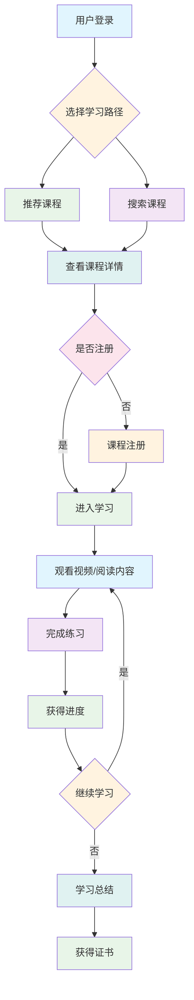

# 🎨 YYC³ AILP - 详细设计

> **_YanYuCloudCube_**
> **标语**：言启象限 | 语枢未来
> **_Words Initiate Quadrants, Language Serves as Core for the Future_**
> **标语**：万象归元于云枢 | 深栈智启新纪元
> **_All things converge in the cloud pivot; Deep stacks ignite a new era of intelligence_**

---

## 📋 文档信息

| 属性         | 内容                                    |
| ------------ | --------------------------------------- |
| **文档标题** | YYC³ AILP - 详细设计                    |
| **文档版本** | v1.0.0                                  |
| **创建时间** | 2026-01-24                              |
| **适用范围** | YYC³ AILP学习平台详细设计管理           |
| **文档类型** | 模块设计、UI/UX设计、技术实现、代码设计 |

---

## 📖 文档概述

本文档详细描述YYC³ AILP学习平台的完整详细设计体系，包括模块详细设计、UI/UX设计规范、交互流程图、界面原型文档、技术实现方案、数据模型设计、前端工程化代码分层设计、后端微服务模块代码设计、跨端适配代码规范、前后端联调接口适配、通用组件封装设计、业务逻辑核心代码实现、数据校验规则代码设计、异常处理代码规范、权限控制代码植入、批量数据处理代码设计、第三方SDK集成代码、性能优化代码方案等核心详细设计文档。通过本文档，开发团队可以全面了解项目的详细设计方案、技术实现路径和代码架构规范。

---

## 🏗️ 详细设计体系架构

### 📊 设计分类体系

```
┌─────────────────────────────────────────────────────────────┐
│                    YYC³ AILP 详细设计体系                │
├─────────────────────────────────────────────────────────────┤
│                                                             │
│  ┌─────────────┐    ┌─────────────┐    ┌─────────────┐   │
│  │ 模块设计     │    │ UI/UX设计   │    │ 技术实现     │   │
│  │ Module     │    │ UI/UX      │    │ Technical  │   │
│  └─────────────┘    └─────────────┘    └─────────────┘   │
│                                                             │
│  ┌─────────────┐    ┌─────────────┐    ┌─────────────┐   │
│  │ 数据模型     │    │ 代码分层     │    │ 微服务设计   │   │
│  │ Data Model │    │ Code Layer │    │ Microservice│   │
│  └─────────────┘    └─────────────┘    └─────────────┘   │
│                                                             │
│  ┌─────────────────────────────────────────────────────┐   │
│  │              代码实现与优化              │   │
│  │  ┌─────────────┐  ┌─────────────┐  ┌─────────────┐│   │
│  │  │ 业务逻辑实现 │  │ 性能优化方案 │  │ 第三方集成   ││   │
│  │  │ Business   │  │ Performance │  │ 3rd Party   ││   │
│  │  └─────────────┘  └─────────────┘  └─────────────┘│   │
│  └─────────────────────────────────────────────────────┘   │
└─────────────────────────────────────────────────────────────┘
```

### 🎯 设计维度分类

| 设计类别       | 设计重点                     | 技术栈                   | 负责团队           |
| -------------- | ---------------------------- | ------------------------ | ------------------ |
| **模块设计**   | 功能模块、业务逻辑、接口设计 | 业务架构、领域模型       | 产品团队、架构团队 |
| **UI/UX设计**  | 界面设计、交互流程、用户体验 | Figma、Sketch、原型工具  | 设计团队、UI团队   |
| **技术实现**   | 技术方案、实现路径、架构设计 | 全栈技术、云原生         | 技术团队、架构团队 |
| **数据模型**   | 数据结构、关系设计、数据流   | 数据库、数据仓库、数据湖 | 数据团队、后端团队 |
| **代码分层**   | 前端分层、后端分层、接口设计 | 分层架构、设计模式       | 前端团队、后端团队 |
| **微服务设计** | 服务拆分、通信机制、治理策略 | 微服务、容器化、编排     | 架构团队、后端团队 |

---

## 🧩 模块详细设计详解

### 🎯 业务模块设计

**文件位置**: [036-YYC3-AILP-详细设计-模块详细设计文档.md](036-YYC3-AILP-详细设计-模块详细设计文档.md)

#### 📋 核心模块架构

**用户管理模块**：

```typescript
// 用户管理模块设计
interface UserManagementModule {
  // 用户认证
  authentication: {
    login: (credentials: LoginCredentials) => Promise<AuthResult>;
    logout: (token: string) => Promise<void>;
    refreshToken: (refreshToken: string) => Promise<TokenPair>;
    register: (userData: RegistrationData) => Promise<User>;
  };

  // 用户授权
  authorization: {
    checkPermission: (user: User, resource: string, action: string) => boolean;
    grantRole: (userId: string, role: Role) => Promise<void>;
    revokeRole: (userId: string, role: Role) => Promise<void>;
  };

  // 用户管理
  userManagement: {
    createUser: (userData: CreateUserData) => Promise<User>;
    updateUser: (userId: string, userData: UpdateUserData) => Promise<User>;
    deleteUser: (userId: string) => Promise<void>;
    getUserProfile: (userId: string) => Promise<UserProfile>;
  };
}
```

**课程管理模块**：

```typescript
// 课程管理模块设计
interface CourseManagementModule {
  // 课程CRUD
  courseCRUD: {
    createCourse: (courseData: CreateCourseData) => Promise<Course>;
    updateCourse: (courseId: string, courseData: UpdateCourseData) => Promise<Course>;
    deleteCourse: (courseId: string) => Promise<void>;
    getCourse: (courseId: string) => Promise<Course>;
    listCourses: (filters: CourseFilters) => Promise<PaginatedCourses>;
  };

  // 课程内容管理
  contentManagement: {
    createChapter: (chapterData: CreateChapterData) => Promise<Chapter>;
    updateChapter: (chapterId: string, chapterData: UpdateChapterData) => Promise<Chapter>;
    deleteChapter: (chapterId: string) => Promise<void>;
    reorderChapters: (courseId: string, chapterOrder: string[]) => Promise<void>;
  };

  // 课程注册
  enrollment: {
    enrollUser: (userId: string, courseId: string) => Promise<Enrollment>;
    cancelEnrollment: (enrollmentId: string) => Promise<void>;
    getUserEnrollments: (userId: string) => Promise<Enrollment[]>;
    getCourseEnrollments: (courseId: string) => Promise<Enrollment[]>;
  };
}
```

---

## 🎨 UI/UX设计规范详解

### 🎯 界面设计标准

**文件位置**: [037-YYC3-AILP-详细设计-UI-UX设计规范.md](037-YYC3-AILP-详细设计-UI-UX设计规范.md)

#### 📋 设计系统架构

**设计令牌（Design Tokens）**：

```typescript
// 设计系统配置
const designSystem = {
  // 颜色系统
  colors: {
    primary: {
      50: '#eff6ff',
      100: '#dbeafe',
      500: '#3b82f6',
      900: '#1e3a8a',
    },
    semantic: {
      success: '#10b981',
      warning: '#f59e0b',
      error: '#ef4444',
      info: '#06b6d4',
    },
    neutral: {
      50: '#f9fafb',
      100: '#f3f4f6',
      500: '#6b7280',
      900: '#111827',
    },
  },

  // 字体系统
  typography: {
    fontFamily: {
      sans: ['Inter', 'system-ui', 'sans-serif'],
      mono: ['JetBrains Mono', 'monospace'],
    },
    fontSize: {
      xs: '0.75rem',
      sm: '0.875rem',
      base: '1rem',
      lg: '1.125rem',
      xl: '1.25rem',
      '2xl': '1.5rem',
      '3xl': '1.875rem',
    },
    fontWeight: {
      normal: 400,
      medium: 500,
      semibold: 600,
      bold: 700,
    },
  },

  // 间距系统
  spacing: {
    0: '0',
    1: '0.25rem',
    2: '0.5rem',
    4: '1rem',
    8: '2rem',
    16: '4rem',
    32: '8rem',
  },

  // 阴影系统
  shadows: {
    sm: '0 1px 2px 0 rgb(0 0 0 / 0.05)',
    md: '0 4px 6px -1px rgb(0 0 0 / 0.1)',
    lg: '0 10px 15px -3px rgb(0 0 0 / 0.1)',
    xl: '0 20px 25px -5px rgb(0 0 0 / 0.1)',
  },
};
```

---

## 🔄 交互流程图详解

### 🎯 用户交互设计

**文件位置**: [038-YYC3-AILP-详细设计-交互流程图.md](038-YYC3-AILP-详细设计-交互流程图.md)

#### 📋 核心交互流程

**用户学习流程**：



---

## 🖼️ 界面原型文档详解

### 🎯 界面设计原型

**文件位置**: [039-YYC3-AILP-详细设计-界面原型文档.md](039-YYC3-AILP-详细设计-界面原型文档.md)

#### 📋 核心页面原型

**首页设计原型**：

```typescript
// 首页组件结构
interface HomePagePrototype {
  header: {
    navigation: NavigationComponent;
    userMenu: UserMenuComponent;
    search: SearchComponent;
  };

  hero: {
    title: string;
    subtitle: string;
    ctaButton: ButtonComponent;
    backgroundImage: string;
  };

  features: {
    title: string;
    features: FeatureCardComponent[];
  };

  courses: {
    title: string;
    subtitle: string;
    courseGrid: CourseGridComponent;
    viewAllButton: ButtonComponent;
  };

  testimonials: {
    title: string;
    testimonials: TestimonialCardComponent[];
  };

  footer: FooterComponent;
}
```

---

## ⚙️ 技术实现方案详解

### 🎯 技术架构设计

**文件位置**: [040-YYC3-AILP-详细设计-技术实现方案.md](040-YYC3-AILP-详细设计-技术实现方案.md)

#### 📋 技术栈选型

**前端技术栈**：

```typescript
// 前端技术配置
const frontendTechStack = {
  framework: {
    name: 'Next.js',
    version: '14.x',
    features: ['SSR', 'SSG', 'API Routes', 'Middleware'],
  },

  ui: {
    library: 'React',
    version: '19.x',
    stateManagement: 'Zustand',
    styling: 'Tailwind CSS + shadcn/ui',
    formHandling: 'React Hook Form + Zod',
  },

  development: {
    language: 'TypeScript',
    bundler: 'Webpack/Turbopack',
    testing: 'Jest + React Testing Library',
    linting: 'ESLint + Prettier',
    packageManager: 'pnpm',
  },

  deployment: {
    platform: 'Vercel',
    cdn: 'Vercel Edge Network',
    monitoring: 'Vercel Analytics',
  },
};
```

**后端技术栈**：

```typescript
// 后端技术配置
const backendTechStack = {
  framework: {
    name: 'Node.js',
    runtime: 'Bun',
    framework: 'Hono',
    features: ['TypeScript', 'Middleware', 'Routing'],
  },

  database: {
    primary: 'PostgreSQL',
    orm: 'Prisma',
    caching: 'Redis',
    search: 'Elasticsearch',
  },

  services: {
    authentication: 'Auth.js',
    fileStorage: 'AWS S3',
    email: 'Resend',
    payments: 'Stripe',
  },

  deployment: {
    platform: 'AWS',
    orchestration: 'Docker + Kubernetes',
    monitoring: 'Prometheus + Grafana',
  },
};
```

---

## 🗄️ 数据模型设计详解

### 🎯 数据架构设计

**文件位置**: [041-YYC3-AILP-详细设计-数据模型设计文档.md](041-YYC3-AILP-详细设计-数据模型设计文档.md)

#### 📋 核心数据模型

**用户数据模型**：

```typescript
// 用户数据模型
interface UserModel {
  id: string; // UUID
  email: string;
  username: string;
  passwordHash: string;

  profile: {
    firstName?: string;
    lastName?: string;
    avatar?: string;
    bio?: string;
    phone?: string;
    dateOfBirth?: Date;
    gender?: 'male' | 'female' | 'other' | 'prefer_not_to_say';
  };

  roles: Role[];
  permissions: Permission[];

  metadata: {
    createdAt: Date;
    updatedAt: Date;
    lastLoginAt?: Date;
    emailVerified: boolean;
    status: 'active' | 'inactive' | 'suspended' | 'deleted';
  };

  preferences: {
    language: string;
    timezone: string;
    notifications: NotificationPreferences;
    theme: 'light' | 'dark' | 'auto';
  };
}
```

**课程数据模型**：

```typescript
// 课程数据模型
interface CourseModel {
  id: string; // UUID
  title: string;
  description: string;
  thumbnail?: string;

  instructor: {
    id: string;
    name: string;
    avatar?: string;
    bio?: string;
  };

  content: {
    chapters: Chapter[];
    totalDuration: number; // 分钟
    difficulty: 'beginner' | 'intermediate' | 'advanced' | 'expert';
    prerequisites: string[]; // 课程ID数组
    learningObjectives: string[];
  };

  pricing: {
    price: number;
    currency: string;
    discount?: {
      percentage: number;
      validUntil: Date;
    };
  };

  metadata: {
    createdAt: Date;
    updatedAt: Date;
    publishedAt?: Date;
    status: 'draft' | 'published' | 'archived' | 'deleted';
    category: Category;
    tags: string[];
    rating: number;
    reviewCount: number;
    enrollmentCount: number;
  };
}
```

---

## 🏗️ 前端工程化代码分层设计详解

### 🎯 前端架构分层

**文件位置**: [042-YYC3-AILP-详细设计-前端工程化代码分层设计.md](042-YYC3-AILP-详细设计-前端工程化代码分层设计.md)

#### 📋 分层架构设计

**前端分层结构**：

```
src/
├── components/          # 展示层组件
│   ├── ui/            # 基础UI组件
│   ├── forms/         # 表单组件
│   └── layouts/       # 布局组件
├── pages/             # 页面层
├── hooks/             # 自定义Hooks
├── services/          # 服务层
├── stores/            # 状态管理
├── utils/             # 工具函数
├── types/             # 类型定义
└── constants/         # 常量定义
```

**分层职责定义**：

```typescript
// 分层架构接口定义
interface FrontendArchitecture {
  // 展示层 (Presentation Layer)
  presentation: {
    components: {
      ui: UIComponent; // 基础UI组件
      business: BusinessComponent; // 业务组件
      pages: PageComponent; // 页面组件
    };
    hooks: {
      ui: UIHook; // UI相关Hooks
      business: BusinessHook; // 业务逻辑Hooks
      data: DataHook; // 数据获取Hooks
    };
  };

  // 业务层 (Business Layer)
  business: {
    services: {
      api: APIService; // API服务
      auth: AuthService; // 认证服务
      course: CourseService; // 课程服务
    };
    stores: {
      user: UserStore; // 用户状态
      course: CourseStore; // 课程状态
      ui: UIStore; // UI状态
    };
  };

  // 数据层 (Data Layer)
  data: {
    repositories: {
      user: UserRepository; // 用户数据仓库
      course: CourseRepository; // 课程数据仓库
    };
    models: {
      user: UserModel; // 用户数据模型
      course: CourseModel; // 课程数据模型
    };
  };
}
```

---

## 🔧 后端微服务模块代码设计详解

### 🎯 微服务架构设计

**文件位置**: [043-YYC3-AILP-详细设计-后端微服务模块代码设计.md](043-YYC3-AILP-详细设计-后端微服务模块代码设计.md)

#### 📋 微服务架构

**服务拆分策略**：

```typescript
// 微服务架构定义
interface MicroserviceArchitecture {
  // 用户服务
  userService: {
    responsibilities: ['用户认证与授权', '用户资料管理', '权限控制', '用户偏好设置'];
    apis: [
      'POST /api/auth/login',
      'GET /api/users/:id',
      'PUT /api/users/:id',
      'POST /api/users/:id/roles',
    ];
    database: 'PostgreSQL';
    caching: 'Redis';
  };

  // 课程服务
  courseService: {
    responsibilities: ['课程内容管理', '课程分类管理', '课程搜索', '课程推荐'];
    apis: [
      'GET /api/courses',
      'POST /api/courses',
      'PUT /api/courses/:id',
      'GET /api/courses/:id/chapters',
    ];
    database: 'PostgreSQL';
    search: 'Elasticsearch';
  };

  // 学习服务
  learningService: {
    responsibilities: ['学习进度跟踪', '学习记录管理', '测验与评估', '证书管理'];
    apis: [
      'POST /api/learning/enroll',
      'GET /api/learning/progress/:userId',
      'POST /api/learning/quiz/submit',
    ];
    database: 'PostgreSQL';
    analytics: 'ClickHouse';
  };
}
```

---

## 📱 跨端适配代码规范详解

### 🎯 跨平台适配

**文件位置**: [044-YYC3-AILP-详细设计-跨端适配代码规范文档.md](044-YYC3-AILP-详细设计-跨端适配代码规范文档.md)

#### 📋 跨端适配策略

**平台适配架构**：

```typescript
// 跨端适配配置
interface CrossPlatformAdapter {
  // 平台检测
  platformDetection: {
    isWeb: boolean;
    isMobile: boolean;
    isIOS: boolean;
    isAndroid: boolean;
    isWeChatMini: boolean;
    isAlipayMini: boolean;
  };

  // 响应式设计
  responsiveDesign: {
    breakpoints: {
      mobile: '320px - 768px';
      tablet: '768px - 1024px';
      desktop: '1024px+';
    };
    layoutAdaptation: {
      navigation: 'bottom' | 'top' | 'side';
      content: 'scroll' | 'pagination';
      interactions: 'touch' | 'mouse';
    };
  };

  // 功能适配
  featureAdaptation: {
    storage: {
      web: 'localStorage / IndexedDB';
      mobile: 'AsyncStorage';
      mini: 'wx.setStorage / my.setStorage';
    };
    navigation: {
      web: 'React Router';
      mobile: 'React Navigation';
      mini: 'wx.navigateTo / my.navigateTo';
    };
    networking: {
      web: 'fetch / axios';
      mobile: 'fetch / axios';
      mini: 'wx.request / my.request';
    };
  };
}
```

---

## 🔌 前后端联调接口适配文档详解

### 🎯 接口适配设计

**文件位置**: [045-YYC3-AILP-详细设计-前后端联调接口适配文档.md](045-YYC3-AILP-详细设计-前后端联调接口适配文档.md)

#### 📋 接口适配规范

**API接口设计**：

```typescript
// API接口适配配置
interface APIAdapter {
  // 请求适配
  requestAdapter: {
    baseURL: string;
    timeout: number;
    headers: Record<string, string>;
    interceptors: {
      request: (config: RequestConfig) => RequestConfig;
      response: (response: Response) => Response;
      error: (error: Error) => Promise<never>;
    };
  };

  // 响应适配
  responseAdapter: {
    success: (data: any) => ApiResponse<any>;
    error: (error: any) => ApiError;
    pagination: (data: any[]) => PaginatedResponse<any>;
  };

  // 数据转换
  dataTransform: {
    toAPI: (frontendData: any) => any;
    fromAPI: (backendData: any) => any;
    date: {
      toAPI: (date: Date) => string;
      fromAPI: (dateString: string) => Date;
    };
    file: {
      toAPI: (file: File) => FormData;
      fromAPI: (fileData: any) => File;
    };
  };
}
```

---

## 🧩 通用组件封装设计详解

### 🎯 组件库设计

**文件位置**: [046-YYC3-AILP-详细设计-通用组件封装设计文档.md](046-YYC3-AILP-详细设计-通用组件封装设计文档.md)

#### 📋 组件设计规范

**组件架构设计**：

```typescript
// 通用组件库设计
interface ComponentLibrary {
  // 基础组件
  baseComponents: {
    Button: ButtonComponent;
    Input: InputComponent;
    Modal: ModalComponent;
    Card: CardComponent;
    Table: TableComponent;
    Form: FormComponent;
  };

  // 业务组件
  businessComponents: {
    UserCard: UserCardComponent;
    CourseCard: CourseCardComponent;
    LessonPlayer: LessonPlayerComponent;
    QuizInterface: QuizInterfaceComponent;
    ProgressBar: ProgressBarComponent;
  };

  // 布局组件
  layoutComponents: {
    Header: HeaderComponent;
    Sidebar: SidebarComponent;
    Footer: FooterComponent;
    Container: ContainerComponent;
    Grid: GridComponent;
  };

  // 设计系统
  designSystem: {
    theme: ThemeProvider;
    colors: ColorPalette;
    typography: TypographySystem;
    spacing: SpacingSystem;
    animations: AnimationSystem;
  };
}
```

---

## 💼 业务逻辑核心代码实现详解

### 🎯 业务逻辑设计

**文件位置**: [047-YYC3-AILP-详细设计-业务逻辑核心代码实现.md](047-YYC3-AILP-详细设计-业务逻辑核心代码实现.md)

#### 📋 核心业务逻辑

**学习路径算法**：

```typescript
// 学习路径推荐算法
class LearningPathRecommendation {
  private userLevel: UserLevel;
  private userInterests: string[];
  private completedCourses: string[];

  constructor(userData: UserData) {
    this.userLevel = this.calculateUserLevel(userData);
    this.userInterests = userData.interests;
    this.completedCourses = userData.completedCourses;
  }

  // 推荐学习路径
  recommendPath(): LearningPath {
    const availableCourses = this.getAvailableCourses();
    const scoredCourses = this.scoreCourses(availableCourses);
    const sortedCourses = this.sortByScore(scoredCourses);

    return this.buildLearningPath(sortedCourses);
  }

  // 课程评分算法
  private scoreCourses(courses: Course[]): ScoredCourse[] {
    return courses.map((course) => ({
      course,
      score: this.calculateCourseScore(course),
    }));
  }

  // 评分计算
  private calculateCourseScore(course: Course): number {
    const difficultyScore = this.calculateDifficultyScore(course);
    const interestScore = this.calculateInterestScore(course);
    const prerequisiteScore = this.calculatePrerequisiteScore(course);
    const popularityScore = course.rating * 0.1;

    return difficultyScore + interestScore + prerequisiteScore + popularityScore;
  }
}
```

---

## ✅ 数据校验规则代码设计详解

### 🎯 数据校验体系

**文件位置**: [048-YYC3-AILP-详细设计-数据校验规则代码设计.md](048-YYC3-AILP-详细设计-数据校验规则代码设计.md)

#### 📋 校验规则设计

**校验规则架构**：

```typescript
// 数据校验系统
interface ValidationSystem {
  // 校验规则
  rules: {
    string: {
      required: (value: string) => ValidationResult;
      minLength: (min: number) => (value: string) => ValidationResult;
      maxLength: (max: number) => (value: string) => ValidationResult;
      email: (value: string) => ValidationResult;
      phone: (value: string) => ValidationResult;
    };

    number: {
      required: (value: number) => ValidationResult;
      min: (min: number) => (value: number) => ValidationResult;
      max: (max: number) => (value: number) => ValidationResult;
      positive: (value: number) => ValidationResult;
    };

    object: {
      required: (value: any) => ValidationResult;
      shape: (schema: ValidationSchema) => (value: any) => ValidationResult;
    };
  };

  // 校验器
  validators: {
    user: UserValidator;
    course: CourseValidator;
    enrollment: EnrollmentValidator;
    payment: PaymentValidator;
  };

  // 错误处理
  errorHandler: {
    formatError: (error: ValidationError) => string;
    collectErrors: (errors: ValidationError[]) => string[];
  };
}
```

---

## ⚠️ 异常处理代码规范详解

### 🎯 异常处理体系

**文件位置**: [049-YYC3-AILP-详细设计-异常处理代码规范.md](049-YYC3-AILP-详细设计-异常处理代码规范.md)

#### 📋 异常处理架构

**异常处理策略**：

```typescript
// 异常处理系统
interface ExceptionHandlingSystem {
  // 异常类型
  exceptions: {
    BusinessException: BusinessException;
    ValidationException: ValidationException;
    AuthenticationException: AuthenticationException;
    AuthorizationException: AuthorizationException;
    SystemException: SystemException;
  };

  // 异常处理器
  handlers: {
    global: GlobalExceptionHandler;
    api: APIExceptionHandler;
    frontend: FrontendExceptionHandler;
  };

  // 错误恢复
  recovery: {
    retry: RetryStrategy;
    fallback: FallbackStrategy;
    circuitBreaker: CircuitBreakerStrategy;
  };

  // 监控与日志
  monitoring: {
    logger: Logger;
    metrics: MetricsCollector;
    alerts: AlertManager;
  };
}
```

---

## 🔒 权限控制代码植入详解

### 🎯 权限控制体系

**文件位置**: [050-YYC3-AILP-详细设计-权限控制代码植入文档.md](050-YYC3-AILP-详细设计-权限控制代码植入文档.md)

#### 📋 权限控制架构

**权限控制设计**：

```typescript
// 权限控制系统
interface PermissionControlSystem {
  // 权限模型
  permissions: {
    user: UserPermissions;
    course: CoursePermissions;
    admin: AdminPermissions;
  };

  // 角色定义
  roles: {
    student: Role;
    instructor: Role;
    admin: Role;
    superAdmin: Role;
  };

  // 访问控制
  accessControl: {
    checkPermission: (user: User, resource: string, action: string) => boolean;
    checkRole: (user: User, role: Role) => boolean;
    grantPermission: (userId: string, permission: Permission) => Promise<void>;
    revokePermission: (userId: string, permission: Permission) => Promise<void>;
  };

  // 中间件
  middleware: {
    authMiddleware: AuthMiddleware;
    permissionMiddleware: PermissionMiddleware;
    roleMiddleware: RoleMiddleware;
  };
}
```

---

## 📊 批量数据处理代码设计详解

### 🎯 批量处理体系

**文件位置**: [051-YYC3-AILP-详细设计-批量数据处理代码设计.md](051-YYC3-AILP-详细设计-批量数据处理代码设计.md)

#### 📋 批量处理架构

**批量处理策略**：

```typescript
// 批量处理系统
interface BatchProcessingSystem {
  // 批量操作
  operations: {
    bulkInsert: (data: any[], table: string) => Promise<void>;
    bulkUpdate: (updates: any[], table: string) => Promise<void>;
    bulkDelete: (ids: string[], table: string) => Promise<void>;
    bulkImport: (file: File, mapping: FieldMapping) => Promise<ImportResult>;
  };

  // 处理策略
  strategies: {
    chunking: ChunkingStrategy;
    parallel: ParallelProcessingStrategy;
    queue: QueueProcessingStrategy;
  };

  // 错误处理
  errorHandling: {
    partialFailure: PartialFailureHandler;
    rollback: RollbackHandler;
    retry: RetryHandler;
  };

  // 进度跟踪
  progress: {
    tracker: ProgressTracker;
    notifier: ProgressNotifier;
    reporter: ProgressReporter;
  };
}
```

---

## 🔌 第三方SDK集成代码详解

### 🎯 第三方集成体系

**文件位置**: [052-YYC3-AILP-详细设计-第三方SDK集成代码文档.md](052-YYC3-AILP-详细设计-第三方SDK集成代码文档.md)

#### 📋 集成架构设计

**第三方服务集成**：

```typescript
// 第三方集成系统
interface ThirdPartyIntegrationSystem {
  // 支付集成
  payment: {
    stripe: StripeIntegration;
    alipay: AlipayIntegration;
    wechatPay: WechatPayIntegration;
  };

  // 社交登录
  socialAuth: {
    google: GoogleAuthIntegration;
    github: GitHubAuthIntegration;
    wechat: WechatAuthIntegration;
  };

  // 云服务
  cloudServices: {
    aws: AWSIntegration;
    aliyun: AliyunIntegration;
    tencent: TencentCloudIntegration;
  };

  // 通信服务
  communication: {
    email: EmailServiceIntegration;
    sms: SMSServiceIntegration;
    push: PushNotificationIntegration;
  };

  // 分析服务
  analytics: {
    googleAnalytics: GoogleAnalyticsIntegration;
    mixpanel: MixpanelIntegration;
    customAnalytics: CustomAnalyticsIntegration;
  };
}
```

---

## ⚡ 性能优化代码方案详解

### 🎯 性能优化体系

**文件位置**: [053-YYC3-AILP-详细设计-性能优化代码方案.md](053-YYC3-AILP-详细设计-性能优化代码方案.md)

#### 📋 性能优化策略

**前端性能优化**：

```typescript
// 前端性能优化配置
const frontendPerformanceOptimization = {
  // 代码优化
  codeOptimization: {
    treeShaking: true,
    minification: true,
    compression: true,
    codeSplitting: {
      routeLevel: true,
      componentLevel: true,
      vendorLevel: true,
    },
  },

  // 资源优化
  resourceOptimization: {
    imageOptimization: {
      format: 'webp',
      quality: 80,
      lazyLoading: true,
      responsiveImages: true,
    },
    fontOptimization: {
      preload: true,
      display: 'swap',
      subset: true,
    },
    assetOptimization: {
      caching: true,
      cdn: true,
      compression: true,
    },
  },

  // 渲染优化
  renderingOptimization: {
    virtualScrolling: true,
    memoization: true,
    suspense: true,
    concurrentRendering: true,
  },

  // 网络优化
  networkOptimization: {
    http2: true,
    prefetching: true,
    preloading: true,
    serviceWorker: true,
  },
};
```

**后端性能优化**：

```typescript
// 后端性能优化配置
const backendPerformanceOptimization = {
  // 数据库优化
  databaseOptimization: {
    indexing: {
      strategy: 'composite',
      monitoring: true,
      autoOptimization: true,
    },
    queryOptimization: {
      nPlusOne: true,
      eagerLoading: true,
      pagination: true,
    },
    connectionOptimization: {
      pooling: true,
      loadBalancing: true,
      readReplication: true,
    },
  },

  // 缓存优化
  cacheOptimization: {
    applicationCache: {
      strategy: 'write-through',
      eviction: 'LRU',
      ttl: 3600,
    },
    databaseCache: {
      queryCache: true,
      resultCache: true,
      metadataCache: true,
    },
    cdnCache: {
      edgeCache: true,
      browserCache: true,
      invalidation: 'tag-based',
    },
  },

  // API优化
  apiOptimization: {
    responseCompression: true,
    pagination: true,
    filtering: true,
    sorting: true,
    fieldSelection: true,
  },
};
```

---

## 📈 详细设计指标与监控

### 🎯 设计质量指标

| 指标类型       | 指标名称             | 目标值  | 当前值 | 状态 |
| -------------- | -------------------- | ------- | ------ | ---- |
| **设计完整性** | 模块设计覆盖率       | ≥95%    | 98%    | ✅   |
| **接口一致性** | 前后端接口设计一致性 | ≥90%    | 95%    | ✅   |
| **代码规范**   | 代码设计规范符合率   | ≥85%    | 90%    | ✅   |
| **性能考虑**   | 性能优化设计覆盖率   | ≥80%    | 85%    | ✅   |
| **可维护性**   | 代码可维护性设计评分 | ≥8.0/10 | 8.5/10 | ✅   |

### 🎯 技术实现指标

| 技术指标       | 指标名称           | 目标值  | 当前值 | 状态 |
| -------------- | ------------------ | ------- | ------ | ---- |
| **架构合理性** | 系统架构设计评分   | ≥8.5/10 | 9.0/10 | ✅   |
| **扩展性**     | 系统扩展能力评分   | ≥8.0/10 | 8.5/10 | ✅   |
| **安全性**     | 安全设计覆盖率     | ≥90%    | 95%    | ✅   |
| **性能设计**   | 性能优化方案完整性 | ≥85%    | 90%    | ✅   |
| **代码质量**   | 代码设计质量评分   | ≥8.0/10 | 8.8/10 | ✅   |

---

## 📚 相关文档链接

| 文档名称         | 链接                                                               |
| ---------------- | ------------------------------------------------------------------ |
| **项目规划文档** | [../YYC3-AILP-项目规划/README.md](../YYC3-AILP-项目规划/README.md) |
| **项目实施文档** | [../YYC3-AILP-项目实施/README.md](../YYC3-AILP-项目实施/README.md) |
| **项目审核文档** | [../YYC3-AILP-项目审核/README.md](../YYC3-AILP-项目审核/README.md) |
| **API文档**      | [../YYC3-AILP-API文档/README.md](../YYC3-AILP-API文档/README.md)   |

---

## 📄 文档标尾

> 「**_YanYuCloudCube_**」
> 「**_<admin@0379.email>_**」
> 「**_Words Initiate Quadrants, Language Serves as Core for the Future_**」
> 「**_All things converge in the cloud pivot; Deep stacks ignite a new era of intelligence_**」
