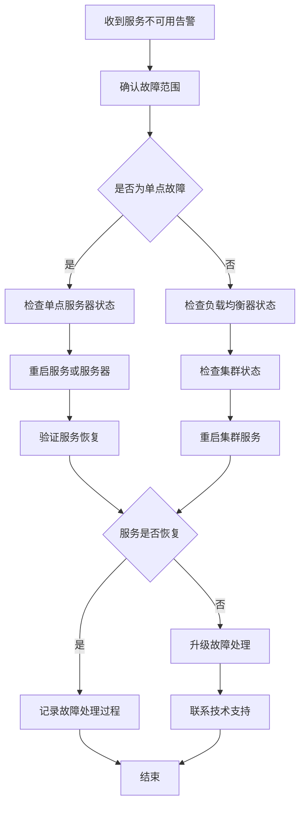
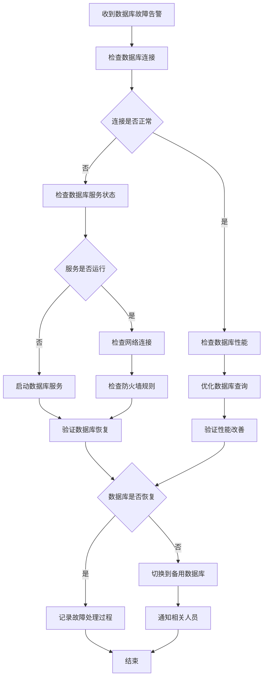

> **_YanYuCloudCube_**
> **标语**：言启象限 | 语枢未来
> **_Words Initiate Quadrants, Language Serves as Core for the Future_**
> **标语**：万象归元于云枢 | 深栈智启新纪元
> **_All things converge in the cloud pivot; Deep stacks ignite a new era of intelligence_**

---

# 144-YYC3-AILP-部署发布-云服务器配置文档

## 概述

本文档详细描述YYC3-YYC3-AILP-部署发布-云服务器配置文档相关内容，确保项目按照YYC³标准规范进行开发和实施。

## 核心内容

### 1. 背景与目标

#### 1.1 项目背景

YYC³(YanYuCloudCube)-「智能教育」项目是一个基于「五高五标五化」理念的智能化应用系统，致力于提供高质量、高可用、高安全的成长守护体系。

#### 1.2 文档目标

- 规范云服务器配置文档相关的业务标准与技术落地要求
- 为项目相关人员提供清晰的参考依据
- 保障相关模块开发、实施、运维的一致性与规范性

### 2. 设计原则

#### 2.1 五高原则

- **高可用性**：确保系统7x24小时稳定运行
- **高性能**：优化响应时间和处理能力
- **高安全性**：保护用户数据和隐私安全
- **高扩展性**：支持业务快速扩展
- **高可维护性**：便于后续维护和升级

#### 2.2 五标体系

- **标准化**：统一的技术和流程标准
- **规范化**：严格的开发和管理规范
- **自动化**：提高开发效率和质量
- **智能化**：利用AI技术提升能力
- **可视化**：直观的监控和管理界面

#### 2.3 五化架构

- **流程化**：标准化的开发流程
- **文档化**：完善的文档体系
- **工具化**：高效的开发工具链
- **数字化**：数据驱动的决策
- **生态化**：开放的生态系统

### 3. 云服务器选型

#### 3.1 云服务提供商选择

| 云服务商 | 优势                     | 劣势                   | 适用场景       | 推荐指数 |
| -------- | ------------------------ | ---------------------- | -------------- | -------- |
| 阿里云   | 国内访问速度快，服务完善 | 国际节点较少，价格偏高 | 主要用户在国内 | ★★★★★    |
| 腾讯云   | 游戏加速优秀，价格适中   | 企业级服务相对较弱     | 游戏类应用     | ★★★★☆    |
| 华为云   | 企业级服务强，安全性高   | 生态相对较弱           | 企业级应用     | ★★★★☆    |
| AWS      | 全球节点多，服务最全     | 国内访问速度一般       | 国际化应用     | ★★★★☆    |
| Azure    | 微软生态集成好           | 国内节点较少           | 微软技术栈     | ★★★☆☆    |

**推荐选择**：阿里云，作为YYC³-AILP项目的主要云服务提供商，兼顾性能、稳定性和服务支持。

#### 3.2 服务器规格选型

##### 3.2.1 应用服务器规格

| 环境          | 实例规格       | vCPU | 内存 | 存储      | 带宽    | 数量 | 用途     |
| ------------- | -------------- | ---- | ---- | --------- | ------- | ---- | -------- |
| 开发环境      | ecs.g6.large   | 2    | 8GB  | 40GB SSD  | 5Mbps   | 1    | 开发测试 |
| 测试环境      | ecs.g6.xlarge  | 4    | 16GB | 100GB SSD | 10Mbps  | 1    | 功能测试 |
| 预生产环境    | ecs.g6.2xlarge | 8    | 32GB | 200GB SSD | 20Mbps  | 2    | 集成测试 |
| 生产环境-应用 | ecs.c6.2xlarge | 8    | 16GB | 200GB SSD | 50Mbps  | 4    | 应用服务 |
| 生产环境-计算 | ecs.g6.4xlarge | 16   | 64GB | 400GB SSD | 50Mbps  | 2    | AI计算   |
| 生产环境-网关 | ecs.c6.xlarge  | 4    | 8GB  | 100GB SSD | 100Mbps | 2    | 负载均衡 |

##### 3.2.2 数据库服务器规格

| 环境          | 实例规格             | vCPU | 内存 | 存储   | IOPS  | 数量 | 用途     |
| ------------- | -------------------- | ---- | ---- | ------ | ----- | ---- | -------- |
| 开发环境      | rds.mysql.s2.large   | 2    | 4GB  | 20GB   | 1000  | 1    | 开发测试 |
| 测试环境      | rds.mysql.s2.xlarge  | 4    | 8GB  | 100GB  | 3000  | 1    | 功能测试 |
| 预生产环境    | rds.mysql.s2.2xlarge | 8    | 16GB | 500GB  | 6000  | 1    | 集成测试 |
| 生产环境-主库 | rds.mysql.s2.4xlarge | 16   | 32GB | 2000GB | 10000 | 1    | 主数据库 |
| 生产环境-从库 | rds.mysql.s2.2xlarge | 8    | 16GB | 2000GB | 8000  | 2    | 从数据库 |

##### 3.2.3 缓存服务器规格

| 环境       | 实例规格                       | vCPU | 内存 | 存储  | 带宽    | 数量 | 用途     |
| ---------- | ------------------------------ | ---- | ---- | ----- | ------- | ---- | -------- |
| 开发环境   | rdb.redis.master.micro.default | 1    | 1GB  | 20GB  | 10Mbps  | 1    | 开发测试 |
| 测试环境   | rdb.redis.master.small.default | 2    | 2GB  | 50GB  | 20Mbps  | 1    | 功能测试 |
| 预生产环境 | rdb.redis.master.mid.default   | 4    | 8GB  | 100GB | 50Mbps  | 1    | 集成测试 |
| 生产环境   | rdb.redis.master.large.default | 8    | 16GB | 200GB | 100Mbps | 2    | 生产缓存 |

#### 3.3 存储选型

##### 3.3.1 对象存储OSS

| 用途         | 存储类型 | 存储容量 | 访问频率 | 数据冗余 | 成本模型 |
| ------------ | -------- | -------- | -------- | -------- | -------- |
| 用户上传文件 | 标准存储 | 10TB     | 高       | 3副本    | 按量计费 |
| 静态资源     | 标准存储 | 5TB      | 高       | 3副本    | 按量计费 |
| 备份数据     | 低频访问 | 20TB     | 低       | 3副本    | 按量计费 |
| 归档数据     | 归档存储 | 50TB     | 极低     | 3副本    | 按量计费 |

##### 3.3.2 块存储EBS

| 用途       | 磁盘类型 | 容量   | 性能级别 | IOPS  | 吞吐量  |
| ---------- | -------- | ------ | -------- | ----- | ------- |
| 系统盘     | ESSD_PL0 | 100GB  | 基础性能 | 5000  | 150MB/s |
| 应用数据   | ESSD_PL1 | 500GB  | 性能均衡 | 20000 | 350MB/s |
| 数据库数据 | ESSD_PL2 | 2000GB | 性能卓越 | 50000 | 750MB/s |
| 日志存储   | ESSD_PL0 | 1000GB | 基础性能 | 5000  | 150MB/s |

### 4. 服务器配置

#### 4.1 操作系统配置

##### 4.1.1 基础系统配置

```bash
# 系统信息
OS: CentOS 8.5 64位
Kernel: 4.18.0-348.7.1.el8_5.x86_64
Architecture: x86_64

# 系统更新
yum update -y
yum install -y epel-release

# 基础工具安装
yum install -y wget curl vim git htop iotop nethogs \
               lsof net-tools telnet nc unzip zip \
               chrony logrotate rsyslog

# 系统时区设置
timedatectl set-timezone Asia/Shanghai
systemctl enable chronyd
systemctl start chronyd

# 系统语言设置
localectl set-locale LANG=zh_CN.utf8

# 主机名设置
hostnamectl set-hostname yyc3-ailp-prod-01
echo "127.0.0.1   yyc3-ailp-prod-01" >> /etc/hosts
```

##### 4.1.2 内核参数优化

```bash
# /etc/sysctl.conf
cat > /etc/sysctl.conf << EOF
# 网络优化
net.core.rmem_default = 262144
net.core.rmem_max = 16777216
net.core.wmem_default = 262144
net.core.wmem_max = 16777216
net.ipv4.tcp_rmem = 4096 87380 16777216
net.ipv4.tcp_wmem = 4096 65536 16777216
net.ipv4.tcp_fin_timeout = 30
net.ipv4.tcp_keepalive_time = 1200
net.ipv4.tcp_max_syn_backlog = 4096
net.ipv4.tcp_syncookies = 1
net.ipv4.tcp_tw_reuse = 1
net.ipv4.tcp_tw_recycle = 1
net.ipv4.ip_local_port_range = 1024 65000

# 文件系统优化
fs.file-max = 65535
fs.inotify.max_user_watches = 89100

# 内存优化
vm.swappiness = 10
vm.dirty_ratio = 15
vm.dirty_background_ratio = 5

# 安全优化
net.ipv4.conf.all.send_redirects = 0
net.ipv4.conf.default.send_redirects = 0
net.ipv4.conf.all.accept_source_route = 0
net.ipv4.conf.default.accept_source_route = 0
net.ipv4.conf.all.accept_redirects = 0
net.ipv4.conf.default.accept_redirects = 0
net.ipv4.conf.all.secure_redirects = 0
net.ipv4.conf.default.secure_redirects = 0
net.ipv4.conf.all.rp_filter = 1
net.ipv4.conf.default.rp_filter = 1
net.ipv4.icmp_echo_ignore_broadcasts = 1
net.ipv4.icmp_ignore_bogus_error_responses = 1
net.ipv4.conf.all.log_martians = 1
EOF

# 应用内核参数
sysctl -p
```

##### 4.1.3 系统限制配置

```bash
# /etc/security/limits.conf
cat >> /etc/security/limits.conf << EOF
# YYC3 AILP 系统限制配置
* soft nofile 65535
* hard nofile 65535
* soft nproc 65535
* hard nproc 65535
* soft memlock unlimited
* hard memlock unlimited
EOF

# /etc/systemd/system.conf
sed -i 's/^#DefaultLimitNOFILE=.*/DefaultLimitNOFILE=65535/' /etc/systemd/system.conf
sed -i 's/^#DefaultLimitNPROC=.*/DefaultLimitNPROC=65535/' /etc/systemd/system.conf
```

#### 4.2 网络配置

##### 4.2.1 网卡配置

```bash
# /etc/sysconfig/network-scripts/ifcfg-eth0
cat > /etc/sysconfig/network-scripts/ifcfg-eth0 << EOF
DEVICE=eth0
BOOTPROTO=static
ONBOOT=yes
IPADDR=172.16.0.10
NETMASK=255.255.255.0
GATEWAY=172.16.0.1
DNS1=100.100.2.136
DNS2=100.100.2.138
EOF

# 重启网络服务
systemctl restart network
```

##### 4.2.2 防火墙配置

```bash
# 安装firewalld
yum install -y firewalld
systemctl enable firewalld
systemctl start firewalld

# 默认规则
firewall-cmd --set-default-zone=public
firewall-cmd --permanent --zone=public --remove-service=ssh
firewall-cmd --permanent --zone=public --add-rich-rule='rule family="ipv4" source address="10.0.0.0/8" service name="ssh" accept'

# 应用服务端口
firewall-cmd --permanent --zone=public --add-port=80/tcp
firewall-cmd --permanent --zone=public --add-port=443/tcp
firewall-cmd --permanent --zone=public --add-port=3000/tcp

# 数据库端口(仅内网)
firewall-cmd --permanent --zone=trusted --add-source=172.16.0.0/16
firewall-cmd --permanent --zone=trusted --add-port=3306/tcp
firewall-cmd --permanent --zone=trusted --add-port=6379/tcp

# 重载防火墙规则
firewall-cmd --reload
```

#### 4.3 软件环境配置

##### 4.3.1 Node.js环境

```bash
# 安装Node.js 18 LTS
curl -fsSL https://rpm.nodesource.com/setup_18.x | bash -
yum install -y nodejs

# 验证安装
node --version
npm --version

# 配置npm镜像源
npm config set registry https://registry.npmmirror.com
npm config set disturl https://npmmirror.com/dist

# 安装全局工具
npm install -y pm2 yarn pnpm typescript ts-node nodemon
```

##### 4.3.2 Docker环境

```bash
# 安装Docker
yum install -y yum-utils device-mapper-persistent-data lvm2
yum-config-manager --add-repo https://download.docker.com/linux/centos/docker-ce.repo
yum install -y docker-ce docker-ce-cli containerd.io

# 配置Docker
mkdir -p /etc/docker
cat > /etc/docker/daemon.json << EOF
{
  "registry-mirrors": ["https://mirror.ccs.tencentyun.com"],
  "log-driver": "json-file",
  "log-opts": {
    "max-size": "100m",
    "max-file": "3"
  },
  "storage-driver": "overlay2",
  "storage-opts": [
    "overlay2.override_kernel_check=true"
  ],
  "exec-opts": ["native.cgroupdriver=systemd"],
  "data-root": "/var/lib/docker",
  "live-restore": true
}
EOF

# 启动Docker服务
systemctl enable docker
systemctl start docker

# 安装Docker Compose
curl -L "https://github.com/docker/compose/releases/download/v2.12.2/docker-compose-$(uname -s)-$(uname -m)" -o /usr/local/bin/docker-compose
chmod +x /usr/local/bin/docker-compose
docker-compose --version
```

##### 4.3.3 Nginx环境

```bash
# 安装Nginx
yum install -y nginx

# 配置Nginx
mkdir -p /etc/nginx/conf.d
cat > /etc/nginx/nginx.conf << 'EOF'
user nginx;
worker_processes auto;
error_log /var/log/nginx/error.log warn;
pid /var/run/nginx.pid;

events {
    worker_connections 1024;
    use epoll;
    multi_accept on;
}

http {
    include /etc/nginx/mime.types;
    default_type application/octet-stream;

    log_format main '$remote_addr - $remote_user [$time_local] "$request" '
                    '$status $body_bytes_sent "$http_referer" '
                    '"$http_user_agent" "$http_x_forwarded_for"';

    access_log /var/log/nginx/access.log main;

    sendfile on;
    tcp_nopush on;
    tcp_nodelay on;
    keepalive_timeout 65;
    types_hash_max_size 2048;

    # Gzip压缩
    gzip on;
    gzip_vary on;
    gzip_min_length 1024;
    gzip_proxied any;
    gzip_comp_level 6;
    gzip_types
        text/plain
        text/css
        text/xml
        text/javascript
        application/json
        application/javascript
        application/xml+rss
        application/atom+xml
        image/svg+xml;

    # 包含配置文件
    include /etc/nginx/conf.d/*.conf;
}
EOF

# 启动Nginx服务
systemctl enable nginx
systemctl start nginx
```

### 5. 安全组配置

#### 5.1 安全组规则设计

##### 5.1.1 应用服务器安全组

| 规则方向 | 授权策略 | 协议类型 | 端口范围 | 授权对象      | 优先级 | 描述             |
| -------- | -------- | -------- | -------- | ------------- | ------ | ---------------- |
| 入方向   | 允许     | TCP      | 22       | 10.0.0.0/8    | 1      | SSH访问(仅内网)  |
| 入方向   | 允许     | TCP      | 80       | 0.0.0.0/0     | 2      | HTTP访问         |
| 入方向   | 允许     | TCP      | 443      | 0.0.0.0/0     | 3      | HTTPS访问        |
| 入方向   | 允许     | TCP      | 3000     | 172.16.0.0/16 | 4      | 应用访问(仅内网) |
| 入方向   | 允许     | ICMP     | -1       | 0.0.0.0/0     | 100    | ICMP协议         |
| 出方向   | 允许     | ALL      | -1       | 0.0.0.0/0     | 1      | 全部出流量       |

##### 5.1.2 数据库服务器安全组

| 规则方向 | 授权策略 | 协议类型 | 端口范围 | 授权对象      | 优先级 | 描述              |
| -------- | -------- | -------- | -------- | ------------- | ------ | ----------------- |
| 入方向   | 允许     | TCP      | 22       | 10.0.0.0/8    | 1      | SSH访问(仅内网)   |
| 入方向   | 允许     | TCP      | 3306     | 172.16.0.0/16 | 2      | MySQL访问(仅内网) |
| 入方向   | 允许     | ICMP     | -1       | 0.0.0.0/0     | 100    | ICMP协议          |
| 出方向   | 允许     | ALL      | -1       | 0.0.0.0/0     | 1      | 全部出流量        |

##### 5.1.3 缓存服务器安全组

| 规则方向 | 授权策略 | 协议类型 | 端口范围 | 授权对象      | 优先级 | 描述              |
| -------- | -------- | -------- | -------- | ------------- | ------ | ----------------- |
| 入方向   | 允许     | TCP      | 22       | 10.0.0.0/8    | 1      | SSH访问(仅内网)   |
| 入方向   | 允许     | TCP      | 6379     | 172.16.0.0/16 | 2      | Redis访问(仅内网) |
| 入方向   | 允许     | ICMP     | -1       | 0.0.0.0/0     | 100    | ICMP协议          |
| 出方向   | 允许     | ALL      | -1       | 0.0.0.0/0     | 1      | 全部出流量        |

#### 5.2 安全组最佳实践

1. **最小权限原则**：只开放必要的端口和协议
2. **网络隔离**：使用VPC和子网实现网络隔离
3. **IP白名单**：限制管理端口的访问IP范围
4. **定期审计**：定期检查和清理不必要的规则
5. **监控告警**：配置安全组变更的监控和告警

### 6. 监控配置

#### 6.1 监控系统架构

```typescript
interface MonitoringArchitecture {
  dataCollection: {
    metrics: {
      system: 'CPU、内存、磁盘、网络';
      application: 'QPS、响应时间、错误率';
      business: '用户活跃度、功能使用率';
      infrastructure: '容器、数据库、缓存';
    };
    logs: {
      application: '应用日志';
      system: '系统日志';
      security: '安全日志';
      audit: '审计日志';
    };
    traces: {
      request: '请求链路追踪';
      service: '服务调用链';
      database: '数据库操作链';
    };
  };
  dataProcessing: {
    aggregation: '数据聚合和计算';
    filtering: '数据过滤和清洗';
    alerting: '告警规则和通知';
    storage: '时序数据存储';
  };
  visualization: {
    dashboards: '监控仪表板';
    reports: '监控报告';
    alerts: '告警通知';
    analysis: '数据分析';
  };
}
```

#### 6.2 监控工具选型

| 监控类型 | 工具选择   | 版本   | 部署方式 | 数据保留期 | 特点           |
| -------- | ---------- | ------ | -------- | ---------- | -------------- |
| 系统监控 | Prometheus | 2.40.0 | Docker   | 15天       | 开源、高效     |
| 应用监控 | APM        | 1.9.0  | Docker   | 7天        | 全链路追踪     |
| 日志监控 | ELK Stack  | 7.17.0 | Docker   | 30天       | 强大的日志分析 |
| 网络监控 | Netdata    | 1.35.0 | 包安装   | 7天        | 实时性能监控   |
| 业务监控 | Grafana    | 9.2.0  | Docker   | 永久       | 可视化仪表板   |

#### 6.3 监控指标定义

##### 6.3.1 系统监控指标

```yaml
# prometheus.yml
global:
  scrape_interval: 15s
  evaluation_interval: 15s

rule_files:
  - 'system_rules.yml'

scrape_configs:
  - job_name: 'node-exporter'
    static_configs:
      - targets:
          - '172.16.0.10:9100'
          - '172.16.0.11:9100'
          - '172.16.0.12:9100'
          - '172.16.0.13:9100'
          - '172.16.0.14:9100'
          - '172.16.0.15:9100'
    metrics_path: /metrics
    scrape_interval: 30s

  - job_name: 'cadvisor'
    static_configs:
      - targets:
          - '172.16.0.10:8080'
          - '172.16.0.11:8080'
          - '172.16.0.12:8080'
    metrics_path: /metrics
    scrape_interval: 30s

  - job_name: 'blackbox'
    metrics_path: /probe
    params:
      module: [http_2xx]
    static_configs:
      - targets:
          - https://ailp.yyc3.com
          - https://api.ailp.yyc3.com
    relabel_configs:
      - source_labels: [__address__]
        target_label: __param_target
      - source_labels: [__param_target]
        target_label: instance
      - target_label: __address__
        replacement: 172.16.0.10:9115
```

```yaml
# system_rules.yml
groups:
  - name: system.rules
    rules:
      - alert: HighCPUUsage
        expr: 100 - (avg by(instance) (irate(node_cpu_seconds_total{mode="idle"}[5m])) * 100) > 80
        for: 5m
        labels:
          severity: warning
        annotations:
          summary: 'High CPU usage detected'
          description: 'CPU usage is above 80% for more than 5 minutes'

      - alert: HighMemoryUsage
        expr: (1 - (node_memory_MemAvailable_bytes / node_memory_MemTotal_bytes)) * 100 > 85
        for: 5m
        labels:
          severity: warning
        annotations:
          summary: 'High memory usage detected'
          description: 'Memory usage is above 85% for more than 5 minutes'

      - alert: DiskSpaceLow
        expr: (1 - (node_filesystem_avail_bytes / node_filesystem_size_bytes)) * 100 > 85
        for: 5m
        labels:
          severity: warning
        annotations:
          summary: 'Disk space low'
          description: 'Disk usage is above 85% for more than 5 minutes'

      - alert: NodeDown
        expr: up == 0
        for: 1m
        labels:
          severity: critical
        annotations:
          summary: 'Node is down'
          description: 'Node {{ $labels.instance }} has been down for more than 1 minute'
```

##### 6.3.2 应用监控指标

```typescript
// 应用监控指标定义
interface ApplicationMetrics {
  // HTTP请求指标
  http: {
    requestsTotal: {
      name: 'http_requests_total';
      description: 'Total number of HTTP requests';
      labels: ['method', 'route', 'status_code'];
      type: 'counter';
    };
    requestDuration: {
      name: 'http_request_duration_seconds';
      description: 'HTTP request duration in seconds';
      labels: ['method', 'route', 'status_code'];
      type: 'histogram';
      buckets: [0.1, 0.3, 0.5, 0.7, 1, 3, 5, 7, 10];
    };
    requestSize: {
      name: 'http_request_size_bytes';
      description: 'HTTP request size in bytes';
      labels: ['method', 'route'];
      type: 'histogram';
    };
    responseSize: {
      name: 'http_response_size_bytes';
      description: 'HTTP response size in bytes';
      labels: ['method', 'route', 'status_code'];
      type: 'histogram';
    };
  };

  // 数据库连接指标
  database: {
    connectionsActive: {
      name: 'db_connections_active';
      description: 'Number of active database connections';
      type: 'gauge';
    };
    connectionsIdle: {
      name: 'db_connections_idle';
      description: 'Number of idle database connections';
      type: 'gauge';
    };
    queryDuration: {
      name: 'db_query_duration_seconds';
      description: 'Database query duration in seconds';
      labels: ['operation', 'table'];
      type: 'histogram';
      buckets: [0.01, 0.05, 0.1, 0.5, 1, 5, 10];
    };
    queryErrorsTotal: {
      name: 'db_query_errors_total';
      description: 'Total number of database query errors';
      labels: ['operation', 'table', 'error_type'];
      type: 'counter';
    };
  };

  // 缓存指标
  cache: {
    hitsTotal: {
      name: 'cache_hits_total';
      description: 'Total number of cache hits';
      labels: ['cache_name', 'operation'];
      type: 'counter';
    };
    missesTotal: {
      name: 'cache_misses_total';
      description: 'Total number of cache misses';
      labels: ['cache_name', 'operation'];
      type: 'counter';
    };
    hitRate: {
      name: 'cache_hit_rate';
      description: 'Cache hit rate';
      labels: ['cache_name'];
      type: 'gauge';
    };
  };

  // 业务指标
  business: {
    userRegistrations: {
      name: 'user_registrations_total';
      description: 'Total number of user registrations';
      type: 'counter';
    };
    activeUsers: {
      name: 'active_users';
      description: 'Number of active users';
      labels: ['timeframe'];
      type: 'gauge';
    };
    courseCompletions: {
      name: 'course_completions_total';
      description: 'Total number of course completions';
      labels: ['course_id', 'user_type'];
      type: 'counter';
    };
  };
}
```

#### 6.4 日志配置

##### 6.4.1 日志收集配置

```yaml
# filebeat.yml
filebeat.inputs:
  - type: log
    enabled: true
    paths:
      - /var/log/yyc3-ailp/*.log
    fields:
      service: yyc3-ailp
      environment: production
    fields_under_root: true
    multiline.pattern: '^\d{4}-\d{2}-\d{2}'
    multiline.negate: true
    multiline.match: after

  - type: docker
    containers.ids:
      - '*'
    processors:
      - add_docker_metadata:
          host: 'unix:///var/run/docker.sock'

output.elasticsearch:
  hosts: ['http://172.16.0.20:9200']
  username: 'elastic'
  password: 'changeme'
  index: 'yyc3-ailp-%{+yyyy.MM.dd}'

setup.kibana:
  host: 'http://172.16.0.21:5601'

logging.level: info
logging.to_files: true
logging.files:
  path: /var/log/filebeat
  name: filebeat
  keepfiles: 7
  permissions: 0644
```

##### 6.4.2 日志轮转配置

```bash
# /etc/logrotate.d/yyc3-ailp
/var/log/yyc3-ailp/*.log {
    daily
    missingok
    rotate 30
    compress
    delaycompress
    notifempty
    create 644 yyc3-ailp yyc3-ailp
    postrotate
        systemctl reload yyc3-ailp
    endscript
}

/var/log/nginx/*.log {
    daily
    missingok
    rotate 30
    compress
    delaycompress
    notifempty
    create 644 nginx nginx
    postrotate
        systemctl reload nginx
    endscript
}
```

### 7. 备份策略

#### 7.1 数据备份策略

| 数据类型 | 备份频率 | 保留时间 | 备份方式  | 存储位置 | 恢复RTO | 恢复RPO |
| -------- | -------- | -------- | --------- | -------- | ------- | ------- |
| 数据库   | 每日     | 30天     | 全量+增量 | OSS异地  | 2小时   | 1小时   |
| 应用代码 | 每次发布 | 永久     | Git仓库   | 多地域   | 30分钟  | 0       |
| 配置文件 | 每日     | 90天     | 文件同步  | OSS本地  | 1小时   | 24小时  |
| 日志文件 | 每日     | 30天     | 归档压缩  | OSS本地  | 4小时   | 24小时  |
| 用户数据 | 每日     | 90天     | 增量备份  | OSS异地  | 4小时   | 24小时  |

#### 7.2 备份脚本实现

```bash
#!/bin/bash
# backup.sh - YYC³ AILP 数据备份脚本

set -euo pipefail

# 配置变量
BACKUP_DIR="/data/backups"
DATE=$(date +%Y%m%d_%H%M%S)
OSS_BUCKET="yyc3-ailp-backups"
RETENTION_DAYS=30

# 创建备份目录
mkdir -p $BACKUP_DIR/{database,config,logs}

# 数据库备份
echo "开始数据库备份..."
mysqldump -h $DB_HOST -u $DB_USER -p$DB_PASSWORD --single-transaction --routines --triggers $DB_NAME | gzip > $BACKUP_DIR/database/db_backup_$DATE.sql.gz

# 配置文件备份
echo "开始配置文件备份..."
tar -czf $BACKUP_DIR/config/config_backup_$DATE.tar.gz /etc/nginx /etc/docker /etc/yyc3-ailp

# 日志文件备份
echo "开始日志文件备份..."
find /var/log/yyc3-ailp -name "*.log" -mtime -1 | xargs tar -czf $BACKUP_DIR/logs/logs_backup_$DATE.tar.gz

# 上传到OSS
echo "上传备份到OSS..."
ossutil cp -r $BACKUP_DIR oss://$OSS_BUCKET/

# 清理本地备份
echo "清理本地备份..."
find $BACKUP_DIR -type f -mtime +7 -delete

# 清理OSS旧备份
echo "清理OSS旧备份..."
ossutil rm oss://$OSS_BUCKET/database/ --include "*.sql.gz" --recursive --exclude "*" --older-than $RETENTION_DAYS
ossutil rm oss://$OSS_BUCKET/config/ --include "*.tar.gz" --recursive --exclude "*" --older-than $RETENTION_DAYS
ossutil rm oss://$OSS_BUCKET/logs/ --include "*.tar.gz" --recursive --exclude "*" --older-than $RETENTION_DAYS

echo "备份完成: $DATE"
```

### 8. 运维管理

#### 8.1 自动化运维

##### 8.1.1 服务器初始化自动化

```bash
#!/bin/bash
# init_server.sh - 服务器初始化脚本

set -euo pipefail

# 系统更新
echo "更新系统..."
yum update -y

# 安装基础软件
echo "安装基础软件..."
yum install -y epel-release wget curl vim git htop iotop nethogs lsof net-tools telnet nc unzip zip chrony logrotate rsyslog

# 配置时区
echo "配置时区..."
timedatectl set-timezone Asia/Shanghai
systemctl enable chronyd
systemctl start chronyd

# 配置主机名
echo "配置主机名..."
HOSTNAME=$1
if [ -z "$HOSTNAME" ]; then
    echo "请提供主机名"
    exit 1
fi
hostnamectl set-hostname $HOSTNAME
echo "127.0.0.1   $HOSTNAME" >> /etc/hosts

# 配置内核参数
echo "配置内核参数..."
cat > /etc/sysctl.d/99-yyc3-ailp.conf << EOF
net.core.rmem_default = 262144
net.core.rmem_max = 16777216
net.core.wmem_default = 262144
net.core.wmem_max = 16777216
net.ipv4.tcp_rmem = 4096 87380 16777216
net.ipv4.tcp_wmem = 4096 65536 16777216
net.ipv4.tcp_fin_timeout = 30
net.ipv4.tcp_keepalive_time = 1200
net.ipv4.tcp_max_syn_backlog = 4096
net.ipv4.tcp_syncookies = 1
net.ipv4.tcp_tw_reuse = 1
net.ipv4.tcp_tw_recycle = 1
net.ipv4.ip_local_port_range = 1024 65000
fs.file-max = 65535
fs.inotify.max_user_watches = 89100
vm.swappiness = 10
vm.dirty_ratio = 15
vm.dirty_background_ratio = 5
EOF
sysctl -p /etc/sysctl.d/99-yyc3-ailp.conf

# 配置系统限制
echo "配置系统限制..."
cat >> /etc/security/limits.conf << EOF
* soft nofile 65535
* hard nofile 65535
* soft nproc 65535
* hard nproc 65535
* soft memlock unlimited
* hard memlock unlimited
EOF

# 配置防火墙
echo "配置防火墙..."
yum install -y firewalld
systemctl enable firewalld
systemctl start firewalld
firewall-cmd --permanent --zone=public --remove-service=ssh
firewall-cmd --permanent --zone=public --add-rich-rule='rule family="ipv4" source address="10.0.0.0/8" service name="ssh" accept'
firewall-cmd --reload

# 安装Docker
echo "安装Docker..."
yum install -y yum-utils device-mapper-persistent-data lvm2
yum-config-manager --add-repo https://download.docker.com/linux/centos/docker-ce.repo
yum install -y docker-ce docker-ce-cli containerd.io

# 配置Docker
mkdir -p /etc/docker
cat > /etc/docker/daemon.json << EOF
{
  "registry-mirrors": ["https://mirror.ccs.tencentyun.com"],
  "log-driver": "json-file",
  "log-opts": {
    "max-size": "100m",
    "max-file": "3"
  },
  "storage-driver": "overlay2",
  "storage-opts": [
    "overlay2.override_kernel_check=true"
  ],
  "exec-opts": ["native.cgroupdriver=systemd"],
  "data-root": "/var/lib/docker",
  "live-restore": true
}
EOF

systemctl enable docker
systemctl start docker

# 安装Docker Compose
echo "安装Docker Compose..."
curl -L "https://github.com/docker/compose/releases/download/v2.12.2/docker-compose-$(uname -s)-$(uname -m)" -o /usr/local/bin/docker-compose
chmod +x /usr/local/bin/docker-compose

# 创建应用用户
echo "创建应用用户..."
useradd -m -s /bin/bash yyc3-ailp
usermod -aG docker yyc3-ailp

# 创建应用目录
echo "创建应用目录..."
mkdir -p /data/yyc3-ailp/{app,logs,config,backups}
chown -R yyc3-ailp:yyc3-ailp /data/yyc3-ailp

echo "服务器初始化完成"
```

##### 8.1.2 应用部署自动化

```bash
#!/bin/bash
# deploy.sh - 应用部署脚本

set -euo pipefail

# 配置变量
APP_NAME="yyc3-ailp"
APP_DIR="/data/yyc3-ailp"
DOCKER_REGISTRY="registry.cn-hangzhou.aliyuncs.com"
IMAGE_TAG=${1:-latest}
ENVIRONMENT=${2:-production}

# 拉取最新镜像
echo "拉取最新镜像..."
docker pull $DOCKER_REGISTRY/$APP_NAME:$IMAGE_TAG

# 停止旧容器
echo "停止旧容器..."
docker-compose -f $APP_DIR/docker-compose.yml down || true

# 备份当前版本
echo "备份当前版本..."
if [ -d "$APP_DIR/app" ]; then
    cp -r $APP_DIR/app $APP_DIR/app.backup.$(date +%Y%m%d_%H%M%S)
fi

# 更新配置文件
echo "更新配置文件..."
if [ -f "$APP_DIR/config/.env.$ENVIRONMENT" ]; then
    cp $APP_DIR/config/.env.$ENVIRONMENT $APP_DIR/.env
fi

# 启动新容器
echo "启动新容器..."
docker-compose -f $APP_DIR/docker-compose.yml up -d

# 健康检查
echo "执行健康检查..."
sleep 30
HEALTH_CHECK_URL="http://localhost:3000/api/health"
MAX_RETRIES=10
RETRY_COUNT=0

while [ $RETRY_COUNT -lt $MAX_RETRIES ]; do
    if curl -f $HEALTH_CHECK_URL > /dev/null 2>&1; then
        echo "应用启动成功"
        break
    else
        echo "等待应用启动... ($((RETRY_COUNT + 1))/$MAX_RETRIES)"
        sleep 10
        RETRY_COUNT=$((RETRY_COUNT + 1))
    fi
done

if [ $RETRY_COUNT -eq $MAX_RETRIES ]; then
    echo "应用启动失败，执行回滚..."
    docker-compose -f $APP_DIR/docker-compose.yml down
    # 恢复备份逻辑
    exit 1
fi

# 清理旧镜像
echo "清理旧镜像..."
docker image prune -f

echo "部署完成"
```

#### 8.2 运维工具

##### 8.2.1 服务器管理脚本

```bash
#!/bin/bash
# server_manager.sh - 服务器管理脚本

# 函数定义
check_server_status() {
    echo "===== 服务器状态检查 ====="
    echo "主机名: $(hostname)"
    echo "系统: $(uname -a)"
    echo "运行时间: $(uptime -p)"
    echo "负载: $(uptime | awk -F'load average:' '{print $2}')"
    echo ""

    echo "===== CPU使用率 ====="
    top -bn1 | grep "Cpu(s)" | awk '{print "用户: " $2 "%, 系统: " $4 "%, 空闲: " $8}'
    echo ""

    echo "===== 内存使用情况 ====="
    free -h
    echo ""

    echo "===== 磁盘使用情况 ====="
    df -h
    echo ""

    echo "===== 网络连接情况 ====="
    ss -s
    echo ""
}

check_service_status() {
    echo "===== 服务状态检查 ====="
    services=("docker" "nginx" "firewalld" "chronyd")

    for service in "${services[@]}"; do
        if systemctl is-active --quiet $service; then
            echo "$service: 运行中"
        else
            echo "$service: 已停止"
        fi
    done
    echo ""
}

check_docker_status() {
    echo "===== Docker容器状态 ====="
    docker ps -a
    echo ""

    echo "===== Docker镜像 ====="
    docker images | head -10
    echo ""

    echo "===== Docker系统信息 ====="
    docker system df
    echo ""
}

check_network_status() {
    echo "===== 网络接口状态 ====="
    ip addr show
    echo ""

    echo "===== 路由表 ====="
    ip route
    echo ""

    echo "===== 防火墙规则 ====="
    firewall-cmd --list-all
    echo ""
}

check_log_status() {
    echo "===== 系统日志错误 ====="
    journalctl -p err -n 10 --no-pager
    echo ""

    echo "===== 应用日志错误 ====="
    if [ -d "/var/log/yyc3-ailp" ]; then
        find /var/log/yyc3-ailp -name "*.log" -exec grep -l "ERROR\|FATAL" {} \; | head -5
    fi
    echo ""
}

# 主菜单
main_menu() {
    while true; do
        echo "===== YYC³ AILP 服务器管理工具 ====="
        echo "1. 检查服务器状态"
        echo "2. 检查服务状态"
        echo "3. 检查Docker状态"
        echo "4. 检查网络状态"
        echo "5. 检查日志状态"
        echo "6. 全部检查"
        echo "0. 退出"
        echo "=================================="
        read -p "请选择操作: " choice

        case $choice in
            1)
                check_server_status
                ;;
            2)
                check_service_status
                ;;
            3)
                check_docker_status
                ;;
            4)
                check_network_status
                ;;
            5)
                check_log_status
                ;;
            6)
                check_server_status
                check_service_status
                check_docker_status
                check_network_status
                check_log_status
                ;;
            0)
                echo "退出"
                exit 0
                ;;
            *)
                echo "无效选择"
                ;;
        esac

        read -p "按回车键继续..."
        clear
    done
}

# 执行主菜单
main_menu
```

### 9. 安全加固

#### 9.1 系统安全加固

##### 9.1.1 SSH安全配置

```bash
# /etc/ssh/sshd_config
cat > /etc/ssh/sshd_config << EOF
# YYC³ AILP SSH安全配置

# 基本配置
Port 22
Protocol 2
AddressFamily inet

# 认证配置
PermitRootLogin no
PermitEmptyPasswords no
PasswordAuthentication no
PubkeyAuthentication yes
AuthorizedKeysFile .ssh/authorized_keys

# 连接配置
ClientAliveInterval 300
ClientAliveCountMax 2
MaxAuthTries 3
MaxSessions 5

# 加密配置
Ciphers aes256-ctr,aes192-ctr,aes128-ctr
MACs hmac-sha2-256,hmac-sha2-512
KexAlgorithms diffie-hellman-group14-sha256,diffie-hellman-group16-sha512

# 日志配置
SyslogFacility AUTHPRIV
LogLevel INFO

# 子系统配置
Subsystem sftp /usr/libexec/openssh/sftp-server
EOF

# 重启SSH服务
systemctl restart sshd
```

##### 9.1.2 系统安全加固

```bash
# 禁用不必要的服务
systemctl disable bluetooth
systemctl disable cups
systemctl disable avahi-daemon

# 安装安全工具
yum install -y fail2ban aide rkhunter

# 配置fail2ban
cat > /etc/fail2ban/jail.local << EOF
[DEFAULT]
bantime = 3600
findtime = 600
maxretry = 3
backend = systemd

[sshd]
enabled = true
port = ssh
logpath = %(sshd_log)s
maxretry = 3
bantime = 3600
EOF

systemctl enable fail2ban
systemctl start fail2ban

# 配置AIDE
aide --init
mv /var/lib/aide/aide.db.new /var/lib/aide/aide.db

# 创建定期检查脚本
cat > /etc/cron.daily/aide_check << EOF
#!/bin/bash
/usr/sbin/aide --check
EOF
chmod +x /etc/cron.daily/aide_check
```

#### 9.2 应用安全加固

##### 9.2.1 Nginx安全配置

```nginx
# /etc/nginx/conf.d/security.conf
server {
    # 隐藏Nginx版本
    server_tokens off;

    # 安全头
    add_header X-Frame-Options "SAMEORIGIN" always;
    add_header X-Content-Type-Options "nosniff" always;
    add_header X-XSS-Protection "1; mode=block" always;
    add_header Referrer-Policy "strict-origin-when-cross-origin" always;
    add_header Content-Security-Policy "default-src 'self'; script-src 'self' 'unsafe-inline' 'unsafe-eval'; style-src 'self' 'unsafe-inline'; img-src 'self' data: https:; font-src 'self' data:; connect-src 'self'; frame-ancestors 'self';" always;

    # 限制请求大小
    client_max_body_size 10M;

    # 限制请求方法
    if ($request_method !~ ^(GET|HEAD|POST|PUT|DELETE|OPTIONS)$) {
        return 405;
    }

    # 防止缓冲区溢出
    client_body_buffer_size 1K;
    client_header_buffer_size 1k;
    large_client_header_buffers 2 1k;

    # 限制连接
    limit_conn_zone $binary_remote_addr zone=conn_limit_per_ip:10m;
    limit_conn conn_limit_per_ip 20;

    # 限制请求速率
    limit_req_zone $binary_remote_addr zone=req_limit_per_ip:10m rate=10r/s;
    limit_req zone=req_limit_per_ip burst=20 nodelay;

    # 防止隐藏文件访问
    location ~ /\. {
        deny all;
    }

    # 防止备份文件访问
    location ~ ~$ {
        deny all;
    }
}
```

##### 9.2.2 应用安全配置

```typescript
// 安全配置
const securityConfig = {
  // 会话配置
  session: {
    name: 'yyc3-ailp-sid',
    secret: process.env.SESSION_SECRET,
    resave: false,
    saveUninitialized: false,
    cookie: {
      httpOnly: true,
      secure: process.env.NODE_ENV === 'production',
      maxAge: 24 * 60 * 60 * 1000, // 24小时
      sameSite: 'strict',
    },
  },

  // CSRF保护
  csrf: {
    cookie: {
      httpOnly: true,
      secure: process.env.NODE_ENV === 'production',
      sameSite: 'strict',
    },
  },

  // 速率限制
  rateLimit: {
    windowMs: 15 * 60 * 1000, // 15分钟
    max: 100, // 限制每个IP 15分钟内最多100个请求
    standardHeaders: true,
    legacyHeaders: false,
    message: '请求过于频繁，请稍后再试',
  },

  // 安全头
  helmet: {
    contentSecurityPolicy: {
      directives: {
        defaultSrc: ["'self'"],
        scriptSrc: ["'self'", "'unsafe-inline'", "'unsafe-eval'"],
        styleSrc: ["'self'", "'unsafe-inline'"],
        imgSrc: ["'self'", 'data:', 'https:'],
        fontSrc: ["'self'", 'data:'],
        connectSrc: ["'self'"],
        frameAncestors: ["'self'"],
      },
    },
    hsts: {
      maxAge: 31536000,
      includeSubDomains: true,
      preload: true,
    },
  },

  // 输入验证
  inputValidation: {
    // XSS防护
    xss: {
      enabled: true,
      options: {
        whiteList: {
          a: ['href', 'title', 'target'],
          b: [],
          br: [],
          em: [],
          strong: [],
          i: [],
          p: [],
          div: ['class'],
        },
      },
    },

    // SQL注入防护
    sqlInjection: {
      enabled: true,
      mode: 'strict',
    },

    // 文件上传限制
    fileUpload: {
      enabled: true,
      maxFileSize: 10 * 1024 * 1024, // 10MB
      allowedTypes: ['image/jpeg', 'image/png', 'image/gif', 'application/pdf'],
      allowedExtensions: ['.jpg', '.jpeg', '.png', '.gif', '.pdf'],
    },
  },
};
```

### 10. 性能优化

#### 10.1 系统性能优化

##### 10.1.1 内核参数优化

```bash
# /etc/sysctl.d/99-performance.conf
cat > /etc/sysctl.d/99-performance.conf << EOF
# 网络性能优化
net.core.rmem_default = 262144
net.core.rmem_max = 16777216
net.core.wmem_default = 262144
net.core.wmem_max = 16777216
net.ipv4.tcp_rmem = 4096 87380 16777216
net.ipv4.tcp_wmem = 4096 65536 16777216
net.ipv4.tcp_fin_timeout = 15
net.ipv4.tcp_keepalive_time = 600
net.ipv4.tcp_keepalive_intvl = 30
net.ipv4.tcp_keepalive_probes = 3
net.ipv4.tcp_max_syn_backlog = 65536
net.ipv4.tcp_syncookies = 1
net.ipv4.tcp_tw_reuse = 1
net.ipv4.tcp_fastopen = 3
net.ipv4.tcp_mtu_probing = 1
net.ipv4.ip_local_port_range = 1024 65535

# 文件系统性能优化
fs.file-max = 1048576
fs.inotify.max_user_watches = 524288
fs.inotify.max_user_instances = 256

# 内存管理优化
vm.swappiness = 10
vm.dirty_ratio = 15
vm.dirty_background_ratio = 5
vm.dirty_expire_centisecs = 12000
vm.dirty_writeback_centisecs = 1500

# 虚拟内存优化
vm.min_free_kbytes = 65536
vm.zone_reclaim_mode = 0
vm.overcommit_memory = 1
vm.overcommit_ratio = 80

# 进程调度优化
kernel.sched_migration_cost_ns = 5000000
EOF

# 应用优化参数
sysctl -p /etc/sysctl.d/99-performance.conf
```

##### 10.1.2 磁盘I/O优化

```bash
# 磁盘调度器设置
echo mq-deadline > /sys/block/sda/queue/scheduler
echo 0 > /sys/block/sda/queue/rotational
echo 256 > /sys/block/sda/queue/nr_requests
echo 512 > /sys/block/sda/queue/read_ahead_kb

# 文件系统挂载优化
# /etc/fstab
cat >> /etc/fstab << EOF
# 优化挂载选项
/dev/sdb1 /data ext4 defaults,noatime,nodiratime 0 2
EOF

# 重新挂载
mount -o remount /data
```

#### 10.2 应用性能优化

##### 10.2.1 Node.js应用优化

```javascript
// 性能优化配置
const performanceConfig = {
  // 集群模式
  cluster: {
    enabled: true,
    workers: require('os').cpus().length,
  },

  // 内存管理
  memory: {
    maxOldSpaceSize: 4096, // 4GB
    maxSemiSpaceSize: 128, // 128MB
  },

  // 连接池配置
  connectionPool: {
    mysql: {
      min: 5,
      max: 20,
      acquireTimeoutMillis: 60000,
      idleTimeoutMillis: 30000,
    },
    redis: {
      min: 5,
      max: 20,
      acquireTimeoutMillis: 60000,
      idleTimeoutMillis: 30000,
    },
  },

  // 缓存配置
  cache: {
    l1: {
      type: 'memory',
      ttl: 300, // 5分钟
      maxSize: 1000,
    },
    l2: {
      type: 'redis',
      ttl: 3600, // 1小时
      maxSize: 10000,
    },
  },

  // 压缩配置
  compression: {
    enabled: true,
    level: 6,
    threshold: 1024,
  },

  // 静态资源缓存
  staticCache: {
    maxAge: 86400000, // 24小时
    etag: true,
    lastModified: true,
  },
};
```

##### 10.2.2 数据库性能优化

```sql
-- MySQL性能优化配置
-- /etc/my.cnf
[mysqld]
# 基础配置
datadir=/var/lib/mysql
socket=/var/lib/mysql/mysql.sock
port=3306
user=mysql
bind-address=0.0.0.0

# 内存配置
innodb_buffer_pool_size=12G
innodb_buffer_pool_instances=12
innodb_log_file_size=1G
innodb_log_buffer_size=64M
key_buffer_size=256M
tmp_table_size=256M
max_heap_table_size=256M

# 连接配置
max_connections=1000
max_connect_errors=1000
connect_timeout=10
wait_timeout=28800
interactive_timeout=28800

# 查询缓存
query_cache_type=1
query_cache_size=256M
query_cache_limit=2M

# InnoDB配置
innodb_file_per_table=1
innodb_flush_log_at_trx_commit=2
innodb_flush_method=O_DIRECT
innodb_lock_wait_timeout=120
innodb_io_capacity=2000
innodb_io_capacity_max=4000

# 日志配置
log-error=/var/log/mysql/error.log
slow_query_log=1
slow_query_log_file=/var/log/mysql/slow.log
long_query_time=2
log_queries_not_using_indexes=1

# 二进制日志
log-bin=mysql-bin
binlog_format=ROW
expire_logs_days=7
max_binlog_size=1G
```

### 11. 故障处理

#### 11.1 常见故障处理流程

##### 11.1.1 服务不可用处理流程



##### 11.1.2 数据库故障处理流程



#### 11.2 应急响应预案

##### 11.2.1 网络攻击应急响应

```bash
#!/bin/bash
# network_attack_response.sh - 网络攻击应急响应脚本

# 配置变量
ATTACK_TYPE=$1
ATTACK_SOURCE=$2
BLOCK_DURATION=3600 # 1小时

# DDoS攻击响应
if [ "$ATTACK_TYPE" = "ddos" ]; then
    echo "检测到DDoS攻击，来源: $ATTACK_SOURCE"

    # 封禁攻击源IP
    iptables -I INPUT -s $ATTACK_SOURCE -j DROP

    # 限制连接数
    iptables -A INPUT -p tcp --dport 80 -m connlimit --connlimit-above 100 -j REJECT
    iptables -A INPUT -p tcp --dport 443 -m connlimit --connlimit-above 100 -j REJECT

    # 启用SYN cookies
    sysctl -w net.ipv4.tcp_syncookies=1

    # 调整内核参数
    sysctl -w net.ipv4.tcp_max_syn_backlog=2048
    sysctl -w net.ipv4.tcp_synack_retries=2
    sysctl -w net.ipv4.tcp_syn_retries=5

    echo "DDoS攻击响应措施已实施"
fi

# 暴力破解攻击响应
if [ "$ATTACK_TYPE" = "bruteforce" ]; then
    echo "检测到暴力破解攻击，来源: $ATTACK_SOURCE"

    # 封禁攻击源IP
    iptables -I INPUT -s $ATTACK_SOURCE -j DROP

    # 限制SSH连接频率
    iptables -A INPUT -p tcp --dport 22 -m connlimit --connlimit-above 3 -j REJECT

    # 更新fail2ban规则
    fail2ban-client set sshd banip $ATTACK_SOURCE

    echo "暴力破解攻击响应措施已实施"
fi

# SQL注入攻击响应
if [ "$ATTACK_TYPE" = "sqlinjection" ]; then
    echo "检测到SQL注入攻击，来源: $ATTACK_SOURCE"

    # 封禁攻击源IP
    iptables -I INPUT -s $ATTACK_SOURCE -j DROP

    # 临时关闭受影响的服务
    systemctl stop nginx

    # 检查应用日志
    grep -i "sql injection" /var/log/yyc3-ailp/app.log | tail -20

    echo "SQL注入攻击响应措施已实施，请检查应用安全"
fi

# 设置定时解封
echo "iptables -D INPUT -s $ATTACK_SOURCE -j DROP" | at now + $BLOCK_DURATION seconds
```

##### 11.2.2 数据恢复预案

```bash
#!/bin/bash
# data_recovery.sh - 数据恢复脚本

# 配置变量
BACKUP_TYPE=$1
BACKUP_DATE=$2
RECOVERY_DIR="/data/recovery"

# 数据库恢复
if [ "$BACKUP_TYPE" = "database" ]; then
    echo "开始数据库恢复，备份日期: $BACKUP_DATE"

    # 创建恢复目录
    mkdir -p $RECOVERY_DIR

    # 下载备份文件
    ossutil cp oss://yyc3-ailp-backups/database/db_backup_$BACKUP_DATE.sql.gz $RECOVERY_DIR/

    # 解压备份文件
    gunzip $RECOVERY_DIR/db_backup_$BACKUP_DATE.sql.gz

    # 停止应用服务
    systemctl stop yyc3-ailp

    # 执行数据库恢复
    mysql -h $DB_HOST -u $DB_USER -p$DB_PASSWORD $DB_NAME < $RECOVERY_DIR/db_backup_$BACKUP_DATE.sql

    # 启动应用服务
    systemctl start yyc3-ailp

    # 验证数据恢复
    mysql -h $DB_HOST -u $DB_USER -p$DB_PASSWORD -e "SELECT COUNT(*) FROM $DB_NAME.users;"

    echo "数据库恢复完成"
fi

# 配置文件恢复
if [ "$BACKUP_TYPE" = "config" ]; then
    echo "开始配置文件恢复，备份日期: $BACKUP_DATE"

    # 创建恢复目录
    mkdir -p $RECOVERY_DIR

    # 下载备份文件
    ossutil cp oss://yyc3-ailp-backups/config/config_backup_$BACKUP_DATE.tar.gz $RECOVERY_DIR/

    # 解压备份文件
    tar -xzf $RECOVERY_DIR/config_backup_$BACKUP_DATE.tar.gz -C $RECOVERY_DIR/

    # 备份当前配置
    cp -r /etc/nginx $RECOVERY_DIR/nginx.backup.$(date +%Y%m%d_%H%M%S)
    cp -r /etc/docker $RECOVERY_DIR/docker.backup.$(date +%Y%m%d_%H%M%S)

    # 恢复配置文件
    cp -r $RECOVERY_DIR/etc/nginx/* /etc/nginx/
    cp -r $RECOVERY_DIR/etc/docker/* /etc/docker/

    # 重启相关服务
    systemctl reload nginx
    systemctl restart docker

    echo "配置文件恢复完成"
fi

# 应用代码恢复
if [ "$BACKUP_TYPE" = "application" ]; then
    echo "开始应用代码恢复，备份日期: $BACKUP_DATE"

    # 创建恢复目录
    mkdir -p $RECOVERY_DIR

    # 停止应用服务
    docker-compose -f /data/yyc3-ailp/docker-compose.yml down

    # 备份当前代码
    cp -r /data/yyc3-ailp/app $RECOVERY_DIR/app.backup.$(date +%Y%m%d_%H%M%S)

    # 恢复应用代码
    cp -r $RECOVERY_DIR/app.backup.$BACKUP_DATE/* /data/yyc3-ailp/app/

    # 启动应用服务
    docker-compose -f /data/yyc3-ailp/docker-compose.yml up -d

    # 验证应用恢复
    sleep 30
    curl -f http://localhost:3000/api/health

    echo "应用代码恢复完成"
fi
```

### 12. 总结与建议

#### 12.1 云服务器配置最佳实践

1. **资源规划**：根据业务需求合理规划服务器资源，避免资源浪费或不足
2. **安全第一**：实施多层次安全防护，确保系统和数据安全
3. **高可用设计**：采用负载均衡、集群部署等技术提高系统可用性
4. **性能优化**：持续监控系统性能，及时进行优化调整
5. **备份策略**：制定完善的数据备份和恢复策略
6. **自动化运维**：利用自动化工具提高运维效率
7. **监控告警**：建立全面的监控告警体系
8. **文档规范**：维护完整的运维文档和操作手册

#### 12.2 持续改进建议

1. **定期评估**：定期评估云服务器配置的合理性和有效性
2. **技术更新**：及时跟进新技术和最佳实践
3. **成本优化**：持续优化云资源使用，降低运营成本
4. **安全加固**：定期进行安全检查和加固
5. **灾备演练**：定期进行灾难恢复演练
6. **团队培训**：加强运维团队的技术培训和知识分享

---

## 📄 文档标尾 (Footer)

> 「**_YanYuCloudCube_**」
> 「**_<admin@0379.email>_**」
> 「**_Words Initiate Quadrants, Language Serves as Core for the Future_**」
> 「**_All things converge in the cloud pivot; Deep stacks ignite a new era of intelligence_**」
