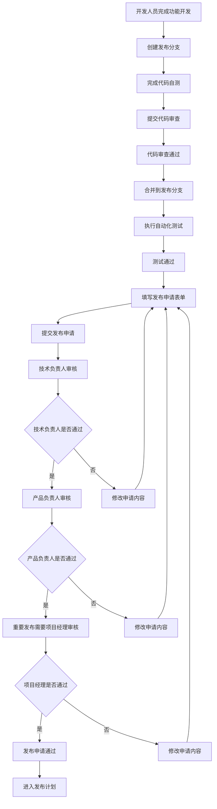
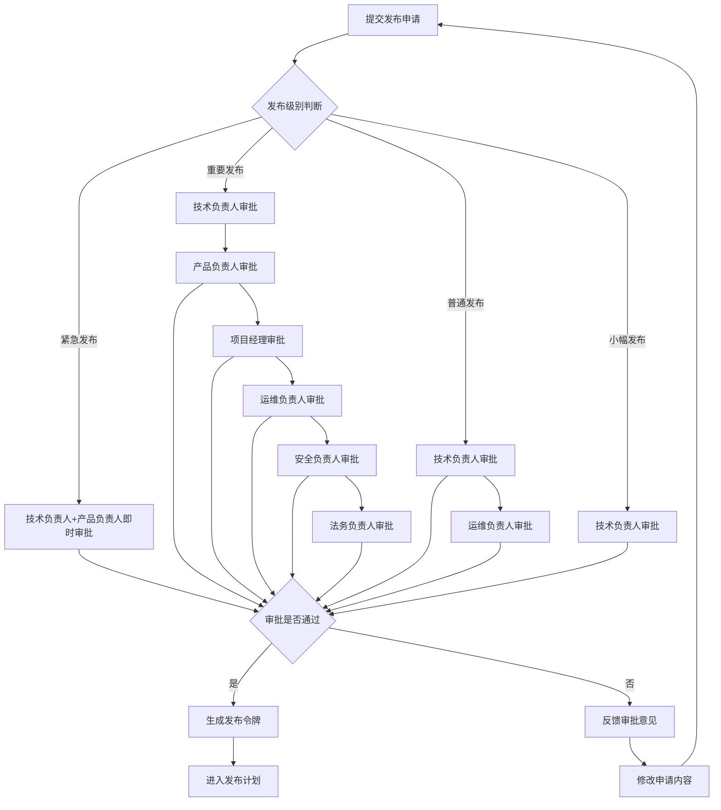
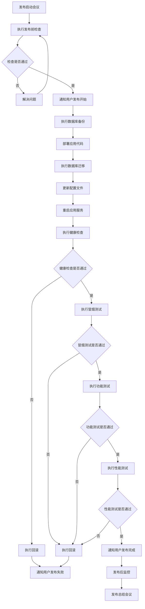
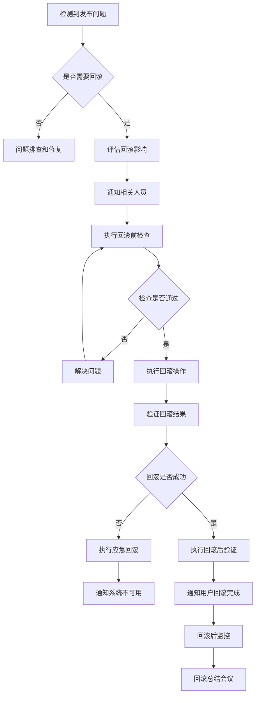
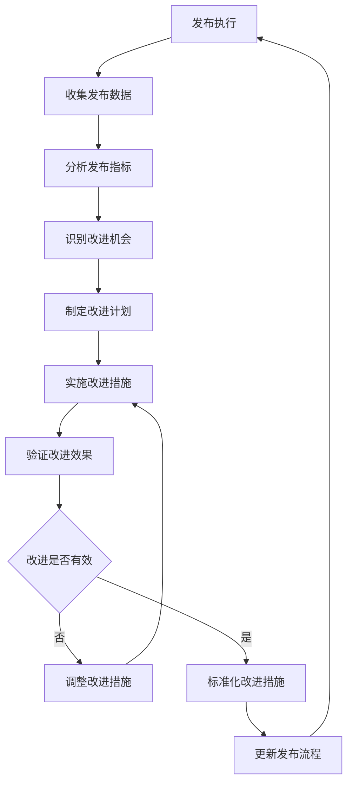

> **_YanYuCloudCube_**
> **标语**：言启象限 | 语枢未来
> **_Words Initiate Quadrants, Language Serves as Core for the Future_**
> **标语**：万象归元于云枢 | 深栈智启新纪元
> **_All things converge in the cloud pivot; Deep stacks ignite a new era of intelligence_**

---

# 145-YYC3-AILP-部署发布-发布审批流程

## 概述

本文档详细描述YYC3-YYC3-AILP-部署发布-发布审批流程相关内容，确保项目按照YYC³标准规范进行开发和实施。

## 核心内容

### 1. 背景与目标

#### 1.1 项目背景

YYC³(YanYuCloudCube)-「智能教育」项目是一个基于「五高五标五化」理念的智能化应用系统，致力于提供高质量、高可用、高安全的成长守护体系。

#### 1.2 文档目标

- 规范发布审批流程相关的业务标准与技术落地要求
- 为项目相关人员提供清晰的参考依据
- 保障相关模块开发、实施、运维的一致性与规范性

### 2. 设计原则

#### 2.1 五高原则

- **高可用性**：确保系统7x24小时稳定运行
- **高性能**：优化响应时间和处理能力
- **高安全性**：保护用户数据和隐私安全
- **高扩展性**：支持业务快速扩展
- **高可维护性**：便于后续维护和升级

#### 2.2 五标体系

- **标准化**：统一的技术和流程标准
- **规范化**：严格的开发和管理规范
- **自动化**：提高开发效率和质量
- **智能化**：利用AI技术提升能力
- **可视化**：直观的监控和管理界面

#### 2.3 五化架构

- **流程化**：标准化的开发流程
- **文档化**：完善的文档体系
- **工具化**：高效的开发工具链
- **数字化**：数据驱动的决策
- **生态化**：开放的生态系统

### 3. 发布审批流程

#### 3.1 发布级别定义

| 发布级别 | 描述                       | 审批流程                       | 发布窗口     | 回滚策略    | 风险等级 |
| -------- | -------------------------- | ------------------------------ | ------------ | ----------- | -------- |
| 紧急发布 | 修复严重安全漏洞或系统故障 | 技术负责人+产品负责人          | 7×24小时     | 立即回滚    | 高       |
| 重要发布 | 新功能上线或重大功能更新   | 技术负责人+产品负责人+项目经理 | 预定维护窗口 | 1小时内回滚 | 中高     |
| 普通发布 | 功能优化或Bug修复          | 技术负责人                     | 预定维护窗口 | 2小时内回滚 | 中       |
| 小幅发布 | 配置调整或文案更新         | 技术负责人                     | 工作时间     | 4小时内回滚 | 低       |

#### 3.2 发布申请流程

##### 3.2.1 发布申请表单

```typescript
interface ReleaseApplication {
  // 基本信息
  basicInfo: {
    applicationName: string; // 应用名称
    version: string; // 版本号
    releaseType: 'emergency' | 'important' | 'normal' | 'minor';
    applicant: string; // 申请人
    applicationDate: Date; // 申请日期
    plannedReleaseDate: Date; // 计划发布日期
    estimatedDuration: number; // 预估发布时长(分钟)
  };

  // 发布内容
  releaseContent: {
    description: string; // 发布描述
    features: string[]; // 新功能列表
    bugFixes: string[]; // Bug修复列表
    improvements: string[]; // 改进列表
    breakingChanges: string[]; // 破坏性变更
  };

  // 技术信息
  technicalInfo: {
    codeChanges: {
      commitHash: string; // 提交哈希
      branch: string; // 分支名称
      codeReviewUrl: string; // 代码审查链接
      testCoverage: number; // 测试覆盖率
    };
    dependencies: {
      updated: string[]; // 更新的依赖
      securityUpdates: string[]; // 安全更新
    };
    databaseChanges: {
      migrations: string[]; // 数据库迁移
      dataBackup: boolean; // 是否需要数据备份
    };
  };

  // 测试信息
  testingInfo: {
    unitTest: {
      passed: boolean;
      coverage: number;
      reportUrl: string;
    };
    integrationTest: {
      passed: boolean;
      reportUrl: string;
    };
    performanceTest: {
      passed: boolean;
      reportUrl: string;
      baselineComparison: string;
    };
    securityTest: {
      passed: boolean;
      reportUrl: string;
      vulnerabilities: string[];
    };
  };

  // 风险评估
  riskAssessment: {
    technicalRisk: 'low' | 'medium' | 'high' | 'critical';
    businessRisk: 'low' | 'medium' | 'high' | 'critical';
    rollbackPlan: string; // 回滚计划
    rollbackTime: number; // 回滚预估时间(分钟)
    impactAssessment: {
      users: number; // 影响用户数
      systems: string[]; // 影响的系统
      downtime: number; // 预估停机时间(分钟)
    };
  };

  // 发布计划
  releasePlan: {
    preReleaseTasks: string[]; // 发布前任务
    releaseSteps: string[]; // 发布步骤
    postReleaseTasks: string[]; // 发布后任务
    verificationSteps: string[]; // 验证步骤
    notificationPlan: {
      before: string[]; // 发布前通知
      during: string[]; // 发布中通知
      after: string[]; // 发布后通知
    };
  };

  // 审批信息
  approvalInfo: {
    technicalLead: {
      name: string;
      status: 'pending' | 'approved' | 'rejected';
      comment: string;
      approvedAt?: Date;
    };
    productOwner: {
      name: string;
      status: 'pending' | 'approved' | 'rejected';
      comment: string;
      approvedAt?: Date;
    };
    projectManager?: {
      name: string;
      status: 'pending' | 'approved' | 'rejected';
      comment: string;
      approvedAt?: Date;
    };
  };
}
```

##### 3.2.2 发布申请提交流程



#### 3.3 发布评审标准

##### 3.3.1 技术评审标准

```typescript
interface TechnicalReviewCriteria {
  // 代码质量
  codeQuality: {
    codeReview: {
      required: true;
      criteria: [
        '代码符合团队编码规范',
        '代码逻辑清晰，可读性强',
        '无明显的性能问题',
        '无安全漏洞',
        '错误处理完善',
      ];
      reviewers: string[]; // 必须的审查人员
      minApprovals: number; // 最少审批人数
    };

    testCoverage: {
      required: true;
      unitTest: {
        minCoverage: 80; // 单元测试最低覆盖率
        criticalPaths: 95; // 关键路径最低覆盖率
      };
      integrationTest: {
        required: true;
        passRate: 100; // 集成测试通过率
      };
      e2eTest: {
        required: false; // 非必需，但推荐
        passRate: 95; // 端到端测试通过率
      };
    };

    performance: {
      required: true;
      criteria: [
        '响应时间不超过基线的110%',
        '吞吐量不低于基线的90%',
        '资源使用率不超过基线的120%',
        '无内存泄漏',
        '无明显的性能回归',
      ];
      baselineComparison: boolean; // 是否需要与基线比较
    };

    security: {
      required: true;
      criteria: [
        '通过静态代码安全扫描',
        '无已知安全漏洞',
        '敏感数据加密存储',
        '输入验证和输出编码',
        '权限控制正确实现',
      ];
      scanTools: string[]; // 使用的安全扫描工具
    };
  };

  // 架构设计
  architecture: {
    required: true;
    criteria: [
      '符合系统架构设计原则',
      '模块化设计合理',
      '接口设计清晰',
      '数据模型设计合理',
      '扩展性和可维护性良好',
    ];
    documentation: {
      required: true;
      types: ['架构设计文档', 'API文档', '数据库设计文档', '部署文档', '运维文档'];
    };
  };

  // 依赖管理
  dependencies: {
    required: true;
    criteria: [
      '依赖版本经过审核',
      '无已知安全漏洞的依赖',
      '依赖许可证合规',
      '依赖冲突已解决',
      '第三方依赖评估完成',
    ];
    licenseCheck: boolean; // 是否需要许可证检查
  };
}
```

##### 3.3.2 业务评审标准

```typescript
interface BusinessReviewCriteria {
  // 功能完整性
  functionality: {
    required: true;
    criteria: [
      '功能实现符合需求规格',
      '用户界面友好',
      '业务流程正确',
      '边界条件处理完善',
      '异常情况处理合理',
    ];
    userAcceptance: {
      required: true;
      testCases: string[]; // 用户验收测试用例
      passRate: number; // 通过率要求
    };
  };

  // 用户体验
  userExperience: {
    required: true;
    criteria: [
      '界面设计符合UI规范',
      '交互流程顺畅',
      '响应时间满足用户期望',
      '错误提示友好',
      '多端适配良好',
    ];
    usabilityTest: {
      required: false; // 非必需，但推荐
      score: number; // 可用性评分
      feedback: string[]; // 用户反馈
    };
  };

  // 业务影响
  businessImpact: {
    required: true;
    criteria: [
      '业务价值明确',
      '用户影响评估准确',
      '业务连续性保障',
      '数据迁移方案完整',
      '培训计划制定',
    ];
    stakeholders: string[]; // 利益相关者
    communicationPlan: string; // 沟通计划
  };

  // 合规性
  compliance: {
    required: true;
    criteria: [
      '符合行业法规要求',
      '数据隐私保护到位',
      '审计日志完整',
      '权限控制符合要求',
      '数据备份策略完善',
    ];
    regulations: string[]; // 相关法规列表
    auditTrail: boolean; // 是否需要审计跟踪
  };
}
```

#### 3.4 发布审批流程

##### 3.4.1 审批角色与职责

| 角色       | 职责                       | 审批范围       | 审批时限  | 替代审批人 |
| ---------- | -------------------------- | -------------- | --------- | ---------- |
| 技术负责人 | 技术方案评审、代码质量把关 | 所有发布       | 2个工作日 | 技术架构师 |
| 产品负责人 | 业务需求确认、用户体验评审 | 重要及以上发布 | 2个工作日 | 产品总监   |
| 项目经理   | 项目进度协调、资源调配     | 重要及以上发布 | 1个工作日 | 项目总监   |
| 运维负责人 | 部署方案评审、运维风险评估 | 所有发布       | 1个工作日 | 运维经理   |
| 安全负责人 | 安全风险评估、安全方案评审 | 重要及以上发布 | 2个工作日 | 安全经理   |
| 法务负责人 | 合规性评审、法律风险评估   | 重要及以上发布 | 3个工作日 | 法务总监   |

##### 3.4.2 审批流程设计



##### 3.4.3 审批决策矩阵

| 发布级别 | 技术负责人 | 产品负责人 | 项目经理 | 运维负责人 | 安全负责人 | 法务负责人 | 决策规则       |
| -------- | ---------- | ---------- | -------- | ---------- | ---------- | ---------- | -------------- |
| 紧急发布 | 必须通过   | 必须通过   | -        | -          | -          | -          | 全部通过       |
| 重要发布 | 必须通过   | 必须通过   | 必须通过 | 必须通过   | 必须通过   | 必须通过   | 全部通过       |
| 普通发布 | 必须通过   | -          | -        | 必须通过   | -          | -          | 全部通过       |
| 小幅发布 | 必须通过   | -          | -        | -          | -          | -          | 技术负责人通过 |

#### 3.5 发布执行流程

##### 3.5.1 发布前准备

```typescript
interface PreReleasePreparation {
  // 环境准备
  environmentPrep: {
    targetEnvironment: {
      name: string; // 目标环境名称
      status: 'ready' | 'not-ready';
      checks: string[]; // 环境检查项
      lastVerified: Date; // 最后验证时间
    };

    backupPreparation: {
      database: {
        completed: boolean;
        backupPath: string;
        verificationRequired: boolean;
      };
      application: {
        completed: boolean;
        backupPath: string;
        verificationRequired: boolean;
      };
      configuration: {
        completed: boolean;
        backupPath: string;
        verificationRequired: boolean;
      };
    };

    resourcePreparation: {
      servers: {
        available: boolean;
        capacity: number;
        utilization: number;
      };
      network: {
        bandwidth: number;
        latency: number;
        reliability: number;
      };
      storage: {
        available: boolean;
        capacity: number;
        utilization: number;
      };
    };
  };

  // 人员准备
  personnelPrep: {
    releaseTeam: {
      members: string[]; // 发布团队成员
      roles: string[]; // 角色分配
      contactInfo: string[]; // 联系方式
      availability: boolean; // 是否可用
    };

    stakeholders: {
      notified: boolean; // 是否已通知
      contactList: string[]; // 联系人列表
      escalationPlan: string; // 升级计划
    };

    supportTeam: {
      onCall: boolean; // 是否有值班人员
      contactInfo: string; // 联系方式
      escalationPath: string; // 升级路径
    };
  };

  // 工具准备
  toolPrep: {
    deploymentTools: {
      name: string; // 部署工具名称
      version: string; // 版本
      status: 'ready' | 'not-ready';
      lastTested: Date; // 最后测试时间
    };

    monitoringTools: {
      name: string; // 监控工具名称
      dashboards: string[]; // 监控仪表板
      alerts: string[]; // 告警规则
      status: 'ready' | 'not-ready';
    };

    rollbackTools: {
      name: string; // 回滚工具名称
      version: string; // 版本
      status: 'ready' | 'not-ready';
      lastTested: Date; // 最后测试时间
    };
  };

  // 文档准备
  documentationPrep: {
    releaseNotes: {
      completed: boolean;
      location: string;
      reviewed: boolean;
    };

    runbook: {
      completed: boolean;
      location: string;
      reviewed: boolean;
    };

    rollbackPlan: {
      completed: boolean;
      location: string;
      tested: boolean;
    };

    communicationPlan: {
      completed: boolean;
      templates: string[];
      distributionList: string[];
    };
  };
}
```

##### 3.5.2 发布执行步骤



##### 3.5.3 发布后验证

```typescript
interface PostReleaseVerification {
  // 功能验证
  functionalVerification: {
    coreFeatures: {
      name: string; // 功能名称
      status: 'pass' | 'fail' | 'skip';
      testCases: number; // 测试用例数
      passed: number; // 通过数
      issues: string[]; // 发现的问题
    }[];

    userJourneys: {
      name: string; // 用户旅程名称
      status: 'pass' | 'fail' | 'skip';
      steps: number; // 步骤数
      completed: number; // 完成数
      issues: string[]; // 发现的问题
    }[];

    integrations: {
      system: string; // 集成系统名称
      status: 'pass' | 'fail' | 'skip';
      testCases: number; // 测试用例数
      passed: number; // 通过数
      issues: string[]; // 发现的问题
    }[];
  };

  // 性能验证
  performanceVerification: {
    responseTime: {
      endpoint: string; // 接口名称
      baseline: number; // 基线值
      current: number; // 当前值
      threshold: number; // 阈值
      status: 'pass' | 'fail' | 'warning';
    }[];

    throughput: {
      service: string; // 服务名称
      baseline: number; // 基线值
      current: number; // 当前值
      threshold: number; // 阈值
      status: 'pass' | 'fail' | 'warning';
    }[];

    resourceUtilization: {
      resource: string; // 资源类型(CPU/内存/磁盘/网络)
      baseline: number; // 基线值
      current: number; // 当前值
      threshold: number; // 阈值
      status: 'pass' | 'fail' | 'warning';
    }[];
  };

  // 安全验证
  securityVerification: {
    vulnerabilityScan: {
      tool: string; // 扫描工具
      vulnerabilities: {
        critical: number; // 严重漏洞数
        high: number; // 高危漏洞数
        medium: number; // 中危漏洞数
        low: number; // 低危漏洞数
      };
      status: 'pass' | 'fail' | 'warning';
    };

    penetrationTest: {
      scope: string[]; // 测试范围
      findings: string[]; // 发现的问题
      riskLevel: 'low' | 'medium' | 'high' | 'critical';
      status: 'pass' | 'fail' | 'warning';
    };

    accessControl: {
      testCases: number; // 测试用例数
      passed: number; // 通过数
      issues: string[]; // 发现的问题
      status: 'pass' | 'fail' | 'warning';
    };
  };

  // 监控验证
  monitoringVerification: {
    alerts: {
      name: string; // 告警名称
      status: 'active' | 'resolved' | 'suppressed';
      severity: 'critical' | 'warning' | 'info';
      duration: number; // 持续时间(分钟)
    }[];

    dashboards: {
      name: string; // 仪表板名称
      status: 'healthy' | 'degraded' | 'down';
      lastUpdated: Date; // 最后更新时间
      dataIntegrity: boolean; // 数据完整性
    }[];

    logs: {
      service: string; // 服务名称
      errorRate: number; // 错误率
      logVolume: number; // 日志量
      anomalies: string[]; // 异常情况
      status: 'healthy' | 'degraded' | 'down';
    }[];
  };
}
```

#### 3.6 回滚流程

##### 3.6.1 回滚触发条件

| 触发类型 | 触发条件                     | 响应时间 | 决策者     | 执行方式 |
| -------- | ---------------------------- | -------- | ---------- | -------- |
| 自动回滚 | 健康检查连续失败3次          | 5分钟内  | 系统       | 自动执行 |
| 自动回滚 | 错误率超过10%持续5分钟       | 5分钟内  | 系统       | 自动执行 |
| 自动回滚 | 响应时间超过阈值2倍持续5分钟 | 5分钟内  | 系统       | 自动执行 |
| 手动回滚 | 功能测试失败                 | 10分钟内 | 发布负责人 | 手动执行 |
| 手动回滚 | 性能测试不达标               | 15分钟内 | 技术负责人 | 手动执行 |
| 手动回滚 | 安全漏洞发现                 | 立即     | 安全负责人 | 手动执行 |
| 紧急回滚 | 系统不可用                   | 立即     | 运维负责人 | 手动执行 |

##### 3.6.2 回滚执行流程



##### 3.6.3 回滚验证清单

```typescript
interface RollbackVerification {
  // 系统状态验证
  systemStatus: {
    services: {
      name: string; // 服务名称
      status: 'running' | 'stopped' | 'degraded';
      version: string; // 版本号
      healthCheck: boolean; // 健康检查
    }[];

    databases: {
      name: string; // 数据库名称
      status: 'connected' | 'disconnected';
      version: string; // 版本号
      dataIntegrity: boolean; // 数据完整性
    }[];

    network: {
      connectivity: boolean; // 网络连通性
      latency: number; // 延迟(毫秒)
      bandwidth: number; // 带宽(Mbps)
    };
  };

  // 功能验证
  functionalVerification: {
    coreFeatures: {
      name: string; // 功能名称
      status: 'working' | 'not-working';
      testCases: number; // 测试用例数
      passed: number; // 通过数
    }[];

    userJourneys: {
      name: string; // 用户旅程名称
      status: 'working' | 'not-working';
      steps: number; // 步骤数
      completed: number; // 完成数
    }[];
  };

  // 性能验证
  performanceVerification: {
    responseTime: {
      endpoint: string; // 接口名称
      baseline: number; // 基线值
      current: number; // 当前值
      status: 'within' | 'exceeds' | 'critical';
    }[];

    throughput: {
      service: string; // 服务名称
      baseline: number; // 基线值
      current: number; // 当前值
      status: 'within' | 'below' | 'critical';
    }[];

    errorRate: {
      service: string; // 服务名称
      baseline: number; // 基线值
      current: number; // 当前值
      status: 'within' | 'exceeds' | 'critical';
    }[];
  };

  // 数据验证
  dataVerification: {
    dataIntegrity: {
      table: string; // 表名
      recordCount: number; // 记录数
      checksum: string; // 校验和
      status: 'valid' | 'invalid';
    }[];

    dataConsistency: {
      source: string; // 源系统
      target: string; // 目标系统
      status: 'consistent' | 'inconsistent';
      discrepancies: string[]; // 差异描述
    }[];
  };
}
```

#### 3.7 发布后活动

##### 3.7.1 发布后监控

```typescript
interface PostReleaseMonitoring {
  // 短期监控(发布后24小时)
  shortTermMonitoring: {
    duration: '24 hours';
    metrics: {
      systemHealth: {
        availability: number; // 可用性
        responseTime: number; // 响应时间
        errorRate: number; // 错误率
        throughput: number; // 吞吐量
      };

      businessMetrics: {
        userActivity: number; // 用户活跃度
        transactionVolume: number; // 交易量
        conversionRate: number; // 转化率
        revenue: number; // 收入
      };

      infrastructureMetrics: {
        cpuUtilization: number; // CPU利用率
        memoryUtilization: number; // 内存利用率
        diskUtilization: number; // 磁盘利用率
        networkUtilization: number; // 网络利用率
      };
    };

    alerts: {
      threshold: {
        errorRate: 5; // 错误率阈值(%)
        responseTime: 1000; // 响应时间阈值(ms)
        availability: 99.5; // 可用性阈值(%)
      };

      escalation: {
        level1: 'development team';
        level2: 'operations team';
        level3: 'management';
      };
    };
  };

  // 中期监控(发布后7天)
  mediumTermMonitoring: {
    duration: '7 days';
    metrics: {
      performanceTrends: {
        responseTime: number[]; // 响应时间趋势
        throughput: number[]; // 吞吐量趋势
        errorRate: number[]; // 错误率趋势
      };

      userBehavior: {
        newFeatureAdoption: number; // 新功能采用率
        userSatisfaction: number; // 用户满意度
        supportTickets: number; // 支持工单数
        userFeedback: string[]; // 用户反馈
      };

      businessImpact: {
        revenueImpact: number; // 收入影响
        costSavings: number; // 成本节约
        efficiencyGain: number; // 效率提升
        riskReduction: number; // 风险降低
      };
    };
  };

  // 长期监控(发布后30天)
  longTermMonitoring: {
    duration: '30 days';
    metrics: {
      stabilityMetrics: {
        mttr: number; // 平均恢复时间
        mtbf: number; // 平均故障间隔
        incidentCount: number; // 事故数量
        availability: number; // 可用性
      };

      performanceMetrics: {
        averageResponseTime: number; // 平均响应时间
        peakThroughput: number; // 峰值吞吐量
        resourceEfficiency: number; // 资源效率
        scalability: number; // 可扩展性
      };

      businessMetrics: {
        roi: number; // 投资回报率
        userRetention: number; // 用户留存率
        marketShare: number; // 市场份额
        competitiveAdvantage: number; // 竞争优势
      };
    };
  };
}
```

##### 3.7.2 发布总结

```typescript
interface ReleaseSummary {
  // 基本信息
  basicInfo: {
    releaseId: string; // 发布ID
    version: string; // 版本号
    releaseDate: Date; // 发布日期
    releaseDuration: number; // 发布时长(分钟)
    releaseType: 'emergency' | 'important' | 'normal' | 'minor';
  };

  // 发布结果
  releaseResult: {
    status: 'success' | 'failed' | 'rolled-back';
    success: boolean;
    issues: {
      type: 'functional' | 'performance' | 'security' | 'infrastructure';
      severity: 'low' | 'medium' | 'high' | 'critical';
      description: string;
      resolution: string;
      resolvedAt?: Date;
    }[];
    rollback: {
      executed: boolean;
      reason?: string;
      duration?: number;
      success?: boolean;
    };
  };

  // 性能指标
  performanceMetrics: {
    beforeRelease: {
      availability: number;
      responseTime: number;
      errorRate: number;
      throughput: number;
    };

    afterRelease: {
      availability: number;
      responseTime: number;
      errorRate: number;
      throughput: number;
    };

    comparison: {
      availabilityChange: number;
      responseTimeChange: number;
      errorRateChange: number;
      throughputChange: number;
    };
  };

  // 业务指标
  businessMetrics: {
    userImpact: {
      affectedUsers: number;
      downtime: number;
      userSatisfaction: number;
      supportTickets: number;
    };

    businessValue: {
      revenueImpact: number;
      costImpact: number;
      efficiencyGain: number;
      riskReduction: number;
    };
  };

  // 经验教训
  lessonsLearned: {
    successes: string[]; // 成功经验
    challenges: string[]; // 挑战和困难
    improvements: string[]; // 改进建议
    bestPractices: string[]; // 最佳实践
  };

  // 后续行动
  followUpActions: {
    immediate: {
      action: string; // 行动描述
      owner: string; // 负责人
      dueDate: Date; // 截止日期
      status: 'pending' | 'in-progress' | 'completed';
    }[];

    shortTerm: {
      action: string; // 行动描述
      owner: string; // 负责人
      dueDate: Date; // 截止日期
      status: 'pending' | 'in-progress' | 'completed';
    }[];

    longTerm: {
      action: string; // 行动描述
      owner: string; // 负责人
      dueDate: Date; // 截止日期
      status: 'pending' | 'in-progress' | 'completed';
    }[];
  };
}
```

#### 3.8 发布流程优化

##### 3.8.1 流程度量指标

| 指标类别   | 指标名称   | 计算方式                   | 目标值   | 监控频率 |
| ---------- | ---------- | -------------------------- | -------- | -------- |
| 效率指标   | 发布周期   | 从代码提交到发布完成的时间 | ≤5天     | 每周     |
| 效率指标   | 发布频率   | 单位时间内的发布次数       | ≥1次/周  | 每周     |
| 效率指标   | 自动化程度 | 自动化步骤占总步骤的比例   | ≥80%     | 每月     |
| 质量指标   | 发布成功率 | 成功发布次数/总发布次数    | ≥95%     | 每月     |
| 质量指标   | 回滚率     | 回滚次数/总发布次数        | ≤5%      | 每月     |
| 质量指标   | 故障率     | 发布后故障次数/总发布次数  | ≤2%      | 每月     |
| 速度指标   | 发布时长   | 从发布开始到完成的时间     | ≤30分钟  | 每次发布 |
| 速度指标   | 回滚时长   | 从回滚开始到完成的时间     | ≤10分钟  | 每次回滚 |
| 满意度指标 | 团队满意度 | 团队成员对流程的满意度评分 | ≥4.0/5.0 | 每季度   |
| 满意度指标 | 客户满意度 | 客户对发布质量的满意度评分 | ≥4.0/5.0 | 每季度   |

##### 3.8.2 持续改进机制



##### 3.8.3 流程优化建议

1. **提高自动化水平**
   - 增加自动化测试覆盖率
   - 实现自动化部署流水线
   - 引入自动化回滚机制
   - 建立自动化监控告警

2. **简化审批流程**
   - 根据风险级别调整审批流程
   - 实施并行审批机制
   - 建立信任发布模式
   - 优化审批表单设计

3. **增强风险管控**
   - 完善风险评估模型
   - 建立风险预警机制
   - 制定应急预案
   - 加强安全审查

4. **提升发布质量**
   - 加强代码审查
   - 提高测试覆盖率
   - 优化性能测试
   - 增强安全测试

5. **改善团队协作**
   - 明确角色职责
   - 优化沟通机制
   - 加强知识分享
   - 提升团队技能

---

## 📄 文档标尾 (Footer)

> 「**_YanYuCloudCube_**」
> 「**_<admin@0379.email>_**」
> 「**_Words Initiate Quadrants, Language Serves as Core for the Future_**」
> 「**_All things converge in the cloud pivot; Deep stacks ignite a new era of intelligence_**」
