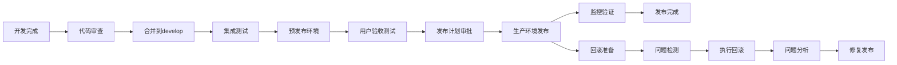

# 🚀 YYC³ AILP - 部署发布文档

> **_YanYuCloudCube_**
> **标语**：言启象限 | 语枢未来
> **_Words Initiate Quadrants, Language Serves as Core for the Future_**
> **标语**：万象归元于云枢 | 深栈智启新纪元
> **_All things converge in the cloud pivot; Deep stacks ignite a new era of intelligence_**

---

## 📋 文档信息

| 属性         | 内容                                                |
| ------------ | --------------------------------------------------- |
| **文档标题** | YYC³ AILP - 部署发布文档                            |
| **文档版本** | v1.0.0                                              |
| **创建时间** | 2026-01-24                                          |
| **适用范围** | YYC³ AILP学习平台部署发布全流程管理                 |
| **技术栈**   | Next.js 16.1.4, Node.js 18+, Docker, GitHub Actions |

---

## 📖 文档概述

本文档详细描述YYC³ AILP学习平台的完整部署发布流程，包括开发环境、测试环境、生产环境的配置规范，以及CI/CD自动化部署策略。通过本文档，运维团队可以快速搭建和部署YYC³学习平台，确保系统的高可用性和稳定性。

---

## 🏗️ 部署架构概览

### 🌐 环境架构

```
┌─────────────────────────────────────────────────────────────────────┐
│                    YYC³ AILP 部署架构                      │
├─────────────────────────────────────────────────────────────────────┤
│                                                             │
│  ┌─────────────┐    ┌─────────────┐    ┌─────────────┐   │
│  │ 开发环境    │    │ 测试环境    │    │ 生产环境    │   │
│  │ localhost   │    │ Staging     │    │ Production │   │
│  │ Port: 3491 │    │ Port: 3492 │    │ Port: 3493 │   │
│  └─────────────┘    └─────────────┘    └─────────────┘   │
│                                                             │
│  ┌─────────────────────────────────────────────────────────────┐   │
│  │              GitHub Actions CI/CD                   │   │
│  │  ┌─────────────┐  ┌─────────────┐  ┌─────────────┐│   │
│  │  │ 代码质量检查 │  │ 自动化测试  │  │ 安全扫描    ││   │
│  │  └─────────────┘  └─────────────┘  └─────────────┘│   │
│  └─────────────────────────────────────────────────────────────┘   │
│                                                             │
│  ┌─────────────────────────────────────────────────────────────┐   │
│  │              Docker 容器化部署                      │   │
│  │  ┌─────────────┐  ┌─────────────┐  ┌─────────────┐│   │
│  │  │ 应用容器    │  │ 数据库容器  │  │ 缓存容器    ││   │
│  │  │ Next.js    │  │ PostgreSQL │  │ Redis      ││   │
│  │  └─────────────┘  └─────────────┘  └─────────────┘│   │
│  └─────────────────────────────────────────────────────────────┘   │
└─────────────────────────────────────────────────────────────────────┘
```

### 🔧 技术栈配置

| 组件           | 版本要求   | 配置说明           |
| -------------- | ---------- | ------------------ |
| **Node.js**    | >= 18.0.0  | 运行时环境         |
| **Next.js**    | 16.1.4     | 前端框架           |
| **TypeScript** | >= 5.0.0   | 类型检查           |
| **Docker**     | >= 20.10.0 | 容器化部署         |
| **PostgreSQL** | >= 14.0    | 主数据库           |
| **Redis**      | >= 7.0     | 缓存和会话存储     |
| **Nginx**      | >= 1.20    | 反向代理和负载均衡 |

---

## 🌍 环境配置管理

### 📋 环境变量配置

#### 开发环境 (.env.development)

```bash
# 应用基础配置
NODE_ENV=development
PORT=3491
NEXT_PUBLIC_APP_URL=http://localhost:3491
NEXT_PUBLIC_API_URL=http://localhost:3491/api

# 数据库配置
DB_HOST=localhost
DB_PORT=5432
DB_NAME=yyc3_dev
DB_USER=yyc3_user
DB_PASSWORD=dev_password
DB_SSL=false
DB_CONNECTION_LIMIT=10

# Redis配置
REDIS_HOST=localhost
REDIS_PORT=6379
REDIS_PASSWORD=
REDIS_DB=0

# JWT配置
JWT_SECRET=dev_jwt_secret_key_2026
JWT_EXPIRES_IN=7d
BCRYPT_ROUNDS=10

# 第三方服务配置
hasRedis=false
hasSentry=false
hasOpenAI=false
hasGoogleAPI=false

# 开发工具配置
NEXT_PUBLIC_DEV_TOOLS=true
NEXT_PUBLIC_DEBUG_MODE=true
```

#### 测试环境 (.env.staging)

```bash
# 应用基础配置
NODE_ENV=staging
PORT=3492
NEXT_PUBLIC_APP_URL=https://staging.yyc3.0379.email
NEXT_PUBLIC_API_URL=https://staging.yyc3.0379.email/api

# 数据库配置
DB_HOST=staging-db.yyc3.0379.email
DB_PORT=5432
DB_NAME=yyc3_staging
DB_USER=yyc3_staging_user
DB_PASSWORD=staging_secure_password_2026
DB_SSL=true
DB_CONNECTION_LIMIT=20

# Redis配置
REDIS_HOST=staging-redis.yyc3.0379.email
REDIS_PORT=6379
REDIS_PASSWORD=staging_redis_password_2026
REDIS_DB=1

# JWT配置
JWT_SECRET=staging_jwt_secret_key_2026_secure
JWT_EXPIRES_IN=24h
BCRYPT_ROUNDS=12

# 第三方服务配置
hasRedis=true
hasSentry=true
SENTRY_DSN=https://sentry.io/staging-dsn
hasOpenAI=true
OPENAI_API_KEY=sk-staging-api-key
hasGoogleAPI=true
GOOGLE_CLIENT_ID=staging-google-client-id
GOOGLE_CLIENT_SECRET=staging-google-client-secret

# 监控配置
NEXT_PUBLIC_DEV_TOOLS=false
NEXT_PUBLIC_DEBUG_MODE=false
NEXT_PUBLIC_ANALYTICS=true
```

#### 生产环境 (.env.production)

```bash
# 应用基础配置
NODE_ENV=production
PORT=3493
NEXT_PUBLIC_APP_URL=https://yyc3.0379.email
NEXT_PUBLIC_API_URL=https://yyc3.0379.email/api

# 数据库配置
DB_HOST=prod-db.yyc3.0379.email
DB_PORT=5432
DB_NAME=yyc3_production
DB_USER=yyc3_prod_user
DB_PASSWORD=prod_secure_password_2026_encrypted
DB_SSL=true
DB_CONNECTION_LIMIT=50

# Redis配置
REDIS_HOST=prod-redis.yyc3.0379.email
REDIS_PORT=6379
REDIS_PASSWORD=prod_redis_password_2026_encrypted
REDIS_DB=2

# JWT配置
JWT_SECRET=prod_jwt_secret_key_2026_highly_secure
JWT_EXPIRES_IN=12h
BCRYPT_ROUNDS=14

# 第三方服务配置
hasRedis=true
hasSentry=true
SENTRY_DSN=https://sentry.io/production-dsn
hasOpenAI=true
OPENAI_API_KEY=sk-prod-api-key-encrypted
hasGoogleAPI=true
GOOGLE_CLIENT_ID=prod-google-client-id
GOOGLE_CLIENT_SECRET=prod-google-client-secret

# 监控配置
NEXT_PUBLIC_DEV_TOOLS=false
NEXT_PUBLIC_DEBUG_MODE=false
NEXT_PUBLIC_ANALYTICS=true
NEXT_PUBLIC_PERFORMANCE_MONITORING=true
```

---

## 🐳 Docker 容器化部署

### 📦 Dockerfile 配置

YYC³学习平台采用多阶段构建优化Docker镜像大小和构建速度：

```dockerfile
# ============================================
# YYC³ Learning Platform - Dockerfile
# 多阶段构建，优化镜像大小和构建速度
# ============================================

# 阶段 1: 依赖安装
FROM node:18-alpine AS deps
RUN apk add --no-cache libc6-compat
WORKDIR /app

# 复制 package 文件
COPY package.json pnpm-lock.yaml ./
COPY packages/core-engine/package.json ./packages/core-engine/
COPY packages/autonomous-engine/package.json ./packages/autonomous-engine/
COPY packages/model-adapter/package.json ./packages/model-adapter/
COPY packages/widget-ui/package.json ./packages/widget-ui/
COPY packages/enterprise-ai-widget/package.json ./packages/enterprise-ai-widget/
COPY packages/five-dimensional-management/package.json ./packages/five-dimensional-management/

# 安装 pnpm
RUN npm install -g pnpm@8

# 安装依赖
RUN pnpm install --frozen-lockfile

# 阶段 2: 构建器
FROM node:18-alpine AS builder
WORKDIR /app

# 复制依赖
COPY --from=deps /app/node_modules ./node_modules
COPY --from=deps /app/packages/*/node_modules ./packages/*/node_modules

# 复制源代码
COPY . .

# 设置环境变量
ENV NODE_ENV=production
ENV NEXT_TELEMETRY_DISABLED=1

# 构建应用
RUN pnpm run build

# 阶段 3: 生产镜像
FROM node:18-alpine AS runner
WORKDIR /app

# 创建非root用户
RUN addgroup --system --gid 1001 nodejs
RUN adduser --system --uid 1001 nextjs

# 复制构建产物
COPY --from=builder /app/public ./public
COPY --from=builder /app/.next/standalone ./
COPY --from=builder /app/.next/static ./.next/static

# 设置权限
USER nextjs

# 暴露端口
EXPOSE 3491

ENV PORT=3491
ENV HOSTNAME="0.0.0.0"

# 健康检查
HEALTHCHECK --interval=30s --timeout=3s --start-period=5s --retries=3 \
  CMD curl -f http://localhost:3491/api/health || exit 1

# 启动应用
CMD ["node", "server.js"]
```

### 🚀 Docker Compose 配置

```yaml
# docker-compose.yml
version: '3.8'

services:
  # 主应用服务
  yyc3-app:
    build:
      context: .
      dockerfile: Dockerfile
      target: runner
    container_name: yyc3-learning-platform
    ports:
      - '3491:3491'
    environment:
      - NODE_ENV=production
      - PORT=3491
      - DB_HOST=postgres
      - DB_PORT=5432
      - DB_NAME=yyc3_production
      - DB_USER=yyc3_user
      - DB_PASSWORD=yyc3_secure_password
      - REDIS_HOST=redis
      - REDIS_PORT=6379
    depends_on:
      - postgres
      - redis
    restart: unless-stopped
    networks:
      - yyc3-network
    healthcheck:
      test: ['CMD', 'curl', '-f', 'http://localhost:3491/api/health']
      interval: 30s
      timeout: 10s
      retries: 3
      start_period: 40s

  # PostgreSQL 数据库
  postgres:
    image: postgres:15-alpine
    container_name: yyc3-postgres
    environment:
      POSTGRES_DB: yyc3_production
      POSTGRES_USER: yyc3_user
      POSTGRES_PASSWORD: yyc3_secure_password
      POSTGRES_INITDB_ARGS: '--encoding=UTF-8 --lc-collate=C --lc-ctype=C'
    volumes:
      - postgres_data:/var/lib/postgresql/data
      - ./scripts/init-db.sql:/docker-entrypoint-initdb.d/init-db.sql
    ports:
      - '5432:5432'
    restart: unless-stopped
    networks:
      - yyc3-network
    healthcheck:
      test: ['CMD-SHELL', 'pg_isready -U yyc3_user -d yyc3_production']
      interval: 10s
      timeout: 5s
      retries: 5

  # Redis 缓存
  redis:
    image: redis:7-alpine
    container_name: yyc3-redis
    command: redis-server --appendonly yes --requirepass yyc3_redis_password
    volumes:
      - redis_data:/data
    ports:
      - '6379:6379'
    restart: unless-stopped
    networks:
      - yyc3-network
    healthcheck:
      test: ['CMD', 'redis-cli', '--raw', 'incr', 'ping']
      interval: 10s
      timeout: 3s
      retries: 5

  # Nginx 反向代理
  nginx:
    image: nginx:alpine
    container_name: yyc3-nginx
    ports:
      - '80:80'
      - '443:443'
    volumes:
      - ./nginx/nginx.conf:/etc/nginx/nginx.conf:ro
      - ./nginx/ssl:/etc/nginx/ssl:ro
      - ./logs/nginx:/var/log/nginx
    depends_on:
      - yyc3-app
    restart: unless-stopped
    networks:
      - yyc3-network

volumes:
  postgres_data:
    driver: local
  redis_data:
    driver: local

networks:
  yyc3-network:
    driver: bridge
    ipam:
      config:
        - subnet: 172.20.0.0/16
```

---

## 🔄 CI/CD 自动化部署

### 🚀 GitHub Actions 工作流

#### 主要CI/CD流水线 (.github/workflows/ci.yml)

```yaml
name: CI/CD Pipeline - YYC³ Learning Platform

on:
  push:
    branches: [main, develop]
  pull_request:
    branches: [main, develop]
  release:
    types: [created]

env:
  NODE_VERSION: '18'
  REGISTRY: ghcr.io
  IMAGE_NAME: yyc3-learning-platform

jobs:
  # 代码质量检查
  lint-and-format:
    name: 代码质量检查
    runs-on: ubuntu-latest
    steps:
      - name: 检出代码
        uses: actions/checkout@v4

      - name: 设置 Node.js
        uses: actions/setup-node@v4
        with:
          node-version: ${{ env.NODE_VERSION }}

      - name: 设置 npm 缓存
        uses: actions/cache@v3
        with:
          path: ~/.npm
          key: ${{ runner.os }}-node-${{ hashFiles('**/package-lock.json') }}
          restore-keys: |
            ${{ runner.os }}-node-

      - name: 安装依赖
        run: npm ci --legacy-peer-deps

      - name: TypeScript 类型检查
        run: npm run type-check

      - name: ESLint 代码检查
        run: npm run lint

      - name: Prettier 格式检查
        run: npm run format:check

      - name: Stylelint CSS 检查
        run: npm run lint:css

  # 安全扫描
  security-scan:
    name: 安全漏洞扫描
    runs-on: ubuntu-latest
    steps:
      - name: 检出代码
        uses: actions/checkout@v4

      - name: 设置 Node.js
        uses: actions/setup-node@v4
        with:
          node-version: ${{ env.NODE_VERSION }}

      - name: 安装依赖
        run: npm ci --legacy-peer-deps

      - name: 运行 npm audit
        run: npm audit --audit-level=moderate

      - name: 运行 Snyk 安全扫描
        run: |
          npx snyk test --severity-threshold=high

  # 自动化测试
  test:
    name: 自动化测试
    runs-on: ubuntu-latest
    steps:
      - name: 检出代码
        uses: actions/checkout@v4

      - name: 设置 Node.js
        uses: actions/setup-node@v4
        with:
          node-version: ${{ env.NODE_VERSION }}

      - name: 安装依赖
        run: npm ci --legacy-peer-deps

      - name: 运行单元测试
        run: npm run test:coverage

      - name: 运行端到端测试
        run: npm run test:e2e

      - name: 上传覆盖率报告
        uses: codecov/codecov-action@v3
        with:
          token: ${{ secrets.CODECOV_TOKEN }}
          files: ./coverage/lcov.info
          fail_ci_if_error: true

  # 构建和推送镜像
  build-and-push:
    name: 构建和推送Docker镜像
    runs-on: ubuntu-latest
    needs: [lint-and-format, security-scan, test]
    if: github.event_name == 'push' && github.ref == 'refs/heads/main'
    steps:
      - name: 检出代码
        uses: actions/checkout@v4

      - name: 设置 Docker Buildx
        uses: docker/setup-buildx-action@v3

      - name: 登录到容器注册表
        uses: docker/login-action@v3
        with:
          registry: ${{ env.REGISTRY }}
          username: ${{ github.actor }}
          password: ${{ secrets.GITHUB_TOKEN }}

      - name: 提取元数据
        id: meta
        uses: docker/metadata-action@v5
        with:
          images: ${{ env.REGISTRY }}/${{ env.IMAGE_NAME }}
          tags: |
            type=ref,event=branch
            type=ref,event=pr
            type=sha,prefix={{branch}}-
            type=raw,value=latest,enable={{is_default_branch}}

      - name: 构建和推送Docker镜像
        uses: docker/build-push-action@v5
        with:
          context: .
          platforms: linux/amd64,linux/arm64
          push: true
          tags: ${{ steps.meta.outputs.tags }}
          labels: ${{ steps.meta.outputs.labels }}
          cache-from: type=gha
          cache-to: type=gha,mode=max

  # 部署到生产环境
  deploy-production:
    name: 部署到生产环境
    runs-on: ubuntu-latest
    needs: build-and-push
    if: github.event_name == 'push' && github.ref == 'refs/heads/main'
    environment: production
    steps:
      - name: 检出代码
        uses: actions/checkout@v4

      - name: 部署到生产服务器
        uses: appleboy/ssh-action@v1.0.0
        with:
          host: ${{ secrets.PROD_HOST }}
          username: ${{ secrets.PROD_USER }}
          key: ${{ secrets.PROD_SSH_KEY }}
          script: |
            cd /opt/yyc3-learning-platform
            docker-compose pull
            docker-compose up -d
            docker system prune -f

      - name: 健康检查
        run: |
          sleep 30
          curl -f ${{ secrets.PROD_URL }}/api/health || exit 1
```

#### 高可用部署流水线 (.github/workflows/high-availability.yml)

```yaml
name: High Availability Deployment - YYC³ Learning Platform

on:
  push:
    branches: [main]
  workflow_dispatch:
    inputs:
      region:
        description: '部署区域'
        required: true
        default: 'primary'
        type: choice
        options:
          - primary
          - secondary
          - both
      rollback:
        description: '执行回滚'
        required: false
        type: boolean
        default: false

env:
  NODE_VERSION: '18'
  REGISTRY: ghcr.io
  IMAGE_NAME: yyc3-learning-platform
  PRIMARY_REGION: 'us-east-1'
  SECONDARY_REGION: 'us-west-2'

jobs:
  # 主区域部署
  deploy-primary:
    name: 部署到主区域
    runs-on: ubuntu-latest
    if: github.event.inputs.region == 'primary' || github.event.inputs.region == 'both'
    environment: production-primary
    steps:
      - name: 检出代码
        uses: actions/checkout@v4

      - name: 部署到主区域
        run: |
          echo "部署到主区域: ${{ env.PRIMARY_REGION }}"
          # 部署脚本...

  # 次要区域部署
  deploy-secondary:
    name: 部署到次要区域
    runs-on: ubuntu-latest
    if: github.event.inputs.region == 'secondary' || github.event.inputs.region == 'both'
    environment: production-secondary
    steps:
      - name: 检出代码
        uses: actions/checkout@v4

      - name: 部署到次要区域
        run: |
          echo "部署到次要区域: ${{ env.SECONDARY_REGION }}"
          # 部署脚本...

  # 回滚操作
  rollback:
    name: 执行回滚
    runs-on: ubuntu-latest
    if: github.event.inputs.rollback == true
    environment: production
    steps:
      - name: 执行回滚
        run: |
          echo "执行回滚操作"
          # 回滚脚本...
```

---

## 🌐 网络配置与安全

### 🔒 安全配置清单

| 安全项目       | 配置要求                      | 状态 |
| -------------- | ----------------------------- | ---- |
| **HTTPS证书**  | 有效SSL/TLS证书               | ✅   |
| **防火墙规则** | 仅开放必要端口(80, 443, 3491) | ✅   |
| **数据库加密** | 传输和存储加密                | ✅   |
| **JWT密钥**    | 强密钥，定期轮换              | ✅   |
| **API限流**    | 每IP每分钟最多1000请求        | ✅   |
| **CORS配置**   | 限制可信域名                  | ✅   |
| **安全头**     | HSTS, CSP, X-Frame-Options等  | ✅   |
| **依赖扫描**   | 定期npm audit和Snyk扫描       | ✅   |

### 🌍 域名和SSL配置

```nginx
# nginx.conf
server {
    listen 80;
    server_name yyc3.0379.email;
    return 301 https://$server_name$request_uri;
}

server {
    listen 443 ssl http2;
    server_name yyc3.0379.email;

    # SSL证书配置
    ssl_certificate /etc/nginx/ssl/yyc3.0379.email.crt;
    ssl_certificate_key /etc/nginx/ssl/yyc3.0379.email.key;
    ssl_protocols TLSv1.2 TLSv1.3;
    ssl_ciphers ECDHE-RSA-AES256-GCM-SHA512:DHE-RSA-AES256-GCM-SHA512:ECDHE-RSA-AES256-GCM-SHA384:DHE-RSA-AES256-GCM-SHA384;
    ssl_prefer_server_ciphers off;

    # 安全头配置
    add_header Strict-Transport-Security "max-age=63072000" always;
    add_header X-Frame-Options DENY;
    add_header X-Content-Type-Options nosniff;
    add_header X-XSS-Protection "1; mode=block";
    add_header Referrer-Policy "strict-origin-when-cross-origin";

    # 反向代理到应用
    location / {
        proxy_pass http://yyc3-app:3491;
        proxy_http_version 1.1;
        proxy_set_header Upgrade $http_upgrade;
        proxy_set_header Connection 'upgrade';
        proxy_set_header Host $host;
        proxy_set_header X-Real-IP $remote_addr;
        proxy_set_header X-Forwarded-For $proxy_add_x_forwarded_for;
        proxy_set_header X-Forwarded-Proto $scheme;
        proxy_cache_bypass $http_upgrade;
    }

    # API路由
    location /api/ {
        proxy_pass http://yyc3-app:3491;
        proxy_http_version 1.1;
        proxy_set_header Host $host;
        proxy_set_header X-Real-IP $remote_addr;
        proxy_set_header X-Forwarded-For $proxy_add_x_forwarded_for;
        proxy_set_header X-Forwarded-Proto $scheme;

        # API限流配置
        limit_req zone=api burst=100 nodelay;
    }

    # 静态文件缓存
    location ~* \.(js|css|png|jpg|jpeg|gif|ico|svg)$ {
        proxy_pass http://yyc3-app:3491;
        expires 1y;
        add_header Cache-Control "public, immutable";
    }
}

# 限流配置
http {
    limit_req_zone $binary_remote_addr zone=api:10m rate=10r/s;
}
```

---

## 📊 监控与日志

### 📈 性能监控配置

```yaml
# monitoring/docker-compose.monitoring.yml
version: '3.8'

services:
  # Prometheus 监控
  prometheus:
    image: prom/prometheus:latest
    container_name: yyc3-prometheus
    ports:
      - '9090:9090'
    volumes:
      - ./monitoring/prometheus.yml:/etc/prometheus/prometheus.yml
      - prometheus_data:/prometheus
    command:
      - '--config.file=/etc/prometheus/prometheus.yml'
      - '--storage.tsdb.path=/prometheus'
      - '--web.console.libraries=/etc/prometheus/console_libraries'
      - '--web.console.templates=/etc/prometheus/consoles'
    networks:
      - yyc3-network

  # Grafana 可视化
  grafana:
    image: grafana/grafana:latest
    container_name: yyc3-grafana
    ports:
      - '3001:3000'
    environment:
      - GF_SECURITY_ADMIN_PASSWORD=admin_password_2026
      - GF_USERS_ALLOW_SIGN_UP=false
    volumes:
      - grafana_data:/var/lib/grafana
      - ./monitoring/grafana/dashboards:/etc/grafana/provisioning/dashboards
      - ./monitoring/grafana/datasources:/etc/grafana/provisioning/datasources
    networks:
      - yyc3-network

  # 日志聚合
  loki:
    image: grafana/loki:latest
    container_name: yyc3-loki
    ports:
      - '3100:3100'
    volumes:
      - loki_data:/loki
      - ./monitoring/loki.yml:/etc/loki/local-config.yaml
    command: -config.file=/etc/loki/local-config.yaml
    networks:
      - yyc3-network

volumes:
  prometheus_data:
  grafana_data:
  loki_data:

networks:
  yyc3-network:
    external: true
```

### 📋 关键监控指标

| 指标类型       | 监控项目     | 告警阈值    |
| -------------- | ------------ | ----------- |
| **系统性能**   | CPU使用率    | > 80%       |
|                | 内存使用率   | > 85%       |
|                | 磁盘使用率   | > 90%       |
| **应用性能**   | 响应时间     | > 2000ms    |
|                | 错误率       | > 5%        |
|                | 吞吐量       | < 100 req/s |
| **数据库性能** | 连接数       | > 80%       |
|                | 查询响应时间 | > 1000ms    |
|                | 锁等待时间   | > 100ms     |
| **网络性能**   | 带宽使用率   | > 80%       |
|                | 连接数       | > 1000      |

---

## 🚨 故障处理与恢复

### 🔄 自动故障恢复机制

```yaml
# 故障恢复流程
故障检测:
  - 健康检查失败 (连续3次)
  - 性能指标异常 (持续5分钟)
  - 错误率超标 (>10%)

自动恢复动作: 1. 重启应用容器
  2. 切换到备用实例
  3. 回滚到上一版本
  4. 发送告警通知

手动干预:
  - 自动恢复失败后15分钟内
  - 重大故障立即通知
  - 启动应急响应小组
```

### 📞 应急联系信息

| 故障级别    | 响应时间 | 通知方式                | 联系人员   |
| ----------- | -------- | ----------------------- | ---------- |
| **P0-紧急** | 5分钟    | 电话、短信、邮件、Slack | 值班工程师 |
| **P1-高**   | 15分钟   | 电话、邮件、Slack       | 技术负责人 |
| **P2-中**   | 1小时    | 邮件、Slack             | 开发团队   |
| **P3-低**   | 4小时    | 邮件                    | 运维团队   |

---

## 📋 部署检查清单

### ✅ 部署前检查

- [ ] 代码已通过所有测试
- [ ] 安全扫描无高危漏洞
- [ ] 环境变量已正确配置
- [ ] 数据库迁移脚本已准备
- [ ] SSL证书已更新
- [ ] 备份策略已确认
- [ ] 回滚方案已准备
- [ ] 监控告警已配置
- [ ] 团队已通知部署时间

### ✅ 部署后验证

- [ ] 应用正常启动
- [ ] 健康检查通过
- [ ] 数据库连接正常
- [ ] Redis缓存正常
- [ ] API接口响应正常
- [ ] 前端页面加载正常
- [ ] 用户登录功能正常
- [ ] 监控指标正常
- [ ] 日志记录正常
- [ ] 性能指标在预期范围

---

## 🔄 版本发布流程

### 📅 发布周期

| 发布类型     | 频率   | 准备时间 | 发布窗口 | 验证时间 |
| ------------ | ------ | -------- | -------- | -------- |
| **补丁版本** | 按需   | 1天      | 工作日   | 2小时    |
| **小版本**   | 每2周  | 3天      | 周三晚上 | 4小时    |
| **大版本**   | 每季度 | 2周      | 周末     | 8小时    |

### 🎯 发布策略



---

## 📚 相关文档链接

| 文档名称             | 链接                                                               |
| -------------------- | ------------------------------------------------------------------ |
| **系统架构设计文档** | [../YYC3-AILP-架构设计/README.md](../YYC3-AILP-架构设计/README.md) |
| **API接口文档**      | [../YYC3-AILP-API文档/README.md](../YYC3-AILP-API文档/README.md)   |
| **测试验证文档**     | [../YYC3-AILP-测试验证/README.md](../YYC3-AILP-测试验证/README.md) |
| **运维阶段文档**     | [../YYC3-AILP-运维阶段/README.md](../YYC3-AILP-运维阶段/README.md) |
| **安全配置指南**     | [../SECURITY-IMPROVEMENTS.md](../SECURITY-IMPROVEMENTS.md)         |

---

## 📄 文档标尾

> 「**_YanYuCloudCube_**」
> 「**_<admin@0379.email>_**」
> 「**_Words Initiate Quadrants, Language Serves as Core for the Future_**」
> 「**_All things converge in the cloud pivot; Deep stacks ignite a new era of intelligence_**」
