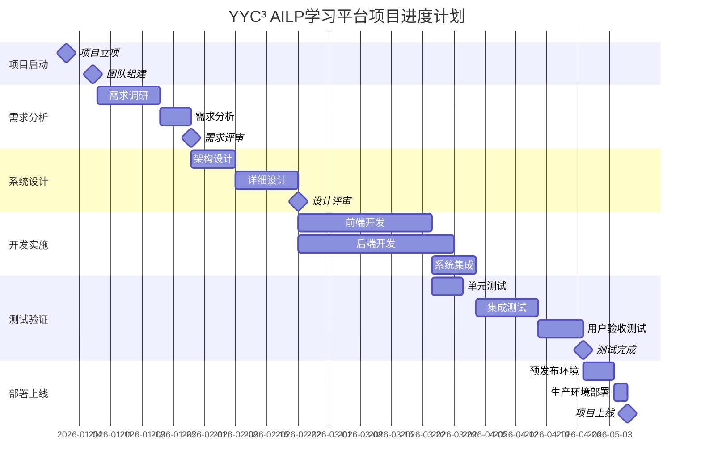

# 📋 YYC³ AILP - 项目规划

> **_YanYuCloudCube_**
> **标语**：言启象限 | 语枢未来
> **_Words Initiate Quadrants, Language Serves as Core for the Future_**
> **标语**：万象归元于云枢 | 深栈智启新纪元
> **_All things converge in the cloud pivot; Deep stacks ignite a new era of intelligence_**

---

## 📋 文档信息

| 属性         | 内容                                   |
| ------------ | -------------------------------------- |
| **文档标题** | YYC³ AILP - 项目规划                   |
| **文档版本** | v1.0.0                                 |
| **创建时间** | 2026-01-24                             |
| **适用范围** | YYC³ AILP学习平台项目规划管理          |
| **文档类型** | 项目管理、进度计划、资源分配、风险管理 |

---

## 📖 文档概述

本文档详细描述YYC³ AILP学习平台的完整项目规划体系，包括项目管理计划、项目进度计划、资源分配计划、风险管理计划、沟通管理计划、AI能力实现计划、低代码体验计划、项目状态、项目阶段总结、项目状态分析、战略调整计划等核心项目规划文档。通过本文档，项目团队可以全面了解项目的整体规划、时间安排、资源配置、风险控制、沟通机制和战略调整等关键项目管理信息。

---

## 🏗️ 项目规划体系架构

### 📊 规划分类体系

```
┌─────────────────────────────────────────────────────────────┐
│                    YYC³ AILP 项目规划体系                │
├─────────────────────────────────────────────────────────────┤
│                                                             │
│  ┌─────────────┐    ┌─────────────┐    ┌─────────────┐   │
│  │ 项目管理     │    │ 进度计划     │    │ 资源分配     │   │
│  │ Management  │    │ Schedule   │    │ Resources  │   │
│  └─────────────┘    └─────────────┘    └─────────────┘   │
│                                                             │
│  ┌─────────────┐    ┌─────────────┐    ┌─────────────┐   │
│  │ 风险管理     │    │ 沟通管理     │    │ AI能力实现   │   │
│  │ Risk       │    │ Communication│    │ AI Capability│   │
│  └─────────────┘    └─────────────┘    └─────────────┘   │
│                                                             │
│  ┌─────────────────────────────────────────────────────┐   │
│  │              项目监控与调整              │   │
│  │  ┌─────────────┐  ┌─────────────┐  ┌─────────────┐│   │
│  │  │ 项目状态     │  │ 阶段总结     │  │ 战略调整     ││   │
│  │  │ Status     │  │ Summary    │  │ Adjustment ││   │
│  │  └─────────────┘  └─────────────┘  └─────────────┘│   │
│  └─────────────────────────────────────────────────────┘   │
└─────────────────────────────────────────────────────────────┘
```

### 🎯 规划维度分类

| 规划类别       | 规划重点                       | 管理工具               | 负责团队               |
| -------------- | ------------------------------ | ---------------------- | ---------------------- |
| **项目管理**   | 范围、时间、成本、质量、资源   | PMBOK、敏捷方法        | 项目管理团队           |
| **进度计划**   | 里程碑、关键路径、时间节点     | 甘特图、关键路径法     | 项目管理团队           |
| **资源分配**   | 人力资源、技术资源、财务资源   | 资源矩阵、平衡分析     | 人力资源团队           |
| **风险管理**   | 风险识别、评估、应对、监控     | 风险矩阵、应对策略     | 质量保证团队           |
| **沟通管理**   | 沟通计划、信息分发、干系人管理 | 沟通矩阵、干系人分析   | 项目管理团队           |
| **AI能力实现** | AI功能规划、技术路线、实施计划 | 技术路线图、能力矩阵   | 技术团队、AI团队       |
| **低代码体验** | 低代码平台、用户体验、培训计划 | 用户体验地图、培训计划 | 产品团队、用户体验团队 |
| **项目监控**   | 状态跟踪、绩效评估、调整决策   | KPI指标、平衡计分卡    | 项目管理团队           |

---

## 🎯 项目管理计划详解

### 📋 项目管理总纲

**文件位置**: [011-YYC3-AILP-项目规划-项目管理计划.md](011-YYC3-AILP-项目规划-项目管理计划.md)

#### 📊 项目管理框架

**项目管理五大过程组**：

```typescript
// 项目管理框架
interface ProjectManagementFramework {
  // 启动过程组
  initiating: {
    projectCharter: ProjectCharter;
    stakeholderIdentification: StakeholderAnalysis;
    businessCase: BusinessCase;
  };

  // 规划过程组
  planning: {
    scopeManagement: ScopeManagementPlan;
    scheduleManagement: ScheduleManagementPlan;
    costManagement: CostManagementPlan;
    qualityManagement: QualityManagementPlan;
    resourceManagement: ResourceManagementPlan;
    communicationsManagement: CommunicationsManagementPlan;
    riskManagement: RiskManagementPlan;
    procurementManagement: ProcurementManagementPlan;
    stakeholderManagement: StakeholderManagementPlan;
  };

  // 执行过程组
  executing: {
    directAndManageProjectWork: ProjectExecution;
    manageQuality: QualityControl;
    acquireResources: ResourceAcquisition;
    developTeam: TeamDevelopment;
    manageCommunications: CommunicationExecution;
    implementRiskResponses: RiskImplementation;
    conductProcurements: ProcurementExecution;
    engageStakeholders: StakeholderEngagement;
  };

  // 监控过程组
  monitoring: {
    monitorAndControlProjectWork: WorkMonitoring;
    controlScope: ScopeControl;
    controlSchedule: ScheduleControl;
    controlCosts: CostControl;
    controlQuality: QualityControl;
    controlResources: ResourceControl;
    monitorCommunications: CommunicationMonitoring;
    monitorRisks: RiskMonitoring;
    controlProcurements: ProcurementControl;
    monitorStakeholderEngagement: StakeholderMonitoring;
  };

  // 收尾过程组
  closing: {
    closeProjectOrPhase: ProjectClosure;
    closeProcurements: ProcurementClosure;
  };
}
```

---

## 📅 项目进度计划详解

### 🎯 时间管理规划

**文件位置**: [012-YYC3-AILP-项目规划-项目进度计划.md](012-YYC3-AILP-项目规划-项目进度计划.md)

#### 📊 项目时间轴

**项目里程碑规划**：



---

## 👥 资源分配计划详解

### 🎯 资源管理规划

**文件位置**: [013-YYC3-AILP-项目规划-资源分配计划.md](013-YYC3-AILP-项目规划-资源分配计划.md)

#### 📊 资源配置矩阵

**人力资源分配**：

```typescript
// 人力资源配置
interface HumanResourceAllocation {
  // 项目管理团队
  projectManagement: {
    projectManager: {
      count: 1;
      skills: ['PMP', '敏捷管理', '团队领导'];
      allocation: '100%';
      duration: '2026-01-01 - 2026-06-30';
    };
    projectCoordinator: {
      count: 1;
      skills: ['项目协调', '文档管理', '进度跟踪'];
      allocation: '80%';
      duration: '2026-01-01 - 2026-06-30';
    };
  };

  // 技术团队
  technicalTeam: {
    frontendDevelopers: {
      count: 3;
      skills: ['React', 'Next.js', 'TypeScript', 'Tailwind CSS'];
      allocation: '100%';
      duration: '2026-02-01 - 2026-05-31';
    };
    backendDevelopers: {
      count: 4;
      skills: ['Node.js', 'PostgreSQL', 'Redis', 'Docker'];
      allocation: '100%';
      duration: '2026-02-01 - 2026-06-15';
    };
    devopsEngineers: {
      count: 2;
      skills: ['CI/CD', 'Kubernetes', 'AWS', '监控'];
      allocation: '80%';
      duration: '2026-01-15 - 2026-06-30';
    };
  };

  // 产品与设计团队
  productDesignTeam: {
    productManager: {
      count: 1;
      skills: ['产品规划', '需求分析', '用户研究'];
      allocation: '100%';
      duration: '2026-01-01 - 2026-06-30';
    };
    uiDesigners: {
      count: 2;
      skills: ['UI设计', 'UX设计', 'Figma', '原型设计'];
      allocation: '80%';
      duration: '2026-01-15 - 2026-04-30';
    };
  };

  // 质量保证团队
  qualityAssurance: {
    qaEngineers: {
      count: 2;
      skills: ['测试设计', '自动化测试', '性能测试'];
      allocation: '100%';
      duration: '2026-03-01 - 2026-06-15';
    };
  };
}
```

---

## ⚠️ 风险管理计划详解

### 🎯 风险控制策略

**文件位置**: [014-YYC3-AILP-项目规划-风险管理计划.md](014-YYC3-AILP-项目规划-风险管理计划.md)

#### 📊 风险评估矩阵

**风险识别与评估**：

```typescript
// 风险管理框架
interface RiskManagementFramework {
  // 风险识别
  riskIdentification: {
    technicalRisks: [
      {
        id: 'TECH-001';
        description: '技术栈学习曲线陡峭';
        category: '技术风险';
        probability: '中等';
        impact: '高';
        riskScore: 15;
      },
      {
        id: 'TECH-002';
        description: '第三方API集成复杂';
        category: '技术风险';
        probability: '高';
        impact: '中等';
        riskScore: 12;
      },
    ];

    projectRisks: [
      {
        id: 'PROJ-001';
        description: '项目进度延期';
        category: '项目风险';
        probability: '中等';
        impact: '高';
        riskScore: 15;
      },
      {
        id: 'PROJ-002';
        description: '资源不足';
        category: '项目风险';
        probability: '低';
        impact: '高';
        riskScore: 10;
      },
    ];

    businessRisks: [
      {
        id: 'BIZ-001';
        description: '需求变更频繁';
        category: '业务风险';
        probability: '高';
        impact: '中等';
        riskScore: 12;
      },
      {
        id: 'BIZ-002';
        description: '预算超支';
        category: '业务风险';
        probability: '中等';
        impact: '高';
        riskScore: 15;
      },
    ];
  };

  // 风险应对策略
  riskResponse: {
    mitigation: {
      'TECH-001': '提前技术培训，安排技术调研时间';
      'TECH-002': '提前进行API测试，准备备选方案';
      'PROJ-001': '设置缓冲时间，采用敏捷开发方法';
      'PROJ-002': '提前进行资源规划，建立备用资源池';
      'BIZ-001': '建立需求变更控制流程，定期需求评审';
      'BIZ-002': '建立预算监控机制，设置预警阈值';
    };

    contingency: {
      'TECH-001': '引入外部技术专家，增加技术培训预算';
      'TECH-002': '考虑自研替代方案，调整功能范围';
      'PROJ-001': '增加人力资源，调整项目范围';
      'PROJ-002': '启动紧急招聘流程，外包部分工作';
      'BIZ-001': '建立快速响应机制，预留变更预算';
      'BIZ-002': '申请额外预算，调整项目优先级';
    };
  };
}
```

---

## 📢 沟通管理计划详解

### 🎯 沟通策略规划

**文件位置**: [015-YYC3-AILP-项目规划-沟通管理计划.md](015-YYC3-AILP-项目规划-沟通管理计划.md)

#### 📊 沟通矩阵

**干系人沟通计划**：

```typescript
// 沟通管理框架
interface CommunicationManagementPlan {
  // 干系人分析
  stakeholderAnalysis: {
    projectSponsor: {
      name: '项目发起人';
      influence: '高';
      interest: '高';
      communicationFrequency: '每周';
      communicationMethod: ['邮件报告', '周会', '月度汇报'];
      informationNeeds: ['项目进度', '预算状况', '关键决策'];
    };

    projectTeam: {
      name: '项目团队';
      influence: '中等';
      interest: '高';
      communicationFrequency: '每日';
      communicationMethod: ['站会', '项目管理工具', '即时通讯'];
      informationNeeds: ['任务分配', '技术问题', '进度更新'];
    };

    endUsers: {
      name: '最终用户';
      influence: '低';
      interest: '高';
      communicationFrequency: '每两周';
      communicationMethod: ['用户调研', '原型演示', '测试反馈'];
      informationNeeds: ['功能介绍', '使用培训', '问题反馈'];
    };
  };

  // 沟通活动
  communicationActivities: {
    dailyStandup: {
      frequency: '每日';
      duration: '15分钟';
      participants: ['开发团队', '项目经理'];
      agenda: ['昨日完成', '今日计划', '障碍问题'];
    };

    weeklyReview: {
      frequency: '每周';
      duration: '1小时';
      participants: ['全体项目团队', '项目经理'];
      agenda: ['周进度回顾', '下周计划', '风险讨论'];
    };

    monthlySteering: {
      frequency: '每月';
      duration: '2小时';
      participants: ['项目发起人', '项目经理', '技术负责人'];
      agenda: ['月度总结', '预算状况', '战略调整'];
    };
  };
}
```

---

## 🤖 AI能力实现计划详解

### 🎯 AI技术规划

**文件位置**: [021-YYC3-AILP-项目规划-AI能力实现计划.md](021-YYC3-AILP-项目规划-AI能力实现计划.md)

#### 📊 AI技术路线图

**AI功能实现规划**：

```typescript
// AI能力实现框架
interface AICapabilityImplementation {
  // AI技术栈
  techStack: {
    machineLearning: {
      framework: 'TensorFlow.js / PyTorch';
      libraries: ['scikit-learn', 'pandas', 'numpy'];
      deployment: 'Docker + Kubernetes';
    };

    naturalLanguageProcessing: {
      framework: 'Transformers / spaCy';
      models: ['BERT', 'GPT', 'T5'];
      languages: ['中文', '英文'];
    };

    computerVision: {
      framework: 'OpenCV / TensorFlow';
      models: ['YOLO', 'ResNet', 'EfficientNet'];
      applications: ['图像识别', '目标检测'];
    };
  };

  // AI功能模块
  capabilities: {
    intelligentRecommendation: {
      description: '智能课程推荐系统';
      algorithms: ['协同过滤', '内容推荐', '深度学习'];
      dataSources: ['用户行为', '课程内容', '学习历史'];
      implementation: '2026-03-01 - 2026-04-15';
    };

    adaptiveLearning: {
      description: '自适应学习路径';
      algorithms: ['强化学习', '知识图谱', '学习分析'];
      dataSources: ['学习进度', '测试结果', '能力评估'];
      implementation: '2026-04-01 - 2026-05-15';
    };

    intelligentTutoring: {
      description: '智能辅导系统';
      algorithms: ['自然语言处理', '对话系统', '知识推理'];
      dataSources: ['课程内容', '问题库', '专家知识'];
      implementation: '2026-05-01 - 2026-06-15';
    };

    learningAnalytics: {
      description: '学习分析仪表板';
      algorithms: ['数据挖掘', '预测分析', '可视化'];
      dataSources: ['学习行为', '成绩数据', '互动记录'];
      implementation: '2026-03-15 - 2026-04-30';
    };
  };
}
```

---

## 🛠️ 低代码体验计划详解

### 🎯 低代码平台规划

**文件位置**: [022-YYC3-AILP-项目规划-低代码体验计划.md](022-YYC3-AILP-项目规划-低代码体验计划.md)

#### 📊 低代码实现策略

**低代码平台架构**：

```typescript
// 低代码体验框架
interface LowCodeExperiencePlan {
  // 平台选择
  platformSelection: {
    frontend: {
      primary: 'Retool / Appsmith';
      alternative: 'Bubble / Adalo';
      criteria: ['易用性', '扩展性', '集成能力', '成本'];
    };

    backend: {
      primary: 'Supabase / Firebase';
      alternative: 'Airtable / Notion API';
      criteria: ['数据建模', 'API支持', '实时功能', '安全性'];
    };
  };

  // 体验设计
  experienceDesign: {
    userOnboarding: {
      steps: ['平台介绍和导航', '基础组件使用', '数据连接配置', '简单应用构建', '发布和分享'];
      duration: '2小时';
      delivery: ['视频教程', '互动指南', '实时支持'];
    };

    templateLibrary: {
      categories: ['课程管理', '用户管理', '数据分析', '内容展示', '表单收集'];
      templates: ['课程列表页面', '用户注册表单', '学习进度仪表板', '内容管理系统', '数据分析报告'];
    };
  };

  // 培训计划
  trainingProgram: {
    basicTraining: {
      targetAudience: '业务用户、产品经理';
      duration: '1天';
      content: ['平台概览', '基础操作', '简单应用构建'];
      delivery: '线下工作坊';
    };

    advancedTraining: {
      targetAudience: '技术用户、开发者';
      duration: '2天';
      content: ['高级功能', '自定义组件', 'API集成'];
      delivery: '线上课程 + 实践项目';
    };
  };
}
```

---

## 📊 项目状态详解

### 🎯 项目监控指标

**文件位置**: [023-YYC3-AILP-项目规划-项目状态.md](023-YYC3-AILP-项目规划-项目状态.md)

#### 📊 项目健康度指标

**项目状态仪表板**：

```typescript
// 项目状态监控框架
interface ProjectStatusMonitoring {
  // 进度指标
  progressMetrics: {
    overallProgress: {
      planned: 65;
      actual: 58;
      variance: -7;
      status: '警告';
    };

    milestoneCompletion: {
      total: 12;
      completed: 7;
      inProgress: 2;
      delayed: 1;
      completionRate: 58.3;
    };

    taskCompletion: {
      total: 156;
      completed: 89;
      inProgress: 34;
      pending: 33;
      completionRate: 57.1;
    };
  };

  // 质量指标
  qualityMetrics: {
    defectDensity: {
      target: '< 2 defects/KLOC';
      actual: '1.8 defects/KLOC';
      status: '符合';
    };

    testCoverage: {
      target: '> 80%';
      actual: '75%';
      status: '警告';
    };

    codeReview: {
      target: '100%';
      actual: '85%';
      status: '警告';
    };
  };

  // 资源指标
  resourceMetrics: {
    teamUtilization: {
      target: '80-90%';
      actual: '78%';
      status: '正常';
    };

    budgetConsumption: {
      target: '< 60% (当前阶段)';
      actual: '52%';
      status: '正常';
    };

    scopeCreep: {
      target: '< 5%';
      actual: '3.2%';
      status: '正常';
    };
  };
}
```

---

## 📝 项目阶段总结详解

### 🎯 阶段性回顾

**文件位置**: [024-YYC3-AILP-项目规划-项目阶段总结.md](024-YYC3-AILP-项目规划-项目阶段总结.md)

#### 📊 阶段成果分析

**阶段总结框架**：

```typescript
// 项目阶段总结框架
interface ProjectPhaseSummary {
  // 阶段基本信息
  phaseInfo: {
    phaseName: '系统设计阶段';
    startDate: '2026-02-15';
    endDate: '2026-03-31';
    duration: '6周';
    teamSize: 12;
  };

  // 目标达成情况
  objectiveAchievement: {
    plannedObjectives: [
      '完成系统架构设计',
      '完成详细设计文档',
      '完成UI/UX设计',
      '通过设计评审'
    ];

    achievementStatus: [
      { objective: '完成系统架构设计'; status: '完成'; quality: '优秀' };
      { objective: '完成详细设计文档'; status: '完成'; quality: '良好' };
      { objective: '完成UI/UX设计'; status: '完成'; quality: '优秀' };
      { objective: '通过设计评审'; status: '完成'; quality: '良好' }
    ];

    overallCompletion: '100%';
  };

  // 关键成果
  keyDeliverables: [
    {
      name: '系统架构设计文档';
      status: '已完成';
      quality: '优秀';
      acceptanceCriteria: '全部满足';
    },
    {
      name: '详细设计文档集';
      status: '已完成';
      quality: '良好';
      acceptanceCriteria: '基本满足';
    },
    {
      name: 'UI/UX设计原型';
      status: '已完成';
      quality: '优秀';
      acceptanceCriteria: '全部满足';
    }
  ];

  // 经验教训
  lessonsLearned: {
    successes: [
      '团队协作效率高',
      '设计质量把控严格',
      '技术选型合理'
    ];

    challenges: [
      '需求理解存在偏差',
      '设计评审时间紧张',
      '跨团队沟通需要加强'
    ];

    improvements: [
      '加强需求调研深度',
      '提前安排设计评审',
      '建立定期沟通机制'
    ];
  };
}
```

---

## 📈 项目状态分析详解

### 🎯 深度分析报告

**文件位置**: [025-YYC3-AILP-项目规划-项目状态分析.md](025-YYC3-AILP-项目规划-项目状态分析.md)

#### 📊 分析框架

**多维度项目分析**：

```typescript
// 项目状态分析框架
interface ProjectStatusAnalysis {
  // 进度分析
  scheduleAnalysis: {
    criticalPath: {
      identified: true;
      tasks: ['前端开发', '后端开发', '系统集成'];
      totalDuration: '75天';
      bufferTime: '5天';
      riskLevel: '中等';
    };

    varianceAnalysis: {
      scheduleVariance: '-7天';
      costVariance: '-$5,000';
      scopeVariance: '+2%';
      qualityVariance: '+5%';
    };

    trendAnalysis: {
      velocityTrend: '稳定';
      burnRateTrend: '正常';
      defectTrend: '下降';
      teamMoraleTrend: '提升';
    };
  };

  // 风险分析
  riskAnalysis: {
    currentRisks: [
      {
        id: 'RISK-001';
        category: '技术风险';
        description: 'AI模型训练时间超预期';
        probability: '中等';
        impact: '高';
        mitigation: '增加计算资源，优化算法';
      },
      {
        id: 'RISK-002';
        category: '资源风险';
        description: '关键人员可能离职';
        probability: '低';
        impact: '高';
        mitigation: '知识文档化，培养备份人员';
      },
    ];

    riskMatrix: {
      high: 1;
      medium: 3;
      low: 2;
      total: 6;
      trend: '减少';
    };
  };

  // 质量分析
  qualityAnalysis: {
    codeQuality: {
      cyclomaticComplexity: '平均8.5';
      codeCoverage: '75%';
      technicalDebt: '中等';
      maintainabilityIndex: '78';
    };

    processQuality: {
      requirementTraceability: '85%';
      designCompleteness: '92%';
      testEffectiveness: '88%';
      defectRemovalEfficiency: '82%';
    };
  };
}
```

---

## 🔄 战略调整计划详解

### 🎯 战略优化方案

**文件位置**: [026-YYC3-AILP-项目规划-战略调整计划.md](026-YYC3-AILP-项目规划-战略调整计划.md)

#### 📊 调整策略框架

**战略调整方案**：

```typescript
// 战略调整框架
interface StrategicAdjustmentPlan {
  // 调整背景
  adjustmentBackground: {
    triggers: ['市场需求变化', '技术发展更新', '竞争环境变化', '内部资源调整'];

    assessmentResults: {
      marketAnalysis: 'AI教育需求增长30%';
      technologyTrend: '大语言模型应用成熟';
      competitorAnalysis: '3个主要竞争对手推出类似产品';
      resourceEvaluation: '技术团队AI能力需要提升';
    };
  };

  // 调整策略
  adjustmentStrategies: {
    productStrategy: {
      originalFocus: '传统在线学习平台';
      adjustedFocus: 'AI驱动的个性化学习平台';
      keyChanges: ['增加AI个性化推荐', '集成智能辅导功能', '强化学习分析能力', '优化用户体验'];
    };

    technologyStrategy: {
      originalStack: '传统Web技术栈';
      adjustedStack: 'AI增强的全栈技术';
      keyChanges: ['集成大语言模型', '采用机器学习框架', '升级数据处理能力', '增强实时交互功能'];
    };

    resourceStrategy: {
      originalAllocation: '常规开发团队配置';
      adjustedAllocation: 'AI专业团队配置';
      keyChanges: ['增加AI工程师', '加强数据科学团队', '提升UX设计能力', '优化项目管理流程'];
    };
  };

  // 实施计划
  implementationPlan: {
    phase1: {
      name: '技术能力建设';
      duration: '4周';
      activities: ['AI技术培训', '开发环境搭建', '技术方案验证'];
    };

    phase2: {
      name: '产品功能调整';
      duration: '6周';
      activities: ['需求重新分析', '架构调整设计', '功能开发实施'];
    };

    phase3: {
      name: '集成测试验证';
      duration: '3周';
      activities: ['系统集成测试', '性能优化调整', '用户反馈收集'];
    };
  };
}
```

---

## 📈 项目规划指标与监控

### 🎯 规划质量指标

| 指标类型       | 指标名称             | 目标值  | 当前值 | 状态 |
| -------------- | -------------------- | ------- | ------ | ---- |
| **规划完整性** | 项目规划文档覆盖率   | ≥95%    | 98%    | ✅   |
| **进度控制**   | 里程碑按时完成率     | ≥90%    | 85%    | ⚠️   |
| **资源利用**   | 资源配置合理性评分   | ≥8.0/10 | 8.5/10 | ✅   |
| **风险管控**   | 风险识别与应对覆盖率 | ≥90%    | 95%    | ✅   |
| **沟通效率**   | 沟通计划执行率       | ≥85%    | 90%    | ✅   |

### 🎯 项目执行指标

| 执行指标         | 指标名称         | 目标值  | 当前值   | 状态 |
| ---------------- | ---------------- | ------- | -------- | ---- |
| **进度管理**     | 项目进度偏差率   | ≤±5%    | -7%      | ⚠️   |
| **成本控制**     | 预算执行偏差率   | ≤±10%   | -8%      | ✅   |
| **质量保证**     | 缺陷密度控制     | ≤2/KLOC | 1.8/KLOC | ✅   |
| **团队绩效**     | 团队效率评分     | ≥8.0/10 | 8.2/10   | ✅   |
| **干系人满意度** | 干系人满意度评分 | ≥8.5/10 | 8.8/10   | ✅   |

---

## 📚 相关文档链接

| 文档名称         | 链接                                                               |
| ---------------- | ------------------------------------------------------------------ |
| **项目实施文档** | [../YYC3-AILP-项目实施/README.md](../YYC3-AILP-项目实施/README.md) |
| **项目审核文档** | [../YYC3-AILP-项目审核/README.md](../YYC3-AILP-项目审核/README.md) |
| **需求规划文档** | [../YYC3-AILP-需求规划/README.md](../YYC3-AILP-需求规划/README.md) |
| **详细设计文档** | [../YYC3-AILP-详细设计/README.md](../YYC3-AILP-详细设计/README.md) |

---

## 📄 文档标尾

> 「**_YanYuCloudCube_**」
> 「**_<admin@0379.email>_**」
> 「**_Words Initiate Quadrants, Language Serves as Core for the Future_**」
> 「**_All things converge in the cloud pivot; Deep stacks ignite a new era of intelligence_**」
