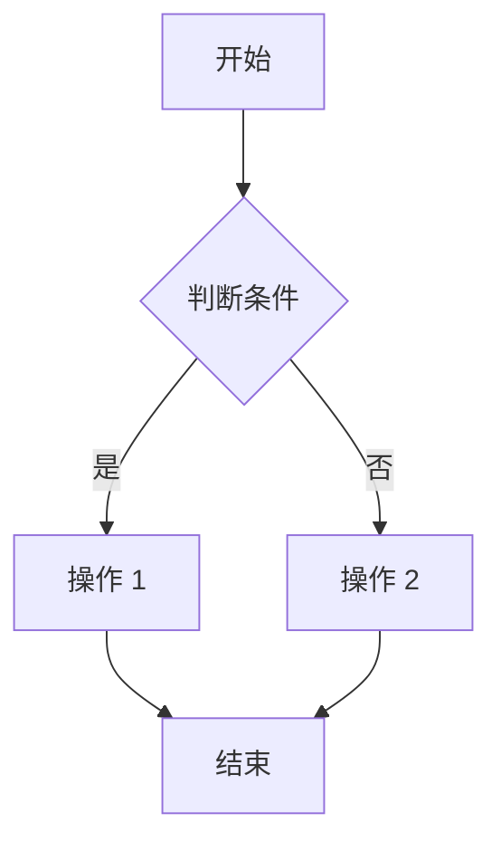

# YYC³ Learning System - 文档规范标准

> **版本**: v1.0.0
> **更新时间**: 2026-01-03
> **适用范围**: YYC³ Learning System 全部技术文档

---

## 📋 文档概述

本文档定义了 YYC³ Learning System 项目技术文档的统一规范标准，确保所有文档的一致性、完整性和可维护性。

---

## 🎯 文档分类体系

### 1. 核心文档 (Core Documentation)

#### 1.1 架构设计文档 (Architecture)
- **前缀**: `ARCH-`
- **命名格式**: `ARCH-{模块名}-{文档主题}.md`
- **示例**: `ARCH-LearningSystem-Overview.md`

#### 1.2 API 文档 (API)
- **前缀**: `API-`
- **命名格式**: `API-{模块名}-{版本}.md`
- **示例**: `API-BehavioralLayer-v1.md`

#### 1.3 开发指南 (Guide)
- **前缀**: `GUIDE-`
- **命名格式**: `GUIDE-{主题}-{子主题}.md`
- **示例**: `GUIDE-Installation-Setup.md`

#### 1.4 类型定义文档 (Types)
- **前缀**: `TYPES-`
- **命名格式**: `TYPES-{模块名}.md`
- **示例**: `TYPES-Common.md`

### 2. 实施文档 (Implementation)

#### 2.1 开发阶段文档 (Dev)
- **前缀**: `DEV-`
- **命名格式**: `DEV-{阶段}-{任务}.md`
- **示例**: `DEV-Phase1-Refactoring.md`

#### 2.2 测试文档 (Test)
- **前缀**: `TEST-`
- **命名格式**: `TEST-{类型}-{模块}.md`
- **示例**: `TEST-Integration-BehavioralLayer.md`

#### 2.3 部署文档 (Deploy)
- **前缀**: `DEPLOY-`
- **命名格式**: `DEPLOY-{环境}-{版本}.md`
- **示例**: `DEPLOY-Production-v1.0.md`

---

## 📝 文档结构模板

### 标准文档结构

```markdown
# {文档标题}

> **文档类型**: {架构/API/指南/实施}
> **版本**: v{X.Y.Z}
> **创建日期**: {YYYY-MM-DD}
> **最后更新**: {YYYY-MM-DD}
> **维护者**: {团队/个人}
> **状态**: {草稿/评审中/已发布/已废弃}

---

## 📋 目录 (Table of Contents)

- [文档概述](#文档概述)
- [背景与目标](#背景与目标)
- [核心内容](#核心内容)
- [实施指南](#实施指南)
- [最佳实践](#最佳实践)
- [常见问题](#常见问题)
- [附录](#附录)

---

## 📄 文档概述

### 文档目的
{描述本文档的目标和受众}

### 适用范围
{说明本文档覆盖的范围}

### 前置知识
{阅读本文档需要的背景知识}

---

## 🎯 背景与目标

### 业务背景
{描述业务场景和需求}

### 技术背景
{描述技术背景和约束}

### 目标设定
{明确的技术目标和指标}

---

## 💡 核心内容

### {主要章节 1}
#### 1.1 {子章节}
- **定义**: {概念定义}
- **示例**:
  ```typescript
  // 代码示例
  ```
- **说明**: {详细说明}

### {主要章节 2}
...

---

## 🚀 实施指南

### 步骤 1: {步骤标题}
**前置条件**:
- {条件 1}
- {条件 2}

**操作步骤**:
1. {详细步骤}
2. {详细步骤}

**验证方法**:
```bash
# 验证命令
```

### 步骤 2: {步骤标题}
...

---

## ✅ 最佳实践

### 实践 1: {实践名称}
- **适用场景**: {场景描述}
- **实施方法**: {方法描述}
- **注意事项**: {注意事项}

### 实践 2: {实践名称}
...

---

## ❓ 常见问题 (FAQ)

### Q1: {问题标题}
**问题描述**: {详细描述}

**解决方案**:
1. {方案 1}
2. {方案 2}

**参考链接**: {相关文档}

### Q2: {问题标题}
...

---

## 📚 附录

### A. 术语表 (Glossary)
| 术语 | 英文 | 定义 |
|------|------|------|
| {术语} | {English} | {定义} |

### B. 参考文档 (References)
- [{文档名}]({链接})
- [{文档名}]({链接})

### C. 变更历史 (Changelog)
| 版本 | 日期 | 作者 | 变更说明 |
|------|------|------|----------|
| v1.0.0 | 2026-01-03 | YYC³ AI Team | 初始版本 |

---

## 🔗 相关链接

- [项目主页](../../README.md)
- [架构文档](./ARCH-Overview.md)
- [API 文档](./API-Index.md)
- [开发指南](./GUIDE-Index.md)
```

---

## 🎨 文档格式规范

### Markdown 规范

#### 1. 标题层级
```markdown
# 一级标题 (文档标题，每个文档只有一个)
## 二级标题 (主要章节)
### 三级标题 (子章节)
#### 四级标题 (细节内容)
##### 五级标题 (尽量避免使用)
```

#### 2. 代码块
```typescript
// TypeScript 代码示例
interface Example {
  id: string;
  name: string;
}
```

```bash
# Shell 命令示例
npm install @yyc3/learning-system
```

```json
// JSON 配置示例
{
  "version": "1.0.0"
}
```

#### 3. 表格
| 参数名 | 类型 | 必填 | 说明 |
|--------|------|------|------|
| id | string | 是 | 唯一标识符 |
| name | string | 是 | 显示名称 |

#### 4. 列表
- 无序列表项 1
  - 嵌套项 1.1
  - 嵌套项 1.2
- 无序列表项 2

1. 有序列表项 1
2. 有序列表项 2
   1. 子项 2.1
   2. 子项 2.2

#### 5. 强调和引用
**加粗文本**: 重要概念
*斜体文本*: 术语定义
`行内代码`: 变量名或函数名
> 引用块: 重要提示或说明

---

## 🎯 内容质量标准

### 1. 准确性
- ✅ 技术信息准确无误
- ✅ 代码示例经过验证
- ✅ 版本号和依赖关系明确

### 2. 完整性
- ✅ 覆盖所有使用场景
- ✅ 包含必要的错误处理
- ✅ 提供完整的工作流程

### 3. 可读性
- ✅ 语言简洁清晰
- ✅ 逻辑结构合理
- ✅ 图文并茂

### 4. 可维护性
- ✅ 定期更新内容
- ✅ 标注版本和状态
- ✅ 记录变更历史

---

## 📊 文档元数据

### 必需元数据
每个文档必须包含以下元数据：

```markdown
> **文档类型**: {架构/API/指南/实施}
> **版本**: v{X.Y.Z}
> **创建日期**: {YYYY-MM-DD}
> **最后更新**: {YYYY-MM-DD}
> **维护者**: {团队/个人}
> **状态**: {草稿/评审中/已发布/已废弃}
```

### 可选元数据
```markdown
> **审核者**: {姓名}
> **审核日期**: {YYYY-MM-DD}
> **相关模块**: {模块列表}
> **依赖文档**: {文档列表}
```

---

## 🔧 文档工具

### 推荐工具
- **编辑器**: VS Code + Markdown Preview Enhanced
- **图示工具**: Mermaid, Draw.io
- **API 文档**: TypeDoc
- **版本控制**: Git

### Mermaid 图表示例


---

## 📋 文档审核流程

### 1. 编写阶段
- 作者按照模板编写文档
- 自查格式和内容完整性

### 2. 评审阶段
- 技术评审：准确性和技术深度
- 格式评审：符合规范标准
- 语言评审：表达清晰准确

### 3. 发布阶段
- 合并到主分支
- 更新文档索引
- 通知相关团队

---

## 📈 文档版本管理

### 版本号规则
- **主版本号**: 重大架构变更
- **次版本号**: 新增功能或章节
- **修订号**: 错误修正和小改进

### 变更记录
每次更新必须记录：
- 变更内容
- 变更原因
- 影响范围

---

## 🎯 文档索引结构

### 主索引文件
`/docs/INDEX.md` - 文档总索引

### 分类索引
- `/docs/arch/INDEX.md` - 架构文档索引
- `/docs/api/INDEX.md` - API 文档索引
- `/docs/guides/INDEX.md` - 开发指南索引
- `/docs/types/INDEX.md` - 类型定义索引

---

## 📞 联系方式

### 文档维护团队
- **技术负责人**: YYC³ AI Team
- **邮箱**: ai-team@yyc3.com
- **问题反馈**: [GitHub Issues](https://github.com/YYC-Cube/learning-platform/issues)

---

**文档结束**
