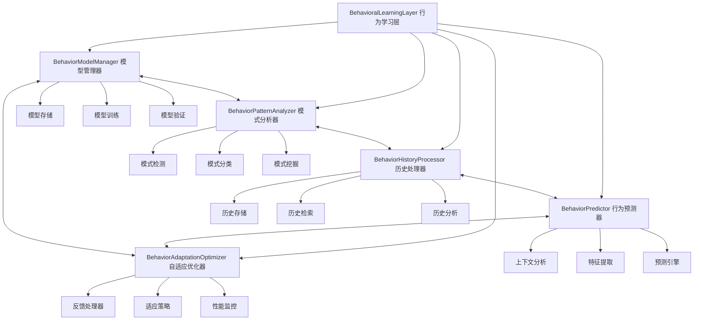
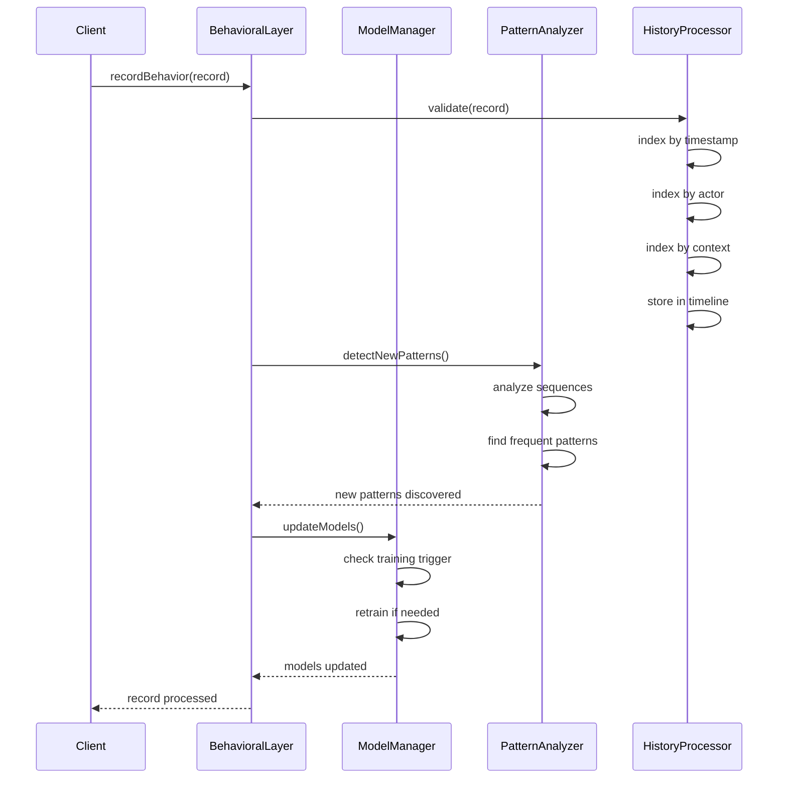
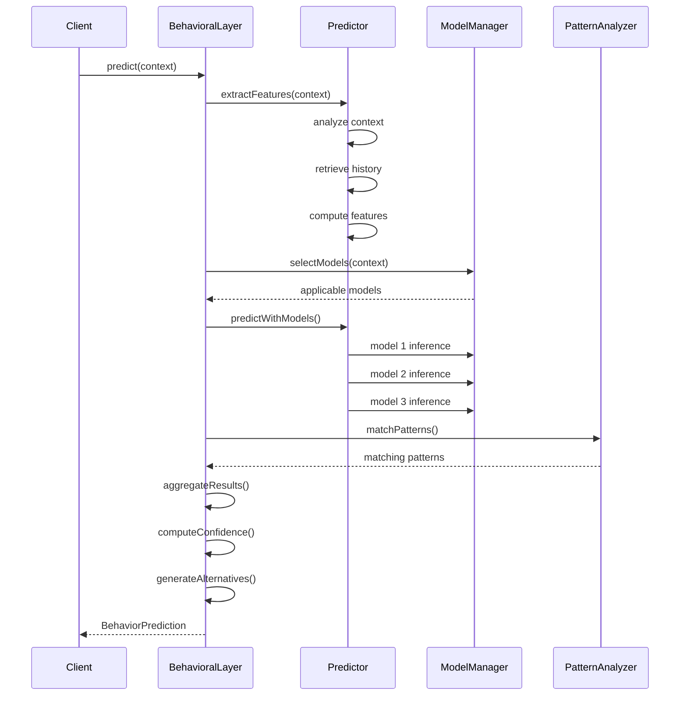
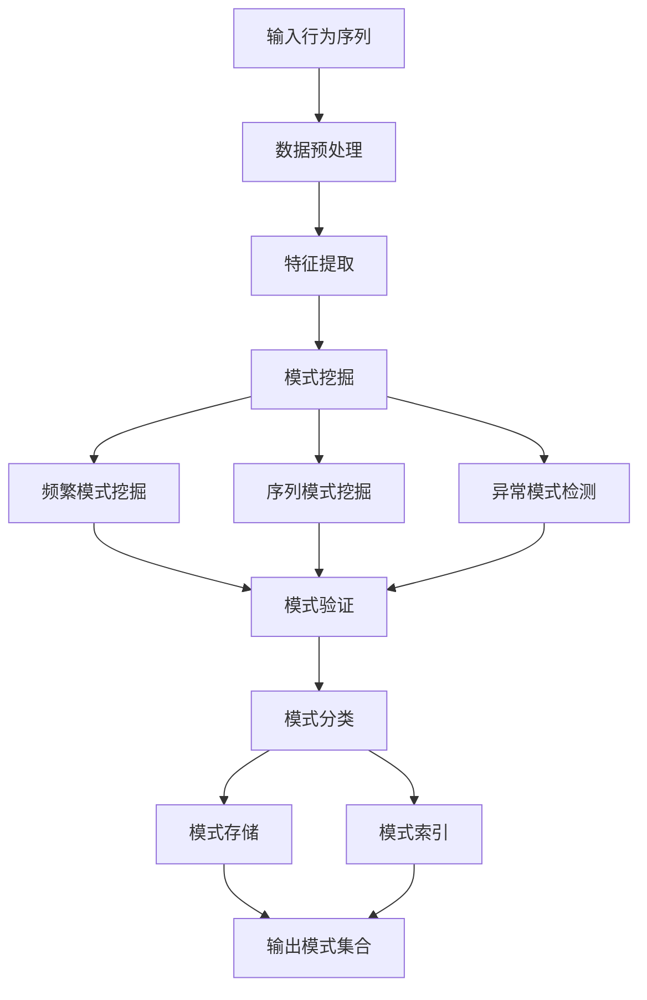

# YYC³ Behavioral Learning Layer - 架构设计

> **文档类型**: 架构设计
> **版本**: v1.0.0
> **创建日期**: 2026-01-03
> **最后更新**: 2026-01-03
> **维护者**: YYC³ AI Team
> **状态**: 已发布

---

## 📋 目录

- [层概述](#层概述)
- [架构设计](#架构设计)
- [核心模块](#核心模块)
- [数据流程](#数据流程)
- [模型管理](#模型管理)
- [模式分析](#模式分析)
- [预测机制](#预测机制)
- [自适应优化](#自适应优化)
- [接口定义](#接口定义)

---

## 📄 层概述

### 职责定位

Behavioral Learning Layer（行为学习层）是 YYC³ Learning System 的三层架构中的基础层，负责：

- 🧠 **行为捕获**: 记录和存储行为数据
- 🔍 **模式识别**: 发现和分析行为模式
- 📊 **预测建模**: 构建和训练预测模型
- 🎯 **行为预测**: 实时预测未来行为
- 🔄 **自适应优化**: 基于反馈优化模型

### 设计原则

1. **数据驱动**: 基于真实行为数据进行学习
2. **实时处理**: 支持流式行为数据处理
3. **可扩展性**: 支持多种行为模型和算法
4. **高可用性**: 保证持续稳定的行为分析服务

---

## 🏗️ 架构设计

### 架构图



### 模块职责

#### 1. BehaviorModelManager (行为模型管理器)
**职责**: 管理预测模型的生命周期

**核心功能**:
- 模型注册和存储
- 模型训练和更新
- 模型评估和验证
- 模型版本管理

**数据结构**:
```typescript
interface ModelManager {
  models: Map<string, PredictionModel>;
  trainingQueue: TrainingTask[];
  performanceMetrics: Map<string, ModelPerformance>;
}
```

---

#### 2. BehaviorPatternAnalyzer (行为模式分析器)
**职责**: 发现和分析行为模式

**核心功能**:
- 序列模式挖掘
- 频繁模式识别
- 异常模式检测
- 模式相似度计算

**数据结构**:
```typescript
interface PatternAnalyzer {
  patterns: Map<string, BehaviorPattern>;
  patternIndex: Map<string, string[]>; // type -> pattern IDs
  similarityMatrix: Map<string, Map<string, number>>;
}
```

---

#### 3. BehaviorHistoryProcessor (行为历史处理器)
**职责**: 管理和检索行为历史

**核心功能**:
- 行为记录存储
- 时间窗口查询
- 行为序列检索
- 历史统计分析

**数据结构**:
```typescript
interface HistoryProcessor {
  records: BehaviorRecord[];
  timelineIndex: Map<number, string[]>; // timestamp -> record IDs
  actorIndex: Map<string, string[]>;    // actor -> record IDs
  contextIndex: Map<string, string[]>;  // context -> record IDs
}
```

---

#### 4. BehaviorPredictor (行为预测器)
**职责**: 进行行为预测

**核心功能**:
- 特征提取
- 模型推理
- 结果聚合
- 置信度评估

**数据结构**:
```typescript
interface BehaviorPredictor {
  featureExtractor: FeatureExtractor;
  models: Map<string, PredictionModel>;
  aggregationStrategy: AggregationStrategy;
}
```

---

#### 5. BehaviorAdaptationOptimizer (自适应优化器)
**职责**: 优化模型和策略

**核心功能**:
- 反馈处理
- 模型调整
- 性能监控
- 策略优化

**数据结构**:
```typescript
interface AdaptationOptimizer {
  feedbackBuffer: BehaviorFeedback[];
  adaptationStrategies: Map<string, AdaptationStrategy>;
  performanceHistory: PerformanceMetric[];
}
```

---

## 🔄 数据流程

### 行为记录流程



### 行为预测流程



---

## 🧠 模型管理

### 模型类型

```typescript
enum ModelType {
  Classification = 'classification',    // 分类模型
  Regression = 'regression',            // 回归模型
  Clustering = 'clustering',            // 聚类模型
  AnomalyDetection = 'anomaly_detection', // 异常检测
  SequencePrediction = 'sequence_prediction' // 序列预测
}
```

### 模型接口

```typescript
interface PredictionModel {
  id: string;
  type: ModelType;
  config: ModelConfig;
  performance: ModelPerformance;
  createdAt: number;
  updatedAt: number;
  lastTrainedAt: number;

  // 训练方法
  train(trainingData: TrainingData): Promise<ModelTrainingResult>;

  // 预测方法
  predict(features: FeatureVector): Promise<PredictionResult>;

  // 评估方法
  evaluate(testData: TrainingData): Promise<ModelPerformance>;

  // 更新方法
  update(updates: ModelUpdate): Promise<void>;
}
```

### 模型配置

```typescript
interface ModelConfig {
  // 基础配置
  algorithm: string;              // 算法名称
  parameters: ModelParameters;    // 算法参数

  // 训练配置
  training: {
    algorithm: string;            // 训练算法
    hyperparameters: Record<string, unknown>; // 超参数
    validation: {
      strategy: 'cross_validation' | 'holdout';
      folds?: number;
      testSize?: number;
    };
  };

  // 评估配置
  evaluation: {
    metrics: EvaluationMetric[];
    frequency: number;           // 评估频率
    threshold: number;           // 性能阈值
  };
}
```

### 模型训练

```typescript
interface ModelTrainingResult {
  success: boolean;
  modelId: string;
  performance: ModelPerformance;
  trainingTime: number;
  dataPoints: number;
  convergenceInfo: {
    iterations: number;
    finalLoss: number;
    earlyStopped: boolean;
  };
  timestamp: number;
}
```

---

## 🔍 模式分析

### 模式类型

```typescript
enum PatternType {
  Sequential = 'sequential',       // 序列模式
  Temporal = 'temporal',           // 时间模式
  Conditional = 'conditional',     // 条件模式
  Cyclic = 'cyclic',               // 循环模式
  Anomalous = 'anomalous'          // 异常模式
}
```

### 模式结构

```typescript
interface BehaviorPattern {
  id: string;
  type: PatternType;
  description: string;

  // 模式特征
  frequency: number;               // 出现频率
  confidence: number;              // 置信度
  support: number;                 // 支持度

  // 模式组成
  conditions: PatternCondition[];  // 前置条件
  actions: PatternAction[];        // 行为动作
  outcomes: PatternOutcome[];      // 预期结果

  // 模式元数据
  temporalFeatures: {
    duration: number;              // 持续时间
    periodicity: number;           // 周期性
    seasonality: string;           // 季节性
  };

  contextualFeatures: {
    actors: string[];              // 涉及主体
    environments: string[];        // 环境特征
    situations: string[];          // 情景特征
  };

  timestamp: number;
}
```

### 模式发现算法



---

## 🎯 预测机制

### 预测流程

```typescript
interface BehaviorPrediction {
  id: string;

  // 预测结果
  predictedBehavior: PredictedBehavior;
  confidence: number;

  // 推理过程
  reasoning: PredictionReasoning;

  // 备选方案
  alternatives: AlternativePrediction[];

  // 元数据
  timestamp: number;
  modelVersions: string[];
  processingTime: number;
}
```

### 特征工程

```typescript
interface FeatureExtractor {
  // 上下文特征
  extractContextFeatures(context: BehaviorContext): FeatureVector;

  // 历史特征
  extractHistoryFeatures(history: BehaviorRecord[]): FeatureVector;

  // 时序特征
  extractTemporalFeatures(timeline: number[]): FeatureVector;

  // 交互特征
  extractInteractionFeatures(records: BehaviorRecord[]): FeatureVector;
}
```

### 预测聚合

```typescript
enum AggregationStrategy {
  WeightedVoting = 'weighted_voting',       // 加权投票
  Stacking = 'stacking',                   // 模型堆叠
  Bayesian = 'bayesian',                   // 贝叶斯融合
  ConfidenceBased = 'confidence_based'     // 基于置信度
}

interface AggregationConfig {
  strategy: AggregationStrategy;
  weights: Map<string, number>;           // 模型权重
  threshold: number;                      // 置信度阈值
  diversityPenalty: number;               // 多样性惩罚
}
```

---

## 🔄 自适应优化

### 反馈机制

```typescript
interface BehaviorFeedback {
  id: string;
  predictionId: string;

  // 反馈内容
  actualBehavior: BehaviorRecord;
  predictedBehavior: PredictedBehavior;

  // 反馈评估
  accuracy: number;                       // 准确度
  error: number;                          // 错误率

  // 反馈元数据
  timestamp: number;
  source: 'user' | 'system' | 'expert';
  confidence: number;                     // 反馈可信度
}
```

### 适应策略

```typescript
interface AdaptationStrategy {
  id: string;
  name: string;
  type: 'model_update' | 'parameter_tuning' | 'feature_engineering';

  // 触发条件
  triggerCondition: {
    metric: string;
    threshold: number;
    duration: number;
  };

  // 适应动作
  actions: {
    retrainModel: boolean;
    adjustParameters: boolean;
    updateFeatures: boolean;
    switchModel: boolean;
  };

  // 预期效果
  expectedImprovement: number;
  estimatedCost: number;
}
```

### 性能监控

```typescript
interface PerformanceMonitor {
  // 实时指标
  currentMetrics: {
    accuracy: number;
    precision: number;
    recall: number;
    f1Score: number;
    latency: number;
    throughput: number;
  };

  // 历史趋势
  metricsHistory: PerformanceMetric[];

  // 异常检测
  anomalies: PerformanceAnomaly[];

  // 性能报告
  generateReport(): PerformanceReport;
}
```

---

## 🔌 接口定义

### 核心接口

```typescript
interface IBehavioralLearningLayer extends EventEmitter {
  // 状态
  readonly status: LayerStatus;
  readonly config: BehavioralLayerConfig;
  readonly metrics: BehavioralMetrics;

  // 生命周期
  initialize(config: BehavioralLayerConfig): Promise<void>;
  start(): Promise<void>;
  stop(): Promise<void>;

  // 行为记录
  recordBehavior(record: BehaviorRecord): Promise<void>;
  recordBehaviors(records: BehaviorRecord[]): Promise<void>;

  // 模式分析
  analyzePatterns(range?: TimeRange): Promise<BehaviorPattern[]>;
  detectAnomalies(range?: TimeRange): Promise<Anomaly[]>;

  // 预测
  predict(context: BehaviorContext): Promise<BehaviorPrediction>;
  predictBatch(contexts: BehaviorContext[]): Promise<BehaviorPrediction[]>;

  // 模型管理
  trainModel(config: ModelConfig): Promise<PredictionModel>;
  evaluateModel(modelId: string): Promise<ModelPerformance>;
  updateModel(modelId: string, updates: ModelUpdate): Promise<void>;

  // 优化
  optimize(): Promise<OptimizationResult>;
  adaptFeedback(feedback: BehaviorFeedback): Promise<void>;
}
```

### 配置接口

```typescript
interface BehavioralLayerConfig {
  enabled: boolean;
  modelType: ModelType;
  updateFrequency: number;            // 更新频率 (ms)
  maxHistorySize: number;             // 最大历史记录数
  optimizationThreshold: number;      // 优化阈值
  adaptationRate: number;             // 适应率

  // 模型配置
  modelConfig?: ModelConfig;

  // 模式检测配置
  patternDetection?: {
    minSupport: number;
    minConfidence: number;
    maxPatternLength: number;
  };

  // 预测配置
  prediction?: {
    aggregationStrategy: AggregationStrategy;
    maxAlternatives: number;
    minConfidence: number;
  };
}
```

---

## 📊 性能指标

### 关键指标

```typescript
interface BehavioralMetrics {
  // 预测性能
  prediction: {
    accuracy: number;                 // 准确率
    precision: number;                // 精确率
    recall: number;                   // 召回率
    f1Score: number;                  // F1 分数
    rocAuc: number;                   // ROC-AUC
  };

  // 系统性能
  performance: {
    avgResponseTime: number;          // 平均响应时间
    throughput: number;               // 吞吐量
    errorRate: number;                // 错误率
    availability: number;             // 可用性
  };

  // 模型性能
  models: {
    totalModels: number;              // 总模型数
    activeModels: number;             // 活跃模型数
    avgPerformance: number;           // 平均性能
    lastUpdateTime: number;           // 最后更新时间
  };

  // 模式性能
  patterns: {
    totalPatterns: number;            // 总模式数
    discoveredToday: number;          // 今日发现
    avgConfidence: number;            // 平均置信度
    lastDiscoveryTime: number;        // 最后发现时间
  };
}
```

---

## 🔧 优化策略

### 模型优化

1. **增量学习**: 使用新数据增量更新模型
2. **主动学习**: 选择最有价值的数据进行标注
3. **迁移学习**: 从相关任务迁移知识
4. **集成学习**: 组合多个模型提升性能

### 数据优化

1. **数据清洗**: 去除噪声和异常值
2. **特征选择**: 选择最相关的特征
3. **数据增强**: 通过变换增加数据多样性
4. **采样策略**: 平衡数据分布

### 计算优化

1. **批处理**: 批量处理提高效率
2. **并行计算**: 利用多核并行处理
3. **缓存机制**: 缓存常用计算结果
4. **模型压缩**: 减小模型大小和计算量

---

## 📚 相关文档

### 架构文档
- [ARCH-LearningSystem-Overview.md](../ARCH-LearningSystem-Overview.md) - 系统架构概览
- [ARCH-StrategicLayer.md](../ARCH-StrategicLayer.md) - 策略层架构
- [ARCH-KnowledgeLayer.md](../ARCH-KnowledgeLayer.md) - 知识层架构

### API 文档
- [API-BehavioralLayer.md](../api/API-BehavioralLayer.md) - 行为层 API

### 开发指南
- [GUIDE-BestPractices.md](../guides/GUIDE-BestPractices.md) - 最佳实践

---

## 📞 联系方式

- **技术团队**: YYC³ AI Team
- **邮箱**: ai-team@yyc3.com
- **问题反馈**: [GitHub Issues](https://github.com/YYC-Cube/learning-platform/issues)

---

**文档结束**
