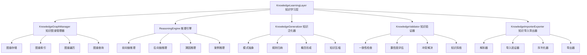
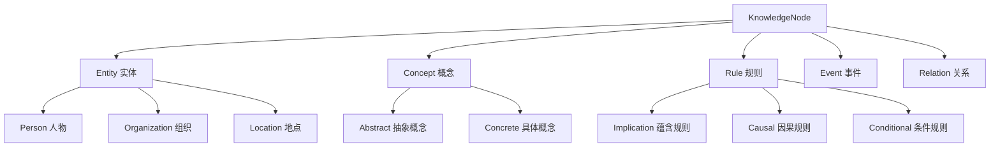
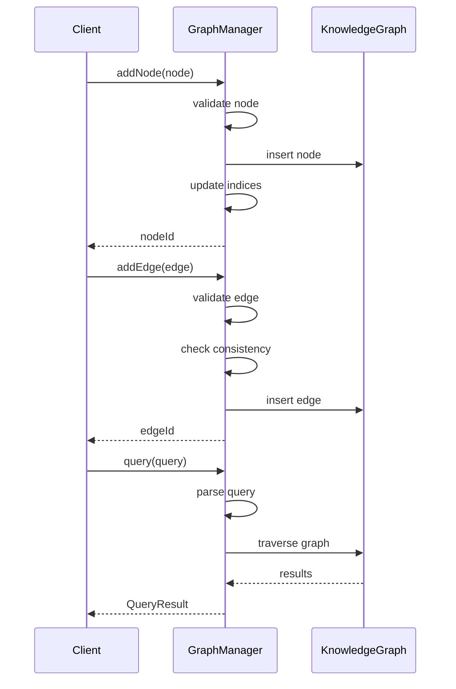
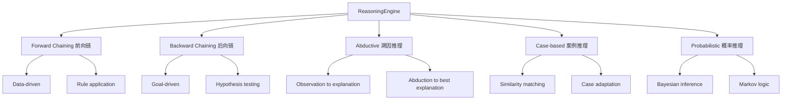
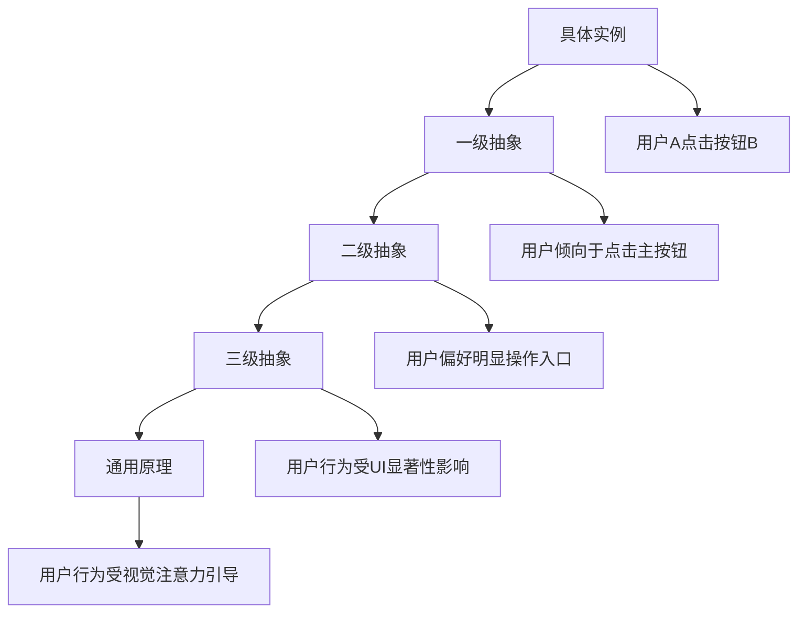
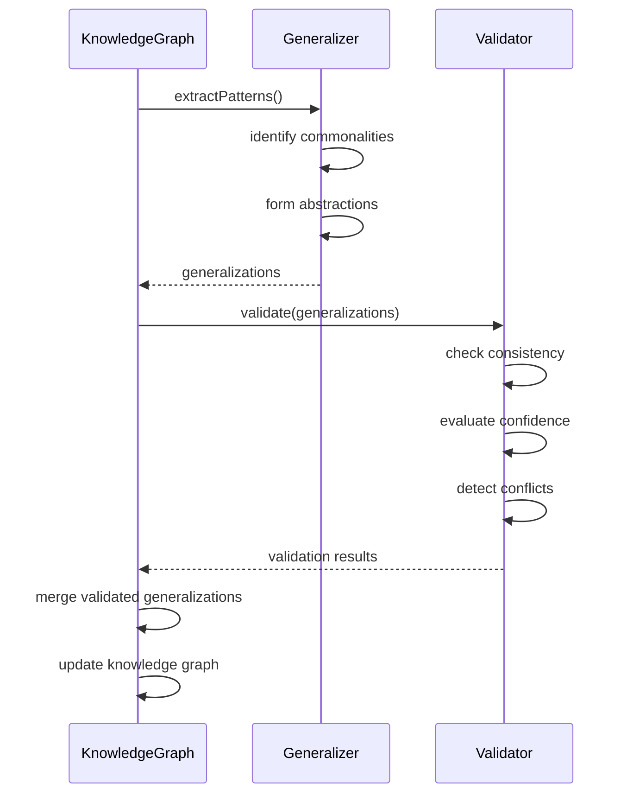
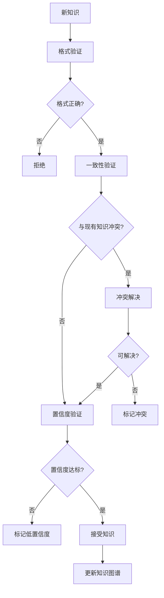

# YYC³ Knowledge Learning Layer - 架构设计

> **文档类型**: 架构设计
> **版本**: v1.0.0
> **创建日期**: 2026-01-03
> **最后更新**: 2026-01-03
> **维护者**: YYC³ AI Team
> **状态**: 已发布

---

## 📋 目录

- [层概述](#层概述)
- [架构设计](#架构设计)
- [核心模块](#核心模块)
- [知识图谱](#知识图谱)
- [推理引擎](#推理引擎)
- [知识泛化](#知识泛化)
- [验证机制](#验证机制)
- [接口定义](#接口定义)

---

## 📄 层概述

### 职责定位

Knowledge Learning Layer（知识学习层）是 YYC³ Learning System 的顶层，负责：

- 📚 **知识获取**: 从多种来源获取知识
- 🕸️ **知识表示**: 构建和维护知识图谱
- 🧠 **知识推理**: 基于知识进行推理推断
- 🔄 **知识更新**: 验证和更新现有知识
- 🎯 **知识泛化**: 抽象和泛化知识模式

### 设计原则

1. **知识驱动**: 以知识为中心指导系统行为
2. **可解释性**: 提供清晰的推理过程
3. **可扩展性**: 支持知识库的持续扩展
4. **一致性**: 保证知识的一致性和准确性

---

## 🏗️ 架构设计

### 架构图



### 模块职责

#### 1. KnowledgeGraphManager (知识图谱管理器)
**职责**: 管理知识图谱的存储和检索

**核心功能**:
- 图谱存储和索引
- 节点和边管理
- 图谱遍历和查询
- 图谱统计分析

**数据结构**:
```typescript
interface KnowledgeGraphManager {
  graph: KnowledgeGraph;
  nodeIndex: Map<string, KnowledgeNode>;
  edgeIndex: Map<string, KnowledgeEdge[]>;
  typeIndex: Map<string, string[]>; // type -> node IDs

  // 查询优化
  queryCache: Map<string, QueryResult>;
  accessStats: Map<string, AccessStatistics];
}
```

---

#### 2. ReasoningEngine (推理引擎)
**职责**: 执行知识推理

**核心功能**:
- 逻辑推理
- 规则匹配
- 因果推断
- 不确定性推理

**数据结构**:
```typescript
interface ReasoningEngine {
  knowledgeBase: KnowledgeBase;
  rules: ReasoningRule[];
  inferenceStrategy: InferenceStrategy;

  // 推理状态
  workingMemory: WorkingMemory;
  inferenceStack: InferenceStep[];
  cache: Map<string, ReasoningResult>;
}
```

---

#### 3. KnowledgeGeneralizer (知识泛化器)
**职责**: 抽象和泛化知识

**核心功能**:
- 模式抽象
- 规则归纳
- 概念形成
- 知识压缩

**数据结构**:
```typescript
interface KnowledgeGeneralizer {
  patterns: Pattern[];
  generalizations: Generalization[];

  // 泛化配置
  config: {
    minSupport: number;
    minConfidence: number;
    maxAbstractionLevel: number;
  };
}
```

---

#### 4. KnowledgeValidator (知识验证器)
**职责**: 验证知识质量

**核心功能**:
- 一致性检查
- 置信度评估
- 冲突检测
- 知识剪枝

**数据结构**:
```typescript
interface KnowledgeValidator {
  validationRules: ValidationRule[];
  confidenceModel: ConfidenceModel;
  conflictDetector: ConflictDetector;

  // 验证状态
  validationCache: Map<string, ValidationResult>;
  qualityMetrics: QualityMetrics;
}
```

---

## 🕸️ 知识图谱

### 图谱结构

```typescript
interface KnowledgeGraph {
  nodes: KnowledgeNode[];
  edges: KnowledgeEdge[];
  properties: GraphProperties;
  statistics: GraphStatistics;
}
```

### 节点类型



### 边类型

```typescript
interface KnowledgeEdge {
  id: string;
  source: string;               // 源节点 ID
  target: string;               // 目标节点 ID
  type: EdgeType;
  properties: EdgeProperties;
  weight: number;               // 关联强度
  confidence: number;           // 置信度
}

enum EdgeType {
  IsA = 'is_a',                 // 是一种
  HasProperty = 'has_property', // 具有属性
  RelatedTo = 'related_to',     // 相关联
  Causes = 'causes',            // 导致
  CausedBy = 'caused_by',      // 由...导致
  PartOf = 'part_of',          // 是...的一部分
  HasInstance = 'has_instance'  // 有实例
}
```

### 图谱操作



---

## 🧠 推理引擎

### 推理类型



### 推理过程

```typescript
interface ReasoningProcess {
  id: string;
  query: ReasoningQuery;
  strategy: InferenceStrategy;

  // 推理步骤
  steps: ReasoningStep[];

  // 推理状态
  workingMemory: {
    facts: Fact[];
    rules: Rule[];
    goals: Goal[];
    constraints: Constraint[];
  };

  // 推理结果
  conclusion: Conclusion;
  reasoning: ReasoningPath[];
  confidence: number;
  evidence: Evidence[];
}
```

### 推理规则

```typescript
interface ReasoningRule {
  id: string;
  name: string;
  type: RuleType;

  // 规则结构
  conditions: RuleCondition[];
  actions: RuleAction[];
  confidence: number;

  // 规则元数据
  priority: number;
  applicableContext: string[];
  limitations: string[];
}
```

---

## 🔄 知识泛化

### 泛化层次



### 泛化方法

```typescript
interface GeneralizationMethod {
  type: 'induction' | 'abstraction' | 'compression';

  // 归纳泛化
  induction?: {
    minInstances: number;        // 最小实例数
    minSupport: number;          // 最小支持度
    maxExceptions: number;       // 最大异常数
  };

  // 抽象泛化
  abstraction?: {
    levels: number;              // 抽象层数
    criteria: AbstractionCriteria[];
  };

  // 压缩泛化
  compression?: {
    targetSize: number;          // 目标大小
    retainEssential: boolean;    // 保留核心信息
  };
}
```

### 泛化过程



---

## ✅ 验证机制

### 验证类型

```typescript
enum ValidationType {
  Consistency = 'consistency',       // 一致性验证
  Completeness = 'completeness',     // 完整性验证
  Accuracy = 'accuracy',             // 准确性验证
  Relevance = 'relevance',           // 相关性验证
  Freshness = 'freshness'            // 新鲜度验证
}
```

### 验证规则

```typescript
interface ValidationRule {
  id: string;
  name: string;
  type: ValidationType;

  // 规则定义
  condition: {
    property: string;              // 验证属性
    operator: string;              // 比较操作符
    value: unknown;                // 期望值
  };

  // 验证动作
  action: {
    onPass: 'accept' | 'warn' | 'log';
    onFail: 'reject' | 'flag' | 'quarantine';
    severity: 'error' | 'warning' | 'info';
  };

  // 元数据
  enabled: boolean;
  priority: number;
}
```

### 验证流程



---

## 🔌 接口定义

### 核心接口

```typescript
interface IKnowledgeLearningLayer extends EventEmitter {
  // 状态
  readonly status: LayerStatus;
  readonly config: KnowledgeLayerConfig;
  readonly metrics: KnowledgeMetrics;
  readonly knowledge: KnowledgeGraph;
  readonly reasoning: ReasoningEngine;

  // 生命周期
  initialize(config: KnowledgeLayerConfig): Promise<void>;
  start(): Promise<void>;
  stop(): Promise<void>;

  // 知识管理
  acquireKnowledge(knowledge: KnowledgeItem): Promise<void>;
  acquireBatch(knowledge: KnowledgeItem[]): Promise<void>;
  getKnowledge(query: KnowledgeQuery): Promise<KnowledgeItem[]>;
  updateKnowledge(id: string, updates: KnowledgeUpdate): Promise<void>;
  deleteKnowledge(id: string): Promise<void>;

  // 推理
  reason(query: ReasoningQuery): Promise<ReasoningResult>;
  infer(facts: Fact[]): Promise<Conclusion>;
  explain(conclusion: Conclusion): Promise<Explanation>;

  // 泛化
  generalize(criteria: GeneralizationCriteria): Promise<GeneralizationResult>;
  abstract(patterns: Pattern[]): Promise<Concept[]>;
  induceRules(examples: Example[]): Promise<Rule[]>;

  // 验证
  validateKnowledge(id: string): Promise<ValidationResult>;
  validateAll(): Promise<ValidationResult[]>;
  checkConsistency(): Promise<ConsistencyReport>;

  // 导入导出
  importKnowledge(source: KnowledgeSource): Promise<KnowledgeImport>;
  exportKnowledge(format: ExportFormat): Promise<KnowledgeExport>;

  // 学习
  learnFromExperience(experience: LearningExperience): Promise<KnowledgeLearning>;
  optimizeKnowledge(timeRange: TimeRange): Promise<OptimizationResult>;
}
```

### 配置接口

```typescript
interface KnowledgeLayerConfig {
  enabled: boolean;
  graphSize: number;               // 知识图谱大小
  reasoningDepth: number;          // 推理深度
  validationThreshold: number;     // 验证阈值

  // 图谱配置
  graph?: {
    storage: 'memory' | 'database' | 'distributed';
    indexing: string[];
    caching: boolean;
  };

  // 推理配置
  reasoning?: {
    strategy: InferenceStrategy;
    maxSteps: number;
    timeout: number;
    confidenceThreshold: number;
  };

  // 泛化配置
  generalization?: {
    enabled: boolean;
    minSupport: number;
    minConfidence: number;
    maxLevel: number;
  };

  // 验证配置
  validation?: {
    autoValidate: boolean;
    rules: ValidationRule[];
    conflictResolution: 'merge' | 'prefer_new' | 'prefer_existing';
  };
}
```

---

## 📊 数据结构

### 知识项

```typescript
interface KnowledgeItem {
  id: string;
  type: KnowledgeType;
  content: KnowledgeContent;
  source: KnowledgeSource;
  confidence: number;
  validity: ValidityPeriod;
  relationships: KnowledgeRelationship[];
  metadata: KnowledgeMetadata;
}
```

### 推理查询

```typescript
interface ReasoningQuery {
  id: string;
  type: 'inference' | 'explanation' | 'verification';
  query: string;
  context: Record<string, unknown>;
  constraints: {
    maxResults?: number;
    confidence?: number;
    timeout?: number;
    depth?: number;
  };
}
```

### 推理结果

```typescript
interface ReasoningResult {
  id: string;
  query: ReasoningQuery;
  conclusion: string;
  reasoning: ReasoningPath[];
  confidence: number;
  evidence: Evidence[];
  timestamp: number;
}
```

---

## 📚 相关文档

### 架构文档
- [ARCH-LearningSystem-Overview.md](../ARCH-LearningSystem-Overview.md) - 系统架构概览
- [ARCH-BehavioralLayer.md](../ARCH-BehavioralLayer.md) - 行为层架构
- [ARCH-StrategicLayer.md](../ARCH-StrategicLayer.md) - 策略层架构

### API 文档
- [API-KnowledgeLayer.md](../api/API-KnowledgeLayer.md) - 知识层 API

---

## 📞 联系方式

- **技术团队**: YYC³ AI Team
- **邮箱**: ai-team@yyc3.com
- **问题反馈**: [GitHub Issues](https://github.com/YYC-Cube/learning-platform/issues)

---

**文档结束**
