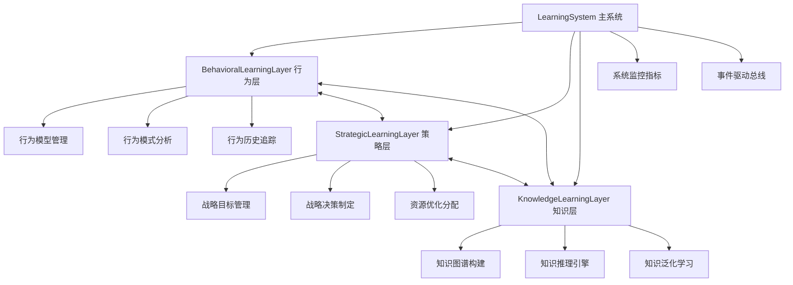
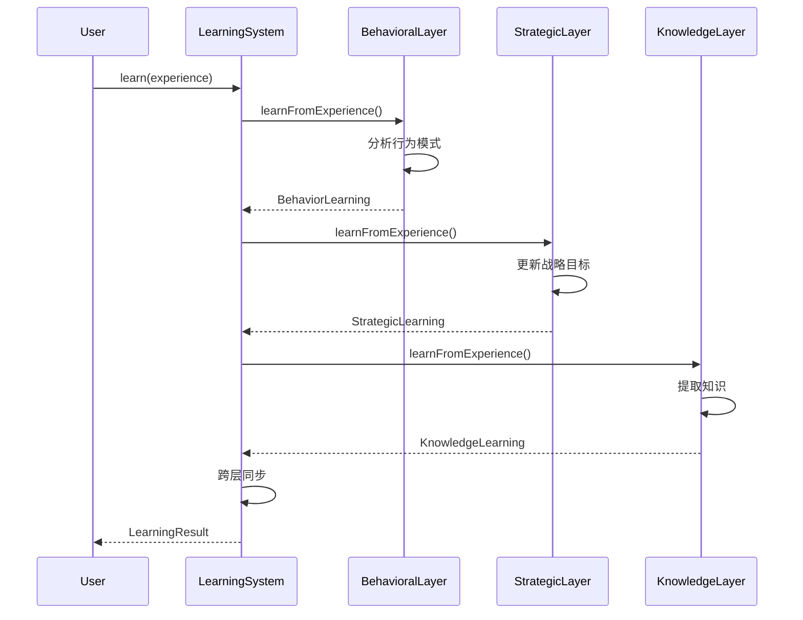
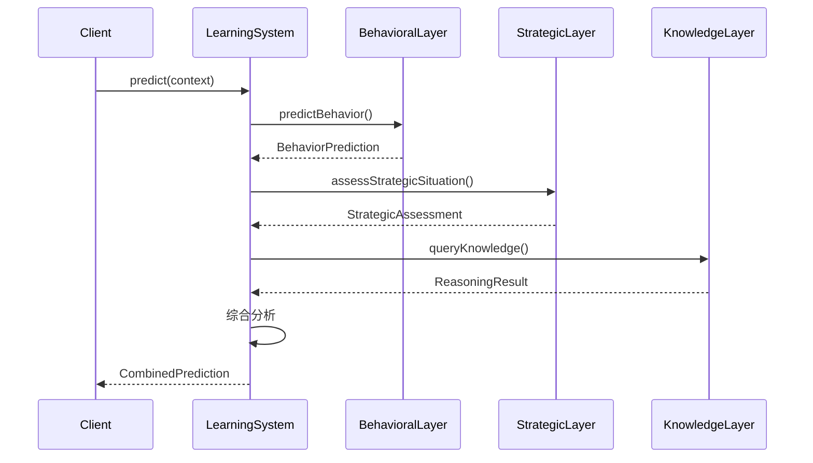

# YYC³ Learning System - 架构概览

> **文档类型**: 架构设计
> **版本**: v1.0.0
> **创建日期**: 2026-01-03
> **最后更新**: 2026-01-03
> **维护者**: YYC³ AI Team
> **状态**: 已发布

---

## 📋 目录

- [系统概述](#系统概述)
- [三层架构设计](#三层架构设计)
- [核心模块](#核心模块)
- [数据流](#数据流)
- [类型系统](#类型系统)
- [技术栈](#技术栈)
- [架构图](#架构图)

---

## 📄 系统概述

YYC³ Learning System 是一个基于 TypeScript 的三层智能学习系统，提供行为学习、策略学习和知识学习三大核心能力。

### 核心特性
- 🧠 **三层学习架构**: 行为层、策略层、知识层
- 🔄 **跨层协同**: 层间数据同步和洞察共享
- 📊 **实时监控**: 全方位系统指标监控
- 🎯 **自适应优化**: 基于反馈的自动调优
- 🔒 **类型安全**: 完整的 TypeScript 类型定义

### 设计原则
1. **模块化**: 每一层独立运作，接口清晰
2. **可扩展**: 支持自定义策略和算法
3. **高性能**: 优化的数据结构和算法
4. **可观测**: 完善的监控和日志体系

---

## 🏗️ 三层架构设计

### 架构图



### 层级职责

#### 1. 行为学习层 (Behavioral Learning Layer)
**职责**: 捕获、分析和预测行为模式

**核心功能**:
- 行为记录和存储
- 模式识别和分类
- 预测模型训练
- 实时行为预测
- 自适应反馈优化

**输出**:
- 行为模式 (BehaviorPattern)
- 行为预测 (BehaviorPrediction)
- 适应策略 (AdaptationStrategy)

#### 2. 策略学习层 (Strategic Learning Layer)
**职责**: 制定和优化战略决策

**核心功能**:
- 战略目标设定
- 决策场景分析
- 策略评估优化
- 资源动态分配
- 风险评估管理

**输出**:
- 战略目标 (StrategicGoal)
- 战略决策 (StrategicDecision)
- 资源分配方案 (ResourceAllocation)

#### 3. 知识学习层 (Knowledge Learning Layer)
**职责**: 知识管理、推理和泛化

**核心功能**:
- 知识图谱构建
- 知识推理推断
- 知识泛化抽象
- 知识验证更新
- 知识导入导出

**输出**:
- 知识项 (KnowledgeItem)
- 推理结果 (ReasoningResult)
- 泛化模式 (Generalization)

---

## 🧩 核心模块

### 1. LearningSystem (主系统)

**职责**: 协调三层学习，提供统一接口

```typescript
class LearningSystem {
  // 系统状态
  readonly status: LayerStatus;
  readonly config: LearningSystemConfig;
  readonly metrics: LearningSystemMetrics;

  // 三层学习
  readonly behavioralLayer: IBehavioralLearningLayer;
  readonly strategicLayer: IStrategicLearningLayer;
  readonly knowledgeLayer: IKnowledgeLearningLayer;

  // 核心方法
  initialize(config: LearningSystemConfig): Promise<void>;
  start(): Promise<void>;
  stop(): Promise<void>;

  // 学习接口
  learn(experience: LearningExperience): Promise<LearningResult>;
  predict(context: BehaviorContext): Promise<BehaviorPrediction>;
  optimize(): Promise<PerformanceOptimizationResult>;
}
```

### 2. 类型系统

**统一类型定义** (`src/types/common.types.ts`)

| 类型 | 用途 | 定义位置 |
|------|------|----------|
| `ConfigObject` | 动态配置对象 | common.types.ts:182 |
| `Content` | 通用内容包装 | common.types.ts:203 |
| `NodeData` | 节点数据结构 | common.types.ts:214 |
| `Pattern` | 模式数据结构 | common.types.ts:225 |
| `Recommendation` | 推荐数据结构 | common.types.ts:237 |
| `RiskAssessment` | 风险评估数据 | common.types.ts:253 |
| `LearningInsight` | 学习洞察数据 | common.types.ts:307 |

### 3. 事件驱动架构

**核心事件**:
- `behavior_learned`: 行为学习完成
- `strategy_updated`: 策略更新完成
- `knowledge_acquired`: 知识获取完成
- `pattern_discovered`: 模式发现事件
- `optimization_complete`: 优化完成事件

---

## 🔄 数据流

### 学习数据流



### 预测数据流



---

## 🎨 类型系统架构

### 类型层次结构

```
common.types.ts (公共类型)
├── 基础类型
│   ├── EntityId (string)
│   ├── Timestamp (number)
│   ├── Confidence (number)
│   └── Priority (union)
├── 数据类型
│   ├── FeatureVector
│   ├── TrainingData
│   └── Label
├── 结果类型
│   ├── Result<T, E>
│   ├── PaginatedResponse<T>
│   └── ValidationResult
└── 内容类型
    ├── Content
    ├── NodeData
    ├── Pattern
    └── Recommendation

ILearningSystem.ts (接口类型)
├── 行为层接口
│   ├── BehaviorPattern
│   ├── BehaviorPrediction
│   └── BehaviorContext
├── 策略层接口
│   ├── StrategicGoal
│   ├── StrategicDecision
│   └── DecisionContext
└── 知识层接口
    ├── KnowledgeItem
    ├── KnowledgeGraph
    └── ReasoningResult
```

---

## 🛠️ 技术栈

### 核心技术

| 技术 | 版本 | 用途 |
|------|------|------|
| TypeScript | 5.9.3+ | 类型安全开发 |
| Bun | 1.0.0+ | 运行时和构建工具 |
| Node.js | 18.0.0+ | 运行环境 |

### 主要依赖

```json
{
  "dependencies": {
    "zod": "^3.22.4",           // Schema 验证
    "eventemitter3": "^5.0.1",  // 事件驱动
    "lodash": "^4.17.21",       // 工具函数
    "uuid": "^9.0.1"            // 唯一标识符
  }
}
```

### 开发工具

| 工具 | 用途 |
|------|------|
| ESLint | 代码检查 |
| Prettier | 代码格式化 |
| TypeDoc | API 文档生成 |
| bun test | 单元测试 |

---

## 📊 系统指标

### 核心指标 (LearningSystemMetrics)

```typescript
interface LearningSystemMetrics {
  // 性能指标
  performance: {
    avgResponseTime: number;      // 平均响应时间
    throughput: number;            // 吞吐量
    errorRate: number;             // 错误率
  };

  // 学习指标
  learning: {
    totalExperiences: number;      // 总经验数
    patternsDiscovered: number;    // 发现模式数
    predictionsMade: number;       // 预测次数
    accuracy: number;              // 预测准确率
  };

  // 资源指标
  resources: {
    memoryUsage: number;           // 内存使用
    cpuUsage: number;              // CPU 使用
    knowledgeItems: number;        // 知识项数量
    activeModels: number;          // 活跃模型数
  };

  // 同步指标
  synchronization: {
    lastSyncTime: number;          // 最后同步时间
    syncFrequency: number;         // 同步频率
    pendingInsights: number;       // 待处理洞察数
  };
}
```

---

## 🔧 配置系统

### 系统配置 (LearningSystemConfig)

```typescript
interface LearningSystemConfig {
  // 行为层配置
  behavioral: BehavioralLayerConfig;
  // 策略层配置
  strategic: StrategicLayerConfig;
  // 知识层配置
  knowledge: KnowledgeLayerConfig;

  // 集成配置
  integration: IntegrationConfig;
  // 监控配置
  monitoring: MonitoringConfig;
  // 安全配置
  security: SecurityConfig;
}
```

### 配置示例

```typescript
const config: LearningSystemConfig = {
  behavioral: {
    enabled: true,
    modelType: 'classification',
    updateFrequency: 1000,
    maxHistorySize: 10000
  },
  strategic: {
    enabled: true,
    planningHorizon: 90,
    optimizationFrequency: 3600000
  },
  knowledge: {
    enabled: true,
    graphSize: 100000,
    reasoningDepth: 5
  },
  integration: {
    syncFrequency: 60000,
    insightQueueSize: 1000
  },
  monitoring: {
    metricsCollection: true,
    logLevel: 'info'
  },
  security: {
    encryption: true,
    accessControl: true
  }
};
```

---

## 📚 相关文档

### 架构文档
- [ARCH-BehavioralLayer.md](./ARCH-BehavioralLayer.md) - 行为层架构
- [ARCH-StrategicLayer.md](./ARCH-StrategicLayer.md) - 策略层架构
- [ARCH-KnowledgeLayer.md](./ARCH-KnowledgeLayer.md) - 知识层架构

### API 文档
- [API-LearningSystem.md](../api/API-LearningSystem.md) - 主系统 API
- [API-BehavioralLayer.md](../api/API-BehavioralLayer.md) - 行为层 API
- [API-StrategicLayer.md](../api/API-StrategicLayer.md) - 策略层 API
- [API-KnowledgeLayer.md](../api/API-KnowledgeLayer.md) - 知识层 API

### 开发指南
- [GUIDE-Installation.md](../guides/GUIDE-Installation.md) - 安装指南
- [GUIDE-QuickStart.md](../guides/GUIDE-QuickStart.md) - 快速开始
- [GUIDE-Contributing.md](../guides/GUIDE-Contributing.md) - 贡献指南

### 类型文档
- [TYPES-Common.md](../types/TYPES-Common.md) - 公共类型
- [TYPES-Interfaces.md](../types/TYPES-Interfaces.md) - 接口类型

---

## 📞 联系方式

- **技术团队**: YYC³ AI Team
- **邮箱**: ai-team@yyc3.com
- **问题反馈**: [GitHub Issues](https://github.com/YYC-Cube/learning-platform/issues)

---

**文档结束**
