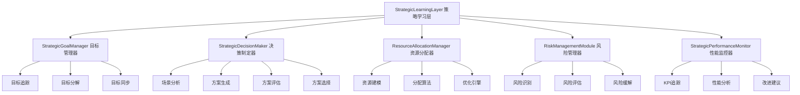
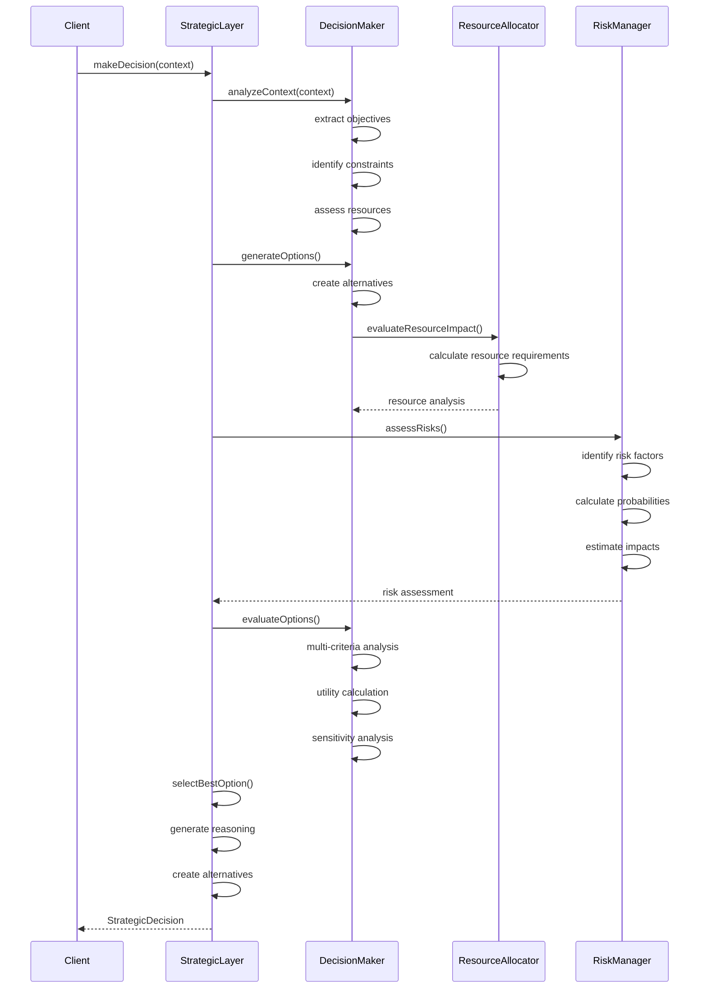
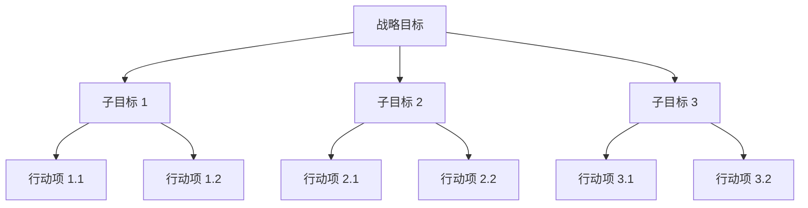
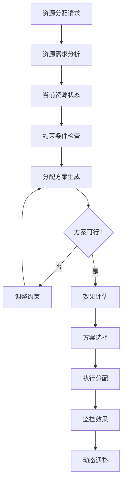

# YYC³ Strategic Learning Layer - 架构设计

> **文档类型**: 架构设计
> **版本**: v1.0.0
> **创建日期**: 2026-01-03
> **最后更新**: 2026-01-03
> **维护者**: YYC³ AI Team
> **状态**: 已发布

---

## 📋 目录

- [层概述](#层概述)
- [架构设计](#架构设计)
- [核心模块](#核心模块)
- [决策流程](#决策流程)
- [目标管理](#目标管理)
- [策略优化](#策略优化)
- [资源分配](#资源分配)
- [接口定义](#接口定义)

---

## 📄 层概述

### 职责定位

Strategic Learning Layer（策略学习层）是 YYC³ Learning System 的中层，负责：

- 🎯 **战略规划**: 制定长期和短期战略目标
- 🎲 **决策制定**: 在复杂场景下做出最优决策
- 📊 **资源优化**: 动态分配和优化资源使用
- ⚖️ **风险评估**: 评估和管理决策风险
- 📈 **性能追踪**: 监控和评估战略执行效果

### 设计原则

1. **目标导向**: 所有决策围绕战略目标展开
2. **全局最优**: 考虑系统的整体利益而非局部优化
3. **动态调整**: 根据环境变化动态调整策略
4. **可解释性**: 提供清晰的决策推理过程

---

## 🏗️ 架构设计

### 架构图



### 模块职责

#### 1. StrategicGoalManager (战略目标管理器)
**职责**: 管理战略目标的完整生命周期

**核心功能**:
- 目标设定和分解
- 目标进度追踪
- 目标依赖管理
- 目标冲突解决

**数据结构**:
```typescript
interface GoalManager {
  goals: Map<string, StrategicGoal>;
  goalHierarchy: Map<string, string[]>; // parent -> children
  dependencies: Map<string, string[]>;   // goal -> dependencies
  milestones: Map<string, Milestone[]>;
}
```

---

#### 2. StrategicDecisionMaker (战略决策制定器)
**职责**: 在复杂场景下制定决策

**核心功能**:
- 场景分析和建模
- 决策方案生成
- 多准则决策评估
- 决策推理记录

**数据结构**:
```typescript
interface DecisionMaker {
  decisionFrameworks: Map<string, DecisionFramework>;
  optionGenerators: Map<string, OptionGenerator>;
  evaluators: Map<string, CriteriaEvaluator>;
  decisionHistory: StrategicDecision[];
}
```

---

#### 3. ResourceAllocationManager (资源分配管理器)
**职责**: 优化资源分配

**核心功能**:
- 资源需求预测
- 分配方案生成
- 分配效果评估
- 动态调整优化

**数据结构**:
```typescript
interface AllocationManager {
  resources: Map<string, ResourceDefinition>;
  allocations: Map<string, ResourceAllocation>;
  constraints: AllocationConstraint[];
  optimizationStrategy: OptimizationStrategy;
}
```

---

#### 4. RiskManagementModule (风险管理模块)
**职责**: 识别和评估决策风险

**核心功能**:
- 风险因素识别
- 风险概率评估
- 风险影响分析
- 风险缓解策略

**数据结构**:
```typescript
interface RiskManager {
  riskFactors: Map<string, RiskFactor>;
  assessments: Map<string, RiskAssessment>;
  mitigationStrategies: Map<string, MitigationStrategy>;
  riskHistory: RiskRecord[];
}
```

---

#### 5. StrategicPerformanceMonitor (战略性能监控器)
**职责**: 监控战略执行效果

**核心功能**:
- KPI 指标追踪
- 性能趋势分析
- 偏差检测
- 改进建议生成

**数据结构**:
```typescript
interface PerformanceMonitor {
  kpis: Map<string, KPIDefinition>;
  measurements: Map<string, Measurement[]>;
  thresholds: Map<string, Threshold>;
  reports: PerformanceReport[];
}
```

---

## 🔄 决策流程

### 决策制定流程



### 决策评估框架

```typescript
interface DecisionFramework {
  name: string;
  type: 'utility' | 'cost_benefit' | 'multi_criteria' | 'game_theoretic';

  // 评估准则
  criteria: {
    objective: string;          // 目标
    weight: number;             // 权重
    measurement: string;        // 测量方法
    threshold: number;          // 阈值
  }[];

  // 决策规则
  rules: {
    if: string;                // 条件
    then: string;              // 结果
    priority: number;          // 优先级
  }[];

  // 敏感性分析
  sensitivity: {
    factor: string;            // 影响因素
    range: [number, number];   // 变化范围
    impact: number;            // 影响程度
  }[];
}
```

---

## 🎯 目标管理

### 目标类型

```typescript
enum GoalType {
  Performance = 'performance',     // 性能目标
  Efficiency = 'efficiency',       // 效率目标
  Quality = 'quality',             // 质量目标
  Cost = 'cost',                   // 成本目标
  Time = 'time',                   // 时间目标
  Strategic = 'strategic'          // 战略目标
}
```

### 目标结构

```typescript
interface StrategicGoal {
  id: string;
  name: string;
  description: string;
  type: GoalType;
  priority: Priority;

  // 目标值
  targetValue: TargetValue;
  currentValue: number;
  progress: number;              // 0-1

  // 时间规划
  deadline: number;
  milestones: Milestone[];
  timeline: PlanTimeline;

  // 依赖关系
  dependencies: string[];        // 依赖的其他目标
  constraints: Constraint[];     // 约束条件
  resources: Resource[];         // 所需资源

  // 状态
  status: GoalStatus;
  metrics: GoalMetrics;

  // 责任
  owner: string;
  stakeholders: string[];

  // 元数据
  tags: string[];
  createdAt: number;
  updatedAt: number;
}
```

### 目标分解



---

## 📊 资源分配

### 资源类型

```typescript
enum ResourceType {
  Compute = 'compute',           // 计算资源
  Storage = 'storage',           // 存储资源
  Network = 'network',           // 网络资源
  Human = 'human',               // 人力资源
  Financial = 'financial',       // 财务资源
  Time = 'time'                  // 时间资源
}
```

### 分配策略

```typescript
interface ResourceAllocation {
  id: string;
  timestamp: number;
  timeRange: TimeRange;

  // 分配方案
  allocations: {
    resourceId: string;
    allocation: Record<string, number>;
    constraints: Constraint[];
    priority: Priority;
  }[];

  // 优化目标
  objectives: {
    type: 'maximize' | 'minimize' | 'optimize';
    target: string;
    weight: number;
  }[];

  // 效果预测
  expectedOutcomes: {
    utilization: number;
    cost: number;
    benefit: number;
    risk: number;
  };
}
```

### 分配算法



---

## ⚖️ 风险管理

### 风险评估

```typescript
interface RiskAssessment {
  id: string;
  timestamp: number;
  scenario: DecisionContext;

  // 风险识别
  risks: {
    id: string;
    type: RiskType;
    description: string;

    // 概率和影响
    probability: number;        // 发生概率
    impact: {
      severity: 'low' | 'medium' | 'high' | 'critical';
      financial: number;
      operational: number;
      reputational: number;
    };

    // 缓解策略
    mitigation: {
      strategy: string;
      cost: number;
      effectiveness: number;
      timeline: number;
    };
  }[];

  // 整体评估
  overallRisk: number;
  riskTolerance: number;
  residualRisk: number;
}
```

### 风险类型

```typescript
enum RiskType {
  Financial = 'financial',         // 财务风险
  Operational = 'operational',     // 运营风险
  Strategic = 'strategic',         // 战略风险
  Technical = 'technical',         // 技术风险
  Market = 'market',              // 市场风险
  Regulatory = 'regulatory',       // 监管风险
  Reputational = 'reputational'    // 声誉风险
}
```

---

## 📈 性能监控

### KPI 体系

```typescript
interface KPIDefinition {
  id: string;
  name: string;
  category: 'performance' | 'efficiency' | 'quality' | 'cost';

  // 测量方法
  measurement: {
    formula: string;
    unit: string;
    frequency: number;
    dataSource: string;
  };

  // 目标设定
  target: {
    value: number;
    tolerance: number;
    direction: 'higher_is_better' | 'lower_is_better';
  };

  // 告警
  alerts: {
    threshold: number;
    severity: 'info' | 'warning' | 'critical';
    action: string;
  }[];
}
```

### 性能分析

```typescript
interface PerformanceAnalysis {
  id: string;
  timestamp: number;
  timeRange: TimeRange;

  // 目标达成
  goalAchievement: {
    goalId: string;
    targetValue: number;
    currentValue: number;
    achievement: number;         // 达成率
    variance: number;            // 偏差
    trend: 'improving' | 'stable' | 'declining';
  }[];

  // 时间线遵守
  timelineAdherence: {
    planned: number;
    actual: number;
    variance: number;
    onTimeMilestones: number;
    delayedMilestones: number[];
  };

  // 资源使用
  resourceUsage: {
    planned: number;
    actual: number;
    efficiency: number;
    waste: number;
  };

  // 质量评分
  qualityScore: {
    accuracy: number;
    completeness: number;
    reliability: number;
    overall: number;
  };

  // 建议
  recommendations: Recommendation[];
}
```

---

## 🔌 接口定义

### 核心接口

```typescript
interface IStrategicLearningLayer extends EventEmitter {
  // 状态
  readonly status: LayerStatus;
  readonly config: StrategicLayerConfig;
  readonly metrics: StrategicMetrics;

  // 生命周期
  initialize(config: StrategicLayerConfig): Promise<void>;
  start(): Promise<void>;
  stop(): Promise<void>;

  // 目标管理
  setGoals(goals: StrategicGoal[]): Promise<void>;
  getGoals(filter?: GoalFilter): Promise<StrategicGoal[]>;
  updateGoal(goalId: string, updates: GoalUpdate): Promise<void>;
  deleteGoal(goalId: string): Promise<void>;
  trackGoalProgress(goalId: string): Promise<GoalProgress>;

  // 决策制定
  makeDecision(context: DecisionContext): Promise<StrategicDecision>;
  evaluateDecision(decision: StrategicDecision): Promise<DecisionEvaluation>;
  implementDecision(decision: StrategicDecision): Promise<ImplementationResult>;

  // 资源管理
  allocateResources(request: ResourceAllocationRequest): Promise<ResourceAllocation>;
  optimizeAllocation(current: ResourceAllocation): Promise<ResourceAllocation>;
  getResourceUtilization(): Promise<ResourceUtilization>;

  // 风险管理
  assessRisks(scenario: DecisionContext): Promise<RiskAssessment>;
  mitigateRisks(assessment: RiskAssessment): Promise<MitigationResult>;

  // 性能监控
  monitorPerformance(plan: StrategicPlan): Promise<PlanEvaluation>;
  generateReport(timeRange: TimeRange): Promise<PerformanceReport>;

  // 学习
  learnFromExperience(experience: LearningExperience): Promise<StrategicLearning>;
  optimizeStrategy(plan: StrategicPlan): Promise<OptimizationResult>;
}
```

### 配置接口

```typescript
interface StrategicLayerConfig {
  enabled: boolean;
  planningHorizon: number;            // 规划周期 (天)
  optimizationFrequency: number;       // 优化频率 (ms)
  riskTolerance: 'low' | 'medium' | 'high';

  // 决策配置
  decision?: {
    framework: DecisionFramework;
    maxOptions: number;
    evaluationCriteria: string[];
  };

  // 资源配置
  resources?: {
    constraints: ResourceConstraint[];
    optimizationStrategy: 'greedy' | 'genetic' | 'simulated_annealing';
  };

  // 风险配置
  risk?: {
    assessmentMethod: 'quantitative' | 'qualitative' | 'hybrid';
    toleranceLevel: number;
    mitigationStrategies: string[];
  };
}
```

---

## 📊 最佳实践

### 决策制定

1. **明确目标**: 清晰定义决策目标
2. **多方案比较**: 生成多个可选方案
3. **量化评估**: 使用可量化的评估标准
4. **风险考虑**: 全面评估潜在风险
5. **迭代优化**: 持续改进决策质量

### 目标管理

1. **SMART 原则**:
   - Specific (具体的)
   - Measurable (可衡量的)
   - Achievable (可实现的)
   - Relevant (相关的)
   - Time-bound (有时限的)

2. **目标分解**: 将大目标分解为可执行的小目标
3. **定期回顾**: 定期检查目标进度
4. **灵活调整**: 根据实际情况调整目标

### 资源优化

1. **需求预测**: 准确预测资源需求
2. **合理分配**: 按优先级合理分配资源
3. **动态调整**: 根据实际情况动态调整
4. **效率监控**: 持续监控资源使用效率

---

## 📚 相关文档

### 架构文档
- [ARCH-LearningSystem-Overview.md](../ARCH-LearningSystem-Overview.md) - 系统架构概览
- [ARCH-BehavioralLayer.md](../ARCH-BehavioralLayer.md) - 行为层架构
- [ARCH-KnowledgeLayer.md](../ARCH-KnowledgeLayer.md) - 知识层架构

### API 文档
- [API-StrategicLayer.md](../api/API-StrategicLayer.md) - 策略层 API

---

## 📞 联系方式

- **技术团队**: YYC³ AI Team
- **邮箱**: ai-team@yyc3.com
- **问题反馈**: [GitHub Issues](https://github.com/YYC-Cube/learning-platform/issues)

---

**文档结束**
