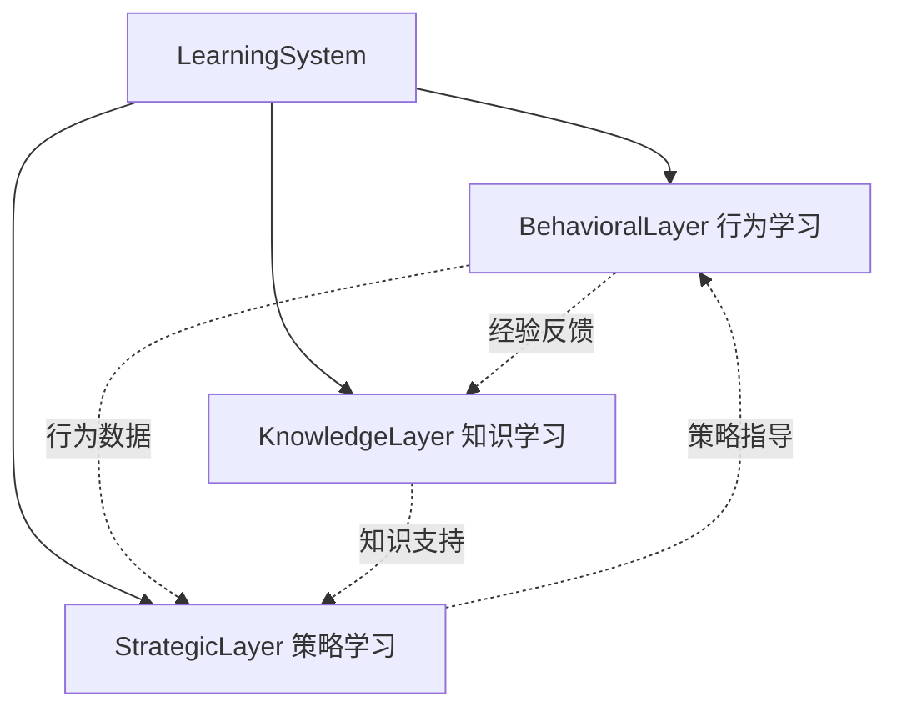
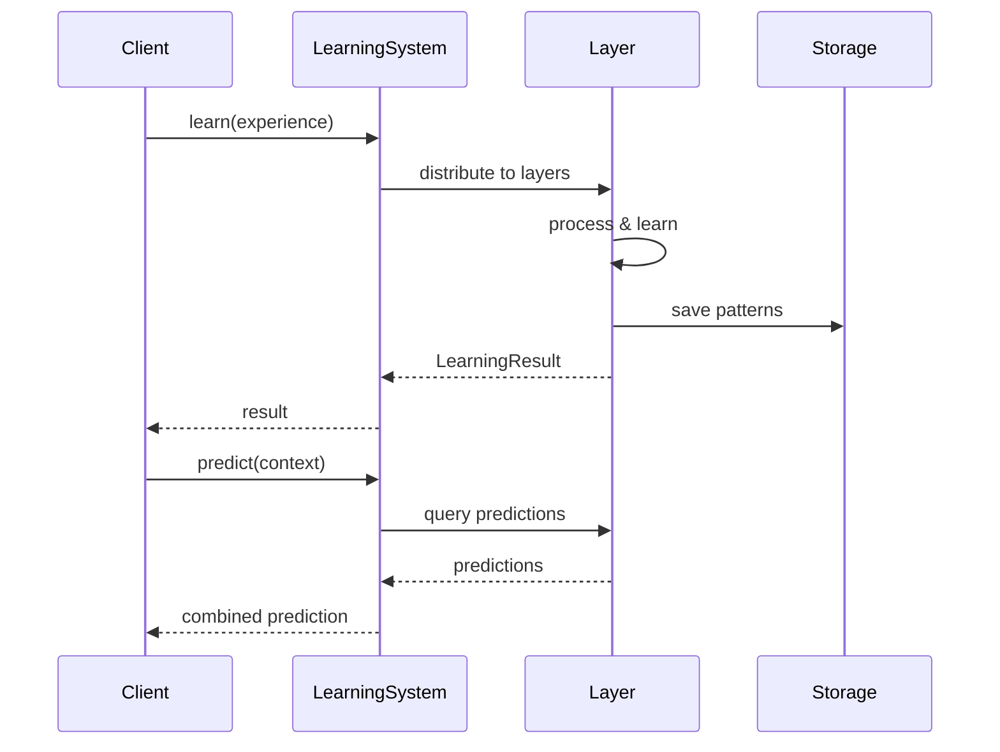

# YYC³ Learning System - 快速开始指南

> **文档类型**: 开发指南
> **版本**: v1.0.0
> **创建日期**: 2026-01-03
> **最后更新**: 2026-01-03
> **维护者**: YYC³ AI Team
> **状态**: 已发布

---

## 📋 目录

- [环境准备](#环境准备)
- [安装](#安装)
- [快速示例](#快速示例)
- [核心概念](#核心概念)
- [下一步](#下一步)

---

## 🚀 环境准备

### 系统要求

- **Node.js**: >= 18.0.0
- **Bun**: >= 1.0.0 (推荐)
- **TypeScript**: >= 5.0.0
- **操作系统**: Linux, macOS, Windows

### 验证环境

```bash
# 检查 Node.js 版本
node --version  # 应该 >= 18.0.0

# 检查 Bun 版本
bun --version   # 应该 >= 1.0.0

# 检查 TypeScript 版本
tsc --version   # 应该 >= 5.0.0
```

---

## 📦 安装

### 1. 创建新项目

```bash
# 创建项目目录
mkdir my-learning-app
cd my-learning-app

# 初始化项目
bun init -y

# 安装 Learning System
bun add @yyc3/learning-system
```

### 2. 配置 TypeScript

创建 `tsconfig.json`:

```json
{
  "compilerOptions": {
    "target": "ESNext",
    "module": "ESNext",
    "moduleResolution": "bundler",
    "esModuleInterop": true,
    "strict": true,
    "skipLibCheck": true,
    "forceConsistentCasingInFileNames": true,
    "resolveJsonModule": true,
    "isolatedModules": true,
    "noEmit": true,
    "declaration": true,
    "outDir": "./dist"
  },
  "include": ["src/**/*"],
  "exclude": ["node_modules"]
}
```

### 3. 创建源文件

```bash
mkdir src
touch src/index.ts
```

---

## ⚡ 快速示例

### 基础使用

```typescript
// src/index.ts
import { LearningSystem } from '@yyc3/learning-system';
import type { LearningExperience, BehaviorContext } from '@yyc3/learning-system';

// 1. 创建学习系统实例
const system = new LearningSystem();

// 2. 初始化系统
await system.initialize({
  behavioral: {
    enabled: true,
    modelType: 'classification',
    updateFrequency: 1000,
    maxHistorySize: 10000
  },
  strategic: {
    enabled: true,
    planningHorizon: 90,
    optimizationFrequency: 3600000
  },
  knowledge: {
    enabled: true,
    graphSize: 100000,
    reasoningDepth: 5
  }
});

// 3. 启动系统
await system.start();
console.log('Learning System started!');

// 4. 从经验中学习
const experience: LearningExperience = {
  id: 'exp_001',
  timestamp: Date.now(),
  context: {
    situation: { type: 'user_interaction', severity: 'normal' },
    environment: { state: 'production' },
    objectives: [{ id: 'obj_1', description: 'Optimize response' }],
    constraints: [],
    availableResources: []
  },
  actions: [{
    type: 'adjust_parameters',
    parameters: { learningRate: 0.01 }
  }],
  outcomes: [{
    success: true,
    effectiveness: 0.85,
    sideEffects: [],
    measurements: []
  }],
  feedback: {
    satisfaction: 0.9,
    effectiveness: 0.85
  },
  metadata: {
    source: 'production',
    version: '1.0'
  }
};

const result = await system.learn(experience);
console.log('Learning result:', result.success);

// 5. 预测行为
const context: BehaviorContext = {
  situation: { type: 'user_session' },
  environment: { state: 'active' },
  actor: { id: 'user_001', type: 'human' }
};

const prediction = await system.predict(context);
console.log('Predicted behavior:', prediction.predictedBehavior.type);
console.log('Confidence:', prediction.confidence);

// 6. 监听事件
system.on('pattern_discovered', (pattern) => {
  console.log('New pattern discovered:', pattern.id);
});

system.on('error', (error) => {
  console.error('System error:', error.message);
});

// 7. 优雅关闭
process.on('SIGINT', async () => {
  console.log('Shutting down...');
  await system.stop();
  process.exit(0);
});
```

### 运行示例

```bash
# 运行 TypeScript 文件
bun run src/index.ts

# 或者先编译再运行
bun build src/index.ts --outdir ./dist
node dist/index.js
```

---

## 🎯 核心概念

### 1. 三层学习架构

YYC³ Learning System 采用三层学习架构：



#### 行为学习层 (Behavioral Learning Layer)
- **职责**: 捕获和分析行为模式
- **输入**: 行为记录 (BehaviorRecord)
- **输出**: 行为预测 (BehaviorPrediction)
- **使用场景**: 用户行为分析、系统监控、异常检测

#### 策略学习层 (Strategic Learning Layer)
- **职责**: 制定和优化战略决策
- **输入**: 决策上下文 (DecisionContext)
- **输出**: 战略决策 (StrategicDecision)
- **使用场景**: 资源分配、目标规划、风险评估

#### 知识学习层 (Knowledge Learning Layer)
- **职责**: 知识管理和推理
- **输入**: 知识项 (KnowledgeItem)
- **输出**: 推理结果 (ReasoningResult)
- **使用场景**: 知识图谱、智能问答、规则推理

### 2. 学习流程



### 3. 事件驱动

系统采用事件驱动架构，支持监听和响应各种事件：

```typescript
// 监听模式发现事件
system.on('pattern_discovered', (pattern) => {
  console.log('Pattern:', pattern.id, pattern.description);
});

// 监听学习完成事件
system.on('learned', (result) => {
  console.log('Learning completed:', result.success);
});

// 监听错误事件
system.on('error', (error) => {
  console.error('Error:', error.message);
});

// 监听优化完成事件
system.on('optimized', (result) => {
  console.log('Optimization gain:', result.performanceGain);
});
```

---

## 💡 使用场景

### 场景 1: 用户行为分析

```typescript
import { createBehaviorRecord } from '@yyc3/learning-system';

// 记录用户行为
await system.behavioralLayer.recordBehavior(
  createBehaviorRecord({
    actor: { id: 'user_123', type: 'human' },
    action: { type: 'click', parameters: { element: 'buy_button' } },
    context: { situation: { type: 'purchase_flow' } },
    outcome: { result: { success: true }, effectiveness: 1.0 }
  })
);

// 分析用户行为模式
const patterns = await system.behavioralLayer.analyzePatterns({
  start: Date.now() - 7 * 24 * 3600 * 1000, // 最近7天
  end: Date.now()
});

console.log('Discovered patterns:', patterns.length);
```

### 场景 2: 智能决策

```typescript
// 设定战略目标
await system.strategicLayer.setGoals([
  {
    id: 'goal_001',
    name: 'Increase Conversion Rate',
    description: 'Achieve 5% conversion rate',
    priority: 'high',
    targetValue: 0.05,
    currentValue: 0.03,
    deadline: Date.now() + 90 * 24 * 3600 * 1000
  }
]);

// 制定决策
const decision = await system.strategicLayer.makeDecision({
  situation: { type: 'marketing_optimization' },
  objectives: ['maximize_conversion', 'minimize_cost'],
  constraints: ['budget_limit'],
  availableOptions: [
    { id: 'opt_1', description: 'Increase ad spend', cost: 5000 },
    { id: 'opt_2', description: 'Optimize landing page', cost: 2000 }
  ]
});

console.log('Recommended action:', decision.selectedOption);
```

### 场景 3: 知识推理

```typescript
// 添加知识
await system.knowledgeLayer.acquireKnowledge({
  id: 'rule_001',
  type: 'rule',
  content: {
    id: 'content_001',
    type: 'rule',
    content: 'If user spends > 5 minutes, show recommendation',
    format: 'text'
  },
  source: { id: 'expert', type: 'human', name: 'Business Expert', reliability: 0.9 },
  confidence: 0.95,
  validity: {
    start: Date.now(),
    end: null,
    confidence: 0.9
  },
  relationships: [],
  metadata: {
    tags: ['recommendation', 'engagement'],
    source: 'expert',
    version: '1.0'
  }
});

// 推理查询
const result = await system.knowledgeLayer.reason({
  id: 'query_001',
  type: 'inference',
  query: 'What should I do for long session users?',
  context: { domain: 'user_engagement' },
  constraints: { maxResults: 3, confidence: 0.8 }
});

console.log('Recommendation:', result.conclusion);
```

---

## 🔧 高级配置

### 自定义配置

```typescript
await system.initialize({
  // 行为层配置
  behavioral: {
    enabled: true,
    modelType: 'classification', // 'classification' | 'regression' | 'clustering'
    updateFrequency: 1000,        // 毫秒
    maxHistorySize: 10000,        // 最大历史记录数
    optimizationThreshold: 0.8,   // 优化阈值
    adaptationRate: 0.1           // 适应率
  },

  // 策略层配置
  strategic: {
    enabled: true,
    planningHorizon: 90,          // 规划周期（天）
    optimizationFrequency: 3600000, // 优化频率（毫秒）
    riskTolerance: 'medium',       // 风险容忍度
    decisionFramework: 'utility'   // 决策框架
  },

  // 知识层配置
  knowledge: {
    enabled: true,
    graphSize: 100000,            // 知识图谱大小
    reasoningDepth: 5,            // 推理深度
    validationThreshold: 0.7,     // 验证阈值
    generalizationEnabled: true,  // 启用泛化
    pruningEnabled: true          // 启用剪枝
  },

  // 集成配置
  integration: {
    syncFrequency: 60000,         // 层间同步频率
    insightQueueSize: 1000,       // 洞察队列大小
    crossLayerLearning: true      // 跨层学习
  },

  // 监控配置
  monitoring: {
    metricsCollection: true,      // 指标收集
    logLevel: 'info',             // 日志级别
    performanceTracking: true     // 性能跟踪
  },

  // 安全配置
  security: {
    encryption: true,             // 加密
    accessControl: true,          // 访问控制
    auditLogging: true            // 审计日志
  }
});
```

---

## 📚 下一步

### 进阶指南

- [完整 API 文档](./api/API-LearningSystem.md) - 详细的 API 参考
- [架构设计文档](./architecture/ARCH-LearningSystem-Overview.md) - 深入了解系统架构
- [类型定义文档](./types/TYPES-Common.md) - 完整的类型定义

### 示例项目

- [基础示例](../examples/basic-usage/) - 简单的使用示例
- [行为分析示例](../examples/behavioral-analysis/) - 用户行为分析
- [智能决策示例](../examples/strategic-decision/) - 智能决策系统
- [知识推理示例](../examples/knowledge-reasoning/) - 知识推理应用

### 最佳实践

1. **性能优化**
   - 合理设置 `updateFrequency` 避免过度更新
   - 使用 `maxHistorySize` 限制内存使用
   - 定期调用 `optimize()` 进行系统优化

2. **错误处理**
   ```typescript
   try {
     await system.learn(experience);
   } catch (error) {
     console.error('Learning failed:', error);
     // 处理错误
   }
   ```

3. **资源管理**
   ```typescript
   // 启动系统
   await system.start();

   // 使用系统...

   // 优雅关闭
   await system.stop();
   ```

---

## ❓ 常见问题

### Q1: 如何处理大量学习数据？

**A**: 使用批处理和分片：

```typescript
const batchSize = 100;
for (let i = 0; i < experiences.length; i += batchSize) {
  const batch = experiences.slice(i, i + batchSize);
  await Promise.all(batch.map(exp => system.learn(exp)));
}
```

### Q2: 如何提高预测准确率？

**A**:
1. 提供更多高质量的学习数据
2. 定期优化系统：`await system.optimize()`
3. 调整模型参数和配置

### Q3: 系统资源占用如何？

**A**: 系统资源占用主要取决于：
- 历史数据大小 (`maxHistorySize`)
- 知识图谱大小 (`graphSize`)
- 更新频率 (`updateFrequency`)

合理配置这些参数可以平衡性能和资源占用。

---

## 📞 获取帮助

- **文档**: [https://yyc3.0379.email/docs](https://yyc3.0379.email/docs)
- **Issues**: [GitHub Issues](https://github.com/YYC-Cube/learning-platform/issues)
- **邮箱**: ai-team@yyc3.com
- **社区**: [YYC³ Developer Community](https://community.yyc3.com)

---

**文档结束**
