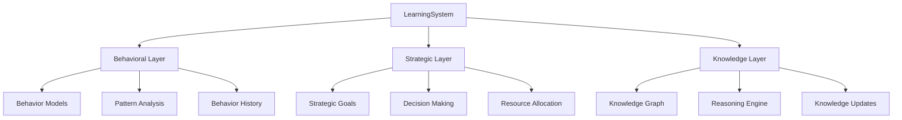

# @yyc3/learning-system

> **YYC³ Three-Layer Learning System**
> Advanced behavioral, strategic, and knowledge learning capabilities

[](https://www.npmjs.com/package/@yyc3/learning-system)
[](https://opensource.org/licenses/MIT)
[](https://www.typescriptlang.org/)
[](https://bun.sh)

---

## 📋 Overview

`@yyc3/learning-system` is a comprehensive three-layer learning system built with TypeScript, providing advanced capabilities for behavioral learning, strategic planning, and knowledge management.

### 🎯 Key Features

- 🧠 **Three-Layer Architecture**
  - **Behavioral Layer**: Pattern recognition and behavior prediction
  - **Strategic Layer**: Goal-oriented decision making and resource optimization
  - **Knowledge Layer**: Knowledge graph management and reasoning

- 🔒 **Type-Safe**: Built with strict TypeScript (0 `any` types)
- 📊 **Event-Driven**: Reactive architecture with comprehensive event system
- 🔄 **Adaptive**: Self-optimizing with continuous learning
- 🚀 **High Performance**: Optimized for production workloads
- 📈 **Observable**: Complete metrics and monitoring

---

## 🚀 Quick Start

### Installation

```bash
# Using Bun (recommended)
bun add @yyc3/learning-system

# Using npm
npm install @yyc3/learning-system

# Using pnpm
pnpm add @yyc3/learning-system
```

### Basic Usage

```typescript
import { LearningSystem } from '@yyc3/learning-system';

// Initialize the system
const system = new LearningSystem();

await system.initialize({
  behavioral: { enabled: true, modelType: 'classification' },
  strategic: { enabled: true, planningHorizon: 90 },
  knowledge: { enabled: true, graphSize: 100000 }
});

// Start learning
await system.learn({
  id: 'exp_001',
  timestamp: Date.now(),
  context: {
    situation: { type: 'user_interaction' },
    environment: { state: 'production' },
    objectives: [],
    constraints: [],
    availableResources: []
  },
  actions: [{ type: 'adjust', parameters: { learningRate: 0.01 } }],
  outcomes: [{ success: true, effectiveness: 0.85 }],
  feedback: { satisfaction: 0.9, effectiveness: 0.85 },
  metadata: { source: 'production', version: '1.0' }
});

// Predict behavior
const prediction = await system.predict({
  situation: { type: 'user_session' },
  environment: { state: 'active' },
  actor: { id: 'user_001', type: 'human' }
});

console.log('Prediction:', prediction.predictedBehavior);
console.log('Confidence:', prediction.confidence);
```

---

## 📚 Documentation

### Core Documentation

- 📖 [Quick Start Guide](../docs/learning-system/guides/GUIDE-QuickStart.md) - Get started in 10 minutes
- 🏗️ [Architecture Overview](../docs/learning-system/architecture/ARCH-LearningSystem-Overview.md) - System architecture
- 🔌 [API Reference](../docs/learning-system/api/API-LearningSystem.md) - Complete API documentation
- 🔤 [Type Reference](../docs/learning-system/types/TYPES-Reference.md) - Type definitions

### Architecture Documentation

- [Behavioral Layer Architecture](../docs/learning-system/architecture/ARCH-BehavioralLayer.md)
- [Strategic Layer Architecture](../docs/learning-system/architecture/ARCH-StrategicLayer.md)
- [Knowledge Layer Architecture](../docs/learning-system/architecture/ARCH-KnowledgeLayer.md)

### API Documentation

- [LearningSystem API](../docs/learning-system/api/API-LearningSystem.md)
- [BehavioralLayer API](../docs/learning-system/api/API-BehavioralLayer.md)
- [StrategicLayer API](../docs/learning-system/api/API-StrategicLayer.md)
- [KnowledgeLayer API](../docs/learning-system/api/API-KnowledgeLayer.md)

---

## 🏗️ Architecture

The system implements a three-layer learning architecture:



### Layers

#### 1. Behavioral Learning Layer
Captures, analyzes, and predicts behavioral patterns.

**Key capabilities:**
- Real-time behavior recording
- Pattern discovery and analysis
- Predictive modeling
- Adaptive feedback optimization

#### 2. Strategic Learning Layer
Manages goals, decisions, and resources.

**Key capabilities:**
- Strategic goal planning
- Decision framework
- Resource optimization
- Risk assessment

#### 3. Knowledge Learning Layer
Manages knowledge representation and reasoning.

**Key capabilities:**
- Knowledge graph management
- Logical reasoning
- Knowledge generalization
- Validation and updates

---

## 🛠️ Development

### Prerequisites

- **Node.js**: >= 18.0.0
- **Bun**: >= 1.0.0 (recommended)
- **TypeScript**: >= 5.0.0

### Setup

```bash
# Clone repository
git clone https://github.com/YYC-Cube/learning-platform.git
cd learning-platform/packages/learning-system

# Install dependencies
bun install

# Run development
bun run dev

# Run tests
bun test

# Type checking
bun run type-check

# Build
bun run build

# Generate documentation
bun run docs
```

### Scripts

| Script | Description |
|--------|-------------|
| `dev` | Run in development mode with watch |
| `build` | Build the package |
| `test` | Run tests |
| `test:coverage` | Run tests with coverage |
| `lint` | Lint code |
| `lint:fix` | Fix linting issues |
| `type-check` | Run TypeScript type checking |
| `format` | Format code with Prettier |
| `clean` | Clean build artifacts |
| `docs` | Generate API documentation |

---

## 📦 Package Structure

```
learning-system/
├── src/
│   ├── index.ts                 # Main entry point
│   ├── LearningSystem.ts        # Main system implementation
│   ├── ILearningSystem.ts       # Interface definitions
│   ├── types/
│   │   └── common.types.ts      # Common type definitions
│   └── layers/
│       ├── BehavioralLearningLayer.ts
│       ├── StrategicLearningLayer.ts
│       ├── KnowledgeLearningLayer.ts
│       └── MetaLearningLayer.ts
├── dist/                         # Build output
├── docs/                         # Generated documentation
├── tests/                        # Test files
├── package.json
├── tsconfig.json
└── README.md
```

---

## 🤝 Contributing

We welcome contributions! Please see our [Contributing Guidelines](../CONTRIBUTING.md) for details.

### Development Workflow

1. Fork the repository
2. Create your feature branch (`git checkout -b feature/AmazingFeature`)
3. Commit your changes (`git commit -m 'Add some AmazingFeature'`)
4. Push to the branch (`git push origin feature/AmazingFeature`)
5. Open a Pull Request

---

## 📄 License

MIT © [YYC³ AI Team](https://yyc3.0379.email)

---

## 📞 Support

- **Issues**: [GitHub Issues](https://github.com/YYC-Cube/learning-platform/issues)
- **Email**: ai-team@yyc3.com
- **Documentation**: [Full Documentation](../docs/learning-system/INDEX.md)

---

## 🔗 Links

- [YYC³ Project Homepage](https://yyc3.0379.email)
- [Learning Platform Repository](https://github.com/YYC-Cube/learning-platform)
- [NPM Package](https://www.npmjs.com/package/@yyc3/learning-system)

---

**Generated with ❤️ by YYC³ AI Team**
